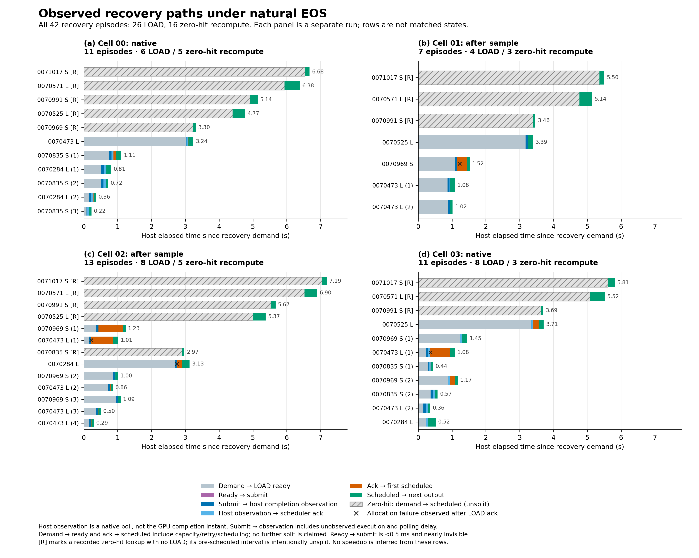
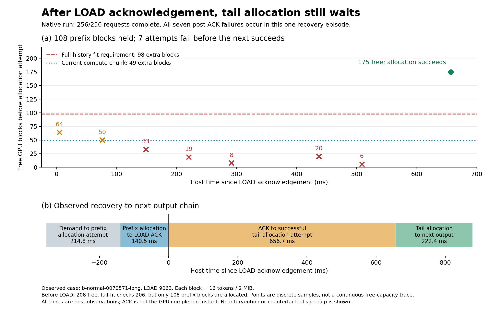
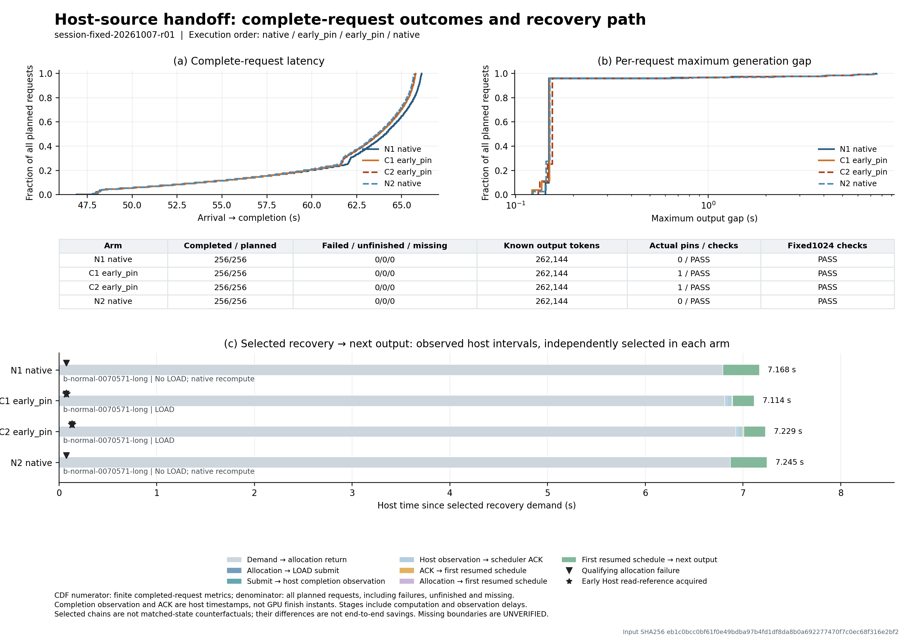

# B：KV 恢复事件时间线与容量等待诊断

## B 当前研究卡与贡献状态（2026-10-09，容量交换实测后）

**最新执行断点。** 普通最大单donor余量端点已运行到末个基线；03:59:48最后实查83207/85923存活且持公共锁，前三格exit0、动作0/1/0。之后53005端口连续拒连、原SSH控制连接消失；末格终态、当前进程/锁和完整服务结果均未知，不能认定实验结束或方法无效。恢复连接后仅回收原组，禁止同session重提。详见文末断点；下方已完成阶段及CPU工具的历史状态不代表此最新运行状态。

**中心问题与服务目标。** 在共享单卡的长短请求流式服务中，强简单恢复旁路仍留下约六秒的长请求停顿；B研究能否通过合法恢复动作改善全部请求的最大生成间隔分布，而不把等待和重复工作隐去。主读数为每请求maxgap均值/P99/最差值，必须同时报告TTFT、完整完成时间、吞吐、排空、让出者和同行代价。没有应用SLO，历史联合阈值仅作诊断。本节接续本会话B的容量交换目标；下方CPU工具成果和旧研究卡按各自阶段保留，不将其历史运行状态当作当前任务。

**部署与证据域。** OLMoE-1B-7B-0924固定revision/BF16，单RTX PRO6000 97887MiB，vLLM0.26/torch2.11+cu130；GPU KV71.9375GiB、Host KV16GiB、Host110GiB。当前开发点为256个3072/512交替自然文本前缀、0.1s开环到达、固定1024输出，原生传输并发、maxseq256/context4096/token budget1024不变。它是正常KV容量下的固定输出压力诊断，不是自然任务质量或生产SLO验证。

**已有方法的边界与候选原则。** stall8是普通强简单基线，先筛fit请求，不能直接帮助装不下的长目标。Andes已有恢复对象—donor联合选择及切换代价；UniBoost已有最低服务保护；FastServe已有批次容量和增长预留。故联合交换、紧急程度或保护本身不算新贡献。待检验的具体差异是：异步LOAD与尾部重算跨多个调度轮时，初始增长账本可能漏掉恢复期间新到达的同行页需求。候选原则是按恢复服务区间核算可持续容量；其增量价值与近邻缺口均**尚未成立**，不能仅据论文未展开实现细节认定其遗漏。

**真实动作与当前判断。** 新四格stall8/probe/probe/stall8全部完成，1024/1024请求，无失败或未完成；实际交换0/1/0/0。唯一交换释放83页，恰好满足T204/R0/G12；长目标只输出1 token即被同行扩页再次抢占，仍停6.281s。恢复末轮已有另外62个同行各欠一页，均不在初始12页G集合内。目标最差间隔比相邻基线降8.43%，但全部请求maxgap均值增21.71%、P99增1.44%，让出者完成时间增4.306s并从0变4次抢占；吞吐降0.27%。第二候选零动作，其波动不算有效重复。这说明入场可执行与持续服务价值不同；当前最小交换Q1规则未获支持，并非一般交换问题被否定。

| 假设 | 支持与最强竞争解释 | 当前判决与能改变判断的证据 |
|---|---|---|
| H_problem：强简单方案仍有重要且可控的损失 | 六秒长停顿真实存在，一次交换确实打断它；也可能普通更大余量或更保守配置已覆盖主要可用取舍 | 损失存在；有竞争力的完整服务改进空间未确认。须计入被让出者和全部同行，不能以首token证明收益 |
| H_model：恢复期同行增长影响持续执行 | 初始G12之后，62个不同同行产生新增缺页；其中一个在保护解除后实际触发目标重抢占 | 单步容量模型不足得到本事件支持。普通更大释放量可能足够；最大单donor同刻可释放253页，但缺失Host页/已算tokens也从82/1315增至252/4040，不能离线推断其净收益 |
| H_method：新增原则超过强简单策略和近邻 | 两种Q1触发已实际改变执行，却未得到有竞争力的完整服务取舍；新G仅在本次影子选择中改变donor | 当前Q1候选未获支持；不存在可投稿的方法结论。下一次若继续，应先真实检验普通大余量交换的价值，之后才考虑更复杂的区间模型；最大donor不是理论上界 |

**本阶段决定。** 一组预算已完成，持公共锁16.60分钟后释放；无新runner/候卡，不追加重复、年龄权重或保护窗口扫描。当前只形成运行域内的容量竞争证据与可执行探针，尚无独立方法/测量论文贡献。下一项有信息价值的问题是“普通更大容量余量能否避免首输出后立即回迁，且其donor代价是否可接受”；它与继续微调最小交换不同，必须真实对照，不能拼接当前轨迹。该下一实验尚未提交，本阶段不扩大GPU预算。完整数字、负结果、原始包和命令见文末“受控长目标交换”。

## 当前贡献说明与判决（2026-10-09，用户指定 CPU 工具转向）

**中心问题。** 对已有抢占恢复轨迹，能否自动区分可确认的 LOAD 生命周期、容量分配尝试与尚不能归因的长等待？服务对象是运行时开发者；目标是可复现的跨层案例诊断，当前不提出恢复排序优化或服务加速。复用既有 OLMoE/BF16/PRO6000 数据，本轮只读本地文件，GPU 预算 **0**，不连接远端，不提交 issue/PR，不修改 E。

**已有指标与候选功能。** 本线原生 `transfers` 聚合复制量和耗时，旧 `trace_recovery.py` 则覆盖重复事件并假设一次恢复恰有一个 LOAD；二者不足以可靠重建缺失、多 LOAD 和容量重试空档。新入口按运行内 request/job 及原始证据位置保留多重事件，对可对齐的 host 观察给出区间，对缺失、歧义及未知时钟返回未知。它不替代 GPU profiler，也不把时间先后当作原因；尚无独立工具论文主张。

**本轮最薄弱环节。** 自动关联能否重建既有人工案例，并在未参与新规则设计的已有轨迹中无需 request ID 特判地工作。停止新增独立恢复顺序实验；以下旧远端进程状态是历史记录，本轮没有查询、停止或重启，不能据其判定当前是否仍运行。

当前未知：自动关联是否足以回答长停顿发生在传输链还是分配/重试/再调度的哪些可观测区间。  
主要竞争解释：结论仍依赖人工指定请求或“每次恢复一个 LOAD”；长间隔其实只是采集缺口。  
最小实验：在 `recovery_service_age/session-20261009-r01/cell-01-cap256-stall8/output` 自动重建最大含抢占输出间隔；规则冻结后对不同 session 首个 native 臂 `recovery_service_age_native/session-20261009-r01/cell-00-cap256-native/output` 做一次留出检查。后者仅核验文件存在，未读事件/指标用于设计。CPU 预计数分钟，GPU 0，不增加采集或远端任务。  
不同结果将如何改变决定：若可自动重建则交付窄案例分析工具；若只能得到缺事件/歧义，明确输出未知并限制功能主张。无论结果都不据此宣称优化收益或工具论文成立，不开展字段补全矩阵。

**留出前冻结。** `analyze.py` SHA256 `5e33539012e4dac7a32d598c56a049ec19ddf2657628f969a4659cd7d0818935`；按最大含抢占输出间隔自动选例，不编码 request ID。设计修正只涉及重复身份冲突不能算阶段耗时、输出前再抢占的 episode 歧义，以及 capacity 采集终点；8 项定向合成测试通过（从 B 根目录 `python3 -m unittest recovery_timeline.test_analyze -v`）。设计首稿 `reports/design-v1` 保留，冻结输出为 `reports/design-frozen`。现在才打开预选 native 轨迹进行一次留出检查，不据留出结果调规则。

### 本轮交付与价值评估（已完成；CPU 既有轨迹检查）

| 证据 | 设计案例 | 未参与本轮规则设计的已有 native 轨迹 |
|---|---:|---:|
| 原轨迹请求状态 | 256/256 completed | 256/256 completed |
| 抢占 episode / 涉及请求 | 15 / 8 | 10 / 8 |
| LOAD job / 唯一 episode 关联 / 歧义 | 12 / 11 / 1 | 3 / 3 / 0 |
| 无观察到 LOAD 的 episode | 3 | 7 |
| 原始 allocator 尝试 / 保留的不同尝试 | 86 / 86 | 74 / 74 |
| 自动最大含抢占输出间隔 | 6.318797 s | 6.482272 s |
| 该案例最长相邻 allocator 重试间隔 | 5.284278 s | 6.188688 s |

**新增证据。** 无 request ID 特判，设计输入自动选回旧人工分析的长请求案例：相邻输出间隔、9 次失败/1 次成功以及末次失败至重试 5.284278 s 与既有 `opportunity-service-age-r01.json` 一致。旧报告的失败返回→成功入口与新表的失败返回→成功返回端点不同（约 21 µs），不是额外收益。新入口还保留了同一请求下一输出前再抢占造成的两 episode 重叠，将 job 9902 的 episode 归属标为未知，没有强行取单个 LOAD。留出选择按不同 session 首个 native 臂事前指定，冻结后一次通过；这只是新工具规则的留出检查，原运行本身是既有探索数据，不能称为新独立性能实验。

**实际执行变化。** 本轮没有运行时干预、没有 GPU/远端动作；只新增独立 CPU 分析入口。两份真实轨迹都没有“一个 episode 多 LOAD”的确定案例，0..N 支持和重复 ready/缺 ack/时钟冲突/身份冲突由定向合成用例检查，不能将合成覆盖写成真实部署验证。JSON 按原始位置保留归一化范围内的每次事件，STORE/全局 flush 仍留在输入原件，不复制完整历史。

**完整功能与代价。** 报告关联抢占、LOAD ready/submit、host 完成回报、ack、allocator 尝试、再调度计划及下一 host 输出；所有因果归属均保留未知，阶段可重叠，不相加。设计/留出分别耗时约 6.84/2.04 s（本机单次文件读取+解析+分析，到序列化前；非基准重复或线上控制开销），JSON 为 1.33/1.13 MB。本轮重建 512 个原轨迹请求的恢复观测，没有重跑这 512 个请求，也没有新增服务收益/质量结果。source 在留出最大案例中没有覆盖，不能把空观测当成已确认的空 LOAD handoff。

**判决：交付窄案例分析工具，停止本轮扩展。** 相比本线原生 transfer 汇总，自动多回答了“哪次抢占关联哪些 job、完成回报后何时 ack/再调度/下一输出、何次失败快照后多久才再尝试”并给出原始索引；相比通常的 kernel/copy 时间视图，补上这里已有的请求与分配语义。它没有自动解释“为何未重试”、GPU 实际完成时刻或持续容量不足，不能据此安排优化、更不能声称独立工具论文成立。下一步无需新增采集或 GPU；仅在实际调试出现现有入口无法回答的具体问题时，再决定是否值得扩展。

自动报告：[历史重建](recovery_timeline/reports/design-frozen/report.md)、[留出检查](recovery_timeline/reports/heldout-frozen/report.md)；完整事件/未知区间在相邻 `report.json`。二者由相同冻结 SHA 生成，未据留出结果调整规则。保留早期 `design-v1`，但以 `design-frozen` 为当前结果。

**自动续行衔接。** 上一轮属于实质进展：已交付 CPU 原型、历史重建与冻结留出检查。本次按要求重读持久目标及引用文件，确认其仍是 C 的准入研究论文目标；该长期目标未完成，不能以 B 工具交付替代。后续研究线已向用户澄清，在明确前保持 GPU 0、不访问远端，不恢复 B 独立优化或启动 C 对照。仅修正已交付报告的一处显示错误：缺少 source handoff 观测明确显示“未知”，与一次 handoff 中观察到空 LOAD 列表区分；解析和关联规则未变，冻结 JSON 未改，仅从 JSON 重新生成 Markdown，无新增实验。

实现与命令：[recovery_timeline/README.md](recovery_timeline/README.md)。本节之后保留历史研究卡与原始结果，不将旧候选/排队状态当作本轮计划。

---

## 研究卡（2026-10-09接续重审；探索证据）

**本卡后续更新：** 以下保留容量交换前的问题与模型；该探针现已完成，文末“容量交换r03”给出完整判决。H_problem的六秒长停顿仍在，但可控收益未知；H_model只支持一次首输出可执行，不支持持续服务价值且R/G没有改变初始选择；H_method当前Q1交换未获支持并停止扩展。不要把以下历史“下一探针/尚未确定”读作待启动任务。文件顶部CPU工具成果另行保留。

**服务对象与目标。** 假设部署对象是共享单卡、逐token流式返回的长短请求混合服务，用户关心已开始响应后不要长时间停顿。本阶段主目标是全部到达请求的每请求最大生成间隔分布（预先报告均值、P99与最差值）；TTFT、完整完成时间、吞吐、排空和资源成本是必须同时报告的代价。没有真实应用SLO，历史5s/0.2s联合口径保留为诊断，不能据其宣称生产达标，也不要求所有指标同向改善。新目标用于下面的开发实验，不追溯改写旧实验的成功标准。

**部署域。** OLMoE-1B-7B-0924固定revision、BF16；当前单RTX PRO6000 97887MiB、vLLM0.26.0/torch2.11.0+cu130；GPU KV71.9375GiB、Host KV16GiB、Host cgroup110GiB，原生传输实现和并发。当前开发负载256个不同文本前缀、3072/512交替、0.1s开环到达、固定1024输出。编译maxseq256、context4096、token budget1024；原预热、首次形状编译和全部外部等待均计入。它是自然文本上的固定工作量压力诊断，不是完整交互任务或质量证明；既有自然EOS结果仅支持各自旧方法。

**问题及强基线缺口。** 同机同输入simple_cap r02四格完整完成：cap256有9/8个恢复请求、maxgap P99为5.724/5.314s；cap224两次零恢复，P99为.0964/.0958s，但TTFT P95为27.723/27.327s（256为2.844/2.889s），吞吐下降3.39%/3.33%。普通配置能消除本点恢复停顿，但转移了等待且不是Pareto改善。224是事前单一筛查点，不是调优最优；强简单方法之后是否存在B可独立改善的边界，仍未成立。

**合法动作。** B只安排未启动恢复及其衔接，保留原生KV/在途任务/确认/释放。当前普通强基线在原生头容量不足时，从同优先级连续PREEMPTED合法fit后缀选目标；age8按到达年龄，stall8按最近真实client输出时刻。先选后施加每episode一次/全程8次保护，未知服务年龄整批回退age。victim、cap、量子、传输均不变，不跨新WAITING请求。unique8去重已停止；固定cap只作配置基线，不研究动态准入。8次上限是有界探针，尚非完整在线方法。

**近邻与候选原则。** [FastSwitch §3.2](https://arxiv.org/html/2411.18424v1#S3.SS2) 已处理异步交换交接及交换/分配冲突；[FastServe §4.2](https://www.usenix.org/system/files/nsdi26-wu-bingyang.pdf#page=8) 已按预计下次调度时机安排交换并为突发留空间。进一步核对[FastServe公开scheduler.py](https://github.com/LLMServe/FastServe/blob/main/fastserve/scheduler.py#L571)：reserve_free_blocks已合计CPU/未分配请求完整页和GPU驻留请求append页，并使用max(max_batch_size,配置阈值)作预留；有swap-out时不做主动swap-in以避免反复交换。故“联合核算+固定增长余量”本身已有近邻，撤销其独立创新候选。进一步核对执行路径，FastServe已先选执行批次、再为保留成员恢复并执行一次；因此“恢复绑定首次输出”本身也不能作为独立原则。可能的差异必须具体落在本线异步ACK后重新竞争执行和未缓存尾部的跨轮间隙，当前尚未证明其有不可替代的优化价值；完成只触发重算。当前未完整复现或适配这两个系统，native也不能冒称FastServe基线；[FastServe官方实现](https://github.com/LLMServe/FastServe)公开支持OPT/LLaMA2，不能把未适配OLMoE当作性能劣势。 进一步核验[Andes §4.2–4.3](https://arxiv.org/html/2404.16283v2#S4.SS3)：它已将输出消费需求与抢占/恢复代价共同纳入选择，过度压制切换会错失紧急服务也已有明确讨论。因此通用“按服务缺口决定恢复”不能直接成为B创新；当前仅有本原生异步运行域的测量事实。

**当前判决。** 普通stall8已完成age8和同观测native两组ABBA。在同批文本的新到达排列上，两次相对native的maxgap P99下降37.88%/44.53%、均值下降13.41%/28.53%；但最差值+.009%/−7.39%、flow+.220%/−1.805%、TPS−.111%/+1.291%，末原生在任何动作前已经偏慢。短请求获益同时有长请求和其他短请求受损，LOAD多24/408MiB；全部1024请求完成。故保留stall8为普通强简单基线，未证明普遍净加速或新原则。最差长请求仍停6.38–6.48s，现有fit入口不能直接选择它。下一项仅为一次非fit恢复目标与donor的容量交换价值探针；不再调年龄权重。当前无可投稿贡献。

## 假设—证据—竞争解释

| 假设与状态 | 当前支持 | 最强竞争解释 | 最小判别与削弱条件 |
|---|---|---|---|
| H_problem：强简单基线仍留下重要可控的恢复停顿。**真实取舍已支持；B可控剩余空间未成立** | cap256有9/8恢复者和5.3–5.7s P99；cap224零恢复，但32/256请求TTFT>5s、吞吐低约3.4% | 普通容量配置已给出主要可用取舍，恢复调度无法扩展它 | 旧repeat8后验P99有同向改善但最差值与多数请求受损，给出去重动作价值探针的有限依据。若当前同观测对照不能扩展此取舍，不沿该资格规则继续调参。224不是最优点，无生产SLO，不能称问题已全部解决 |
| H_model：服务价值受已有输出停顿与容量竞争影响，不能只用少复制衡量。**fit内反馈价值获支持；交换首测因接线错误无效** | 去重少约490MiB LOAD却使P99更差；age/stall与同观测native/stall的新排列均有P99信号，后者仍留下6.38–6.48s长请求停顿 | fit旁路只把等待从短请求转给长请求；普通腾空间与保护已经足够，新容量信息没有增量 | 一次单donor交换先检验可控动作价值，目标自身T、其他在途R、保留运行者G按同刻去重；如果只转移停顿或无合法单donor，不继续年龄/增长窗口调参 |
| H_method：B方法超过强简单方案及近邻。**独立方法未获支持；stall8作为普通基线** | stall8相对同观测native的P99/均值信号在新排列成立，全部完成但代价/最差未消失 | Andes/UniBoost式普通交换与服务保护覆盖主要收益；具体容量约束未带来新选择 | 当前容量交换只作动作探针；有价值后须同动作范围、相同保护的简单容量规则消融。若简单规则足够，撤销增量方法主张，不改名 |

**上一unique8探针的三个层次（保留原判决）。** H_problem：已测运行域存在服务取舍，强简单方案后的可扩展边界仍未知。H_model：重复旁路真实产出token并切分长gap得到当前轨迹支持，“反复恢复主要是可无损删除的周转”被此探针削弱；目标容量T/R/G仍只是条件记账。H_method：unique8在两次对照均使P99和maxgap均值变差，未获支持并停止。它失败不否定一般恢复问题，repeat8局部受益不证明新颖性或完整净收益。此组仍是既有开发负载、两个独立运行/臂。

**当前最小模型。** 原生合法集合F固定，状态为候选到达时刻a、最近实际client输出时刻l、当前episode及已用动作预算。age选择min(a,id)，stall选择min(l,a,id)，未知l时全体回退age；之后均施加原episode/总8次guard，不跳到另一个未使用候选。动作只把合法目标前移，可能更早加载/服务，也可能消耗容量并延后他人；未来ACK、下一输出和再抢占均未知，因此l只度量过去服务停顿，不是剩余恢复时长预测或最优性保证。实际服务结果必须由完整策略运行给出。

**旧容量模型的保留结论。** P=T+ΣR+ΣG合计目标新增占用、未兑现的在途占用与运行者页增长；条件P≤free不保证下一输出。22/23相邻快照free下降等于G(+1)，但+1决策与普通fit相同，+16退化为每RUNNING多留一页且27次全拒绝，R全0，尚无增量决策价值；不继续扫描中间窗口。并行阶段不相加换算时延。

**贡献说明（以证据收敛）。** 中心问题是原生异步恢复如何改善已开始输出请求的停顿，同时计入容量竞争、重复工作和其他请求等待。FastSwitch/FastServe已覆盖异步交接、批次资源核算及普通预留，Andes已覆盖输出服务需求与切换成本；当前尚未证实本线存在它们遗漏且可独立解决的具体缺口。目标自身能继续却被其他RUNNING扩页再次挤出、重复短服务切分gap，是本运行域的真实经验发现。服务年龄反馈的最小在线探针已产生同向开发信号，但属于普通强基线，不能声明新决策原则。

**尚未成立的主张。** 超过同观测native和强简单配置的稳定服务前沿、超越近邻的状态/动作增量、完整在线方法、自然任务质量与独立负载泛化均未成立。旧联合容量条件没有展现增量价值，不能继续作为创新中心。普通记账、紧凑输出存储及本次收据接线分别归类为分析工具/工程实现；经验发现尚不足独立测量论文，当前没有可投稿中心贡献。

**最新研究转向（2026-10-09，按用户追加指令）。** 将下一探针的动作范围扩到“一次恢复目标—让出者容量交换”，不继续调fit集合中的年龄权重。旧stall两格中，最差70571-long首次waiting决策需要204页、空闲176/169页、R=0；22/11个包含它的策略快照均不fit，不能被现有旁路直接选择。首次容量失败至成功约5.864/5.600s，但末次失败到成功仍有5.284/5.012s未重试allocator且队首变化，不能把全部区间归因于连续容量不足。最薄弱环节是**同一当前状态下，能否以一位合法donor创造有完整服务价值的恢复动作**；只有目标缺28/35页，还不能证明有足够donor，因为保留RUNNING增长与未兑现预留也要计入。

**更新后的近邻边界。** [Andes §4.3](https://arxiv.org/html/2404.16283v2#S4.SS3)已从高优先级恢复对象出发，选择足够腾空间的低优先级donor并检查全体切换损失；[UniBoost §3.3](https://arxiv.org/html/2606.18431v1#S3.SS3)已有派发后到下一几何token阈值前不可逐出的最低服务保护，其[算法1](https://arxiv.org/pdf/2606.18431#page=13)也在下一chunk/step不fit时按priority/swap-cost让出容量。因此“联合选择＋最小交换＋服务保护”均不直接作为B创新。待检验的只是本异步运行时中真实释放、已占/未兑现容量和保护期增长是否留下这些简单方法尚未处理好的具体缺口；论文未展开细节不等于系统没有处理。

**容量交换最小模型与范围。** 对目标t和一位让出者d，事前用同刻状态检验 `free + released(d) >= target_extra(t) + outstanding_reservation(excluding t,d) + next_token_growth(surviving RUNNING)`。实际可释放页以私有有效块计数，与A当前容量定义对齐；已分配页不重复计为在途预留，donor移出后也不再计其增长。目标按过去真实输出停顿选，donor使用可解释的现成容量/Host代价，不引入预测器或多donor搜索。一次原生preempt、既有STORE/LOAD/fence/free和必要的有限保护构成一个动作探针，首实际输出或16轮后解除额外保护；这不保证服务SLO，也不保证目标一定在16轮输出。所有让出者、同行等待、重复计算与传输均计入。首测发生1次原生逻辑preempt，但旧native-only guard在metadata返回前中断；worker未收到该轮工作，故当前是**实验无效、动作价值尚未确定**。旧容量条件的负结论保留。

**最新科学结论：同观测native/stall8新排列四格全部完成。** 真实旁路0/8/8/0，每stall覆盖3人，主P99改善但最差、flow/TPS有代价和波动。此证据排除了仅因age8基线过弱这一解释，仍不是新方法贡献；容量交换首测接线失败，未产生有效方法比较。

**容量交换补齐结果（2026-10-09，历史研究卡更新）：r03四格完整分析，当前Q1规则未获支持。** 1024/1024完成，实际交换0/1/1/0；两候选目标只产生2个新token就因同伴扩页再次被抢占，目标整请求maxgap两次均恶化，最差长请求仍停6.36–6.55s。总体P99变化+9.81%/−0.03%，flow和吞吐符号翻转；T/R/G与T-only四次均选同一donor，未显示新增容量信息的决策价值。停止“首个nonfit目标＋一donor＋首输出解除保护”的性能扩展，不否定一般容量交换。详见文末完整结果；73467已于02:38:25退出并释放锁，原始、失败和图表保留。本次补记不改动文件开头并行完成的CPU工具成果，没有新GPU提交或远端查询。

**完成确认阶段：** 受控固定输出ABBA四格1024/1024请求完成、每请求恰好1024输出，两次候选flow均值分别+1.02%/−0.86%，maxgap均值+13.58%/−5.64%，吞吐−0.77%/+0.71%。候选3795次收尾确实后移，10个LOAD全部首次观察，但最后原生的5个LOAD也全部首次观察；额外一轮不是原生必然行为。自然EOS和固定输出两组都未支持稳定加速，已停止当前completion-handoff候选的性能扩展。后续长短输出单原生探针已完成，256/256请求完成且零恢复，结束该负载点。

**自然EOS阶段：** 四格ABBA、1024/1024请求完成，两次候选flow均值−1.25%/+0.58%，maxgap均值−18.51%/+19.91%；输出量−1382/+1006 tokens。候选12个LOAD全部首次观察，两个原生合计7/14跨一轮观察。固定输出复测用于检查EOS长度混淆，不替代自然EOS主结果。

**STORE阶段结论（2026-10-04）：`flush_first` 在本机正常容量下没有稳定的完整请求净收益。** 已完成3个原生容量点及高压点完整ABBA，共6格、1536/1536请求完成，0失败/超时/未完成。两次候选平均完成时间变化为 **+0.58% / −0.49%**，输出速率为 **+0.15% / −0.84%**，TTFT均恶化。候选确实改序375次，但374次属于已完成请求的块复用fence，仅1次直接关联抢占恢复。恢复的主要暴露等待发生在LOAD就绪之前，部分也发生在LOAD确认之后的容量申请/重试/调度阶段。

这是对**当前就绪STORE重排规则、当前模型/负载/运行时**的窄负结果，不是对全部恢复调度的否定，也不足以支持CCF B/C论文中的系统加速主张。正常容量实验已释放GPU；不继续给此规则增加预测器、stream、传输并发或压力。旧8 GiB实验仅作为受控机制证据，不能作为正常容量主结果。

## 原生路径、动作与计时

`OffloadingConnectorWorker.handle_preemptions` 把当前metadata中必须flush的未提交STORE追加到已有deferred STORE尾部，全部提交后调用原生 `wait(jobs_to_flush)`。同方向handler通过前一个end event串行依赖，因此普通STORE可能成为必要STORE的前驱。

`flush_first` 只稳定前移尚未提交、已进入原生合法提交阶段、属于 `jobs_to_flush` 的STORE；普通任务相对顺序不变。CPU目的块未知或跨任务重叠时整批退回原生顺序。保留原tuple/specs、buffer/event/stream池、完整flush集合、引用计数、提交、wait、完成确认与回收。不取消在途复制、不删KV、不改变模型配置。

这里有两个容易误解的语义：

- scheduler可能已逻辑释放/重分配GPU块，worker fence保证物理覆盖前保存完成。不能写成“STORE ack后才逻辑释放GPU容量”。
- `jobs_to_flush` **也包含已完成请求的末尾STORE**。有flush/改序并不等于有恢复请求受阻，必须关联preempt、LOAD和请求下一输出。

所有策略启用同一轻量观察，记录preempt、逻辑释放返回、allocation状态变化、lookup、job_created、ready、submit begin/end、原生get_finished的host观察、scheduler ack、原生wait前后、首次重新scheduled，并复用raw输出时刻与内部/外部请求映射。所有host阶段使用perf_counter；`job_completed`是host poll观察，`scheduled`是计划返回，不是GPU完成或GPU开始。GPU event elapsed单列为copy-work，不与host绝对时间混用、不当作请求收益。观察器没有新增CUDA event/query/synchronize。

## 正常容量协议与原始数据

权威结果：[normal-metrics.json](normal_capacity/session-r01/normal-metrics.json)；整组状态、实际锁及代码hash：[receipt.json](normal_capacity/session-r01/receipt.json)。每格 `output/{raw.json,recovery-order.json,environment.json,config.json,engine_args.json}`、`command.json`、`run.log` 完整保留。源版本及本线代码hash见 [source.json](source.json)。

- RTX PRO 6000 Blackwell Server Edition，97887 MiB；GPU UUID `GPU-bf3fc5ab-804d-b9d6-759b-4390899f15b9`。Host cgroup120 GiB。
- OLMoE-1B-7B-0924，revision `6d84c48581ece794365f2b8e9cfb043c68ade9c5`，BF16、单卡；模型权重实际约12.89 GiB。vLLM0.26.0、torch2.11.0+cu130。
- 首格以gpu_memory_utilization=.90测得GPU KV **77,242,302,464 bytes = 71.9375 GiB**，36832总块/36831可用块，16 tokens/block。实际tensor字节与pool/spec一致；其后5格固定相同bytes。Host KV始终16 GiB。
- 编译engine maxseq256、max_model_len4096、执行token budget1024；固定运行上限分别64/192/256。每个策略对照内运行上限相同，native FCFS准入、tail victim、请求优先级、服务量子、lease=off、传输并发和stream池均不变。
- 三容量点共用256个不同文章前缀：128×3072与128×512 tokens交替，0.1s固定外部到达，自然EOS、输出上限1024。无复制、拼接、padding，截断与文档来源明确记录。三份workload字节SHA均 `024ccc4a4885de85309a9b20494d9251e78d2dc2d8aa04b8ff45878b4f966022`。这是自然文本上的预设长度混合/到达过程，**不是完整自然任务或质量基准**。
- 同一原有预热：short32×cap16、short32×cap32、long2×cap2，输出16；每格独立空cache。六格测量开头都出现首次形状JIT警告，开销留在请求时延中；当前不能称充分预热的稳态结果，也不扣除未知JIT耗时。
- 先运行native cap64/192/256，仅cap256有合法排序机会时追加对照。两个cap256 native的全部未提交列表都按创建job ID递增，因此按事前规则把最强简单年龄顺序与native合并。实际顺序：**64-N、192-N、256-N、256-F、256-F、256-N**。
- 联合研究SLO事前固定 `TTFT≤5s 且每请求最大生成间隔≤0.2s`，仅完成请求通过，分母包含全部计划请求。数值继承旧runner的研究预算，但maxgap联合事件不同于旧平均TPOT；没有应用SLO依据，不作生产goodput声明，也未看结果改阈值。

正常容量薄适配只解除原执行器的128请求/cap32/8 GiB硬约束。`normal_capacity/run_cell.py` 对父runner和native shadow wrapper做SHA核对与精确替换；实际池/spec、无prefix-sharing/lookahead、输入身份、warmup drain/释放检查保留。冻结父pkg没有改写，没有重建offload或执行框架。

## 三个容量点实际覆盖了什么

| 原生上限 | 完成 | 采样KV最高占用 | 抢占 / LOAD | 观察时长 s | TTFT均值 s | flow均值 / P95 s | maxgap P95 s | 输出token/s | joint通过 |
|---|---:|---:|---:|---:|---:|---:|---:|---:|---:|
| 64 | 256/256 | 28.3% | 0 / 0 | 110.673 | 29.524 | 55.437 / 86.203 | 0.12483 | 2336.39 | 65/256 |
| 192 | 256/256 | 79.7% | 0 / 0 | 89.542 | 6.840 | 55.374 / 65.225 | 0.13515 | 2902.68 | 192/256 |
| 256，首原生 | 256/256 | 98.0% | 6 / 3 | 84.556 | 0.519 | 58.817 / 63.844 | 0.18816 | 3045.95 | 250/256 |

KV占用来自约10s间隔的host日志采样，**不是逐步真实峰值**；实际分配容量由tensor与pool验证。不同cap是运行域表征，不能当成本方法的策略加速对照。cap64和192都没有恢复事件，这也是有效结果。

cap64的239次flush全部finished-only，host wait累计178.477ms；cap192的205次也全部finished-only，累计37.260ms。cap64有83次超过1ms，全部被普通64–120 MiB等大STORE挡住，但它们不是恢复等待。不能把日志中包含预热的累计LOAD数混入测量；逐任务observer在这两格确认LOAD为0。

## 高压完整ABBA：收益与代价

N1/F1为正序，F2/N2为反序；每格256/256完成，无失败、超时、未完成或缺失请求。

| 指标 | N1 | F1 | F2 | N2 |
|---|---:|---:|---:|---:|
| 观察时长 s | 84.55635 | 84.69818 | 84.70207 | 84.69696 |
| TTFT均值 s | 0.51923 | 0.54149 | 0.55427 | 0.54342 |
| TTFT P95 s | 2.41490 | 2.49028 | 2.55267 | 2.51164 |
| flow均值 s | 58.81713 | 59.15916 | 58.91753 | 59.20934 |
| flow P95 s | 63.84352 | 63.82235 | 63.97736 | 63.83892 |
| 请求最大gap均值 s | 0.21095 | 0.19977 | 0.16724 | 0.19729 |
| 请求最大gap P95 s | 0.18816 | 0.14466 | 0.13909 | 0.14141 |
| 请求最大gap最差 s | 3.05754 | 4.52831 | 3.65701 | 4.51278 |
| 输出tokens | 257554 | 258377 | 256686 | 258832 |
| 输出tokens/s | 3045.945 | 3050.561 | 3030.457 | 3055.978 |
| joint通过 / 256 | 250 | 249 | 251 | 249 |
| joint goodput req/s | 2.95661 | 2.93985 | 2.96333 | 2.93989 |
| 抢占 / LOAD jobs | 6 / 3 | 8 / 6 | 7 / 6 | 8 / 6 |
| LOAD bytes | 562036736 | 1096810496 | 1493172224 | 1121976320 |
| STORE bytes | 94174707712 | 94105501696 | 93847552000 | 94160027648 |
| 自然stop / length | 6 / 250 | 5 / 251 | 7 / 249 | 4 / 252 |

| 候选相对对应原生 | 正序F1−N1 | 反序F2−N2 |
|---|---:|---:|
| TTFT均值 | +4.287% | +1.997% |
| flow均值 | +0.582% | −0.493% |
| flow P95 | −0.033% | +0.217% |
| maxgap P95 | −23.121% | −1.636% |
| 输出速率 | +0.152% | −0.835% |
| joint goodput | −0.567% | +0.797% |
| 输出tokens变化 | +823 | −2146 |
| 输出序列不同 / 256 | 146 | 164 |

反序候选只有9个请求flow改善、247个恶化，但平均值略改善：9个改善中5个同时从1024/length变成140、187、499、165、278/stop，这5个贡献了改善总量的99.924%。相同输出序列的92请求flow差合计+20.932s，不同序列164请求合计−95.634s。这是描述性分组，不是同状态反事实，也不能据此判质量效果。

P95 maxgap有局部改善，但原生自身从188.164ms变为141.405ms。N1的P95由同一call1211间隔影响212请求，N2由call1402间隔影响166请求；记录的JIT警告均在测量开头约call15，不能用它解释57s/69s处这两个主导间隔，更不能直接归因给flush改序。仅两个运行级重复，不能把数百个相关请求或若干事件当独立统计重复。

## 真实动作与恢复链路

[候选F1动作校验](normal_capacity/session-r01/cell-03-cap256-flush_first/action-check.json)、[候选F2动作校验](normal_capacity/session-r01/cell-04-cap256-flush_first/action-check.json) 确认实际submit顺序等于after、任务多重集合不变、ready且未提交、完整required wait集合及source关联。两格16878/16768任务六阶段各恰好一次，提交全部接受、fallback全None。trace不含目的块地址，离线检查不能独立重算物理alias；运行时安全判定与CPU碰撞/未知目的块回退检查另保留于代码及既有 `check_cpu.py`。

| 阶段证据 | N1 | F1 | F2 | N2 |
|---|---:|---:|---:|---:|
| 实际改序 | 0 | 191 | 184 | 0 |
| 候选改序中直接关联preempt | — | 0 | 1 | — |
| LOAD恢复 / 零命中重算 | 3 / 3 | 6 / 2 | 6 / 1 | 6 / 2 |
| preempt→下一输出均值 s | 1.73084 | 2.10795 | 1.39268 | 2.10179 |
| 全部flush host wait累计 ms | 9.78723 | 1.29853 | 1.20514 | 6.86590 |

这些event均属于各自运行，不能跨运行匹配后声称同状态因果改善。累计wait只是局部暴露观察，不是请求收益或完整Oracle上界。

N1中193/194个flush属于已完成请求。唯一恢复相关必要STORE9025排在16个普通STORE之后，但host wait仅0.03403ms。三个LOAD同批ready于44.49904s，ready→submit为0.008/0.333/0.414ms；同次host poll约44.51403s，scheduler ack约44.56750s。首次scheduled却在45.69796/45.77265/45.84788s。`9369`对应请求在ack后再次allocation失败，到45.69664s才成功。该段包含物理容量不足、重试与调度间隔，不能全叫纯容量等待。

F1的191个实际动作均为finished-only；唯一preempt相关STORE9583在进入fence前已提交，已经不属于可重排集合。F2有一次恢复相关真实动作：9723从17项队列末尾移到首位，实际提交相符；其wait0.00678ms，下一输出约218ms后，不能直接称为218ms收益。N2的189个flush又全部finished-only；其LOAD ready→submit最大0.437ms，仍可见ack后再次allocation失败约515ms的例子。

恢复事件完整关联：

- [N1六事件](normal_capacity/session-r01/cell-02-cap256-native/cap256-recovery-events.json)
- [F1八事件](normal_capacity/session-r01/cell-03-cap256-flush_first/candidate-recovery-events.json)
- [F2七事件](normal_capacity/session-r01/cell-04-cap256-flush_first/candidate-recovery-events.json)
- [N2八事件](normal_capacity/session-r01/cell-05-cap256-native/native-recovery-events.json)

部分零命中重算请求在等待初期lookup仍为正，后续重试变为零；例如N1的0071017-short。已有日志没有独立记录具体淘汰动作，不能把命中消失归因给某个STORE。当前数据证明“复制已确认”仍不足以保证完整请求可执行，不支持以带宽、copy elapsed总和或GPU重叠量代替输出收益。

## 旧8 GiB受控实验的保留边界

`session-r03` 的native/F各128请求均完成，但第三格前资源边界中止；只得到正序一对，不能声称稳定负效应。候选17次真实改序，flow均值+1.49%、P95 maxgap+3.72%、输出速率−0.44%，输出+863tokens。47/46次恢复中各45次发生allocation失败；事件累计等待98.30%/98.42%发生在LOAD ready之前。这是逐事件累计占比，不是运行墙钟占比。

原始 [r03 metrics](session-r03/metrics.json)、动作校验、原始raw、`run_group-r03.py`、`runner.patch` 均保留；`plan-r04.json` 旧受控反序尚未运行。正常容量完整ABBA已优先完成；不把继续补旧限容实验当作当前论文收益证据。r01/r02的EAGAIN记录、r03资源边界失败也未删除或改成科学结果。

## 溯源、复现与资源释放

原仓库 `ZeXi0308/MOE_Thesis_organized`，起始分支 `agent/publish-current-moe-code`，HEAD `5593b5ff0fb602f479b10f82ca682ba8f9adc86d`。已读AGENTS、A_progress及recovery_quantum_20261002相关实现/结果。B独立目录与远端 `/root/autodl-tmp/moe-b-recovery-order-20261004`；其他会话代码和冻结包未覆盖，未push。

原生worker SHA `d8f1a45cd01ea97307552c12bb8420dabbb63388fce10bd8b4b77d27bc5f1d35`，scheduler/kv_cache_manager与冻结来源一致。复用已有执行器/传输/测量。共享torch安装有旧文件冲突，B沿用现成 `prepare_runtime_overlay.py` 构造私有RECORD-only只读视图，CPU imports通过且共享安装未修改；每格相同overlay。

正常组controller13233等待共同锁后整组持有 `2304:23632821411`，包含初始化、预热和格间；所有格exit0。17:04:36 CST结束检查GPU0MiB/0%/无进程，controller与最后子进程18195退出，随后锁由下一组取得。候锁上限1800s，期间无B CUDA进程，无重复runner；没有持锁分析/写文档。

已执行命令（历史，**不要对同一session重复运行**）：

```sh
/root/miniconda3/bin/python -u /root/autodl-tmp/moe-b-recovery-order-20261004/normal_capacity/run_group.py \
  --plan /root/autodl-tmp/moe-b-recovery-order-20261004/normal_capacity/plan-r01.json \
  --wait-lock-seconds 1800
```

本地复算（输出必须新建，不能覆盖已有结果）：

```sh
python3 normal_capacity/analyze_group.py --session normal_capacity/session-r01 --output /tmp/b-normal-recomputed.json
python3 normal_capacity/check_actions.py --input normal_capacity/session-r01/cell-03-cap256-flush_first/output --output /tmp/b-actions-f1.json
python3 normal_capacity/check_actions.py --input normal_capacity/session-r01/cell-04-cap256-flush_first/output --output /tmp/b-actions-f2.json
```

## 近邻、结论边界与唯一下一步

[FastServe NSDI2026 §4.2](https://www.usenix.org/system/files/nsdi26-wu-bingyang.pdf) 已按ENST安排换入/换出；[FastSwitch §3.2](https://arxiv.org/html/2411.18424v1#S3.SS2) 已讨论异步dispatch、优先级插入与事件跟踪；[SuperInfer §4.3](https://arxiv.org/html/2601.20309v1#S4.SS3) 已处理换出源与换入目标的HBM依赖，并以提前保存减少依赖。异步、优先级队列、下一执行导向、STORE→LOAD依赖本身不是本线创新。

**裁决：当前ready-STORE flush-first formulation在本运行域NO-GO。** 证据层级是原生单卡完整请求ABBA与实际事件链，最强简单年龄顺序已与native实测等价；没有完整Oracle。主要失败是可改顺序与真实恢复关键路径不匹配，加上输出工作量与运行波动，不能解释成稳定净加速。自然完整任务/质量、第二模型、无观测开销、充分预热稳态、多卡TP均未完成，因此论文目标仍未实现。

唯一下一步收缩为：**能否把原有一次连接器收尾移到已有采样/CPU返回同步之后、ModelRunnerOutput返回之前，使本步刚完成的LOAD随本步确认？** 同步engine必须先结束当前计算，直接提前调用scheduler ack不能越过此依赖；已观测poll→ack的53–62ms不能直接算作可消除等待。候选只检验“原生早期poll之后、现有采样同步返回之前完成的LOAD，是否可以少等下一轮poll”。当前尚无其自然发生频次和端到端收益证据。

## 唯一后续候选：completion_handoff，GPU未运行

源码接口已经定位：原生 `maybe_get_kv_connector_output` 在forward末尾收尾；后续 `sample_tokens._bookkeeping_sync` 原本就同步取得CPU token，之后才读取同一个 `self.kv_connector_output`。最薄适配 [completion_finalize.py](completion_handoff/completion_finalize.py) 保留原context的enter、输出对象和整个exit，仅将普通同步生成路径的exit移到既有bookkeeping返回后。每个受观测context恰好收尾一次；不追加CUDA query/synchronize，不改engine确认协议。no-forward及原生defer_finalize路径保持原位；异常和遗留pending清理也走原exit。

**它后移的是整个收尾，并非只移动LOAD查询。** `prepare_store_kv`、LOAD/STORE完成观察、原生回收与metadata清除一起后移。普通STORE仍由原生下一步提交；必要STORE fence、在途复制、引用与buffer路径保留。必须检查STORE确认/后续提交是否付出代价，也必须检查LOAD确认后是否仍被容量挡住，不能把查询更晚看见完成等同于输出更早。

该候选限制为已固定OLMoE revision/BF16、单卡、同步、无speculation/pooling、多模态关闭、原生CPU offload；安装时核验实际GPUModelRunner与mixin源码hash，域不符就拒绝。GPUModelRunner snapshot与已完成cell05实际hash一致；mixin snapshot与历史固定hash一致，但未在normal cell05单独采集，需安装时再次核验。[源码来源与适用边界](native_sources/completion_sources.json) 保留上游链接；engine core仅作上游参考，没有补丁或实际hash承诺。

[check_cpu.py](completion_handoff/check_cpu.py) 已通过真实固定mixin AST的生命周期检查：native/after_sample保留同一输出对象，query相对既有CPU返回的顺序确实改变，bind/load/query/build/clear各执行一次；无forward、defer-finalize、7类异常/意外返回、跨步pending和卸载路径通过。薄runner命令生成与四格配对检查通过。这些是CPU正确性准备，**不是GPU运行、真实可改等待或科学收益**。

[plan-r01.json](completion_handoff/plan-r01.json) 固定cap256和71.9375GiB KV，复用正常组256个输入及相同预热，native/after_sample/after_sample/native整组串行。每臂 `B_RECOVERY_ORDER=native`；唯一策略变量为收尾时机。两臂相同轻量host计数记录在 `completion-finalize.json`，继续报告全部请求、失败/未完成、输出与传输量。原有5s/.2s探索SLO不变；充分预热限制也未消失。没有动作、没有提前输出或代价抵消时，就停止此窄候选，不加预测器或扫描压力。

本地已运行的CPU检查：

```sh
python3 completion_handoff/check_cpu.py
python3 completion_handoff/run_cell.py --help
```

资源恢复后使用以下命令，从本B目录部署**尚未上传的新目录**，然后只提交一次整组（要求原远端B父目录、runtime-overlay与共同锁仍在；目标目录/会话已存在时先核对，不能覆盖或重复启动）：

```sh
ssh -p 25753 root@connect.westd.seetacloud.com \
  'mkdir /root/autodl-tmp/moe-b-recovery-order-20261004/completion_handoff'
scp -P 25753 completion_handoff/*.py completion_handoff/plan-r01.json \
  root@connect.westd.seetacloud.com:/root/autodl-tmp/moe-b-recovery-order-20261004/completion_handoff/
ssh -p 25753 root@connect.westd.seetacloud.com \
  '/root/miniconda3/bin/python -u /root/autodl-tmp/moe-b-recovery-order-20261004/completion_handoff/run_group.py --plan /root/autodl-tmp/moe-b-recovery-order-20261004/completion_handoff/plan-r01.json --wait-lock-seconds 1800'
```

保持共同flock覆盖初始化、预热和全部四格，复用原边界、超时和清理；GPU UUID/实际预算不符就停止。`completion_handoff/analyze_group.py --session … --output …` 复用全请求分析，只比较实际cap/GPU/Host预算一致的臂；输出文件必须新建。

**2026-10-04结束时资源状态：GPU_UNRUN。** 整组原始数据完整取回后，旧SSH控制连接已结束；多次重新连接当时授权endpoint25753均返回 `Connection refused`。该日新候选未上传、未创建远端session；没有重启主机或开通其他资源。

## 2026-10-07恢复执行：完成确认时机对照

用户更新端点为 `connect.westb.seetacloud.com:25495`。原B工作区、模型缓存和runtime-overlay仍在；GPU换为同型号97887MiB PRO6000，UUID `GPU-94203fc3-1021-3a9c-a367-cff792479616`、driver595.71.05，Host上限仍120GiB。GPUModelRunner、mixin、offloading worker、scheduler、KV manager实际源码hash均匹配，私有CPU imports通过且CUDA未初始化。保留旧结果，所有四格均在新卡上重新运行，不用旧卡时延作对照。

现场配置为 [plan-20261007-r01.json](completion_handoff/plan-20261007-r01.json)。唯一controller3078通过共同锁候等20秒后取得 `2304:15049831297`；`session-20261007-r01=COMPLETE`，四格exit0、1024/1024请求完成，失败/超时/未完成均0。全部预热及格间由同一锁覆盖。控制器与SSH exec40853已退出，结束检查GPU0MiB/0%/无进程，随后共同锁由下一组PID4153取得；B无剩余GPU作业或候锁进程，没有持锁写文档。

本轮实际启动命令（新session，不能重复提交）：

```sh
/root/miniconda3/bin/python -u /root/autodl-tmp/moe-b-recovery-order-20261004/completion_handoff/run_group.py \
  --plan /root/autodl-tmp/moe-b-recovery-order-20261004/completion_handoff/plan-20261007-r01.json \
  --wait-lock-seconds 1800
```

权威数据：[completion-metrics.json](completion_handoff/session-20261007-r01/completion-metrics.json)、[最终receipt](completion_handoff/session-20261007-r01/receipt.json)。四格完整output、command.json、run.log及组日志已全部取回本地。实际GPU KV均为71.9375GiB、36832总块/36831可用块，Host KV16GiB、cap256。每格独立空cache，原预热32/32/2请求完整；测量开始后仍有fused_moe JIT warning，不能声称充分预热稳态。指标保留此开销；原生返回、后续drain和shutdown分别计时。联合5s/.2s研究SLO未改，仍无生产阈值依据。

N1/H1为正序，H2/N2为反序，H=after_sample。所有值为完整请求原始指标，不用GPU copy elapsed替代。

| 指标 | N1 | H1 | H2 | N2 |
|---|---:|---:|---:|---:|
| 观察时长 s | 86.21141 | 85.66715 | 86.28760 | 86.26053 |
| TTFT均值 / P95 s | 0.56680 / 2.60391 | 0.58834 / 2.68423 | 0.57455 / 2.65314 | 0.58913 / 2.67764 |
| flow均值 / P95 s | 60.50337 / 65.01900 | 59.74838 / 64.64988 | 60.66392 / 64.97987 | 60.31186 / 65.14358 |
| 每请求maxgap均值 / P95 s | 0.26982 / 0.15190 | 0.21988 / 0.14559 | 0.27814 / 0.15329 | 0.23196 / 0.15264 |
| 最差maxgap s | 6.68218 | 5.50863 | 7.19029 | 5.81386 |
| 输出tokens | 258680 | 257298 | 259338 | 258332 |
| 输出tokens/s | 3000.531 | 3003.462 | 3005.507 | 2994.788 |
| 请求吞吐 req/s | 2.969445 | 2.988310 | 2.966823 | 2.967754 |
| joint通过 / 256 | 247 | 249 | 247 | 247 |
| joint goodput req/s | 2.865050 | 2.906598 | 2.862520 | 2.863419 |
| 抢占 / LOAD / 零命中重算 | 11 / 6 / 5 | 7 / 4 / 3 | 13 / 8 / 5 | 11 / 8 / 3 |
| LOAD bytes | 1172307968 | 1035993088 | 2065694720 | 1426063360 |
| STORE bytes | 94122278912 | 93937729536 | 94204067840 | 94193582080 |
| 恢复需求→下一输出均值 s | 2.97487 | 3.01695 | 2.86214 | 2.21062 |

| 候选相对对应原生 | H1−N1 | H2−N2 |
|---|---:|---:|
| TTFT均值 | +3.800% | −2.475% |
| flow均值 | −1.248% | +0.584% |
| flow P95 | −0.568% | −0.251% |
| maxgap均值 | −18.508% | +19.909% |
| maxgap P95 | −4.157% | +0.425% |
| 输出tokens/s | +0.098% | +0.358% |
| joint goodput | +1.450% | −0.031% |
| flow改善 / 恶化请求 | 251 / 5 | 152 / 104 |
| maxgap改善 / 恶化请求 | 245 / 11 | 4 / 252 |
| 输出序列不同 / 256 | 169 | 170 |

正序8个长度变化请求贡献约一半净flow改善：变短共−2545tokens、flow差合计−164.903s，变长+1163tokens、flow差+67.870s。248个等长请求flow差平均−0.388s，87个相同序列请求平均−0.376s。反序6个长度变化请求贡献约70.3%的净flow恶化；250个等长请求平均+0.107s，86个相同序列请求平均−0.049s。分组只描述运行结果，不能排除全系统batch/容量/计算随输出长度改变。反序一个相同输出序列请求0070284-long的maxgap仍增加约2.610s；不能用略降的flow P95覆盖此代价。

四格真实动作检查均通过，context/finalize分别1880/1872/1882/1878且各恰一次；所有LOAD/STORE完成观察均落入相应finalize区间，没有未关联poll。两候选的3754次收尾全部实际后移；STORE提交顺序始终native，查询次数与同步次数的代码路径不增加。

| LOAD提交后完成观察位置 | N1 | H1 | H2 | N2 |
|---|---:|---:|---:|---:|
| 首次收尾中观察 / 跨一次收尾 | 2 / 4 | 4 / 0 | 8 / 0 | 5 / 3 |

动作与完整LOAD关联：[N1](completion_handoff/session-20261007-r01/cell-00-cap256-native/completion-action-check.json)、[H1](completion_handoff/session-20261007-r01/cell-01-cap256-after_sample/completion-action-check.json)、[H2](completion_handoff/session-20261007-r01/cell-02-cap256-after_sample/completion-action-check.json)、[N2](completion_handoff/session-20261007-r01/cell-03-cap256-native/completion-action-check.json)。原生LOAD finalize结束到bookkeeping返回约50.55–61.36ms；候选在bookkeeping返回后约1.36–1.77μs开始原生收尾。这是同一host时基的边界差，不是已消除的请求等待，也未测GPU绝对完成时刻。

后续依赖没有消失：H1的9716在ack后再分配失败，至scheduled306.953ms；H2的9457/10157同类间隔653.413/150.948ms。H2的9458为731.816ms却无自身allocation_fail，不能全归物理容量。N2的9536同样ack后分配失败并等579.546ms至scheduled。LOAD ready→submit保持亚毫秒；零命中重算及就绪前容量等待仍贡献秒级尾部。

**本轮裁决：动作成立，完整请求净收益未稳定。** 运行级均值方向翻转、输出/传输工作量不同，不能写成纯调度加速，也不将同序列请求视为同状态反事实。只有两对运行，不把数百个相关请求当作独立重复。当前证据不足以支持系统论文收益主张；也没有证据把失败归因成调度器CPU开销，故不加预测器或重写执行器。

近邻针对新动作的范围：[FastSwitch §3.2](https://arxiv.org/html/2411.18424v1#S3.SS2) 明确在每轮调度开始时检查CUDA event，再把完成请求移回running；[FastServe §4.2](https://www.usenix.org/system/files/nsdi26-wu-bingyang.pdf) 明确按ENST提前换入/换出并与计算重叠。两处未明确比较“将同一次完成观察移至既有采样同步之后”的host边界，但这既不能确认完全同类先例，也不足以证明新颖性。当前定位仅为复用既有同步边界的薄runtime适配，不宣称缩短GPU传输或独立算法创新。

[恢复路径分解图](completion_handoff/recovery-phase-decomposition.png) 纳入四格全部42个恢复episode：26个LOAD、16个最后lookup为零命中的重算事件。图逐个给出需求→ready→submit→host完成观察→ack→再次scheduled→下一输出；零命中需求→scheduled保守地保持不分割，ack后实际allocation failure用×标记。LOAD就绪前的秒级等待、部分ack后的等待清楚可见；“提交→host观察”包含未观测的执行及轮询延迟，不是纯GPU复制时间。每面板为不同运行，行不构成同状态配对。



绘图仅复用现有数据，脚本为 [plot_recovery_phases.py](completion_handoff/plot_recovery_phases.py)，使用已有matplotlib环境，未注入GPU执行。实际复现命令（输出新路径以保护原图）：

```sh
MPLCONFIGDIR=/private/tmp/b-matplotlib-cache /private/tmp/moe-c-plot-env/bin/python B_recovery_order_20261004/completion_handoff/plot_recovery_phases.py --output /private/tmp/b-recovery-phases.png
```

补充host开销检查：`finalize_end−finalize_begin` 包括原生收尾及现有observer的host墙钟，四格累计148.168/167.407/222.958/141.741ms。无active LOAD步骤中位数70.620/72.776/75.831/70.611μs，P95为112.617/125.699/119.273/115.605μs；这里“无active LOAD”仅表示context区间不与LOAD ready→ack区间相交，仍可能包含STORE、prefill和重算，不能视作同状态稳态样本。两候选常见开销小幅增加，但仅两对运行不足以判断显著的策略成本。

H2 iteration1035的67.058ms长尾包含15个STORE完成观察；job10026→10027的66.942ms间隙位于原native get_finished返回之后、observer逐条emit循环内。无GC/host调度原因字段，故不归为GPU copy等待或确定的原生算法成本，不扣除任何请求时延。bookkeeping只有返回时间、prepare_store无独立边界：forward_exit→bookkeeping_return包含采样/host工作，不能写成纯同步等待；prepare_store仅被finalize区间包围，候选将包含它的收尾后移约35.4–35.5ms（中位数），但原生STORE仍在下一步提交，不能将该值当作DMA延迟或输出收益。

唯一下一实验：同256输入和原到达序列、同cap/预算/传输并发/预热，固定每请求1024输出并忽略EOS的**受控等输出工作量ABBA**。只改变输出终止条件，仍保留全部失败/超时/未完成及实际copy工作量。若固定输出后仍无一致全请求净收益，停止当前after_sample formulation的性能扩展；若有信号，再回到不同到达序列的自然EOS验证，受控结果不能代替主结果。

该组已部署为 [plan-fixed-20261007-r01.json](completion_handoff/plan-fixed-20261007-r01.json)，仅新增 [run_fixed_group.py](completion_handoff/run_fixed_group.py) 薄入口及固定输入配置；原EOS执行源不改。原runner会覆盖输入中的EOS字段，因此入口在编译后的原测量源中精确替换终止参数，实际执行 `max_tokens=1024, ignore_eos=True, min_tokens=0`。min_tokens保留0，以免额外引入最小长度EOS屏蔽。256次原request_measurement参数构造CPU检查通过，输入workload字节相同，engine配置与32/32/2×16预热不变；目标机两个CLI入口也通过。这些检查不是GPU结果。

首轮资源尝试 `session-fixed-20261007-r01` 已终止：候锁1270.033秒后取得同一锁，但启动首格前仍观察到上一进程11853占用14464MiB，按原空卡检查退出；cells=[]、GPU测量请求0。controller11679消失、SSH exec77339退出1；[原始receipt](completion_handoff/session-fixed-20261007-r01/receipt.json)与组日志保留。后续现场确认11853也已退出，没有终止其他进程。

第二次资源尝试 `session-fixed-20261007-r02` 候锁663.847秒后同样在首格前终止：原始空卡检查仍观察上一进程13431/14266MiB；cells=[]、GPU测量请求0。[原始receipt](completion_handoff/session-fixed-20261007-r02/receipt.json)已取回，13857消失、SSH exec19582退出1，随后确认13431也退出。此时B没有GPU作业或候锁进程。

阻塞flock薄入口 [run_fixed_group_wait.py](completion_handoff/run_fixed_group_wait.py) 的CPU实锁交接/超时/信号恢复及目标机CLI检查通过，实际内核WRITE*等待和取得锁也已验证；但它不能消除上一组解锁到CUDA进程清理完的间隙。现已新增首次交接最多30秒的空卡等待；同一整组锁保持持有，保留全部观察，未满足原空卡谓词则退出，不操作其他进程。后续格间检查、cell命令和全部科学参数不变。受控fixed1024组的前两次资源尝试未运行GPU测量。

[r03](completion_handoff/plan-fixed-20261007-r03.json) 已单次提交，唯一controller15464/SSH exec76635候锁1045.435秒后取得整组锁，四格现已COMPLETE、全部exit0，所有raw已取回；controller消失、SSH退出0，结束GPU0MiB/0%/无进程。首次交接2.342秒后确认EMPTY，整组含预热持续持锁至结束；没有新增B候卡者。新增 [run_fixed_group_settle.py](completion_handoff/run_fixed_group_settle.py) 固定SHA校验旧wait/fixed入口，只有取得共享锁后才安装首次空卡等待；每次观察即时写receipt，超时仍由原controller终止，不重复创建模型。CPU检查首次清理成功/30秒超时/保留观察/后续边界恢复，目标CLI检查均通过。两组在前，因此有限候锁为3600秒；没有改变GPU测量预算，没有第二B runner。

准确启动命令（此组已完成，不能覆盖原结果重跑）：

```sh
/root/miniconda3/bin/python -u /root/autodl-tmp/moe-b-recovery-order-20261004/completion_handoff/run_fixed_group_settle.py \
  --plan /root/autodl-tmp/moe-b-recovery-order-20261004/completion_handoff/plan-fixed-20261007-r03.json \
  --wait-lock-seconds 3600
```


## 2026-10-07 固定输出ABBA：动作成立，净收益仍翻转

权威数据：[完整指标](completion_handoff/session-fixed-20261007-r03/completion-metrics.json)、[最终receipt](completion_handoff/session-fixed-20261007-r03/receipt.json)。四格原始output、command.json、run.log和组日志全部本地保留。原生→候选→候选→原生，1024/1024请求完成，失败/超时/未完成均0；每请求恰好1024输出，每臂262144 tokens。按source ID核验的文档、prompt token/hash、外部到达、输出上限全相同。实际cap256、GPU KV77242302464B、Host KV17179869184B均一致；沿用原相同预热，首臂测量仍有JIT警告，不宣称充分预热稳态或扣除其开销。

执行配置和固定wrapper实际构造路径均为 `output_mode=fixed, ignore_eos=True, min_tokens=0`，wrapper SHA与记录匹配。**复用的workload文件附属output_contract仍保留旧ignore_eos=False**，它不是本次执行参数；为保留已运行输入字节不追改原始。原runner覆盖EOS字段的行为由fixed wrapper明确替换，实际每请求1024输出也已逐一验证。输出长度相同仍不保证输出内容或MoE路由相同。

N1/H1/H2/N2为四格实际顺序。联合SLO继续固定TTFT≤5s且每请求maxgap≤.2s，全部计划请求进入分母，只有完成请求可通过；本组全部SLO失败均因maxgap。阈值没有调整，仍是研究口径而非生产SLO。

| 全请求指标 | N1 | H1 | H2 | N2 |
|---|---:|---:|---:|---:|
| 时长 s | 86.981006 | 87.655309 | 86.765332 | 87.380489 |
| TTFT均值 / P95 s | .598046 / 2.725730 | .627642 / 2.906964 | .597098 / 2.752558 | .608903 / 2.758004 |
| flow均值 / P95 s | 61.714508 / 65.527200 | 62.345543 / 66.164000 | 61.466765 / 65.283186 | 61.998770 / 65.842384 |
| maxgap均值 / P95 s | .281570 / .147734 | .319814 / .152112 | .293944 / .154149 | .311500 / .160403 |
| 最差maxgap s | 7.155407 | 8.007692 | 7.330282 | 7.571322 |
| 输出tokens/s | 3013.807402 | 2990.623202 | 3021.298870 | 3000.028997 |
| 请求/s | 2.943171 | 2.920530 | 2.950487 | 2.929716 |
| joint通过 / 256 | 247 | 245 | 247 | 245 |
| joint goodput req/s | 2.839700 | 2.795039 | 2.846759 | 2.803830 |

| 候选相对本对原生 | H1−N1 | H2−N2 |
|---|---:|---:|
| TTFT均值 / P95 | +4.94869% / +6.64901% | −1.93866% / −.19747% |
| flow均值 / P95 | +1.02251% / +.97181% | −.85809% / −.84930% |
| maxgap均值 / P95 | +13.58233% / +2.96328% | −5.63587% / −3.89911% |
| tokens/s、请求/s | −.76927% | +.70899% |
| joint goodput | −1.57275% | +1.53110% |
| flow改善 / 恶化请求 | 0 / 256 | 256 / 0 |
| maxgap改善 / 恶化请求 | 16 / 240 | 250 / 6 |
| 相同 / 不同输出序列 | 111 / 145 | 91 / 165 |

首对最大flow恶化+1.050376s；相同输出序列请求0070835-short的maxgap从1.617219增至2.979932s。反对虽然全部flow改善，仍有相同序列请求0070284-long的maxgap从2.278499增至2.385735s，最大TTFT代价+.030749s。相同序列子集flow平均差也翻转：+.615842s/−.552068s；这些子集并不是同状态因果对照，256个相关请求不能作为256次独立运行重复。

| 恢复与实际工作 | N1 | H1 | H2 | N2 |
|---|---:|---:|---:|---:|
| preempt / recovery | 9 | 12 | 9 | 12 |
| 恢复需求→输出均值 / P95 s | 4.040038 / 6.979235 | 3.755079 / 7.871975 | 4.285569 / 7.209934 | 3.489209 / 7.405895 |
| LOAD jobs | 4 | 6 | 4 | 5 |
| LOAD bytes | 910163968 | 1145044992 | 931135488 | 849346560 |
| STORE jobs | 17111 | 17109 | 17110 | 17115 |
| STORE bytes | 94575263744 | 94604623872 | 94659149824 | 94755618816 |
| engine steps = context = finalize | 1896 | 1897 | 1898 | 1896 |
| LOAD首次 / 跨轮观察 | 1 / 3 | 6 / 0 | 4 / 0 | 5 / 0 |

四格动作检查全部通过：[N1](completion_handoff/session-fixed-20261007-r03/cell-00-cap256-native/completion-action-check.json)、[H1](completion_handoff/session-fixed-20261007-r03/cell-01-cap256-after_sample/completion-action-check.json)、[H2](completion_handoff/session-fixed-20261007-r03/cell-02-cap256-after_sample/completion-action-check.json)、[N2](completion_handoff/session-fixed-20261007-r03/cell-03-cap256-native/completion-action-check.json)。候选3795次finalize全部after_bookkeeping，原生全部native_exit；完成观察全部可关联、无unmapped。STORE提交顺序仍native。最后原生的5个LOAD全部首次观察，故不能把“原生总要多等一轮”作为机制前提。

后续依赖仍明显：N1的9727、H1的9817、N2的9806/10058有明确ack后allocation failure，至scheduled分别316.106/683.485/740.775/155.297ms。部分其他job有约88–373ms的ack→scheduled等待却无自身失败记录，不能全部归为物理容量。LOAD ready→submit仍为亚毫秒，就绪前等待和无LOAD重算路径占据秒级尾部。

H2中0070284-long在首次再次scheduled后、下一输出前又被preempt：需求45.685990→LOAD9760 ack46.758581→scheduled46.765946→再次preempt46.840514→LOAD10023 ack47.991001→scheduled47.998620→输出48.066445s。两个需求→同一输出区间为2.380455s、1.225931s，彼此重叠；首次scheduled→输出1.300499s包含第二次恢复，不能称纯计算。10023需要关联后一次scheduled，不能机械取第一个association。恢复事件均值受事件人口和这种重叠影响；本组其方向还与全请求指标相反，不能取代主结果。

H1相对N1的LOAD字节+25.80645%、STORE字节+.03104%；H2相对N2分别+9.62963%、−.10181%。固定输出长度没有固定实际恢复/传输和内部模型工作。已有scheduled_tokens只记录恢复后首次调度，四格局部和3192/5884/5837/6343，不是全运行模型token量，也不是完整重算量；raw.recomputed_tokens缺失。不能定量把+.631035s首对flow代价归因于额外重算、GPU copy或CPU调度开销。

**裁决：履行事前规则，停止当前after_sample formulation的性能扩展。** 动作与host边界变化真实，但正常容量自然EOS和受控固定输出两组都没有一致的全请求净收益；当前不支持CCF B/C系统加速主张，不继续增加预测器、stream、传输并发或模型/TP规模。

原生路径补读已结束，仅保存同一安装目录的scheduler、CPU manager和LRU源码快照，hash见source.json。正命中lookup只查询和touch，GPU分配成功后的update_state_after_alloc才prepare_load并建立引用保护；GPU容量等待时尚无可提前提交的目标LOAD。CPU manager.prepare_store的evict/free/allocate发生在返回dst_spec之前，早于worker的ready队列。对既定src/dst提交排序无法恢复已经删除的key；提前pin或改保存准入超出当前变量。依据：[lookup](native_sources/offloading_scheduler_20261007.py#L720)、[分配后prepare_load](native_sources/offloading_scheduler_20261007.py#L851)、[CPU prepare_load](native_sources/cpu_offloading_manager_20261007.py#L137)、[CPU prepare_store](native_sources/cpu_offloading_manager_20261007.py#L193)、[LRU evict](native_sources/cpu_offloading_lru_20261007.py#L55)。

解释限度：当前lookup日志没记computed/key；原函数也可能因剩余可加载量不足一个chunk而返回[0,false]，故正→零不自动证明LRU淘汰。完成顺序可能间接影响mark_evictable插入次序，但尚无事件级关联，不能作为已发现的新阻塞机制。此次检查没有产生新的调度补丁或GPU实验。

补充计时边界：observer的LOAD `ready`在 `start_kv_transfers` 入口记录，晚于 `handle_preemptions` 中的STORE等待；ready→submit为亚毫秒，不能单独排除此前等待。用原始 `flush_dependency.loads` 关联随后 `wait_begin/end`，10月7日自然EOS的N1/N2分别有3/2次同轮LOAD与STORE fence，累计host等待0.101982/0.067599ms；固定输出N1/N2同为3/2次，累计0.099937/0.068821ms，所有这类单次等待仅31–37μs。这只是实际host等待，不是GPU完成时间，也不是请求收益。四格所有LOAD从job_created到submit为1.918–4.030ms，包含metadata构造后至提交前的其他host准备工作；没有将它全部认作可消除任务排队。目前历史trace不支持为了跨过该STORE fence新增调度规则。

**唯一下一实验：一个原生、自然EOS的长短输出混合探针。** 同一256输入/0.1s到达、cap256、GPU71.9375GiB/Host16GiB、模型/精度、victim/准入/量子/传输参数均不变；仅将长上下文3072的输出上限改为768、短上下文512改为1280，总输出上限仍262144。实际总长上限3840/1792都在原4096模型范围内。目的是让部分较大KV请求较早完成，同时保留较长生成请求，观察容量释放附近是否存在新的、可合法改序的关键任务；不是继续扩展after_sample，亦不跨负载比较“加速”。只运行一格native，不自动追加候选；若仍无实际关键任务排队，就结束此负载点，不继续加压或扫描。保持既定SLO，所有完成/失败/超时/未完与实际输出/传输量仍记录。

该探针已完成CPU和目标机CLI检查并单次提交，`mixed_turnover/session-20261007-r01=COMPLETE`，唯一controller25194/SSH exec89835候锁995.701秒后于18:24:16取得同一共同锁。首次交接2.429秒后GPU0MiB/0%/无进程，原空卡谓词通过，随后才初始化模型；该格随后已COMPLETE、exit0，controller消失、SSH退出0，最终GPU0MiB/0%/无进程；全部原始数据已取回，结果如下。原normal runner逐请求输出上限接口直接复用，没有改cell或offload实现；沿用原normal observer，不安装completion adapter，不作跨组时延对照。CPU逐256参数构造检查为768/1280各128、ignore_eos=False/min_tokens0；实际EOS提前停止允许。四个新增文件及hash见source.json，原workload字节不变。论文目标仍未达成。

探针准确命令（已经提交，不能重复运行）：

```sh
/root/miniconda3/bin/python -u /root/autodl-tmp/moe-b-recovery-order-20261004/mixed_turnover/run_group.py \
  --plan /root/autodl-tmp/moe-b-recovery-order-20261004/mixed_turnover/plan-20261007-r01.json \
  --wait-lock-seconds 3600
```

## 2026-10-07 长短输出原生探针：正常容量下未触发恢复

权威数据：[完整指标](mixed_turnover/session-20261007-r01/normal-metrics.json)、[最终receipt](mixed_turnover/session-20261007-r01/receipt.json)、[动作检查](mixed_turnover/session-20261007-r01/cell-00-cap256-native/action-check.json)。单格于18:28:35结束，cell总墙钟256.561s包含初始化、预热、测量和关闭；测量时长80.880198s。共享锁含预热整格持有，结束GPU EMPTY后释放，没有追加候选。原始output、command.json、run.log、receipt和组日志均保留；取回压缩包SHA256为`ba74cdb09721021082bcd1992bdfd6e02e31e53c11d90c459b5814e086efee03`。

256/256请求完成，失败、超时和未完成均0。输入文档、prompt长度/hash、外部到达和逐请求输出上限按ID逐一核对一致；0.1s到达间隔、跨度25.5s。实际GPU KV77242302464B、Host17179869184B、scheduler cap256，同一PRO6000。长上下文128请求的实际上限768，127 length/1 EOS，共97831输出；短上下文128请求的上限1280，122 length/6 EOS，共158229输出。总输出256060，比262144上限少6084，未固定EOS工作量。测量仍有fused_moe_kernel JIT警告，不扣除或宣称充分预热稳态。

| 全部256请求指标 | 原生单格 |
|---|---:|
| TTFT均值 / P95 s | .563218 / 2.602646 |
| flow均值 / P95 s | 51.517786 / 65.301879 |
| maxgap均值 / P95 / 最大 s | .131217 / .134878 / .668344 |
| 输出tokens/s | 3165.917082 |
| 请求/s | 3.165175 |
| 固定joint通过 / 总请求 | 255 / 256 |
| joint goodput req/s | 3.152811 |

联合口径仍为TTFT≤5s且每请求maxgap≤.2s，全部计划请求入分母、只有完成请求可通过；唯一失败请求0054735-long的maxgap=.668344s。没有改阈值，仍是探索性研究口径。这里没有策略对照，不将较旧负载更短的flow或较高吞吐解释为调度加速。

**实际阻塞点：本格没有恢复阻塞。** raw的actual_preemption_count和preemption_attempt_count均0，trace中无preempt、lookup、capacity_wait、allocation_ok或恢复scheduled；LOAD创建、提交和完成均0。这是完整观察下的零活动，不是字段缺失。16716个STORE、93681876992B的创建/ready/提交开始/提交结束/host完成观察/ack六阶段均完整、身份一致，无缺失或重复，动作检查PASS。1955批真实提交顺序均为native、changed=0。

234次flush_dependency/fence全部来自已完成请求，每次required含1个STORE，没有preempt或同轮LOAD。虽然234次存在合法STORE重排机会、队列长度2–20，这些不是恢复关键任务排队。host fence累计10.027ms，中位数35.420μs、P95 37.851μs、最大1.786ms。

例如job5628对应0054735-long，请求已于28.390285s完成，STORE created28.395612→ready28.395888→submit28.396921→fence wait28.396982–28.398768→host poll28.412866→ack28.461605s。poll晚于wait返回，不能称GPU完成瞬间；该等待也不能称该请求的恢复→下一输出阻塞。STORE fence对其他请求是否有细小代价，没有同负载策略对照，当前不作收益归因。

**裁决与唯一下一步：结束此负载点，保留正常容量“未触发恢复”的运行域证据，不追加候选、不继续加压。** 此轮只改变长短请求输出上限，没有修改任务顺序，故没有调度动作或调度收益可报告。原flush_first和after_sample均未取得稳定全请求净收益；本格也未发现新的恢复任务队列，当前仍不支持系统论文的加速主张。保留全部负结果，不把单格较好的原始指标替代同条件对照。

提前整批LOAD的假设已收束：四个10月7日原生对照共23个LOAD/13个提交context，其中10个LOAD错过首次收尾。保留原生STORE提交和fence后，每批可前移的观测上界只有0.924–1.425ms，可保证下界0；按原GPU elapsed不变且无额外FIFO前驱的乐观时长包络，这10个miss都未显示足够窗口。job_created→submit的2–4ms不能全部前移。例如自然N1的9995，fence返回到首次finalize结束最多1.401ms，原GPU elapsed1.837ms；固定N1的9727虽自身88.576μs，却有9726的3.925ms FIFO前驱。没有逐次query边界，也未测反事实复制时长；结论是当前无直接正证据，不是证明永远无效。因此不为“整批提前”追加GPU试验。

本地复现分析命令（目标文件已经存在；若重算须选择新输出路径）：

```sh
python3 B_recovery_order_20261004/normal_capacity/analyze_group.py \
  --session B_recovery_order_20261004/mixed_turnover/session-20261007-r01 \
  --output /private/tmp/b-mixed-normal-metrics.json
python3 B_recovery_order_20261004/normal_capacity/check_actions.py \
  --input B_recovery_order_20261004/mixed_turnover/session-20261007-r01/cell-00-cap256-native/output \
  --output /private/tmp/b-mixed-action-check.json
```

## 2026-10-07 仅重排同批ready LOAD：实现与冻结计划

新的实际线索来自旧自然EOS原生N1，而非上述零恢复mixed负载：同一提交批中，job9793为226MiB、GPU elapsed4.346784ms，排在18MiB、344.064μs的job9794之前；两者都错过首次完成观察。原host提交区间分别47.120281391–47.120760070s（478.679μs）和47.120765410–47.120884508s（119.098μs），首次finalize为47.120920442–47.121079808s。

若仅交换同批顺序，暂且保持这次host提交时长及首次finalize边界，小LOAD提交结束到首次finalize开始有约519.954μs，比它本次GPU elapsed多175.890μs。大LOAD的host描述符/提交工作可能为先发的小LOAD提供执行窗口；这是不同于“整批提前”的队头阻塞线索。该包络没有给出绝对GPU完成时刻，复制争用和host开销可能随顺序改变；9794原ack→scheduled另有84ms等待，即使提前poll也未证明下一输出更早。固定N1的小job9727还有明确ack后分配失败，不作为正收益证据。

唯一下一实验为 [LOAD顺序ABBA计划](load_order/plan-20261007-r01.json)：回到原确有恢复的256输入、每请求自然EOS cap1024、原0.1s到达和正常71.9375GiB/16GiB预算，native→short_load→short_load→native。只改同批已ready、尚未提交LOAD的稳定字节升序；保留原STORE顺序、fence、提交边界、在途FIFO、streams、引用计数、确认和释放路径。按单FullAttention组及已验证canonical布局计算真实复制字节，未知布局/spec或GPU目的别名整批回退。short_load就是此轮最简单的排序假设，不把优先级队列本身宣称新颖性，也不添加与它等价的第三策略。

所有臂启用同一LOAD决策记录、原recovery-order及native completion-finalize观察；不新增CUDA query/synchronize，不安装after_sample动作。先检查真实顺序是否改变，再看首次完成观察、再次可执行和下一输出；主判据仍为全部请求TTFT、flow、maxgap、吞吐和原固定joint SLO。实际输出、LOAD/STORE字节及失败全部报告。若顺序改变但两对完整请求净收益不稳定，停止这条规则，不追加预测器或继续加压。补丁CPU_PASS（含执行原生提交loop的恰一次/异常恢复检查）及目标机两个CLI入口通过，五个文件hash本地/远端一致。唯一controller29621/SSH exec63147候锁429.503秒后于19:01:55取得同一公共锁；首次交接2.504秒后GPU0MiB/0%/无进程，随后才初始化首臂。整组含预热持续持锁，现receipt=COMPLETE；19:20:57确认末格GPU0MiB/0%/无进程后释放，controller消失、SSH退出0，全部raw已取回。

针对此次LOAD改序，近邻只复核两篇原文：[FastSwitch §3.2](https://arxiv.org/html/2411.18424v1#S3.SS2) 已讨论连续swap dispatch阻塞inference memcpy，并限制连续提交、同步后让高优先级API插入；算法也按轮检查完成。[SuperInfer §4.3](https://arxiv.org/html/2601.20309v1#S4.SS3) 已讨论小片段提交开销、STORE→LOAD地址依赖，以及布局合并、eager保存和跨轮流水。两篇所查段落未明确给出同批ready LOAD按bytes small-first或量化漏过首次poll的代价，但这不证明全领域新颖性。short_load仍定位为简单基线；潜在证据价值必须来自实际提交次序如何经过host dispatch窗口、离散完成观察和后续调度影响下一输出，不能由旧trace的0.479ms窗口代替实测。

为容纳独立空缓存，已删除本线固定输出r03四格及mixed一格的五个临时`cell-*/cache`目录（均COMPLETE、controller退出、原始已取回）；仅可重建编译缓存被清理，所有代码、配置、receipt、run.log和raw保留。当前盘空余约1.17GB；不删除其他会话文件或历史冻结包。

准确启动命令（已经提交，不能重复执行）：

```sh
/root/miniconda3/bin/python -u /root/autodl-tmp/moe-b-recovery-order-20261004/load_order/run_group.py \
  --plan /root/autodl-tmp/moe-b-recovery-order-20261004/load_order/plan-20261007-r01.json \
  --wait-lock-seconds 3600
```

## 2026-10-07 LOAD顺序ABBA：局部动作成立，端到端收益未确认

权威数据：[完整指标与逐批动作](load_order/session-20261007-r01/load-metrics.json)、[最终receipt](load_order/session-20261007-r01/receipt.json)。四格raw、观察、配置、命令和日志全部保留；取回包32392009B，SHA256 `eb3df06f0ce2d7387e80fc8189e11e2019a74a7173663e9407dad579d4db5aee`。四格均exit0、256/256完成，总1024请求；失败、超时和未完成均0。计划文件中GPU_UNRUN为冻结的提交前状态，执行终态以receipt为准，未追改已执行配置。

可执行补丁：[load_order.py](load_order/load_order.py)；复用原cell/controller的薄入口：[run_cell.py](load_order/run_cell.py)、[run_group.py](load_order/run_group.py)；必要CPU验证：[check_cpu.py](load_order/check_cpu.py)；事后分析：[analyze_group.py](load_order/analyze_group.py)。运行源hash见receipt和source.json，分析器在组提交后本地创建，未注入计时进程。精确GPU命令见上一节，原会话目录拒绝覆盖。

N1/S1/S2/N2为实际native/short_load/short_load/native顺序。每格同一GPU `GPU-94203fc3-1021-3a9c-a367-cff792479616`、OLMoE BF16、GPU KV77242302464B、Host17179869184B、cap256和原预热。输入文档、prompt长度/hash、0.1s外部到达及1024输出上限逐请求一致；natural EOS允许提前停止。victim、请求优先级、量子、准入、传输并发和stream数均未改。不是与旧GPU或mixed_turnover的时延对照。

| 全请求指标 | N1 | S1 | S2 | N2 |
|---|---:|---:|---:|---:|
| 测量时长 s | 86.113641 | 85.882178 | 86.115061 | 102.033926 |
| 输出tokens | 258094 | 257392 | 258809 | 258244 |
| TTFT均值 / P95 s | .580055 / 2.673534 | .597333 / 2.780466 | .585286 / 2.698997 | 1.516792 / 5.831474 |
| flow均值 / P95 s | 60.235592 / 65.004206 | 59.970346 / 64.913597 | 60.398625 / 65.019507 | 72.613958 / 75.801523 |
| maxgap均值 / P95 s | .249502 / .156996 | .216593 / .154007 | .234307 / .150330 | 1.799999 / 15.276929 |
| 最差maxgap s | 5.953586 | 5.113921 | 5.686968 | 26.049427 |
| 输出tokens/s | 2997.132599 | 2997.036234 | 3005.385998 | 2530.962114 |
| 请求/s | 2.972816 | 2.980828 | 2.972767 | 2.508969 |
| 固定joint通过 / 256 | 248 | 249 | 248 | 29 |
| joint goodput req/s | 2.879915 | 2.899321 | 2.879868 | .284219 |

联合SLO保持TTFT≤5s且maxgap≤.2s，全部计划请求为分母、只有完成请求通过，没有根据结果调整阈值。前三格不通过均因maxgap；N2有227个maxgap失败，其中23个也超TTFT。该SLO仍是事前研究口径，不是生产需求。

| 候选相对本对原生的原始变化 | S1−N1 | S2−N2（存在动作前阶段差异） |
|---|---:|---:|
| TTFT均值 / P95 | +2.97875% / +3.99967% | −61.41288% / −53.71673% |
| flow均值 / P95 | −.44035% / −.13939% | −16.82229% / −14.22401% |
| maxgap均值 / P95 | −13.18995% / −1.90398% | −86.98292% / −99.01597% |
| 输出tokens/s | −.00322% | +18.74480% |
| 请求/s | +.26951% | +18.48557% |
| joint goodput | +.67382% | +913.25595% |

**反序对照的限制在排序动作之前已出现，不能把大差值写成加速。** engine初始化四格119.838/119.818/120.381/172.180s，应用预热38.261/38.277/38.303/46.535s。四格最晚首输出为28.900375/28.962587/28.924749/32.035647s，首个LOAD提交为46.699729/46.516649/46.503949/68.125218s，均相对各自测量原点。因此所有TTFT在LOAD排序可以动作之前已经产生；TTFT差异不能是改序造成的。最晚首输出由raw.requests[].token_times_s[0]取得，首LOAD由recovery-order的submit_begin且is_store=false取得；没有混用绝对host和GPU时钟。

四格环境版本、源hash和配置一致；现有请求结束后的GPU快照均2430MHz，但它不证明执行中频率相同。Host cgroup采样约30–31GB，低于120GiB，swap为0；没有CPU quota/pressure或执行中GPU时钟记录，不能确定N2变慢的根因。每格测量均有fused_moe_kernel JIT警告，不能称充分预热稳态，也不扣除未知JIT耗时。N2全部原始指标保留，不剔除、不用扣时或归一化补出策略收益。

**真实改变了什么顺序：** 原生STORE及completion边界始终未动，只有同批合法LOAD按精确字节稳定升序。四格布局核验均36832 GPU块、8192 CPU块、每GPU块2097152B、blocks_per_chunk=1。无布局/目的别名fallback；每批实际submit_begin顺序与决策after一致，任务多重集合相同、无缺失或重复。原有动作检查的changed=0指STORE，不与下表LOAD变化矛盾。

| 动作与完成观察 | N1 | S1 | S2 | N2 |
|---|---:|---:|---:|---:|
| 多LOAD批 / 实际改序批 | 2 / 0 | 2 / 1 | 2 / 2 | 1 / 0 |
| LOAD首次收尾 / 跨轮观察 | 2 / 3 | 2 / 4 | 5 / 1 | 2 / 2 |
| preempt / recovery episodes | 8 | 9 | 9 | 29 |
| 恢复需求→下一输出中位数 / 最大 s | 3.296 / 5.947 | 1.696 / 5.108 | 2.260 / 5.680 | 13.803 / 26.043 |

三批实际动作：S1的9922/9923/9924为414/388/38MiB，变为9924/9923/9922，三者仍从iteration1044跨至1045才被观察完成，未达到首次poll命中目标。S2的9665/9666为194/2MiB，变为9666/9665，小任务1027→1027而大任务1027→1028，出现实际观察轮次分离。S2的9925/9926/9927/9928为382/62/94/230MiB，变为9926/9927/9928/9925，四者均1044→1044；本次运行没有原序的同状态反事实，不能断定这一批命中由排序造成。

S2小任务9666的完整host链（相对measurement origin）：

```text
恢复需求45.338334 → job_created46.500583 → ready46.503941
→ submit46.503949 → host poll46.504488 → scheduler ack46.566779
→ 再次scheduled46.575205 → 下一输出46.646818 s
```

ack→scheduled为8.426ms，scheduled→输出71.612ms；这次自身ack后没有capacity failure，也未在下一输出前再次被抢占。完整需求→输出仍为1.308484s，其中需求→created约1.162s。首次poll命中和后续输出真实存在，却未测得“原序同状态会晚多少输出”，也没有绝对GPU完成时刻。不能把submit→poll的539μs当作纯复制耗时。

后续等待也没有因排序自动解除：S2大任务9665确认后仍分配失败，至首次scheduled801.404ms，随后又被抢占，经9925恢复才输出；9928确认后也分配失败，至scheduled154.877ms。S1的9923涉及前一次恢复尚未输出即再次抢占。表中episode可能覆盖同一次后续输出、彼此重叠；不能机械用首个request association切分后一次LOAD，也不能将scheduled→输出一律标为计算。四格完成链检查全部PASS：[N1](load_order/session-20261007-r01/cell-00-cap256-native/completion-action-check.json)、[S1](load_order/session-20261007-r01/cell-01-cap256-short_load/completion-action-check.json)、[S2](load_order/session-20261007-r01/cell-02-cap256-short_load/completion-action-check.json)、[N2](load_order/session-20261007-r01/cell-03-cap256-native/completion-action-check.json)。

**工作量与其他请求的代价：** 首对输出少702tokens（−.272%），反对多565tokens（+.219%）；EOS停止分别6/7/4/5请求，其余达到1024上限。首对96个相同、160个不同输出序列。8个长度变化请求的flow差合计−58.453645s，占全部256请求flow差合计−67.902956s的86.08%；这是描述性分解，不能反推EOS改变的原因。248个等长请求的flow平均差仅−.038102s；相同序列96个请求平均−.045498s，但有24个flow恶化，最差+.191606s、maxgap同时+.018947s。请求0056344-short输出140→1024、flow增加51.674392s，不能隐去它的代价。

首对任一臂发生恢复的并集为7个请求（N1为8episode/7请求，S1为9episode/6请求），7个输出长度相同，flow与maxgap均改善，均值差分别−.252072/−1.156072s。两臂均未恢复的249请求flow均值差−.265616s，含全部8个EOS长度变化请求；其中241个等长请求仅−.031887s。分组依赖实际运行结果，恢复发生和任务集合也不同，不能作为同状态因果配对或以256请求替代运行级重复。

| 实际传输工作 | N1 | S1 | S2 | N2 |
|---|---:|---:|---:|---:|
| LOAD jobs | 5 | 6 | 6 | 4 |
| LOAD bytes | 576716800 | 1759510528 | 1010827264 | 983564288 |
| STORE jobs | 16853 | 16810 | 16899 | 16885 |
| STORE bytes | 94376034304 | 93975478272 | 94197776384 | 94109696000 |

全部任务有原生完成观察和确认。S1相对N1的LOAD字节+205.09%，STORE字节−.424%；S2相对N2分别+2.772%/+.094%。实际恢复与输出工作量不同，不能把原始差值归为纯排序加速。现有scheduled_tokens仅记录恢复后首次调度，不是完整内部模型或重算token量，此项仍未测。四格多LOAD决策host成本合计.200734/.280607/.254253/.304475ms，不包括完整hook及原生提交，不能据此声称零开销，也没有证据将当前无稳定收益归因于调度成本。

**本轮裁决与唯一后续：停止当前small-first规则的性能扩展；不追加GPU实验。** 三批合法改序和一条“小LOAD当轮完成观察→后续输出”链只成立局部可行性，未建立稳定完整请求净收益。反序差值受动作前阶段差异干扰，首对小flow差又伴随EOS/传输工作变化；不会继续复测到得到有利结果，也不加压、加预测器或改streams。该结论限定于当前已就绪任务重排、运行时和负载，不证明所有恢复调度无效。下一次GPU实验的必要前提是出现新的、可由合法任务排序改变且未被后续容量等待吸收的阻塞证据；当前没有这样的未检验候选。

可写入论文的证据限于：STORE fence不等价于恢复关键链；完成观察提前不保证再次可执行或下一输出提前；LOAD创建前的容量等待和确认后的再次容量申请限制了ready队列排序的收益。当前不能写成有效加速系统论文，也不扩展第二模型、TP或质量实验去支撑尚不存在的正向结果。原生buffer、引用计数、确认/释放和模型语义均保留，源补丁与精确命令足够复现这一窄结论。

本地复现分析（目标必须选新路径，避免覆盖已归档结果）：

```sh
python3 B_recovery_order_20261004/load_order/analyze_group.py \
  --session B_recovery_order_20261004/load_order/session-20261007-r01 \
  --output /private/tmp/b-load-metrics-recomputed.json
python3 B_recovery_order_20261004/completion_handoff/check_completion.py \
  --cell-output B_recovery_order_20261004/load_order/session-20261007-r01/cell-02-cap256-short_load/output \
  --output /private/tmp/b-load-s2-completion-check.json
```


## 2026-10-07 确认后容量衔接：新增只读字段的单原生观测

上一轮完成了动作与请求链路核验，构成实际进展；small-first仍按原裁决停止。继续追踪已有ack后容量失败，现已确认一个影响解释的代码事实：**成功LOAD保留GPU前缀，后续失败并不意味着前缀释放后重新装载。** CPU manager.complete_load减少的是Host引用；base scheduler收到finished_recving后，下一轮遍历等待队列才恢复请求状态，成功分支cache_blocks而不free GPU。失败LOAD的异常分支另有释放逻辑，本解释仅针对成功LOAD。

原生scheduler的异步LOAD分支设num_new_tokens=0；allocate_slots中的full_sequence_must_fit检查整个当前历史能否容纳，之后实际只为computed+external+本步tokens分配。因而完整历史的fit检查并不持续占有尚未加载的尾段。恢复执行时，已持有前缀仍在，但可能需要补足未命中或未对齐的尾段；该尾段不保证只有一个token或一块。原safe-cap字段名中的reservation也不能解释成已经物理预分配全部未来KV。

依据为冻结的[scheduler](../MOE_Thesis_organized/refine-logs/expert_saturation/experiments/admission_capacity/20260929_commit_recheck/liveness_pinned_sources_20260930/scheduler.py)（828–831、935–945、2543–2601行）与[kv_cache_manager](../MOE_Thesis_organized/refine-logs/expert_saturation/experiments/admission_capacity/20260929_commit_recheck/liveness_pinned_sources_20260930/kv_cache_manager.py)（411–486行），SHA与已执行runtime记录一致；补读的[单类manager](native_sources/single_type_kv_cache_manager_ack_path_20261007.py)、[coordinator](native_sources/kv_cache_coordinator_ack_path_20261007.py)、[block_pool](native_sources/block_pool_ack_path_20261007.py)也与旧environment的SHA一致，只通过授权SSH读取，无GPU探测或原生源码修改。

唯一新实验是[单原生计划](capacity_handoff/plan-20261007-r01.json)：同一256输入、自然EOS cap1024、原到达、模型/精度、71.9375GiB GPU KV和16GiB Host，沿用全部原生调度与传输。新增[observe_tail.py](capacity_handoff/observe_tail.py)仅在preempt到首次再次scheduled之间，记录allocate_slots的原参数、请求tokens/computed、持有GPU块、空闲块及调用前后成功/失败；不额外调用分配、lookup、CUDA query或同步。精确描述符只适用于已验证单FullAttention、无共享/APC/lookahead/admission cap/watermark，分别计算slot需求和full-fit检查需求；不支持的调用只保留原字段。常规请求只经过集合查询，恢复记录不删除或挑选成功事件。

[三个限定CPU检查](capacity_handoff/check_cpu.py)验证原参数/返回对象/异常及恰一次调用、只读快照和持有前缀但尾部不足的计数情形；本地与目标机均PASS，两个CLI入口通过。它们不构成GPU机制或性能结果。新基线仅用来定量确认已有等待，不提供策略对照，不能与前组直接相减形成收益。

唯一controller37334（/proc/cmdline已核验）、SSHexec50139于19:56:47立即取得同一锁2304:15049831297，首次0.130s空卡检查通过后才初始化；现已COMPLETE、exit0、256/256请求完成。20:01:12确认GPU0MiB/0%/无进程后释放，controller消失、SSH退出0，无B候卡者。整格含预热持锁，原始全部在释放后取回。原数据盘仅2.8MB余量，已清理本线完成并取回原始的LOAD四格可重建cache，保留所有配置/源码/raw/日志；新session与独立空cache放在同机/tmp（当时18.8GB空余），模型和源码仍在原位置。磁盘位置变动不用于跨组时延比较。

准确命令（已经单次提交，不能覆盖原session重跑）：

```sh
/root/miniconda3/bin/python -B -u /root/autodl-tmp/moe-b-recovery-order-20261004/capacity_handoff/run_group.py \
  --plan /root/autodl-tmp/moe-b-recovery-order-20261004/capacity_handoff/plan-20261007-r01.json \
  --wait-lock-seconds 3600
```

远端输出：/tmp/moe-b-recovery-order-20261004/capacity_handoff/session-20261007-r01；本地[receipt](capacity_handoff/session-20261007-r01/receipt.json)、[全请求指标](capacity_handoff/session-20261007-r01/normal-metrics.json)、[逐次分配关联](capacity_handoff/session-20261007-r01/tail-allocation-analysis.json)已齐全。归档8056751B，SHA256 `af0017df471c6a47bd9d3a7318d00ab0ab28496bf698b34742ff79ca5fa1ec96`。原输出raw、capacity-handoff、recovery-order、completion-finalize、配置、命令和日志均保留。

| 单原生全部256请求 | 原始值 |
|---|---:|
| 完成 / 失败 / 未完成 | 256 / 0 / 0 |
| 测量时长 s | 86.033148 |
| 输出tokens；length / EOS停止请求 | 257460；250 / 6 |
| TTFT均值 / P95 s | .567655 / 2.595659 |
| flow均值 / P95 s | 60.022903 / 64.936716 |
| maxgap均值 / P95 / 最大 s | .216836 / .146022 / 5.396868 |
| 输出tokens/s；请求/s | 2992.567462；2.975597 |
| 固定joint通过 / 总请求；goodput req/s | 248 / 256；2.882610 |
| LOAD jobs / bytes | 7 / 1463812096 |
| STORE jobs / bytes | 16815 / 93994352640 |

联合SLO仍为TTFT≤5s且maxgap≤.2s，全部计划请求入分母。所有任务有创建、提交、完成观察和确认；[原生动作检查](capacity_handoff/session-20261007-r01/cell-00-cap256-native/action-check.json)与[完成链检查](capacity_handoff/session-20261007-r01/cell-00-cap256-native/completion-action-check.json)通过，1739批STORE实际顺序未改变。单格没有策略收益或代价对照，也不将原始指标与别组相减宣称改进。

只读观测记录10个preempt→首次再次scheduled片段，属于7个请求，69次分配调用全部保留；3个请求的第二次preempt均发生在前次下一输出之后，分成独立片段。0 orphan、0未映射、结束时无仍在跟踪的恢复请求；全部69次满足已验证的计数公式，缺口正值与52次失败对应，其余17次成功。LOAD确认前7成功/34失败，确认后7成功/7失败，无LOAD片段3成功/11失败。事件人口与时间不能替代全部请求指标。

**实际阻塞点已定量确认：0070571-long的LOAD9063后，尾段容量检查阻止恢复执行。** 每GPU块16tokens、2MiB。请求当前历史3285tokens，抢占前持有206块；LOAD命中1728tokens。43.899484s首次成功分配时空闲208块、full-fit检查206块，但实际只分配108块前缀，空闲降为100。LOAD确认时刻44.040013s；确认后的七次失败均保持held计数108→108、reserved_blocks=0，本步slot额外49块、full-fit额外98块：

| 确认后 ms | 空闲块 | 本步slot缺口 | full-fit缺口 |
|---:|---:|---:|---:|
| 4.641 | 64 | 0 | 34 |
| 76.240 | 50 | 0 | 48 |
| 148.761 | 33 | 16 | 65 |
| 220.216 | 19 | 30 | 79 |
| 291.481 | 8 | 41 | 90 |
| 437.069 | 20 | 29 | 78 |
| 508.590 | 6 | 43 | 92 |

因此前两次不是“本步KV物理放不下”，而是完整历史fit检查不通过；后五次本步也有缺口。44.696696s空闲恢复为175块后才再次分配成功，held108→157、实际新增49块，依然不是一次分配full-fit要求的98块。observer的首次scheduled为44.698422s，原recovery-order内层边界44.698407s，两者差约15μs，是不同host观察点；下一输出44.919049s。确认→成功分配656.683ms，确认→下一输出879.036ms，恢复需求→下一输出1.234385s；首次scheduled后约220.6ms仍包含后续模型执行及调度，不能称为纯GPU计算。

该组只记录块计数，计数不变本身不证明物理块ID相同；“成功ack不free前缀”的依据是原生源码路径。空闲块减少的具体贡献请求未记录，不能把全部减少归给某个请求或某类新准入。没有绕过full-fit检查：它承担原生完整历史容量约束，不能仅因当前chunk能放下就判定可以安全删除。这里也没有估算把656.683ms全部消除后的反事实请求收益。

**本轮没有新的排序动作，新的事实是“LOAD开始时检查可放下”没有持续保证恢复计算所需尾段容量。** 已提出下一阶段的具体范围选项：LOAD启动时持续预留补齐当前历史所需容量，保留总预算、victim、请求优先级和服务量子，以同负载原生对照检验完整请求收益及他人代价。它会改变容量分配并可能影响准入，超出原“只研究恢复相关任务执行顺序”的第一阶段边界；当时等待用户明确选择、未实现或运行该策略；2026-10-07用户已明确授权扩展，现进入最小容量预留对照。若保持原边界，当前证据不支持用就绪传输重排解决这处尾段缺口。

离线分析器[analyze_tail.py](capacity_handoff/analyze_tail.py)仅在组提交后本地创建，未注入GPU计时；保留全部observer记录，以preempt和首次scheduled界定片段，再关联同请求原生LOAD确认。复现命令（新输出路径）：

```sh
python3 B_recovery_order_20261004/capacity_handoff/analyze_tail.py \
  --cell-output B_recovery_order_20261004/capacity_handoff/session-20261007-r01/cell-00-cap256-native/output \
  --output /private/tmp/b-capacity-allocation-recomputed.json
```



[机制图](capacity_handoff/tail-capacity-wait.png)由[plot_tail_wait.py](capacity_handoff/plot_tail_wait.py)直接读取上述原始关联与输出时间生成，未注入GPU进程。它展示本次运行唯一有ack后分配失败的恢复片段，覆盖全部七次此类失败：橙色×表示当前chunk能放下、完整历史检查不通过；红色×表示两者均有缺口。点只代表分配调用前的离散计数，不在采样间插值推断空闲容量。下方四段为同一host时基的214.8/140.5/656.7/222.4ms，LOAD分配→ACK包括提交、执行与host确认链，不是纯GPU复制时间；没有干预或反事实加速。

```sh
MPLCONFIGDIR=/private/tmp/b-matplotlib-cache /private/tmp/moe-c-plot-env/bin/python \
  B_recovery_order_20261004/capacity_handoff/plot_tail_wait.py \
  --output /private/tmp/b-tail-capacity-wait.png
```

针对这条新链，只复核原来的三项近邻：[SuperInfer §4.3.2](https://arxiv.org/html/2601.20309v1#S4.SS3)用提前保存synced blocks及驻留状态管理解决换出源/换入目标地址依赖；[FastSwitch §3.2](https://arxiv.org/html/2411.18424v1#S3.SS2)处理在途swap与新分配冲突，并在传输完成后恢复running状态；[FastServe §4.2](https://www.usenix.org/system/files/nsdi26-wu-bingyang.pdf#page=8)已明确为新请求保留空闲KV slots以应对突发到达。因此“预留容量使请求及时运行”不是可直接宣称的新颖性。所读段落没有明确描述恢复请求的容量承诺跨越LOAD→ACK→首次计算分配的交接；这个有限差异也不证明全领域首次，更不能替代端到端对照。

若用户允许扩大研究变量，下一对照应保持原生完整历史fit要求，不能同时把98块要求改成眼前chunk的49块：修改检查阈值与持续保留容量是两个独立变量。即使首次分配得到保证，后续调度、模型执行及下一输出也仍需实测。当时仅完成图示与近邻界定、等待范围答复；随后用户明确授权进入下述容量预留对照。原论文收益目标保持未达成。


此前目标曾因范围问题标为 **blocked**；2026-10-07用户明确允许超出仅排序边界后已恢复 **active**。既有负结果保留，恢复尾段预留进入实现与对照阶段；正向端到端论文目标仍未达成。


## 2026-10-07：已授权恢复尾段容量预留，准备中

用户明确允许超出“仅任务排序”的边界。原生确有`_inflight_prefills`记账：async LOAD加入集合、动态计算未持有历史块，但`reserved_blocks`仅在特定异步LOAD分配调用中传入；普通running/waiting申请并非都扣除此值。候选仅把恢复LOAD本次原生申请扩展至当前历史，实际持有尾段；不改变scheduler计算量子、完整历史检查、总预算或原生回收。物理持有后remaining变为0，不重复计数。它可能延迟其他请求或LOAD准入，必须纳入完整请求结果。

新目录[tail_reservation](tail_reservation)复用冻结执行器、两种模式相同观测。预定正常71.9375GiB、Host16GiB、同256请求自然EOS/到达，native/full_tail/full_tail/native整组独占；所有四臂在当前GPU重新运行，旧观测不作性能control。当前未运行，不作收益结论。


20:42 CST：本地与目标机CPU原生AST检查通过，唯一controller43152/SSHexec83077已提交、`WAIT_GPU`，共享flock由42868持有，B为WRITE*等待且cells为空，无CUDA初始化。原计划四臂同组执行，3600秒有限等待；不插他组格间，不创建第二runner。观察补丁与策略五文件SHA记录于[source.json](source.json)，GPU结果仍未产生。

实际提交命令（重跑须另取全新session_dir和日志路径，不能覆盖当前组）：

```sh
/root/miniconda3/bin/python -B -u /root/autodl-tmp/moe-b-recovery-order-20261004/tail_reservation/run_group.py \
  --plan /root/autodl-tmp/moe-b-recovery-order-20261004/tail_reservation/plan-20261007-r01.json \
  --wait-lock-seconds 3600
```


## 恢复尾段预留自然 EOS ABBA：局部等待减少，整体代价仍在

[原始整组记录](tail_reservation/session-20261007-r01/receipt.json)与[权威指标及逐动作关联](tail_reservation/session-20261007-r01/tail-metrics.json)。本机当前GPU UUID为`GPU-94203fc3-1021-3a9c-a367-cff792479616`；2026-10-07 20:47:15取得同一公共锁2304:15049831297，候锁304.730s，再等待2.499s确认上一组清理完成、GPU0MiB/0%/无进程才初始化。21:05:04四格全部exit0、GPU再次清空，controller43152/SSH83077退出并释放。133个原始文件在释放后取回，归档31,201,461B，SHA256 `b141b208cd25e33e009454e8ce1c4d54a703143c845e371d0127bf8bd16290e6`；未删除历史或覆盖冻结源码。

干预只发生于抢占恢复的异步LOAD原生分配调用：把allocator-only `num_new_tokens=0`改为补齐当前历史所需token数。完整历史检查及第二个reserved检查都保留，scheduler的计算量子、实际LOAD前缀范围、模型语义和原生refs/free/fence不变。全部held地址进入原生STORE复用栅栏。普通请求不改参，所有分配仍只调用一次原函数。代价是更早持有容量及可能更早触发尾块相关栅栏/清零；没有把它称为无成本的纯排序。固定的victim规则可能选出不同对象，这是状态变化，不是修改victim算法。

CPU原生AST检查在本地冻结源码和目标机实际源码均通过。真实四臂尾段动作检查均PASS；原生STORE顺序检查changed=0，批数1753/1730/1756/1760，原生完成确认检查也均PASS。自然EOS正常恢复→继续执行路径核对通过；尚未验证任意中途取消路径或任务质量。用户允许扩展研究边界，不等于已证明性能或质量。

| 全部请求指标 | N1 | C1 full_tail | C2 full_tail | N2 |
|---|---:|---:|---:|---:|
| 完成/计划；失败/未完成 | 256/256；0/0 | 256/256；0/0 | 256/256；0/0 | 256/256；0/0 |
| 测量时长 s | 86.665926 | 86.426530 | 86.294648 | 87.335417 |
| 输出 tokens；长度/EOS结束 | 259058；252/4 | 257220；249/7 | 258802；251/5 | 257792；249/7 |
| TTFT 均值/P95 s | .590044/2.707390 | .609596/2.783919 | .588751/2.692572 | .626443/2.853459 |
| flow 均值/P95 s | 60.936018/65.525157 | 60.436309/65.313023 | 60.571848/65.150470 | 61.262500/66.165857 |
| 每请求maxgap均值/P95 s | .242397/.149911 | .243143/.154877 | .256576/.152824 | .257367/.157127 |
| 全部请求最大maxgap s | 5.825385 | 5.933912 | 6.206208 | 5.936991 |
| 输出 token/s | 2989.156322 | 2976.169467 | 2999.050419 | 2951.746379 |
| 完成 request/s | 2.953871 | 2.962053 | 2.966580 | 2.931228 |
| 联合SLO通过/计划 | 247/256 | 247/256 | 247/256 | 247/256 |
| 联合goodput request/s | 2.850024 | 2.857919 | 2.862286 | 2.828177 |
| LOAD jobs/bytes | 4/815792128 | 8/1715470336 | 4/656408576 | 6/1107296256 |
| STORE jobs/bytes | 16918/94323605504 | 16805/93992255488 | 16900/94136958976 | 16837/94034198528 |

SLO仍为事前固定TTFT≤5s且每请求最大生成间隔≤.2s、只计完成请求、分母含全部计划；不是生产SLO。四臂未通过的是相同9个请求，goodput的变化来自测量时长，未提高通过请求数。所有LOAD/STORE从ready、submit到host观察和ack均齐全；GPU elapsed继续仅作copy-work，不转译成请求收益。

按事前最近原生配对，C1−N1/C2−N2：flow均值−.499708/−.690652s（−.82%/−1.13%），maxgap均值+.000747/−.000791s（+.31%/−.31%），token/s−.43%/+1.60%，TTFT均值+3.31%/−6.02%。C1少1838输出、C2多1010输出；输出序列分别171/140个请求不同，不能推断质量相同。首对仅7个输出长度不同的请求就贡献−109.450s汇总flow差，全部汇总差为−127.925s；这是描述性分解，不是EOS因果解释。第二对5个长度不同请求反而贡献+63.826s，其余251个贡献−240.633s，不能用第一对的解释代替第二对。

还有动作前差异：四臂全部首输出分别在29.011/29.098/28.984/29.175s前产生，而候选首次改参在43.845/42.970s，故TTFT差异不能归于尾段策略。engine init分别120.514/119.773/118.047/123.500s，预热38.340/38.297/37.440/39.259s；N2在任何动作前已偏慢，保留而不剔除，也不能把它的全部后续flow差归给策略。四臂测量开头原有JIT提示都保留在请求时延中。

| 恢复链人口与等待 | N1 | C1 | C2 | N2 |
|---|---:|---:|---:|---:|
| 抢占次数/不同请求数 | 8/8 | 11/8 | 9/8 | 10/8 |
| 成功LOAD；实际额外持块累计 | 4；0 | 8；372 | 4；202 | 6；0 |
| ACK后分配失败次数 | 6 | 0 | 0 | 3 |
| ACK→成功分配均值 ms | 394.1 | 108.7 | 24.3 | 234.6 |
| ACK→下一输出均值 ms | 544.6 | 245.7 | 167.0 | 346.6 |
| 所有恢复片段→下一输出均值 s | 3.169324 | 2.429289 | 3.188442 | 2.838590 |
| 每请求累加后的总恢复等待 s | 25.355 | 26.722 | 28.696 | 28.386 |

额外持块是各成功动作的累计量，不能当同时占用峰值。12次候选成功分配均实际持有完整当前历史，ACK后的第一次申请slot_extra=0；同请求LOAD字节严格对应原external prefix，没有复制未计算tail。候选改参失败55/59次，不是成功预留；这些失败都同时存在完整历史容量缺口，没有观察到仅第二个reserved检查导致候选拒绝的情况。四臂全部原始allocation记录71/75/74/72条满足公式，无orphan、未映射或末尾未恢复片段。

原生的ACK后失败各集中于一条LOAD链：N1持有136块、完整历史还需72；N2持128、还需80。N2第一次失败时本步只需1块、空闲3块，仍过不了完整历史检查。候选消除了这组观察到的同类失败，但ACK到首次再次申请仍有5–232ms/5–83ms，随后还有执行与输出等待；物理容量可用并不保证立即获得计算轮次。

**等待没有整体消失。** 同样8个不同恢复请求，C1多次再次抢占，一个短请求刚产生输出7.28ms后又被抢占，一个长请求共被抢占3次。每个片段都“下一输出前无重复抢占”，也不能因此漏算输出后的再次恢复。C1在47.3996s两次分配额外持134块、free降到28；随后47.5485s另一个短请求被抢占，47.8535s刚恢复短请求再次被抢占。这是同次运行的不利时间链，不能作为跨运行反事实因果证明。两对每请求累计恢复等待分别+5.39%/+1.09%，没有支持总恢复负担下降。双方曾恢复的8个请求maxgap差值均值−.1210/+.1427s，方向也不稳定；未恢复的248个请求均值差+.004675/−.005421s。不能只拿候选较短的ACK→output群体均值宣称请求加速。

本轮收缩结论：**当前原生完整历史门槛下，恢复LOAD启动时实际持有尾段能消除一类ACK后容量再竞争；它不足以在此自然负载上建立稳定完整请求收益，重复抢占与LOAD之前的等待仍占主导。** 不增加预测器、压力或传输并发，不更改victim。唯一下一实验是相同策略/到达/资源的固定1024输出ABBA，显式`ignore_eos=True`，用于隔离实际输出工作量；事前同时看全部请求maxgap、每请求累计恢复等待、flow和吞吐。该受控实验不替代自然EOS结论，不宣称自然任务或质量证据。

离线复现（新输出路径）：

```sh
python3 -B B_recovery_order_20261004/tail_reservation/analyze_actions.py \
  --session B_recovery_order_20261004/tail_reservation/session-20261007-r01 \
  --output /private/tmp/b-tail-reservation-recomputed.json
```


21:23 CST，固定输出唯一组已实际提交：controller49617/SSHexec44264，`WAIT_GPU`，cells为空、未初始化CUDA；公共锁48074持有，49459排在B前。有限候锁3600秒、整组含预热持续持锁、结束立即释放。新会话`tail_reservation/session-fixed-20261007-r01`输出在/tmp；不创建第二runner、不在他组格间插队。新三文件及校验记录见[source.json](source.json)。GPU结果尚未产生，不把CPU检查当科学结果。

```sh
/root/miniconda3/bin/python -B -u /root/autodl-tmp/moe-b-recovery-order-20261004/tail_reservation/run_fixed_group.py \
  --plan /root/autodl-tmp/moe-b-recovery-order-20261004/tail_reservation/plan-fixed-20261007-r01.json \
  --wait-lock-seconds 3600
```


固定输出候锁期间，利用已归档自然组进一步界定机制覆盖范围：未形成LOAD的`0070571-long`在N1/C1/C2/N2中，恢复需求→首次成功分配分别4.8389/5.2662/5.6031/5.2438s，分配返回→下一输出仅.4585/.4399/.3733/.3923s。首次失败申请曾有1968/1648/1968/1856个external computed tokens，成功时均为0；这只证明申请参数变化，不独自证明具体Host eviction因果。短请求`0071017-short`的相应前段为5.6725/5.7810/6.0524/5.7695s，后段约.145–.162s。当前规则只在LOAD成功启动后实际持有尾块，不能消除这些启动前的主要等待。该读数来自原有`tail-metrics.json`的全部allocation记录和请求输出，未新增观测、未更改正在候锁的固定输出计划。

[紧凑全请求汇总](tail_reservation/session-20261007-r01/compact-summary.json)由本地[summarize_runs.py](tail_reservation/summarize_runs.py)生成，保留全部256请求与缺失/失败语义，新增每请求恢复区间并集累计与输出后再次抢占计数；后者为0/3/1/2次。自然四臂不套用固定1024契约；同一helper已在已有固定输出原始上验证。此代码仅作离线分析，未部署到GPU进程。


## 尾段预留固定1024输出 ABBA：排除输出量后，停止当前机制

本轮不确定性是自然EOS差异是否掩盖尾段预留的完整服务价值。仅将终止方式改为固定1024输出，原策略、输入、到达、GPU/Host预算、预热和观测不变；没有修改机制或压力。

[整组记录](tail_reservation/session-fixed-20261007-r01/receipt.json)、[完整指标及动作关联](tail_reservation/session-fixed-20261007-r01/tail-metrics.json)、[全请求紧凑汇总](tail_reservation/session-fixed-20261007-r01/compact-summary.json)已归档。2026-10-07 21:47:22取得公共锁2304:15049831297，候锁1491.875s；2.482s清理交接后GPU0MiB/0%/无进程才初始化。22:05:05四格exit0、GPU清空、controller49617及SSH44264退出并释放。只读观察进程也结束，无B候卡任务。释放后取回133文件，归档31,595,031B，SHA256 `2e51579adbb9607e89c4a206c3a5dc6b40ecc513c240ebf9b3834dcd4aade0d9`。

四臂全部固定输出契约PASS：256唯一请求、每请求1024输出ID与时间、max1024/min0/ignore_eos=True、length结束；无缺失、失败或未完成。全部尾段动作、原生完成链检查PASS；原生STORE顺序changed=0，批数1773/1777/1764/1774。固定输出是受控机制实验，不是自然任务或质量证据；输出数相同也不意味着重算与传输工作相同。

| 全部256请求 | N1 | C1 full_tail | C2 full_tail | N2 |
|---|---:|---:|---:|---:|
| 测量时长 s | 87.063377 | 87.010621 | 87.462162 | 87.312306 |
| 完成/计划；失败/未完成 | 256/256；0/0 | 256/256；0/0 | 256/256；0/0 | 256/256；0/0 |
| 输出tokens | 262144 | 262144 | 262144 | 262144 |
| TTFT均值/P95 s | 0.599436/2.736770 | 0.592215/2.695067 | 0.609320/2.801048 | 0.604034/2.760321 |
| flow均值/P95 s | 61.773193/65.615064 | 61.691347/65.568635 | 62.039023/65.875943 | 61.965997/65.833540 |
| 每请求maxgap均值/P95 s | 0.311727/0.156202 | 0.300184/0.149782 | 0.312679/0.158333 | 0.298494/0.151906 |
| 输出token/s | 3010.956020 | 3012.781640 | 2997.227542 | 3002.371728 |
| 完成request/s | 2.940387 | 2.942170 | 2.926980 | 2.932004 |
| 联合SLO通过/计划 | 245/256 | 247/256 | 245/256 | 246/256 |
| 联合goodput request/s | 2.814042 | 2.838734 | 2.801211 | 2.817472 |
| LOAD jobs/bytes | 2/438304768 | 3/618659840 | 4/599785472 | 4/555745280 |
| STORE jobs/bytes | 17110/94545903616 | 17109/94545903616 | 17110/94598332416 | 17113/94845796352 |
| 抢占片段/受影响请求 | 11/10 | 9/8 | 10/10 | 11/9 |
| 每请求恢复等待并集的总和 s | 42.070880 | 39.819947 | 41.477549 | 40.076485 |

沿用事前探索SLO：TTFT≤5s且每请求maxgap≤.2s，仅完成者通过、全部计划请求入分母；不作生产SLO主张。两对C−N的flow均值−.1325%/+.1178%，maxgap均值−3.7027%/+4.7522%，token/s+.0606%/−.1713%，goodput+.8775%/−.5771%，均发生符号反转。全部首输出在29.084s前完成，候选首次改参在42.061/42.257s、首次成功预留46.755/46.994s；TTFT差不能归于此动作。各臂init118.562/118.643/119.692/119.837s，预热37.753/37.284/37.912/37.911s，没有剔除任何慢格。

**真实执行改变：** 候选72/68次改参仍分配失败，3/4次实际成功持有完整当前历史；不能把请求改参计为实际预留。原生ACK后分配失败8/14次，候选0/0次。ACK→成功分配均值366.9/5.0/61.1/295.7ms，ACK→下一输出554.7/515.8/212.2/461.6ms。局部链改善未带来稳定全请求收益；两对累计恢复等待−5.35%/+3.50%。累计量按同一请求恢复区间并集计算，不能直接相加重叠片段。

具体反证发生于C1 `b-normal-0070284-long`：45.814388s被抢占，LOAD9750确认后5.011ms分配成功、held208块、slot_extra=0、free10；46.901945s首次恢复调度777tokens，46.979515s却在产生输出前再次被抢占。此时已算2425tokens、历史3325tokens，仍持完整208块；不是尾段未分配。第二次LOAD10014后48.207140s才产生下一输出，第一LOAD ACK→输出1.313257s。C1片段直接求和会重复计算约1.227624s；权威指标已取区间并集。其他臂也保留输出后再次抢占：N1/C1/C2/N2分别1/0/0/2次。

**结论与停止决定：** full_tail确实解决了特定ACK后容量交接失败，但固定输出复测仍无稳定完整服务净收益。停止该机制在本运行域的重复、近邻阈值和预测器扩展。首输出前再次抢占是现有固定victim/执行链的边界，本线不据此修改其他线的victim或服务量子；也不将这一个机制的失败扩展为整个恢复问题无价值。

唯一下一实验的问题改为：等待GPU容量期间，已匹配Host KV的可读源是否丢失；一次原生读引用提前持有能否保住源并改善完整服务？已有自然组external tokens从1648–1968变成0只能提出问题，尚不能证明具体key被淘汰。先在原分配决策边界记录一个合格恢复的初始key及其cached/ready/ref状态，以一组native/early_pin/early_pin/native固定输出对照检验：首个既有抢占请求因完整历史容量失败、已有至少一个原生1024token量子的ready Host前缀时，候选只额外持有这一请求的原生CPU读引用，到原生LOAD接管后释放，取消/reset/uninstall同样释放。不更改GPU分配、victim、准入、量子或预算，不提前提交GPU复制。

本轮仍未知接口是否足够安全以及这个源保留动作是否有价值。若没有实际pin/接管，先诊断接口或合法机会，不展开矩阵；若key保留但全请求代价抵消收益，停止此探针，不能增加预测器掩盖；仅当动作和完整结果都给出信号，再用独立到达及去掉新增信号的简单规则确认。保持原生Host引用会减少其他STORE可淘汰空间，未LOAD而释放时还会改变原生LRU recency，这些都是必须报告的成本。此时新补丁正在CPU检查，**尚未提交GPU实验，未产生新结果**。


22:41 CST：Host源交接的本地/目标CPU检查通过，唯一controller59507/SSHexec19190已实际提交，22:42核实`WAIT_GPU`、cells为空、未初始化CUDA；公共锁2304:15049831297由58138持有，B只有这一个等待者。新源码与plan的SHA记录于[source.json](source.json)，原生CPU AST覆盖引用接管/结束/reset/部分异常清理；这不是GPU性能证据。按原计划等待最多3600秒，四格及预热整组持锁，结束立即释放。无实际新GPU结果。

```sh
/root/miniconda3/bin/python -B -u /root/autodl-tmp/moe-b-recovery-order-20261004/source_handoff/run_group.py \
  --plan /root/autodl-tmp/moe-b-recovery-order-20261004/source_handoff/plan-fixed-20261007-r01.json \
  --wait-lock-seconds 3600
```

复跑必须为plan中的session_dir和外层日志选择未存在的新路径。早持规则每个测量运行至多一个请求，1024是原有计算量子而非结果调出的阈值；所有256个外部到达进入完整指标。CPU检查为`python3 -B B_recovery_order_20261004/source_handoff/check_cpu.py`。


22:47:25 CST：controller59507在候锁360.791秒后取得原公共锁2304:15049831297，22:48:39核实首个native已进入引擎初始化；整组持续持锁，尚无完成格。不下载活动raw、不改冻结计划。


23:05:07 CST：Host源交接四臂全部exit0，controller59507与SSH19190退出、只读观察69615退出，finalGPU0MiB/0%/无进程；B无实验/候锁任务。释放后归档133个原始文件（未含cache），压缩包44,384,462B、SHA256 `6404903ff248a0beb5bee489c04e1f6b2abfe7c0b467aab6f050de28d644f376`，目前单一SCP66291取回中，尚未完成统一指标分析。先前已退出两臂的小型动作记录显示：N1所选前缀1600tokens最终external0，100个tracked keys缺失；C1实际pin一次，1888tokens保存到原生LOAD10241，remaining early refs0。这是动作证据，跨运行初始状态不同，尚不是请求收益结论。


## Host源引用提前持有：真实保住前缀，但完整服务信号不足

本轮最弱环节是“GPU容量等待期间，原来匹配的Host源是否确实丢失，以及保留源是否有动作价值”。为区分源丢失与其他等待，复用正常71.9375GiB GPU/16GiB Host、相同256到达/文章前缀和固定1024输出，冻结native/early_pin/early_pin/native。没有改变GPU分配参数、victim、准入、服务量子、stream或并发；候选在首个合格原生分配失败后，用原生`prepare_load`多持一份CPU读引用，实际LOAD建立原引用后用`complete_load`归还。每臂至多一次，无未来ID；基线同样记录选中状态和源块。

[整组记录](source_handoff/session-fixed-20261007-r01/receipt.json)、[完整指标与逐key动作关联](source_handoff/session-fixed-20261007-r01/source-metrics.json)和全部raw/config/log已本地保存。原包133文件、44,384,462B、SHA256 `6404903ff248a0beb5bee489c04e1f6b2abfe7c0b467aab6f050de28d644f376`。22:47:25取得同一公共锁、候锁360.791s，首次0.113s检查已空闲；23:05:07四臂exit0、GPU0MiB/0%/无进程后释放。controller59507/SSH19190和只读观察69615都退出，SCP66291随后完成；没有遗留runner或下一候卡任务。

四臂source-action与固定1024契约均PASS；每臂256/256完成、262144输出，失败/未完成/缺失均0。所有原生完成链检查PASS，STORE顺序changed=0，批数1777/1779/1771/1773。候选实际pin次数为0/1/1/0，每份early ref最终都释放；原生LOAD在接管时先持额外引用，完整字节和原始job信息保留。CPU验证覆盖正常接管、完成、reset及部分异常清理；真实组验证正常固定输出路径，未主动注入取消。等输出数量不能推出质量一致或重算/复制工作相同。

| 全部256请求指标 | N1 | C1 early_pin | C2 early_pin | N2 |
|---|---:|---:|---:|---:|
| 测量时长 s | 87.526312 | 87.116872 | 87.158048 | 87.113275 |
| 最后外部到达后排空至观察结束 s | 62.026312 | 61.616872 | 61.658048 | 61.613275 |
| 完成/计划；失败/未完成 | 256/256；0/0 | 256/256；0/0 | 256/256；0/0 | 256/256；0/0 |
| 输出tokens | 262144 | 262144 | 262144 | 262144 |
| TTFT均值/P95 s | 0.593834/2.709109 | 0.606550/2.779512 | 0.600987/2.730147 | 0.599186/2.741831 |
| flow均值/P95 s | 62.144765/66.026785 | 61.891948/65.709200 | 61.822998/65.650448 | 61.797066/65.627726 |
| 每请求maxgap均值/P95 s | 0.298357/0.148440 | 0.297999/0.149826 | 0.304039/0.154924 | 0.304616/0.150589 |
| 输出token/s | 2995.030797 | 3009.107130 | 3007.685521 | 3009.231370 |
| 完成request/s | 2.924835 | 2.938581 | 2.937193 | 2.938703 |
| 联合SLO通过/计划 | 246/256 | 245/256 | 245/256 | 245/256 |
| 联合goodput request/s | 2.810583 | 2.812314 | 2.810985 | 2.812430 |
| LOAD jobs/bytes | 4/530579456 | 4/884998144 | 6/1006632960 | 6/954204160 |
| STORE jobs/bytes | 17113/94845796352 | 17116/94959042560 | 17118/94996791296 | 17112/94747230208 |
| 恢复片段/受影响请求数 | 11/9 | 12/10 | 12/10 | 11/10 |
| 每请求恢复等待并集的总和 s | 40.340939 | 41.049428 | 41.129472 | 41.364531 |

SLO继续固定TTFT≤5s且maxgap≤.2s，完成者才通过、所有计划到达入分母；是探索研究阈值，不是生产SLO。本次没有拒绝、丢弃或提前终止。TTFT/flow从外部到达计算，实际提交滞后最大值为.5432/.5410/.5447/.5532s，没有从指标中扣除。原生外部到达在25.5s结束，其后继续观察到全部排空；表中排空含其间全部服务，不是仅2–3ms的引擎收尾调用。

最近原生配对C1−N1/C2−N2：flow均值−.4068%/+.0420%，maxgap均值−.1200%/−.1892%，token/s+.4700%/−.0514%，联合goodput+.0616%/−.0514%。第一对SLO通过少1个，第二对不变。maxgap均值的轻微下降并不表示普遍受益：第一对35请求更好、221更差；第二对27更好、229更差。flow受益/受损为218/38与69/187，方向不稳定。累计恢复等待+1.7563%/−.5683%，两次候选均12次恢复、10个受影响请求，原生分别11次/9人和11次/10人。输出后再次抢占2/2/2/1次，没有漏记恢复后的再次等待。输出序列分别165/166个请求不同，不宣称任务质量等价。

全部首输出分别在29.009/29.102/29.006/29.045s前完成，选中/动作边界在42.433/42.472/42.410/42.408s。因此TTFT均值+2.1415%/+.3006%发生于动作之前，不能归因给pin。engine init118.905/118.981/120.265/119.564s、预热38.163/37.645/37.675/38.035s；所有格保留，未将首对较慢N1剔除或当作无噪声控制。

| 每臂独立选中的恢复链（host时间） | N1 | C1 | C2 | N2 |
|---|---:|---:|---:|---:|
| 初始matched tokens / tracked块数 | 1600/100 | 1888/118 | 1600/100 | 1808/113 |
| 原生接管时external tokens | 0 | 1888 | 1600 | 0 |
| 初始GPU free blocks | 179 | 177 | 181 | 173 |
| demand→首成功分配经过 s | 6.792734 | 6.814945 | 6.929282 | 6.869762 |
| 末次失败→首成功之间无本请求分配尝试 s | 5.927508 | 5.955192 | 6.003827 | 6.020101 |
| 成功分配→首次恢复schedule ms | 2.024 | 79.645 | 79.721 | 1.813 |
| 首次恢复schedule→下一输出 ms | 372.828 | 219.434 | 220.109 | 373.601 |
| demand→下一输出 s | 7.167586 | 7.114024 | 7.229111 | 7.245176 |

四臂都按在线首个合格状态选中`b-normal-0070571-long`，并非按ID筛选；初始free、matched和历史状态不同，不能据此宣称严格同状态反事实。两个原生在49.1521/49.2049s的日志观察到原tracked源全部缺失，首次成功分配时external=0；此前约6秒没有该请求allocation边界，因此不能精确定位淘汰发生时刻。候选118/100个源块保持相同物理ID、ready及持有引用，分别经LOAD10241/10252接管，原生refs交接与最终early refs=0均通过逐key检查。这里证明了动作和后续恢复轨迹改变，没有把“选择pin”冒充执行。

候选选中链均无ACK后分配失败、无首输出前再次抢占；本次不支持“源保住了但被尾段不足拖延”的解释，也没有依据叠加full_tail。候选新增约80ms的分配→首次恢复调度路径，同时调度→输出缩短约153ms；目标需求→下一输出仅−53.562/−16.065ms（约−.75%/−.22%）。这是不同运行链的描述，不是严格因果节省。选中请求的完整flow第一对−.3991s、第二对+.0553s，不能只挑下一输出片段。全部LOAD字节增加354,418,688/52,428,800B，STORE也增加113,246,208/249,561,088B；不是纯传输调度的等工作量加速。

**本轮收缩：** 原生Host lookup→真正LOAD之间确实可能丢失已经ready的源，原生引用可以安全保留；但这一次one-request source-only动作只触及约7秒恢复等待的较小后段，未建立稳定全服务收益。保留工程成果与负/微弱结果，不称创新或可投稿，不以当前微小均值变化扩展模型、负载、重复或阈值矩阵。下一步是单次定向CPU诊断：查清约6秒无allocation尝试时，原生waiting循环是被计算预算、本轮preemption、运行cap还是队首请求阻塞。既有trace若不能区分，只补该循环处最少状态/退出原因，再做一格正常容量原生观测；不先增加pin预算，也不硬做传输优化。

这个下一实验能改变决策：若存在B恢复任务可合法改变的队首/依赖等待，再做两设置的真实动作探针；若主要为既定模型计算、真实容量不足或其他线固定规则，则收束这一运行域的恢复任务调度机会，而不是给source-only增加预测器。新GPU实验尚未提交。



图由[plot_results.py](source_handoff/plot_results.py)从权威JSON直接生成，已查看；CDF分母含全部计划请求，局部条形是host观察区间，不是GPU完成时间，也不是跨运行因果差值。复现须用新输出路径：

```sh
python3 -B B_recovery_order_20261004/source_handoff/analyze.py \
  --session B_recovery_order_20261004/source_handoff/session-fixed-20261007-r01 \
  --output /private/tmp/b-source-metrics-recomputed.json
MPLCONFIGDIR=/private/tmp/b-matplotlib-cache /private/tmp/moe-c-plot-env/bin/python \
  B_recovery_order_20261004/source_handoff/plot_results.py \
  --metrics /private/tmp/b-source-metrics-recomputed.json \
  --output /private/tmp/b-source-results-recomputed.png
```


### 同组后续定向诊断：恢复出队次序与实际配置

用户更新的goal文件已读取，仍延续B恢复主线与投稿目标；已有结果不重跑，沿用会话中最近明确的设备授权和共享锁，不回退到起始材料里的旧连接。未改变其他线边界，也未启动新GPU任务。

选中请求约6秒没有allocation尝试，并不是引擎或所有恢复全停：在N1/C1/C2/N2的该窗口内，其他恢复共有71/69/74/76次分配（失败58/56/59/61，成功13/13/15/15），新preempt为9/10/10/9次。固定scheduler `:1233`把新preempt者prepend到waiting，`:1977–1978`按FCFS取队首/优先skipped，`:949–956`队首allocation None即break，`:666`本轮有preemption时整轮跳过waiting。这是源码与trace共同支持的排队解释，但不是已证明可通过某个合法动作消除的全部等待。

**查找反证：**窗口内free≥204（selected完整历史所需）的离散before/after/preempt样本数为24/25/26/22。最早均来自另一个long请求preempt后free206，但该轮waiting被preemption门控。首个`allocation.before≥204`分别46.888746/47.040760/46.978916/46.969906s，free289/273/262/270，当时均为`0070648-short`成功分配、其需49块、传入reserved=0。所有观察到的其他**失败**allocation.before均free<204；因此没有直接证明“队首失败而selected当时已经完整可恢复”。C1该成功调用external=0，其reserved参数也不能推出全局异步预留为0。离散空闲样本不能补出未观察的预算、依赖和队列状态。

同时纠正一个容易被CLI名称误导的基线判断：四臂虽然命令带`--ordinary-backfill`，实际`config.json`和`selective-store.json`均为`ordinary_backfill=false`，choices/admissions=0、gate_counts为空、forced rotations=false、fit_first_resume=false。原runner `effective_ordinary_backfill`由`A_NATIVE_OLDEST_ADMISSION=native`覆盖；这些都是执行记录，不能把CLI请求当作启用。它不影响本次两臂可比性，也不是本次新增机制。

现有`fit_first_resume`只在旧rotation proposal内工作，且伴随selected-save、可能的forced victim及Q1 protection；冻结CLI的eager条件与随后native_full条件互斥，不能直接作为独立排序基线。现有`ordinary`模式更接近fit恢复，但要求无全部transfer jobs、无skipped、无预留、pure decode，并在选中后启动容量/执行保护；它也不是纯恢复出队改序。以后引用这些基线时必须报告这组实际组件，不能将名称直接等同一个简单顺序。

**唯一下一实验具体化：**一格正常容量原生观测，保持当前所有策略off。在真实waiting阶段入口及出队决策点，仅当首个合格恢复仍pending时记录剩余token budget、running/cap、本轮preempt数、pause、两队列顺序/状态、恢复候选当前history/held/full-fit need、free及原生inflight reservation；继续复用已有allocation/LOAD/输出关联，不新增CUDA操作。它检验是否存在一个当下满足原生预算与依赖、但因恢复次序未执行的备选动作。若没有，则不推进队列重排矩阵；若有，下一轮只做一次有界的真实恢复改序探针，保留显式请求priority、victim、新请求准入与服务量子。该新观测补丁和GPU格此时尚未运行，不能将准备或影子机会算作干预结果。


### 2026-10-07 23:46 CST：原生waiting决策观测已单次提交

本轮唯一不确定性是：约6秒没有目标分配尝试时，是否存在满足当前预算、运行上限、原生预留和Host依赖的恢复改序机会。最小实验为正常71.9375GiB GPU /16GiB Host、原模型BF16、cap256、同256×1024输入的一格原生观测；无策略对照、不把历史时延当控制。若发现保守合法机会再做两设置真实干预；若没有，不扩队列策略矩阵。

[observe_waiting.py](recovery_queue/observe_waiting.py)仅在原生waiting入口和peek后的决策位置插入只读回调，且只记录首个source observer选中恢复至release。生产安装前验证现有native闭包code与固定AST重建一致；卸载恢复原闭包。CPU检查确认去掉两回调后原AST完全一致，门控、MISS可重算、pending/unknown不宣称合法、异常和wrapper生命周期通过。oldest-arrival-fit仅为保守影子：用完整历史额外块+原生预留作上界，不是精确异步最小容量，也不是恢复等待年龄。无CUDA操作、无实际改序，观测开销单独报告。

已部署到westb25495授权主机，远端两个CLI exit0。唯一controller69571/SSH exec17097，收据WAIT_GPU（1791387990.9785721）；23:46实查原公共锁device2304/inode15049831297由66669持有，68589在前，本线排后，无B第二runner。最多等待3600秒；预热+一格完整持锁；结束退出立即释放。此时GPU未运行，无新增科学数据。前一部署调用仅因非交互PATH无python3退出127，未写入或启动；改用原/miniconda绝对解释器后成功。

准确命令（已启动，不重复执行此session）：

```sh
/root/miniconda3/bin/python -u -B /root/autodl-tmp/moe-b-recovery-order-20261004/recovery_queue/run_group.py \
  --plan /root/autodl-tmp/moe-b-recovery-order-20261004/recovery_queue/plan-fixed-20261007-r01.json \
  --wait-lock-seconds 3600
```

原始输出：`/tmp/moe-b-recovery-order-20261004/recovery_queue/session-fixed-20261007-r01`。代码/配置hash保存在source.json及运行收据；历史冻结包未改。没有消费遥测，未估算剩余额度或费用。

23:53 CST开跑前修正：原生lookup还会因匹配前缀位于全局`_chunks_being_loaded`而等待；观测加入该只读交集，未知tracking或skip-read非False不宣称LOAD-ready。CPU通过，observer最终SHA `8f130a900b4b0ac6443ba6991a56d2ae80f7132dea2ad4bb72cb4ec3ed5fc28b`。实查同一69571仍WAIT_GPU且无cell，短暂停本线候卡进程后原子替换两文件、立即恢复，未新建runner、未动他人；此时锁仍由66669持有。只读观察PID70550/SSH53823已实际启动，仅看收据变化；不执行GPU任务。分析脚本已能按原生gate和保守shadow输出结果，影子始终不计为真实动作。尚无新GPU数据。


### 2026-10-08 候卡期间的正式投稿目标核验

只保留两个范围相近的备选，不改变科学结论或声明可投稿。CCF第七版于2026-03-31发布、4月9日勘误；当前官方体系结构/并行与分布计算/存储系统分类页列HPCC为C类会议、FGCS为C类期刊。直接抓取CCF页面返回405，本次依据该官方页的搜索索引内容（当日抓取），未声称逐项读取第七版PDF。[CCF发布页](https://www.ccf.org.cn/Academic_Evaluation/By_category/)，[CCF当前分类页](https://www.ccf.org.cn/Academic_Evaluation/ARCH_DCP_SS/)。

- **HPCC正式主会regular full paper**：2026官方CFP包含系统软件、存储/I/O、资源管理与性能评估，范围匹配。投稿延至2026-08-05，现已截止；10月8日是终稿日期，不能当新稿入口。2027轮次本次未核实，workshop不作正式主会替代。[官方CFP](https://ieee-hyper-intelligence.org/2026/hpcc/)。
- **FGCS常规研究论文**：Elsevier官方scope包含高性能/高吞吐计算、基础设施工具及动态资源管理与调度；单卡原型能否构成足够系统贡献仍需证据与审稿判断。官方scope未列常规稿统一截止，作者指南/投稿入口抓取受限，实时收稿状态未确认；未引用第三方特刊期限。[出版社scope](https://shop.elsevier.com/journals/future-generation-computer-systems/0167-739X)。

此核验不替代主结果、强基线、独立确认及英文稿件。唯一GPU任务69571仍按原共享锁排队，不追加模型/参数扫描。


### 原生waiting单格结果与下一真实干预（2026-10-08）

新增证据：91次入口（77可进入、9本轮preempt、5预算空），89次peek；43次影子不同head，其中38次head随后实际分配失败且同priority后继fit。首例42.625515s：long3263tokens需204块，free163，short699tokens需44块、Host前缀176tokens已ready，预算770、running254/256、预留0、无pending/LOAD冲突。不是所有约6秒都因容量或关闭gate：入口相邻区间标签约5.692s可进入、0.660s本轮preempt、0.386s预算空；只是左端快照近似，不能当精确互斥等待分解。

实际执行变化：0（观测格）；180次callback，0错误，已恢复原native闭包。记录区间内准备耗时合计32.21ms，P95 0.278ms；不包含回调前扫描/末尾append，不等于完整端到端观测税。selected恢复→nextoutput7.2656s，需求→首个成功分配6.8838s。其自己最早可fit而非head时，head也fit并原生成功；这条链不支持selected特权优先。

完整结果：256到达/256完成，失败/拒绝/未完成/缺记录均0，262144输出，fixed1024合同PASS。TTFT均值/P95 0.6095/2.8093s，flow均值/P95 62.1291/65.9439s，maxgap均值/P95/最大0.3115/0.1562/7.5623s，2996.44token/s，观测87.4852s，末到达后排空61.9852s；固定探索联合SLO245/256、goodput2.80047req/s。LOAD6项/920649728B、STORE17116项/94722064384B；无对照，不声明收益或损失。

原始与分析：[session](recovery_queue/session-fixed-20261007-r01/receipt.json)、[全请求](recovery_queue/session-fixed-20261007-r01/source-metrics.json)、[等待决策](recovery_queue/session-fixed-20261007-r01/waiting-metrics.json)。69571/SSH17097与只读观察53823均退出0，00:09:06.942释放GPU；归档35文件146940306B，压缩7959605B，SHA `2ed95819835f4f5af69fae907b1eac355b8abf8718bb151ea672e860906697ba`，完整取回。

当前未知：绕过一个容量不足恢复head，是否让后继更早真实输出且总成本可接受。
主要竞争解释：队首阻塞暴露可消除等待；或旁路只是把等待/容量压力转给其他请求。
最小实验：同正常容量/输入/观测，native/fit_once/fit_once/native；每运行最多在首个合法点将同priority、连续PREEMPTED前缀内最早到达且保守fit的后继移到失败head前，全部后续原生执行。
结果决策：真实动作有净收益才做独立到达和强简单持续fit基线；若无动作定位入口一次，若受益被转移则收缩这个单次旁路机制，不加预测器。该ABBA已单次提交，见下方准确断点。

00:24 CST执行断点：`recovery_fit`已部署并单次提交，controller74808/SSH45690实查存活、WAIT_GPU，原公共锁2304:15049831297由73861持有、73891在前；无第二B runner。候锁上限3600秒，整组四格含预热持锁、退出即释放。GPU尚未执行，未把CPU检查/建议算作干预收益。

```sh
/root/miniconda3/bin/python -u -B /root/autodl-tmp/moe-b-recovery-order-20261004/recovery_fit/run_group.py \
  --plan /root/autodl-tmp/moe-b-recovery-order-20261004/recovery_fit/plan-fixed-20261008-r01.json \
  --wait-lock-seconds 3600
```

此命令已运行，不重复提交同一session。输出`/tmp/moe-b-recovery-order-20261004/recovery_fit/session-fixed-20261008-r01`；policy SHA `7d2965b21f60516879b3a14a9a92533e882c9193890f4cf3cf3f77004bf8cbd6`，代码/配置完整版本在source.json和收据。首次队列修改只做相关快速回归，原本未变的计时/传输/统计路径直接复用。

近邻与主张边界：本次`fit_once`是同优先级恢复前缀内的简单fit/backfill动作探针，不把通用旁路宣称创新。既读[FastServe§4.2](https://www.usenix.org/system/files/nsdi26-wu-bingyang.pdf#page=8)按ENST换入/换出并为突发新请求预留槽位（本次重抓超时，复用先前原文）；[FastSwitch§3.2](https://arxiv.org/html/2411.18424v1#S3.SS2)重排优先级、完成换入后回running并用事件处理冲突。所读段落未明确给出本次容量受阻head的fit旁路及被越过head的容量保护，这种有限缺失不能支持新颖性；即使动作有效，仍必须面对持续fit等强简单解释。

2026-10-08T00:50:52.226595+08:00：同一74808取得公共锁，四格ABBA进入RUNNING（首格native）；此前候锁约1594.76秒。仍无候选结果，不把开始运行当作干预或收益。只读观察74891/SSH20600，控制器SSH45690；没有重复runner。


### 2026-10-08：一次恢复旁路ABBA的完整结果

新增证据与实际动作：正常71.9375GiB GPU KV/16GiB Host、原BF16模型、相同256×1024与外部到达，四格native/fit_once/fit_once/native均exit0。实际queue变化0/1/1/0，状态/成员/最终head对应，策略错误0。候选在原生waiting决策点将0071017-short移到容量不足0070571-long之前，原生分配分别0.283/0.223ms内成功，LOAD160/272tokens（20/34MiB）；提交在7.347/5.022ms，Host ACK147.796/139.718ms，schedule计划158.522/147.762ms，下一客户端输出230.573/217.887ms。时间均相对本运行决策Host观察；GPU完成时刻未由这些点推断。

原生影子点至同一short下一输出为14.303/7.451s，候选确实改变后续执行，但各格history、Host命中和整体速度不同，非严格同状态反事实。候选short输出7/8tokens后，在首输出后0.463/0.512s再次被原生抢占（free0、held45→0），又等待6.273/6.246s，以external0重算恢复。首次LOAD ACK后分配均一次成功、首输出前无抢占；问题已从本轮出队转到后续容量竞争，不能用full_tail或更快ACK解释。被越过long仍需204块、free170/176而分配失败，本来就不fit；四格long均仅一次抢占并最终重算，未观察到一个原本可成功的long分配被旁路破坏。

| 指标（N1/C1/C2/N2均256到达、256完成） | N1 native | C1 fit_once | C2 fit_once | N2 native |
|---|---:|---:|---:|---:|
| TTFT均值 / P95（s） | .7405 / 3.3202 | .6144 / 2.8200 | .5952 / 2.7469 | .6186 / 2.8510 |
| 完成flow均值 / P95（s） | 66.9530 / 69.9958 | 62.4859 / 66.2674 | 61.9061 / 65.6929 | 62.1340 / 65.9687 |
| 每请求maxgap均值 / P95 / 最大（s） | .7695 / 4.6358 / 14.6248 | .3019 / .1522 / 7.3482 | .3074 / .1503 / 7.3514 | .3225 / .1623 / 7.7472 |
| 输出token/s | 2832.03 | 2984.32 | 3004.98 | 2992.20 |
| 请求/s | 2.76565 | 2.91438 | 2.93455 | 2.92207 |
| 固定探索联合SLO通过 / goodput（req/s） | 0 / 0 | 245 / 2.78915 | 245 / 2.80846 | 245 / 2.79651 |
| 总观察 / 末外部到达后排空（s） | 92.5640 / 67.0640 | 87.8404 / 62.3404 | 87.2364 / 61.7364 | 87.6092 / 62.1092 |
| short恢复union / maxgap（s） | 14.6125 / 14.6248 | 6.8094 / 6.2795 | 6.6809 / 6.2529 | 7.7418 / 7.7472 |
| long恢复union / maxgap（s） | 14.3750 / 14.3808 | 7.3406 / 7.3482 | 7.3475 / 7.3514 | 7.4499 / 7.4555 |
| 全部恢复episode / 受影响请求 / 重复请求 | 19 / 18 / 1 | 13 / 10 / 3 | 12 / 10 / 2 | 12 / 10 / 2 |
| LOAD项数 / bytes | 4 / 616562688 | 6 / 939524096 | 6 / 740294656 | 6 / 1092616192 |
| STORE项数 / bytes | 17114 / 94594138112 | 17115 / 94745133056 | 17111 / 94625595392 | 17109 / 94598332416 |

全组1024/1024完成，失败/拒绝/超时/未完成/缺行均0；每臂262144输出、固定1024合同PASS。输出序列对照不同163/146个请求，只证明相同生成数量，不声称文本/质量等价。LOAD字节差+308/−336MiB，STORE+144/+26MiB，不能称相同传输量的纯排序加速；复制GPU耗时总和仅是工作量，未折算请求节省。队列remove/prepend的Host区间17.65/13.86µs，不包含全部决策扫描/观测，非完整开销结论。

完整代价与不确定性：两对flow均值描述性−6.672%/−0.367%，maxgap均值−60.760%/−4.683%，吞吐+5.378%/+0.427%。逐请求flow较快256/256；maxgap较快/较慢256/0与225/31（含任何微小差，不视为独立重复或显著性）。C2相对N2，short完成−0.413s、恢复union−1.061s，long完成−0.355s、union−0.102s；仍是运行级描述，不可由单事件推因果。

必须保留的反证：四格所有TTFT在29.935/29.086/29.017/29.110s前已发生，队列动作/影子点在46.847/43.084/42.421/42.605s，故TTFT差异不能由旁路造成。N1在决策前256个请求已出现闭合gap>.2s，其他各仅1个；N1 goodput=0早已确定，不能算被候选修复。N1预热42.393s，其他38.407/37.743/38.366s也显示干预前差异，原因未确证。外部到达→实际admission均值36.37/27.45/27.33/28.24ms、最大824.07/548.55/536.89/550.47ms；到engine-add-return均值37.06/27.90/27.77/28.69ms。等待全部保留在原请求指标，未扣除。N1不删除、不以历史native替换、不调整SLO；当前大幅正值不足以支持机制净收益。

原始及自动分析：[receipt](recovery_fit/session-fixed-20261008-r01/receipt.json)、[全部请求/动作/传输/依赖链](recovery_fit/session-fixed-20261008-r01/recovery-fit-metrics.json)、[干预前时序与发送滞后](recovery_fit/session-fixed-20261008-r01/timing-context.json)、[结果图](recovery_fit/session-fixed-20261008-r01/results.png)。137文件581505740B，归档31778346B、SHA `1de6217318d978ac0842cc2d753ce424c4a6ce75db14ede7a55cc9b4e8b428ba`，已完整取回。controller74808/SSH45690与watch74891/20600退出0，01:08:54.206939CST释放公共锁；最终GPU空，无新的B GPU进程。历史结果/运行源未改。

```sh
python3 -B B_recovery_order_20261004/recovery_fit/analyze.py --session B_recovery_order_20261004/recovery_fit/session-fixed-20261008-r01 --output /private/tmp/b-fit-r01-recomputed.json
python3 -B B_recovery_order_20261004/recovery_fit/summarize_context.py --metrics /private/tmp/b-fit-r01-recomputed.json --output /private/tmp/b-fit-r01-context.json
MPLCONFIGDIR=/private/tmp/b-matplotlib-cache /private/tmp/moe-c-plot-env/bin/python B_recovery_order_20261004/recovery_fit/plot_results.py --metrics /private/tmp/b-fit-r01-recomputed.json --output /private/tmp/b-fit-r01-recomputed.png
```

当前未知：局部旁路后的完整服务小幅变化能否复现，还是首格/运行速度波动。
主要竞争解释：真实全程收益；或干预前已有速度差且下一输出改善大部分移到再次抢占。
最小实验：只追加一组fit_once/native/native/fit_once（BAAB），机制、输入、资源、预热与观测完全冻结；最多4格，不继续同负载测到显著。
结果决策：局部稳定且完整收益仍不稳定则收束单次旁路的净加速主张；若完整收益复现才换独立到达并面对持续fit简单基线；若首格持续异常先定位该具体计时原因，不调策略。该组为开发阶段噪声/顺序复测，不是独立确认，已于01:20:56 CST单次提交，见下方断点。


01:20:56 CST执行断点：r02唯一controller82676/SSH85570、收据WAIT_GPU（1791393656.2365434），实查cmdline与命令一致；公共锁2304:15049831297由80836持有、82522在前，本线排后。只读观察82718/SSH30405已实际启动。原临时盘可用5359022080B；模型/冻结源复用，只部署新反序controller与新plan。新controller仅改变序列校验与对应错误信息，CPU与远端CLI exit0；原实现、输入、所有参数未改。候锁上限3600秒、四格含预热完整串行；此时未运行GPU，不能当新结果。

```sh
/root/miniconda3/bin/python -u -B /root/autodl-tmp/moe-b-recovery-order-20261004/recovery_fit/run_reverse_group.py --plan /root/autodl-tmp/moe-b-recovery-order-20261004/recovery_fit/plan-fixed-20261008-r02.json --wait-lock-seconds 3600
```

命令已运行，勿重提同一session。输出`/tmp/moe-b-recovery-order-20261004/recovery_fit/session-fixed-20261008-r02`。controller SHA `89c63583bea8b75edfa5b7fcf9019b4bc1acee37cf494e8f3b0c46b65cdad1b7`，plan SHA `d767ebfc34ef4c8c2289d787821aa5ab9d1054c982055662f1ee7bdd9bba8fa3`。只有本线运行器和观测器；不持锁写文档、不干扰现有GPU作业。


r02分析已在本地准备，未修改r01分析或任何运行源；只适配BAAB布局/图例，最近native配对与指标计算不变。须待82676退出并释放锁、完整原始归档取回后执行，当前没有r02数据：

```sh
python3 -B B_recovery_order_20261004/recovery_fit/analyze_reverse.py --session B_recovery_order_20261004/recovery_fit/session-fixed-20261008-r02 --output B_recovery_order_20261004/recovery_fit/session-fixed-20261008-r02/recovery-fit-metrics.json
python3 -B B_recovery_order_20261004/recovery_fit/summarize_context.py --metrics B_recovery_order_20261004/recovery_fit/session-fixed-20261008-r02/recovery-fit-metrics.json --output B_recovery_order_20261004/recovery_fit/session-fixed-20261008-r02/timing-context.json
MPLCONFIGDIR=/private/tmp/b-matplotlib-cache /private/tmp/moe-c-plot-env/bin/python B_recovery_order_20261004/recovery_fit/plot_reverse.py --metrics B_recovery_order_20261004/recovery_fit/session-fixed-20261008-r02/recovery-fit-metrics.json --output B_recovery_order_20261004/recovery_fit/session-fixed-20261008-r02/results.png
```


r02候卡期间只读r01补充：两个short再次preempt前分别num_tokens706/708、num_computed705/707、held45、free0；45×16=720，已经成功跨过44→45块。现有数据不支持“在自身第一次块扩容边界失败”这一解释，不能据此加一块预留。固定原生scheduler在某运行分配失败时pop尾部victim；现有allocation observer只覆盖preempt至首次resumed schedule，没有记录这次触发分配的运行请求，因此不指认具体竞争者。此结论来自既有原始记录，无新GPU实验或机制改变。


r01 N1干预前异常的定向定位完成：全部256请求共同218.478626ms输出间隔位于raw engine_call_index788→789，relative39.024490777→39.242969403s（00:54:30.621–30.840CST），早于首次shadow7.604s。其中前client receipt→下一批首job_created144.655ms，随后到context7.216ms、context→bookkeeping60.334ms（前步60.242ms）、bookkeeping→client6.274ms；区间无STORE wait。现有host点不能区分未观测引擎工作、host调度或GPU等待，不做根因归因。四臂都有measurement开始的fused_moe_kernel JIT warning，N1该提示在00:53:52，非本次共同gap同刻、也非N1独有；不能据其解释。预热额外时间主要在首轮41.783s（其他37.278–37.944s），原因亦未记录。至此停止离线追因；保留异常、继续既定BAAB，不新增采样框架或删点。

恢复计算口径补充：r01四格raw.recomputed_tokens/recovery_count均为None，原测量器没有采集全量重算计数，不能当作0。capacity-handoff仅覆盖每次preempt至首次恢复schedule，首次恢复计划token合计7516/7095/5048/5979既不覆盖后续全部prefill，也不是GPU已执行计数；不用于等计算量或计算节省主张。完整外部到达时延保留全部实际开销，已知LOAD/STORE字节差和重复恢复照常报告。未改变已排队r02的观测。

01:43:01.605412 CST：同一82676取得公共锁，r02进入RUNNING，首格fit_once；实际候锁约1325.37秒。观察82718/SSH30405已报告状态切换，控制器SSH85570仍存活。尚无新格结果，未新增runner或改变冻结配置。


当前未知：单次旁路后的再次秒级等待，是否还能被相同合法旁路动作解除并产生完整服务收益。
主要竞争解释：每运行一次的探针停止了后续有效动作；或重复恢复只加重复制/容量竞争，把等待转给其他请求。
最小实验：新独立recovery_repeat目录，once预算1与repeat8预算8的ABBA；两臂相同实时资格检查/轻量观测，每个(request_id,num_preemptions)最多实际旁路一次，只改变总动作预算，保留所有其余原生规则。
结果决策：额外动作0则定向读取覆盖原因后停止扩矩阵；有动作但无完整收益则停止该重复旁路试验，不继续8附近调参；有完整信号再换独立到达并对比持续fit简单规则。当前仅CPU准备，未部署或提交GPU。


### 2026-10-08 反序BAAB结果：单次旁路局部有效，完整净收益未闭合

新增证据：r02按fit_once/native/native/fit_once完成，真实queue变化1/0/0/1、策略错误0、原生状态/队列成员保持。候选short原生分配在决策后0.237/0.211ms成功，LOAD496/16tokens（62/2MiB），提交4.612/5.190ms，Host ACK139.925/67.436ms，schedule计划149.074/76.349ms，输出219.197/146.813ms。两者首次ACK后分配失败0，首次输出前再抢占0；原生short下一输出为7.641503/7.194833s，均无LOAD而重算。候选队列操作Host区间14.36/11.01µs，非完整决策/观测开销。

| r02指标，实际顺序C1/N1/N2/C2 | C1 fit_once | N1 native | N2 native | C2 fit_once |
|---|---:|---:|---:|---:|
| TTFT均值 / P95（s） | .6327 / 2.8801 | .6325 / 2.9078 | .6188 / 2.8853 | .6269 / 2.8647 |
| 完成flow均值 / P95（s） | 62.5830 / 66.3832 | 62.3122 / 66.1306 | 62.0381 / 65.8379 | 61.8474 / 65.6503 |
| maxgap均值 / P95 / 最大（s） | .3909 / .2233 / 7.6968 | .3208 / .1492 / 7.9421 | .2932 / .1417 / 7.4924 | .3068 / .1507 / 7.3326 |
| token/s / req/s | 2978.03 / 2.90823 | 2988.52 / 2.91847 | 2999.14 / 2.92885 | 3008.19 / 2.93769 |
| 固定探索联合SLO通过 / goodput（req/s） | 1 / .01136 | 245 / 2.79307 | 245 / 2.80300 | 245 / 2.81146 |
| 总观察 / 末外部到达后排空（s） | 88.0259 / 62.5259 | 87.7171 / 62.2171 | 87.4063 / 61.9063 | 87.1433 / 61.6433 |
| short恢复union / maxgap（s） | 7.2188 / 6.6584 | 7.9348 / 7.9421 | 7.4872 / 7.4924 | 6.7317 / 6.3002 |
| short完成flow（s） | 62.4900 | 62.2169 | 61.9062 | 61.6081 |
| long恢复union / maxgap（s） | 7.6916 / 7.6968 | 7.6419 / 7.6481 | 7.1950 / 7.1993 | 7.3269 / 7.3326 |
| 全体每请求恢复union均值（s） | .178828 | .179450 | .160855 | .166114 |
| LOAD项数 / bytes | 6 / 734003200 | 5 / 794820608 | 5 / 838860800 | 6 / 671088640 |
| STORE项数 / bytes | 17111 / 94623498240 | 17110 / 94573166592 | 17115 / 94719967232 | 17114 / 94625595392 |

全组1024到达/1024完成，失败/拒绝/超时/未完成/缺行均0，每臂262144输出、fixed1024合同PASS。文本序列相对各自native不同165/173个，不能称质量等价。LOAD字节差−58/−160MiB、STORE+48/−90MiB，复制工作量不相同；全量重算token仍未采集，不用部分schedule计划替代。所有额外等待/复制/计算仍留在完整请求结果中。

完整收益与代价：两对flow均值+0.435%/−0.307%，maxgap均值+21.869%/+4.656%，吞吐−0.351%/+0.302%。逐请求flow较快/较慢4/252与256/0，maxgap8/248与6/250（任何微小差均计入，仅描述，非独立重复/显著性）。候选short分别输出7/8tokens后、距首次输出0.443/0.512s再次被抢占，再等6.654/6.294s；原生short只抢占一次。short恢复union分别少0.716/0.755s，但long多0.050/0.132s；全体恢复union合计变化−0.159/+1.346s，最后一对有明确的总体与目标分组方向不一致。所有事件跨运行状态不同，不据其宣称同状态成本转移量。

计时与发送口径：四格首输出全部在29.088/29.163/29.138/29.127s前，决策在42.670/42.642/42.614/42.491s，TTFT差异不能由随后旁路引起。四格动作前均只有1请求已违反固定.2s gap，r02首格的大范围SLO失败发生在动作之后，与r01首格动作前异常不同。admission相对外部到达均值26.06/27.13/25.97/28.10ms、最大541.66/594.11/524.56/551.31ms；engine-add-return均值26.52/27.59/26.43/28.57ms，均未从请求时延中扣除。

r02 C1共同停顿：245请求共享engine_call1040→1041的223.260015ms输出间隔，244个以此为最大gap，relative48.477563413→48.700823428s（01:46:44.476169–44.699429CST），晚于旁路5.807679s。前输出→首STORE创建5.520ms，创建→末提交返回.892ms，末提交→forward context148.452ms，context→bookkeeping62.415ms（前步62.580ms），返回→输出5.981ms。区间有9项2MiB STORE、顺序未改，没有STORE wait/重叠LOAD；另有一次0070218-long分配失败仅9.369µs、free118未变，无成功恢复。后续3项LOAD在48.818s、781-token恢复计划在48.811s，不能倒推解释前面停顿。唯一inference JIT提示在01:45:56，非gap同刻。现有记录不能区分未观测引擎工作、host调度或GPU等待，也不能排除轨迹改变的间接影响；不能直接归为14µs队列操作，也不删除或校正这段真实服务代价。r01与r02共同停顿的位置不同，不宣称同根因。

跨组结论：[八运行/四原始配对汇总](recovery_fit/comparison-r01-r02.json)完整保留2048请求与所有失败口径。局部“解除本轮队首阻挡→提前输出”在四次动作中复现；“单次旁路→稳定完整服务收益”未成立。已用完预定一组BAAB复测预算，停止该配置继续重复，不以三正一负多数票或删掉首格获得加速结论。

r02原始及自动分析：[receipt](recovery_fit/session-fixed-20261008-r02/receipt.json)、[请求/任务/动作关联](recovery_fit/session-fixed-20261008-r02/recovery-fit-metrics.json)、[动作前与发送时序](recovery_fit/session-fixed-20261008-r02/timing-context.json)、[结果图](recovery_fit/session-fixed-20261008-r02/results.png)。137文件580658750B，归档31669696B，SHA `39b3838c2f7fbb5ff34786e13d7549e04241f4712c7a9a2a954dd5c765b7a9d7`，完整取回。82676/SSH85570与82718/30405退出0，02:00:57.141129CST释放公共锁，最终GPU0MiB/0%、无GPU进程；无新B GPU runner。

下一探针依据来自实际后续等待，而非近邻阈值搜索：r01 C1/C2 short第二次preempt至成功分配间，其他PREEMPTED分配74/71次（失败59/57，成功15/14）；其中free≥45+当条reserved为48/47次，分别有33次失败且当条reserved0。首例44.294830/43.585296s，同源0070525-long需206、free178/191而失败，等待short仅需45；离short实际分配还有5.606/5.662s。未记录short同期队列/Host/global LOAD与所有门控，故不是33次已证明合法机会或可节省5.6s。新预算1/8探针必须在每个真实决策点重新验证旧predicate，只有实际执行变化才计入；不加入保护、预留、victim改变或预测器。代码正在本线recovery_repeat独立目录CPU准备，未部署、未运行。

```sh
python3 -B B_recovery_order_20261004/recovery_fit/compare_groups.py --session B_recovery_order_20261004/recovery_fit/session-fixed-20261008-r01 B_recovery_order_20261004/recovery_fit/session-fixed-20261008-r02 --output /private/tmp/b-fit-comparison-recomputed.json
```


### 2026-10-08 预算1/8实际对照：更短局部间隔，重复抢占与长请求代价

新增证据：四格全部exit0，1024到达/完成、失败/拒绝/超时/未完成/缺行0，每臂262144输出且fixed1024合同PASS。动作关联均ANALYZED，无策略错误；once均1次，repeat均8次，预算只改变实际旁路次数，两臂继续相同实时资格观察。

| 实际顺序 O1/R1/R2/O2 | once | repeat8 | repeat8 | once |
|---|---:|---:|---:|---:|
| TTFT均值 / P95（s） | 0.6022 / 2.7880 | 0.6069 / 2.7931 | 0.6001 / 2.7700 | 0.6060 / 2.7706 |
| 完成flow均值 / P95（s） | 61.9369 / 65.7437 | 62.0250 / 65.8145 | 62.0032 / 65.8557 | 61.9254 / 65.7439 |
| maxgap均值 / P95 / 最大（s） | 0.2998 / 0.1489 / 7.2762 | 0.2645 / 0.1504 / 7.4967 | 0.3088 / 0.2174 / 7.3978 | 0.3035 / 0.1529 / 7.3169 |
| token/s / 联合SLO通过 / goodput | 3003.22 / 245 / 2.80682 | 3003.83 / 245 / 2.80738 | 3000.65 / 65 / 0.74403 | 3003.29 / 245 / 2.80688 |
| 观察时长 / 末到达后排空（s） | 87.2875 / 61.7875 | 87.2700 / 61.7700 | 87.3623 / 61.8623 | 87.2856 / 61.7856 |
| 实际旁路 / 合法机会 / 恢复episode | 1 / 33 / 12 | 8 / 11 / 21 | 8 / 14 / 21 | 1 / 31 / 12 |
| 全体每请求恢复union均值（s） | 0.158892 | 0.146436 | 0.143597 | 0.159997 |
| LOAD项数 / bytes | 7 / 943718400 | 14 / 1333788672 | 16 / 1566572544 | 6 / 922746880 |
| STORE项数 / bytes | 17116 / 94736744448 | 17116 / 94671732736 | 17115 / 94678024192 | 17116 / 94743035904 |

实际执行变化：两候选各对同一4个short旁路8次，16/16动作后原生分配在.174–.424ms开始、下一输出75–221ms，15/16有LOAD、首次ACK后分配失败0、首次输出前重抢占0。但16/16输出后都再次抢占。0071017-short第3次恢复两臂均只输出1 token，6.668/6.032ms后再抢占，又等3.621/3.450s。恢复episode由12增至21，输出后再次抢占由2增至11；这不是只把等待推到ACK后，而是恢复输出后再次失去执行机会。

完整收益与代价：两对flow均值+.1422%/+.1257%，maxgap均值−11.7977%/+1.7608%，TPS+.0200%/−.0878%。逐请求flow更快/更慢为7/249、26/230，maxgap为45/211、71/185，仅描述、不当独立重复。选中4个short恢复union合计减少4.399/4.496s，其maxgap各缩短1.76–2.93s；但4个被绕过long在两对中全部等待增加，合计+1.863/+1.364s。所有256请求逐请求去重union总量40.676→37.488s、40.959→36.761s（−7.84%/−10.25%），不能当作运行时缩短。LOAD多7/10项、+372/+614MiB，STORE均−62MiB；全量实际recompute tokens仍未采集，不能用部分schedule计划冒充总计算量。输出长度一致，序列不同149/120个请求，不声称质量等价。

计时与共同停顿：四格首输出均在29.051/29.049/29.039/29.036s前，首次动作在42.499/42.551/42.475/42.475s，TTFT差不能归因随后的旁路。动作前每格仅1请求已违反gap SLO。admission外部发送延迟均值26.932/26.657/28.775/25.638ms，最大540.022/546.814/553.767/551.878ms；engine-add-return均值27.377/27.122/29.214/26.072ms，全部保留在外部到达计时。

R2的190请求共享engine_call1329→1330、68.191135969→68.408493545s的217.357576ms间隔，180请求以此为最大gap，解释联合SLO由245降至65的180个额外失败。停顿发生在最后旁路46.007561s和最后抢占48.138258s之后；前输出→首STORE创建4.582ms，创建→末提交.872ms，末提交→forward context .959ms，context→bookkeeping52.427ms（前步53.805ms），bookkeeping→客户端158.518ms。9项STORE共18MiB、原生必要wait仅38.19µs，没有本段LOAD；唯一推理JIT提示在测量开头02:57:22，而gap在02:58:30.518–30.735。现有记录没有GC或更细host段时点，不能判GC或旁路的间接影响，保留全部结果、不扣除停顿。

决策：当前有界重复fit的局部动作价值成立，但净服务加速不成立，按预定规则停止8附近调参及同配置性能扩展；这些first-fit动作仍是简单基线/诊断，不构成创新。当前最薄弱环节转为三个运行中共同host停顿对SLO解释的具体可信性风险，不用它追溯洗掉负结果。

当前未知：这些100ms量级未细分host停顿是否与实际Python GC区间重叠。
主要竞争解释：测量中新建trace对象的GC扫描；或其他host/engine/GPU路径延迟，现有数据无法区分。
最小实验：新recovery_gc_diag中仅一格冻结once，增加被动GC start/stop perf_counter记录；不改变GC策略、调度、模型、输入、资源、预热或SLO。
结果决策：若对应GC占主段，下一步只处理观测成本后重新界定证据；若不对应则排除此解释，不用GC修正现有结果，也不恢复预算阈值搜索。实际结果见下。

完整原始：[receipt](recovery_repeat/session-fixed-20261008-r01/receipt.json)、[全量指标与动作链](recovery_repeat/session-fixed-20261008-r01/recovery-repeat-metrics.json)、[动作前/外部到达时序](recovery_repeat/session-fixed-20261008-r01/timing-context.json)、[自动结果图](recovery_repeat/session-fixed-20261008-r01/results.png)。137文件583307532B，归档31911906B，SHA `764236196f922b9428ea2ecfd18b4d7e29ecf57932f4296dbbd2ab74be240b6a`。初始交接等1.323s确认前任务GPU上下文退出才初始化；四格同锁2304:15049831297，03:03:25.589245CST COMPLETE并释放，最终GPU0MiB/0%无进程。91876/SSH87399及93664/28963均exit0，无新GPU任务。

本组实际命令及自动分析（原session已完成，不能原地重复启动）：

```sh
/root/miniconda3/bin/python -B /root/autodl-tmp/moe-b-recovery-order-20261004/recovery_repeat/run_group.py --plan /root/autodl-tmp/moe-b-recovery-order-20261004/recovery_repeat/plan-fixed-20261008-r01.json --wait-lock-seconds 3600
python3 -B B_recovery_order_20261004/recovery_repeat/analyze.py --session B_recovery_order_20261004/recovery_repeat/session-fixed-20261008-r01 --output B_recovery_order_20261004/recovery_repeat/session-fixed-20261008-r01/recovery-repeat-metrics.json
python3 -B B_recovery_order_20261004/recovery_repeat/summarize_context.py --metrics B_recovery_order_20261004/recovery_repeat/session-fixed-20261008-r01/recovery-repeat-metrics.json --output B_recovery_order_20261004/recovery_repeat/session-fixed-20261008-r01/timing-context.json
MPLCONFIGDIR=/private/tmp/b-matplotlib-cache /private/tmp/moe-c-plot-env/bin/python B_recovery_order_20261004/recovery_repeat/plot_results.py --metrics B_recovery_order_20261004/recovery_repeat/session-fixed-20261008-r01/recovery-repeat-metrics.json --output B_recovery_order_20261004/recovery_repeat/session-fixed-20261008-r01/results.png
```

[策略](recovery_repeat/repeat_fit.py)、[冻结配置](recovery_repeat/plan-fixed-20261008-r01.json)与现有source.json保留版本。非Triton旧缓存回收仅涉及已完成fit r01/r02的537591044字节可再生内容，原始/归档/源码/Triton缓存均保留，本组未复用旧cache。

### 2026-10-08 被动GC诊断：共享停顿的一个实测来源

新增证据：唯一once格256到达/完成，失败/拒绝/超时/未完成/缺失0，262144输出且fixed1024合同PASS。GC callback配对完整、无pending；安装与卸载GC均enabled、thresholds均(700,10,10)，未改GC策略或新增CUDA同步。测量内11个gen2区间并集550.103ms，最长102.104ms；所有保留的gen0/1/2区间并集710.412ms。短事件仅安装窗口累计，不能冒充测量窗口GC总量；callback wall elapsed包含调度/回收过程，不能称纯CPU时间。

| 共享gap起点 s | gap ms | 共享请求 / 以它为最大gap | 其中GC交叠 ms | gap交叠比例 |
|---|---:|---:|---:|---:|
| 55.270824 | 151.498 | 232 / 222 | 80.855 | 53.37% |
| 80.810909 | 141.686 | 104 / 0 | 102.104 | 72.06% |
| 66.191507 | 134.969 | 200 / 0 | 71.623 | 53.07% |
| 41.503483 | 134.558 | 256 / 23 | 63.452 | 47.16% |

实际执行变化：冻结once实际旁路1次、其余34个合法机会仅shadow；GC仅观察，没有优化动作。本次没有复现>200ms的共享gap；这些时间覆盖不能证明旧217/223ms停顿由GC造成，也不能证明GC来自trace对象。保留所有旧结果，不扣除任何GC区间。

完整服务与代价：TTFT均值/P95=.607712/2.808584s，flow=61.951044/65.757251s，maxgap均值/P95/最大=.304154/.151498/7.159478s，3005.744token/s，联合SLO245/256、2.809171req/s；观察87.214349s、末到达后排空61.714349s。LOAD5项/725614592B，STORE17110项/94602526720B，12个恢复episode；全量实际重算token仍未采集。只有一格，不能对历史once声称提速。输出事件262144条占raw主要部分；实际普通测量路径`pkg/request_measurement.py`保留每事件dict及new_token_ids小list，测量期间后续读者只用rows，事件仅结束后消费，存在保持全部字段的更轻存储机会。

当前未知：长期保留输出事件容器是否造成可消除的GC停顿，而非其余runtime/observer对象主导。
主要竞争解释：262144个dict+list存活使GC扫描昂贵；或其他对象/host路径主导，改事件表示无价值。
最小实验：同一冻结once策略、双方同GC观察的legacy/compact/compact/legacy四格；只改事件暂存为原语tuple，保留原时间点/失败记录，结束后还原同一schema并单列物化成本。
结果决策：若GC与完整gap均下降，后续统一轻量观测但不宣称恢复机制贡献；若不下降则放弃本修正，不扫描GC阈值、不删停顿、不恢复预算调参。

原始与分析：[receipt](recovery_gc_diag/session-20261008-r01/receipt.json)、[GC/完整请求指标](recovery_gc_diag/session-20261008-r01/gc-metrics.json)、[自动时序图](recovery_gc_diag/session-20261008-r01/results.png)。36文件145668507B，归档7957815B，SHA `43cc0ed7f521bd4e0ebec59c33f3f58442b98d309e7193b66a23578f806009e5`，完整取回。101196/SSH6034退出0，03:28:15.692673CST COMPLETE并释放原公共锁2304:15049831297，最终GPU0MiB/0%、无进程；初始化等待前任务上下文退出2.357s，不重叠。启动前回收的604998709B仅为三组已完成B实验非Triton可再生缓存，raw/归档/源码/Triton均保留。

实际已完成命令（不可原session重复启动）：

```sh
/root/miniconda3/bin/python -B /root/autodl-tmp/moe-b-recovery-order-20261004/recovery_gc_diag/run_group.py --plan /root/autodl-tmp/moe-b-recovery-order-20261004/recovery_gc_diag/plan-20261008-r01.json --wait-lock-seconds 3600
python3 -B B_recovery_order_20261004/recovery_gc_diag/analyze.py --session B_recovery_order_20261004/recovery_gc_diag/session-20261008-r01 --output B_recovery_order_20261004/recovery_gc_diag/session-20261008-r01/gc-metrics.json
```

### 2026-10-08 输出事件表示ABBA：观测干扰可减，物化代价仍在

新增证据：原表示/紧凑/紧凑/原表示四格全exit0，1024到达/完成，失败/拒绝/超时/未完成/缺行0。每格262144输出、fixed1024合同PASS；动作、GC配对与存储检查均ANALYZED。四格实际once旁路各1次，合法机会30/31/44/33；没有改变恢复规则、优先级、victim、服务量子、输入/外部到达或GC设置。

| 实际顺序 L1/C1/C2/L2 | legacy | compact | compact | legacy |
|---|---:|---:|---:|---:|
| gen2次数 / 并集 ms / 最大 ms | 11 / 580.86 / 112.62 | 10 / 230.10 / 37.87 | 10 / 228.75 / 35.23 | 11 / 561.58 / 104.99 |
| 最长共享输出gap ms | 158.245 | 105.265 | 102.885 | 153.968 |
| TTFT均值 / P95 s | .591389 / 2.749907 | .598025 / 2.744520 | .608643 / 2.792190 | .609233 / 2.792700 |
| flow均值 / P95 s | 61.922468 / 65.752503 | 61.622761 / 65.451773 | 61.645948 / 65.480682 | 61.902217 / 65.705167 |
| maxgap均值 / P95 / 最大 s | .298416 / .158245 / 7.189146 | .261282 / .105265 / 7.241424 | .256056 / .102885 / 7.321841 | .302514 / .153968 / 7.363413 |
| token/s / 联合SLO通过 / goodput | 3006.21 / 246 / 2.821071 | 3018.65 / 245 / 2.821229 | 3018.31 / 246 / 2.832431 | 3003.63 / 245 / 2.807191 |
| 观察时长 / 末到达后排空 s | 87.200931 / 61.700931 | 86.841582 / 61.341582 | 86.851183 / 61.351183 | 87.275867 / 61.775867 |
| 结束后物化 s / measurement返回阶段 s | 0 / 87.253882 | .378867 / 87.272429 | .386026 / 87.287390 | 0 / 87.353849 |
| init / warmup / process s | 120.003 / 38.064 / 262.216 | 119.574 / 37.819 / 260.973 | 117.954 / 37.543 / 259.254 | 118.496 / 37.854 / 260.170 |
| LOAD项数 / bytes | 4 / 417333248 | 6 / 660602880 | 2 / 260046848 | 6 / 914358272 |
| STORE项数 / bytes | 17115 / 94868865024 | 17111 / 94625595392 | 17109 / 94539612160 | 17115 / 94778687488 |

实际执行变化：两个compact格各262144次tuple追加、成功替换及事后物化，legacy格保留各262144个dict；未丢事件、未删new_token_ids、未移动任何原输出时间点。9场景CPU逐字段对照包括坏prefix/长度/引擎异常/部分完成/未完成/timeout；原前缀与完成校验保留。事后恢复token delta利用已校验最终累计序列切片，物化start/end均严格晚于原observation_end、早于capture return。

完整收益与代价：正/反序flow均值−.4840%/−.4140%，maxgap均值−12.4438%/−15.3571%，token/s+.4138%/+.4890%；TTFT均值+1.1220%/−.0969%。逐请求flow更快/更慢252/4与256/0，maxgap247/9与251/5，仅描述，非独立重复。联合SLO通过数一对少1、一对多1，goodput+.0056%/+.8991%；阈值仍沿用事前研究口径，不能包装生产SLO保证。

外部发送口径：四格admission lag均值25.478/26.795/27.479/28.170ms、最大517.079/544.656/540.202/545.116ms；engine-add-return lag均值25.914/27.227/27.916/28.604ms，全部计入从外部到达开始的TTFT/flow，没有暂停到达源或扣除提交延迟。

每候选另付378.867/386.026ms物化成本。包含它的measurement返回阶段分别+18.547/−66.459ms，没有稳定全阶段缩短；process虽−1.242/−.916s，但init/warmup也较短，不能把全部process差归给存储变换。LOAD分别+2/−4项、+232/−624MiB，STORE−232/−228MiB，恢复episode11/12/10/13，输出序列不同170/179个；实际全量重算token仍未知，不称纯等计算量或质量等价。所有时延、复制和后处理代价保留。

结论：同策略真实表示干预与反序重复共同支持“长期存活输出事件容器是本测量器GC服务干扰的重要来源”。仍有其他GC/runtime成本，不能外推解释旧217/223ms停顿，更不能把当前观测器修正计作B恢复调度创新。保留这个工程修正供后续两臂统一观测；不扩展GC阈值、模型或重复矩阵，不用新结果推翻旧旁路负结果。后续若需使用，必须共同开启compact并单列物化，不能拿旧legacy运行作新控制。

完整原始与复现：[receipt](output_event_compact/session-20261008-r01/receipt.json)、[全部请求/动作/GC/成本](output_event_compact/session-20261008-r01/storage-metrics.json)、[自动图表](output_event_compact/session-20261008-r01/results.png)、[执行适配](output_event_compact/compact_capture.py)、[冻结配置](output_event_compact/plan-20261008-r01.json)。141文件582171305B，归档31726832B，SHA `36168333a28d4bc6a0df6608c3b165fec7152b3b0a3122abda20f09011ce3c1f`，已完整取回。103008/SSH40130退出0，04:02:39.674426CST释放原共同锁2304:15049831297，最终GPU0MiB/0%、无进程；各格启动前也为empty，无B新runner。只清理两组已完成/取回的非Triton可再生缓存336153800B，未删原始、归档、源码或其他线数据，保留原4GiB启动检查。

已完成命令（原session不可重复提交）：

```sh
/root/miniconda3/bin/python -B /root/autodl-tmp/moe-b-recovery-order-20261004/output_event_compact/run_group.py --plan /root/autodl-tmp/moe-b-recovery-order-20261004/output_event_compact/plan-20261008-r01.json --wait-lock-seconds 3600
python3 -B B_recovery_order_20261004/output_event_compact/analyze.py --session B_recovery_order_20261004/output_event_compact/session-20261008-r01 --output B_recovery_order_20261004/output_event_compact/session-20261008-r01/storage-metrics.json
MPLCONFIGDIR=/private/tmp/b-matplotlib-cache /private/tmp/moe-c-plot-env/bin/python B_recovery_order_20261004/output_event_compact/plot_results.py --metrics B_recovery_order_20261004/output_event_compact/session-20261008-r01/storage-metrics.json --output B_recovery_order_20261004/output_event_compact/session-20261008-r01/results.png
```

### 已有trace的因果补充：再抢占时没有LOAD可重排

新增证据来自已有repeat ABBA，未占用GPU或新增hook。16次动作分别取目标首次重新输出后的第一次成功preempt，与`selective-store.json/victim_decisions`以selected内部ID及victim.step=preemption.engine_call_index唯一匹配；没有最近时刻模糊匹配。logger→preempt入口10.768–28.165µs。16/16 failed_request是**另一个运行请求**，free_blocks=0、native_tail=selected、changed=false。目标的held/computed状态在`ceil((computed+1)/16)-held`算术下均不缺下一块，触发者均缺1块；这是纯decode边界核对，不冒充完整allocator参数。

例如第6次旁路，0071017-short两臂均只输出1token后再被抢占。R1目标45blocks/711computed，触发0058197-long为237/3792；R2同一目标状态，触发0061042-short为64/1024。实际是他人分配失败走原生tail分支，不是目标自身下一token扩张导致。完整16行见[再抢占原因](recovery_repeat/session-fixed-20261008-r01/repreempt-causes.json)。因此不再用“目标恢复尾块不足”解释这些事件，也不据此改victim策略。

同16个真实victim时点再关联已有LOAD生命周期：全部先前建立LOAD都已在原生scheduler确认后从job表退役，**未确认LOAD=0、未提交LOAD=0**，日志身份或生命周期缺字段0。job_created是connector metadata构造后的host观察，job_completed是原生host poll，ack_retired是原生确认删除job之后；不是GPU绝对时点。没有可重排的已建立LOAD，完成LOAD也不等于释放其驻留GPU KV。这个结论只覆盖16个当前时点，不扩展为未来尚未建立任务永无价值。见[关联数据](recovery_repeat/session-fixed-20261008-r01/repreempt-loads.json)。

最强简单解释核对也复用已有fit r01/r02全8格，没有新运行：四个真正native（动作0）恢复episode19/12/12/12、受影响请求18/10/10/10，输出后再抢占0/2/2/2；四个fit_once（动作1）对应3/2/2/2次；当前repeat8两格为11/11次。每格256完成，全请求口径未改。不能说原生完全没有这个问题，但大规模重复重入是当前旁路放大的代价，不能把它包装成原生普遍缺陷并开发补偿控制器。跨运行状态不同，次数差是运行级证据，不是同状态反事实。

实际执行变化：以上都是对已发生动作的CPU关联，新增策略动作0、GPU运行0，不把关联计算写成另一策略的收益。当前repeat8/当前运行域净服务主张继续收束；观测器工程修正保留，中心论文贡献仍未建立。

```sh
python3 -B B_recovery_order_20261004/recovery_repeat/summarize_repreempt.py --session B_recovery_order_20261004/recovery_repeat/session-fixed-20261008-r01 --output /private/tmp/b-repreempt-causes-recomputed.json
python3 -B B_recovery_order_20261004/recovery_repeat/summarize_pending_loads.py --session B_recovery_order_20261004/recovery_repeat/session-fixed-20261008-r01 --output /private/tmp/b-repreempt-loads-recomputed.json
```

原生r02两格的4个案例也已用同一request/step精确定位：

| native格 / step | 恢复目标 | 重恢复后输出数 | 分配失败请求 | 目标 held/computed | 失败请求 held/computed |
|---|---|---:|---|---:|---:|
| cell01 / 1035 | 0070648-short | 5 | 0061080-short | 50 / 786 | 66 / 1056 |
| cell01 / 1041 | 0070648-short | 1 | 0063374-long | 50 / 787 | 225 / 3600 |
| cell02 / 1031 | 0070648-short | 4 | 0063374-long | 50 / 785 | 224 / 3584 |
| cell02 / 1034 | 0070835-short | 8 | 0066440-short | 48 / 768 | 57 / 912 |

四例都是其他RUNNING的分配失败分支，free0、native tail/选择未变、未确认LOAD0；所有LOAD生命周期均有原生ack。logger→preempt入口20.163–24.516µs。最后一例目标自身也处于下一块边界，但**实际触发分支仍是另一请求**；不能把目标也缺块说成其自身触发。这是原生中少量真实的恢复后容量再争用，排除了“只是等LOAD确认”的解释；并不说明大规模重新调度有收益。

[四例数据](recovery_fit/session-fixed-20261008-r02/native-repreempt-causes.json)与[CPU复现](recovery_fit/summarize_native_repreempt.py)：

```sh
python3 -B B_recovery_order_20261004/recovery_fit/summarize_native_repreempt.py --session B_recovery_order_20261004/recovery_fit/session-fixed-20261008-r02 --output /private/tmp/b-native-repreempt-recomputed.json
```

当前未知：对原生已恢复输出又再被抢占的首次合法重试，短暂延后启动能否减少再次无效重入，并计入目标额外等待后改善完整服务。
主要竞争解释：等待一次运行请求完成释放能减少重复恢复；或只是把等待挪给目标、原生立即恢复已经更好。
最小实验：准备native与一次有界defer探针；只延后一个原生可执行的PREEMPTED重试，直到当时running请求完成释放、500ms到期或running为空先到即解除。双方共同compact/GC观测、队列顺序/victim/quantum/新请求准入规则不改；先两设置，再反序一次，不扩压或加预测器。
结果决策：真实break却无完整服务净价值即停止此启动时机；有价值才比结构匹配固定延时。若无合法动作，先定位入口/原生覆盖，不扩大负载。此探针已实现并通过CPU检查，04:47:01取得公共锁开始第一格native；尚无新服务结果。

安全边界已定向确认：薄插入点在native waiting peek之后、lookup/allocate/LOAD提交之前的本轮waiting-loop break，随后保留skipped重挂、已排running计划与STORE metadata原路径。break会连带推迟head后waiting，因此只在没有WAITING新请求、无已承诺rotation/lease、无在途该请求LOAD时允许额外门控；新waiter/原生强制动作出现即撤销。不得声称总等待有界，500ms只界定本探针额外门控。实现见`recovery_retry_defer/retry_defer.py`，针对性CPU检查见`check_cpu.py`，已通过。记录合法机会、请求break与实际执行break、解除来源与观察延迟；没有GPU运行数据。实际原生配置ordinary_backfill=False、oldest_admission=native，取消旧保护是防漂移边界，不把未启用机制当作现有开销。


## 原生恢复重试的有界延后：ABBA完成，先解决入口覆盖

新增证据：同一正常71.9375GiB GPU KV、16GiB Host KV、BF16 OLMoE、256条3072/512交替文章输入、0.1s外部到达、固定1024输出，执行native/defer_once/defer_once/native。真实native父链未安装fit_once/repeat；ordinary_backfill=False、oldest_admission=native、lease/capacity_deferral关闭；victim/量子/复制路径未改。两臂共同compact事件存储和passive GC，沿用原预热，测量起始JIT成本保留。四格各256完成、262144输出，失败/拒绝/超时/未完成/缺行均0，固定输出检查全部PASS。

| 指标 N1/D1/D2/N2 | N1 | D1 | D2 | N2 |
|---|---:|---:|---:|---:|
| TTFT均值 / P95 s | 0.595197 / 2.719913 | 0.599019 / 2.737639 | 0.599704 / 2.758874 | 0.600433 / 2.767448 |
| flow均值 / P95 s | 61.347175 / 65.176058 | 61.583623 / 65.419937 | 61.494863 / 65.321355 | 61.678199 / 65.525096 |
| maxgap均值 / P95 / 最大 s | 0.240863 / 0.097147 / 7.170936 | 0.260958 / 0.104220 / 7.477341 | 0.262145 / 0.099155 / 7.570495 | 0.269657 / 0.107970 / 7.540590 |
| token/s / 联合SLO通过 / goodput | 3028.73 / 247 / 2.853764 | 3018.14 / 245 / 2.820756 | 3024.03 / 245 / 2.826261 | 3014.28 / 245 / 2.817153 |
| 观察时长 / 末到达后排空 s | 86.552358 / 61.052358 | 86.856144 / 61.356144 | 86.686957 / 61.186957 | 86.967246 / 61.467246 |
| 恢复episode / 输出后再抢占 | 9 / 0 | 11 / 1 | 11 / 1 | 11 / 1 |
| LOAD项数 / bytes | 4 / 895483904 | 6 / 929038336 | 2 / 488636416 | 5 / 660602880 |
| STORE项数 / bytes | 17108 / 94623498240 | 17116 / 94764007424 | 17106 / 94545903616 | 17109 / 94600429568 |
| 结束后事件物化 / measurement返回阶段 s | 0.387263 / 86.990020 | 0.369259 / 87.278427 | 0.373006 / 87.112413 | 0.427278 / 87.445898 |

实际执行：两候选均在约48s，对0070648-short的第二次PREEMPTED重试实际break1次；前次驻留确有输出，原生full-history+reservation适配资格通过，未改队列顺序。门控分别持续103.740/72.981ms，均以`NATIVE_HEAD_OR_QUEUE_CHANGED`撤销；不是预期的完成释放或500ms解除。之后102.346/81.643µs即发生目标分配，门控期间目标分配0。D1走784token LOAD，D2走原生MISS重算；分别在决策后403.013/222.411ms产生下一输出，完整该次preempt→下一输出999.763/884.238ms，随后再抢占0。N1没有合法重复恢复机会；N2影子机会后原生立即分配、533.094ms后输出、随后也无再抢占。各自实际路径不构成同状态反事实，不能声称gate阻止了后续抢占。

完整收益与代价：D1−N1 / D2−N2的TTFT均值+.6421%/−.1215%，flow+.3854%/−.2972%，maxgap+8.3428%/−2.7859%，token/s−.3498%/+.3233%，联合goodput−1.1566%/+.3233%；SLO通过−2/0，口径仍为既定TTFT≤5s且每请求maxgap≤.2s。逐请求flow更快/更慢0/256与253/3，maxgap6/250与237/19，仅为描述，非独立重复。所有TTFT在29.013s前发生，策略动作约48s，不能将动作前TTFT差归因给该策略。

输出总量相同但序列不同153/132个请求；LOAD+2/−3项、+32/−164MiB，STORE+134/−52MiB；实际全量重算token仍未知，不声称等计算/复制工作或质量等价。包含事后物化的measurement返回阶段+.2884/−.3335s；process+1.7395/−2.1227s也含init/warmup差，不能全归因。四格gen2区间并集209.655/213.524/218.271/227.012ms，未扣除任何GC或JIT时间。

外部到达保持运行。admission lag均值27.692/26.980/26.209/27.520ms、最大538.054/548.744/522.390/549.934ms；engine-add-return lag均值28.135/27.423/26.657/27.968ms、最大538.722/549.408/523.054/550.634ms，全部保留在外部到达起算的服务时延里。

具体入口限制：native waiting本轮之前处理的请求可能已经进入局部`step_skipped_waiting`，而回调只检查公开的`self.skipped_waiting`。两候选的0070218-long分别在门控前0.334/0.362ms原生async allocation成功，133/107块、2128/1712外部tokens；门控后1.775/2.134ms创建LOAD10035/10023，ACK发生在门控后176.795/143.835ms，晚于撤销。原生循环结束将局部skipped合回，下轮优先访问尚未ACK的更早long，再跳过它处理目标。这是trace约束和冻结源码共同支持的推断，未把未记录的queue/head快照写成直接观察。额外break本身没有pop或移动目标。

结论：当前短延后没有稳定全请求净收益；两次相同的入口撤销也意味着本组没有充分检验完整等待动作。不扩充当前矩阵，不调阈值或预测器。只允许针对已定位入口的一次薄修正：原生处理其他更早队首时放行，并继续保留目标门控；目标到原生轮次才break，原完成/500ms/empty与安全取消条件不变。修正若真实生效仍无服务净价值，收束该启动时机，不继续近邻调参。

原始与复现：[完整指标](recovery_retry_defer/session-20261008-r01/defer-metrics.json)、[图表](recovery_retry_defer/session-20261008-r01/results.png)、[receipt](recovery_retry_defer/session-20261008-r01/receipt.json)、[冻结策略](recovery_retry_defer/retry_defer.py)、[计划](recovery_retry_defer/plan-20261008-r01.json)。141原始文件581085198B，归档40786935B，SHA `5b77fa253ff796708a9444b71dd8818bbe6862077464f625c92c9671ba728aba`，已完整取回。运行04:47:01–05:04:44，PID110171/SSH6746退出0，原公共锁2304:15049831297，结束GPU0MiB/0%、无进程，各格启动前empty。B无新增runner/waiter。

仅清理已完成且原始已取回的本线31个可再生cell缓存1039274392B（包括Triton缓存）；未删源码、raw、归档或其他线数据。随后其他写入使/tmp余量约3.82GB；基于同规格组raw+cache+archive不足1GB，本组启动floor由原保守4GiB改为3GiB，实际检查3821187072B通过，留出超过2GiB超出该已测组大小的余量；不改GPU/Host预算，也不声称磁盘竞争永不会发生。

已完成命令，原session不可重提：

```sh
/root/miniconda3/bin/python -B /root/autodl-tmp/moe-b-recovery-order-20261004/recovery_retry_defer/run_group.py --plan /root/autodl-tmp/moe-b-recovery-order-20261004/recovery_retry_defer/plan-20261008-r01.json --wait-lock-seconds 3600
python3 -B B_recovery_order_20261004/recovery_retry_defer/analyze.py --session B_recovery_order_20261004/recovery_retry_defer/session-20261008-r01 --output B_recovery_order_20261004/recovery_retry_defer/session-20261008-r01/defer-metrics.json
MPLCONFIGDIR=/private/tmp/b-matplotlib-cache /private/tmp/moe-c-plot-env/bin/python B_recovery_order_20261004/recovery_retry_defer/plot_results.py --metrics B_recovery_order_20261004/recovery_retry_defer/session-20261008-r01/defer-metrics.json --output B_recovery_order_20261004/recovery_retry_defer/session-20261008-r01/results.png
```

当前未知：消除临时skipped队列切换造成的提前撤销后，原定有界等待是否有完整服务价值。
主要竞争解释：入口让动作过早退化成一轮等待；或即使执行完整门控也仅转移等待，原生立即恢复更好。
最小实验：只改active期间其他原生队首的pass-through，保留同500ms、输入、预算及两臂观测，执行native/修正defer的一次正反序，先保证真实门控与解除来源有证据。
结果决策：若仍没有预定动作，结束该入口尝试；若动作真实却无净价值，停止该启动时机；只有稳定正信号才对照结构匹配固定延时。修正版`retry_defer_persistent.py`与`check_persistent.py`已通过针对性CPU检查：原生更早skipped请求前进、目标随后break、原生局部队列合回、无适配器队列/引用修改、500ms解除与单次动作。新gate存活时间包含原生闭门或pass-through阶段，不是反事实额外延迟；尚未GPU运行。

取消原因的薄复现：[summarize_cancel.py](recovery_retry_defer/summarize_cancel.py)、[cancel-causes.json](recovery_retry_defer/session-20261008-r01/cancel-causes.json)。观察器step1044对应raw engine_call_index1043，关联通过相邻原始返回时刻与请求身份完成，没有混同编号。


修正后的接续断点（GPU未运行）：[策略](recovery_retry_defer/retry_defer_persistent.py)、[针对性CPU检查](recovery_retry_defer/check_persistent.py)、[r02冻结计划](recovery_retry_defer/plan-20261008-r02.json)已部署至同一远端B目录；policy SHA `4eae969ca391e01d8ab44c516115f9fdc702e12537a01240576c0484b98579e8`，plan SHA `c8e0b540b5ed40dcf970c3e046f8403ecc0ed009c9814385f32175e10af775b7`，新runner/source pins均通过远端核对，fixed/group CLI exit0。没有r02 session，没有后台runner或候卡任务。05:16公共锁2304:15049831297由其他组PID114335持有，GPU进程115271；未干扰或插队。仅再清理本次r01已完成/取回的4个可再生缓存325036117B，保留全部raw/源码/归档，清后/tmp余量3342282752B，仍沿用3GiB组前检查。

锁可用后，先核实本线无同session运行进程，再执行唯一命令；本命令尚未运行，不是新结果：

```sh
/root/miniconda3/bin/python -B /root/autodl-tmp/moe-b-recovery-order-20261004/recovery_retry_defer/run_persistent_group.py --plan /root/autodl-tmp/moe-b-recovery-order-20261004/recovery_retry_defer/plan-20261008-r02.json --wait-lock-seconds 3600
```

完成后复用`analyze.py`与`plot_results.py`，将session/output改为`session-20261008-r02`；每条结果仍包含全部外部到达、物化和复制工作。此次只解决已经观察到的原生队列入口覆盖，不能称独立确认或提交就绪。


r02启动更新：已执行上述唯一命令，候卡PID116952/SSH70117，receipt=`WAIT_GPU`，进程实查存活；尚未开始模型/预热/测量。禁止重新提交同session。修正版分析入口为`analyze_persistent.py`，新增actual-head pass-through与解除终点分类；复用原完整请求、代价及绘图，不把gate lifetime当额外延迟。

共享磁盘整理：仅将本线`recovery_retry_defer/session-20261008-r01`与`output_event_compact/session-20261008-r01`的8份远端展开`cell*/output/raw.json`去重，回收875971179B。已逐文件核对本地raw、归档成员及远端raw SHA，且远端完整归档SHA与本地一致；本地原始文件和两地完整冻结归档保留，其他日志/源码/结果未动。远端归档分别`/tmp/moe-b-retry-defer-raw-r01.tar.gz`与`/tmp/moe-b-output-storage-raw-r01.tar.gz`，可按原cell相对路径解回原session；本地分析命令照常可用。整理后/tmp余量3641942016B；不是删除研究数据或另开收费存储。


r02接续失败（非科学结果）：05:27:41取得公共锁，等待350.999s后检查/tmp仅2583416832B，小于冻结3GiB；在模型/预热/测量之前退出1，cells=[]，PID116952消失且锁已释放。原始[receipt](recovery_retry_defer/session-20261008-r02/receipt.json)已取回；本次没有策略动作或服务数据。新r03仅更换session并记录失败来源，不改科学参数。

共享磁盘继续去重：仅6个既有完成组fit r01/r02、repeat、source_handoff、tail fixed/natural的24个远端raw.json副本，逐文件SHA与本地raw/归档核对，并确认远端完整归档同SHA，回收2621337714B，清后余量5109227520B。源码、其余trace、本地raw和两地完整归档全保留；完整恢复成员路径见source.json。

r03已提交唯一进程PID118098/SSH89537，计划SHA `91029ebbcc46a7a04387c8dde8a84cfbc8ee962070dcb18dabd97d5c45bf8d75`，只改session/retry来源，科学配置保持冻结。命令为上文run_persistent_group.py配`plan-20261008-r03.json`，禁止重复提交。

r03于05:35:28取得锁2304:15049831297，/tmp余量5109211136B、GPU空卡通过，开始首格native，PID118098。分析入口为`analyze_persistent.py --session .../session-20261008-r03 --output .../session-20261008-r03/defer-metrics.json`。此刻尚无完整结果。

已有原生的触发时机诊断（无新增GPU实验）：retry r01与fit r02共4个native格，38个受影响request-run、44次成功preempt，恢复后已有输出再抢占共5次，其中4次的下一恢复就是最后一次；仅fit r02 N1的0070648达到3次preempt，无≥4次。全部完成1024输出。按原始内部ID、成功preemption时点与token_times严格前后关系关联，非跨运行同状态反事实。见[原生重试后续](recovery_retry_defer/session-20261008-r01/native-retry-finality.json)。它限制了此晚触发机制能避免的重复工作，并不替代r03真实干预结果。


## 修正版重试门控 r03：一次真实完成释放，反序零动作

新增证据：同一PRO6000、BF16 OLMoE、71.9375GiB GPU KV/16GiB Host KV，256条同序3072/512输入、0.1s外部到达、每条固定1024输出，native/defer/defer/native完整执行；模型、量子、victim、FCFS、新请求准入、复制并发与预热口径不变。四格均256完成/262144tokens，失败、拒绝、超时、未完成、缺行0。两臂共同compact与passiveGC；版本/计时/固定输出检查通过。

| 指标 N1/D1/D2/N2 | N1 | D1 | D2（零动作） | N2 |
|---|---:|---:|---:|---:|
| TTFT均值 / P95 s | 0.617695 / 2.841763 | 0.597823 / 2.725701 | 0.600385 / 2.763905 | 0.595801 / 2.727210 |
| flow均值 / P95 s | 61.756445 / 65.596110 | 61.682735 / 65.505106 | 61.656593 / 65.512851 | 61.585934 / 65.416208 |
| maxgap均值 / P95 / 最大 s | 0.254444 / 0.098603 / 7.540945 | 0.256781 / 0.099076 / 7.440035 | 0.245248 / 0.102461 / 7.115536 | 0.254556 / 0.099309 / 7.399927 |
| token/s / SLO通过 / goodput | 3012.763 / 245 / 2.815731 | 3013.748 / 246 / 2.828148 | 3015.418 / 247 / 2.841218 | 3018.289 / 245 / 2.820895 |
| 观察时长 / 末到达后排空 s | 87.011153 / 61.511153 | 86.982728 / 61.482728 | 86.934547 / 61.434547 | 86.851859 / 61.351859 |
| 恢复episode / 输出后再抢占 | 12 / 2 | 10 / 1 | 9 / 0 | 11 / 1 |
| LOAD项数 / MiB | 6 / 1492 | 5 / 498 | 4 / 818 | 6 / 886 |
| STORE项数 / MiB | 17112 / 90394 | 17115 / 90582 | 17107 / 90244 | 17116 / 90340 |
| 结束后物化 / measurement返回阶段 s | 0.406349 / 87.469234 | 0.413794 / 87.449223 | 0.389018 / 87.372996 | 0.377160 / 87.280708 |

实际执行：D1对0070648-short执行1次break；48.226978s开始，74.412ms后因0054707-short完成并释放KV而解除，未到500ms，门控期间目标allocation0次。D2动作/请求break均0，346次决策访问中83次因没有此前恢复输出再抢占记录被排除，83不是83个独立事件。D2唯一重复者0070284-long在第一次恢复的777token重算已完成后、尚无新输出时再次被抢占，因此确实不满足当前选择条件；不是请求了动作后被原生覆盖。四格新增pass-through均0：本组提供一次有界等待的真实路径，不证明v2专有入口分支的效果。

完整收益与代价：D1−N1 / D2−N2的flow均值−73.710/+70.660ms（−.1194%/+.1147%），P95−91.004/+96.643ms；maxgap均值+2.337/−9.308ms（+.9183%/−3.6566%），P95+.473/+3.152ms；token/s+.0327%/−.0951%，联合goodput+.4410%/+.7204%，通过数+1/+2。研究阈值保持TTFT≤5s且maxgap≤.2s，仅完成通过、全部256为分母，不声称生产SLO。D2为零动作波动，不能解释成机制收益。D1 flow更快/更慢244/12、maxgap7/249；D2为33/223、39/217，仅描述，不把请求作为独立重复。

动作前差异已存在：D1最晚首次输出28.986826s，比门控早19.240s；门控前已有5请求完成，对N1相同source分别早292.263/325.511/328.695/328.695/318.279ms。TTFT均值−19.872/+4.584ms及这些完成差不可能由该次后续门控引起，未做事后扣除或时间对齐“校正”。唯一目标自身对N1 flow+62.900ms、maxgap+521.221ms；目标/原生状态不完全一致，不能声称严格因果损害或避免了再抢占。

输出序列不同177/137个请求，虽然token预算及总输出量相同，不声称等计算/质量等价；全量重算token未知。D1 LOAD少994MiB、STORE多188MiB，D2相应−68/−96MiB，不能称纯排序等传输工作加速。measurement返回阶段−20.011/+92.288ms；整个process+3.480/+.855s含初始化/预热，未归因给策略。四格gen2区间并集231.385/222.785/224.984/222.059ms、最大32.862/32.803/35.028/34.126ms，共10次/格，GC和JIT均保留，不相加成节省。

外部到达始终继续。admission lag均值27.157/25.898/25.681/26.542ms、P95 56.222/54.614/52.524/54.435ms、最大554.047/514.729/523.432/541.754ms；engine-add返回最大554.760/515.401/524.102/542.452ms。均从外部到达起算，包含在服务时延中，没有暂停到达源。

关键路径：D1 gate起点后74.568ms目标async allocation，79.539ms LOAD10087提交、93.444ms host poll完成、147.439ms原生ACK；直到458.316ms才补1块成功，460.413ms计划、531.144ms下一输出。整个preempt→next输出1.341392s；随后无再抢占，747输出直到86.215794s完成。ACK后310.877ms没有目标分配尝试，不能标成容量分配失败或GPU复制。后排6请求门控期间也无分配，解除后均前进并完成；这不是它们相对无门控的反事实延迟。详见[target-chain.json](recovery_retry_defer/session-20261008-r03/target-chain.json)。

决策：本组没有建立有价值且可重复的完整服务干预；当前post-output重试门控/当前运行域停止，不继续延时阈值或同类重复矩阵。不把未执行的pass-through分支写成论文贡献，也不把这个结论扩展成整个恢复方向无效。唯一下一工作：就本组ACK→allocation的310.877ms，用已有waiting/原生源码区分未到合法入口、token/容量门控和可改变的恢复前驱；若无合法动作，不再在这里加策略。该CPU诊断已完成，具体结论见下；没有新增GPU干预。

原始与复现：[完整指标](recovery_retry_defer/session-20261008-r03/defer-metrics.json)、[图表](recovery_retry_defer/session-20261008-r03/results.png)、[receipt](recovery_retry_defer/session-20261008-r03/receipt.json)、[冻结计划](recovery_retry_defer/plan-20261008-r03.json)。141文件581271542B，压缩40839434B，归档SHA `d6ed9ecabf6314521c559b280b6bd7f390754215f33b0a55fdd938d82ba58f13`，两地保留。本组05:35:28–05:53:12，PID118098/SSH89537退出0，各格起始空卡、结束0MiB/0%且无进程，公共锁2304:15049831297已释放。r02磁盘不足失败receipt保留，不纳入科学负结果。

```sh
/root/miniconda3/bin/python -B /root/autodl-tmp/moe-b-recovery-order-20261004/recovery_retry_defer/run_persistent_group.py --plan /root/autodl-tmp/moe-b-recovery-order-20261004/recovery_retry_defer/plan-20261008-r03.json --wait-lock-seconds 3600
python3 -B B_recovery_order_20261004/recovery_retry_defer/analyze_persistent.py --session B_recovery_order_20261004/recovery_retry_defer/session-20261008-r03 --output /private/tmp/b-r03-recomputed.json
MPLCONFIGDIR=/private/tmp/b-matplotlib-cache /private/tmp/moe-c-plot-env/bin/python B_recovery_order_20261004/recovery_retry_defer/plot_persistent.py --metrics /private/tmp/b-r03-recomputed.json --output /private/tmp/b-r03-recomputed.png
```

第一条为已完成命令，原session禁止重提；复现实验应仅改为新的输出session。分析与绘图命令可直接复核现有本地raw。v1绘图脚本原SHA保持不变，r03薄绘图适配明确标注零动作格。


ACK后等待的定向CPU诊断已完成：D1同轮先让0070969-short重算740tokens、0070525-long重算41tokens进入running；target与0070473-long的LOAD在该轮末已ACK。随后raw1047–1050无新preempt/准入/目标allocation，既有decode分别输出244/244/242/242个单token，唯一仍prefilling的0070525-long按冻结running-first代码消耗780/780/782/782，恰好用满每轮1024预算。raw1051其余118完成，留下664，恰好等于实录target5+0070473-long659。运行数245/245/243/243未达256上限。**预算是由观测状态和冻结源码约束重建，未直接逐轮记录；中间free容量没有记录，不从最终free431插值。** 这解释了310.877ms无目标尝试，不是已确认LOAD仍等复制或分配失败。ACK位置再排传输任务没有已显示的可用动作，原生处理已在running的重算优先于waiting。

可改变的较早入口已定位为waiting分支实际allocate_slots前：此时原生已经算出当前head的`load_kv_async=False`、external=0和正的重算量，但尚未分配/pop；观察局部`step_skipped_waiting`中的更早WAITING_FOR_REMOTE_KVS请求，并核对原生req_status/transfer_jobs/_jobs的真实身份。局部队列必须显式传入，不能重复只看公开skipped的旧入口遗漏。只对满足原生/保守容量检查、无保护冲突的PREEMPTED重算允许一次break；保留已排running计划及loop后的metadata/submit/ACK，零同步、不取消在途、不改量子/victim/新请求规则。此刻earlierLOAD已在update_state_after_alloc注册job和引用；对当前external=0重算的返回break不应创建新的LOAD所有权，具体实现须做该点的针对性回归。源码证据与行号见[target-chain.json](recovery_retry_defer/session-20261008-r03/target-chain.json)的`bounded_source_entry_feasibility`。**它是接口可行性，不是已实现/已运行机制。**

当前未知：在更早异步恢复LOAD尚未确认时，后序恢复重算暂缓接入running一轮，是否能减少确认后等待并改善完整服务。
主要竞争解释：跨异步阶段的后序重算占预算拖迟了前序恢复输出；或一轮等待只是损失有效重叠，把成本转给其他请求。
最小实验：复用现成waiting适配实现一次有界break，native/探针先两臂再反序；先验证实际选择、break和下一输出，不扩并发或负载。本轮尚未实现/提交该新探针。
结果决策：零实际动作先检查具体入口/合法空间；动作发生却无完整价值就收束这一调度位置。有信号立即比同结构固定一轮等待——本例LOAD恰在同轮末ACK，两者可能完全等价；不得把额外调度先后关系写成原生跨请求硬数据依赖或预设创新。


本轮接续（2026-10-08，recovery_start_yield）：上一轮为真实实验及CPU因果定位进展，非等待或空跑。
当前未知：更早恢复LOAD未ACK时，在后序零external重算实际分配前只让出一轮，能否避免其进入running后阻塞更早恢复输出。
主要竞争解释：跨阶段调度顺序导致可改变的暴露等待；或原生重叠已更好，一轮等待只转移代价。
最小实验：native/yield_once/yield_once/native，共同compact/GC及动作观察，每臂固定256×1024；一次break后永久回原生，无500ms门控、不改量子/复制/模型/输入。第一candidate实际动作0则结束，不扩矩阵。
结果决策：零动作只查已定位入口；有动作无完整收益则停止这一位置；有信号先检验同结构固定一轮是否解释全部收益，不宣称新增硬依赖或创新。策略/runner/analyzer正在本线新目录实现，尚未GPU提交。

资源整理仅针对B：r03、GC单格、waiting单格共6份远端展开raw已逐文件与本地raw/归档SHA核对，两地完整归档保留；删除冗余副本656978599B及r03四个可再生缓存325038833B，清后/tmp3753295872B，3GiB启动线不变。r03原始本地分析照常可用。06:09附近设备空卡且公共锁身份未变，当前不持锁开发，无B runner/waiter。

新探针已实现并CPU检查通过，独立目录recovery_start_yield；策略SHA `250b25a4260a7f59cbe7e183dab8d5e6fe96d8dfe1d6f6f9f441b609087d5fef`。现已部署且远端源pins/CLI通过，唯一运行PID123610/SSH88301已提交；计划SHA `2640dcd351141e0c16e0500be7debb99118b6f791b9b26b5108956f062acb42c`，不得重复提交同session。此前“尚未实现/提交”为当时状态，当前无结果；shadow建议、实际break及beneficiary/deferred角色分开分析。

06:18:23新组取得原公共锁2304:15049831297，预启动/tmp3753263104B、空卡通过，首格native正在初始化。尚无新性能结果。

运行中的定向CPU核对：原生非async重算在allocate_slots传reserved_blocks=0，本探针资格检查却使用full-history需求加inflight预留，确为额外保守条件。但r03 D1的0070525-long在入口free360、fullneed206，按同轮原生登记与相邻实录重建的reserve144，206+144=350仍满足；0070969-short也47+144≤407。144不是当时直接日志，不把它写成实测。该差异不能解释这两个入口被容量guard排除；当前冻结组不改规则。

最邻近机制核对仅补两项：FastSwitch §3.2/Algorithm 1已将完成swap-in的请求转入running，并讨论同步/周期性复制调度；[原论文](https://arxiv.org/html/2411.18424v1#S3.SS2)。FastServe §4.2按ENST选择swap-in并结合执行优先级与防饥饿；[原论文](https://www.usenix.org/system/files/nsdi26-wu-bingyang.pdf#page=8)。这说明异步恢复后接回计算及恢复优先级已有强近邻，不能作为本线创新。所核对章节未明确描述本探针“原生后序零external重算首次分配前让出一轮”的入口，但未描述不等于已证明新颖；先检验动作价值。有信号时必须用同结构、同保护、同一轮动作、去掉pending-LOAD条件的简单规则排除普通等待解释。

## 重算启动让出一轮 r01：实际让步未跨过LOAD确认

新增证据：同PRO6000/BF16 OLMoE、71.9375GiB GPU KV/16GiB Host KV、256条同序3072/512输入、0.1s外部到达、每条1024输出，完成native/yield_once/yield_once/native。全部1024请求完成、每格262144tokens，失败/拒绝/超时/未完成/缺行0；相同compact/被动GC/预热/传输实现与并发，原生victim、量子、优先级、新请求准入不变。冻结策略SHA `250b25a4260a7f59cbe7e183dab8d5e6fe96d8dfe1d6f6f9f441b609087d5fef`。

| 指标 N1/Y1/Y2/N2 | N1 | Y1 | Y2（零动作） | N2 |
|---|---:|---:|---:|---:|
| TTFT均值 / P95 s | .607902 / 2.791062 | .611441 / 2.802357 | .596239 / 2.749001 | .614728 / 2.807273 |
| flow均值 / P95 s | 61.714863 / 65.578059 | 61.597500 / 65.430496 | 61.541923 / 65.370572 | 61.706912 / 65.573698 |
| maxgap均值 / P95 / 最大 s | .255483 / .099258 / 7.447082 | .251174 / .109627 / 7.171388 | .261119 / .097764 / 7.500181 | .268220 / .104306 / 7.591953 |
| token/s / SLO通过 / goodput | 3013.270 / 245 / 2.816205 | 3020.902 / 247 / 2.846386 | 3019.558 / 245 / 2.822082 | 3012.435 / 245 / 2.815425 |
| 观察时长 / 末到达后排空 s | 86.996522 / 61.496522 | 86.776720 / 61.276720 | 86.815345 / 61.315345 | 87.020619 / 61.520619 |
| 恢复episode / 输出后再抢占 | 11 / 1 | 9 / 0 | 11 / 1 | 11 / 1 |
| LOAD项数 / MiB | 6 / 850 | 4 / 864 | 5 / 634 | 5 / 588 |
| STORE项数 / MiB | 17114 / 90326 | 17111 / 90224 | 17109 / 90218 | 17110 / 90220 |
| 结束后物化 / measurement返回阶段 s | .409992 / 87.458836 | .373894 / 87.200941 | .388083 / 87.253869 | .401779 / 87.475102 |

实际执行变化：Y1在step1047对0070969-short真正break1次，请求/执行计数一致，没有被原生覆盖；记录的LOAD对象是local_skipped中的0070473-long/job10054，持122块、computed1952。原生将给head重算739tokens，token预算779、free282、inflight reserve85。合法选择、shadow建议、实际动作分开记录。另三格没有机会；Y2的344次入口访问中256是新WAITING存在、69不是零external重算、11不是native waiting head、3不满足保守full-history fit、5没有较早已登记pending LOAD。访问数不是独立请求数；没有将零动作格时延归因给策略。

完整收益与代价：Y1−N1 / Y2−N2的flow均值−117.363/−164.988ms（−.1902%/−.2674%），P95−147.563/−203.125ms；TTFT均值+3.539/−18.489ms，P95+11.294/−58.272ms；maxgap均值−4.308/−7.101ms（−1.6864%/−2.6476%），P95+10.369/−6.543ms；吞吐+.2533%/+.2364%，联合goodput+1.0717%/+.2364%，通过数+2/0。阈值仍为TTFT≤5s且maxgap≤.2s，仅完成通过/全部256，不称生产SLO。Y1 flow更快/更慢222/34，但maxgap8/248；Y2分别256/0、243/13。请求不是运行级独立重复，零动作格也有同量级改善，不能称稳定机制收益。

动作前已有差异：Y1最晚首次输出29.060239s，比动作早19.115s；已有5请求完成，对N1相同source分别早154.879/161.611/162.867/162.867/167.536ms。未做事后时间校正。Y1相对N1，deferred short的flow−172.719ms但maxgap+136.404ms；记录的LOAD对象flow−189.309ms但maxgap+77.516ms；后排long flow−224.165ms/maxgap−408.574ms。它们仅是跨运行描述，不能声称同状态收益或损害。

输出序列不同176/168个请求，仅总输出数量相同，不声称等计算或质量等价。Y1 LOAD多14MiB/STORE少102MiB，Y2相应+46/−2MiB；重算总tokens未知，不称纯排序等工作加速。包含物化的measurement返回阶段−257.895/−221.233ms；process−2.356/−1.959s含初始化/预热，不能归因给一次break。四格gen2均10次，区间并集224.439/214.456/219.672/225.432ms，最大32.415/35.046/33.708/33.856ms；保留为host callback观测，不相加成节省。

外部到达继续、排空完整：arrival→admission均值26.711/25.766/27.105/27.235ms，P95 51.727/54.154/52.388/54.322ms，最大553.253/516.044/543.402/549.349ms；engine-add返回最大553.937/516.718/544.079/550.016ms。全部服务时延从外部到达起算，未隐藏client等待。

关键链（Y1，host测量原点相对秒）：48.175625实际break；LOAD10054在同轮48.180122–48.180309提交；下一entry48.252112，仍早于host poll完成48.280531与scheduler ACK48.326058。该entry已经分别将short739与long41分配进running，short48.328129输出。ACK后的四轮decode数245/245/243/243，后排long按冻结running-first源码消耗779/779/781/781，预算1024恰满；下一轮long剩122，留659给LOAD对象，实录其allocation48.640225、plan48.642018、下一输出48.789074。ACK→allocation314.167ms、ACK→next463.016ms；decision→next613.474ms。后排long48.713100才输出。**逐轮预算为原始输出集合/完成事件及冻结源码约束重建，并非直接预算日志；中间free不插值。** 原始engine_call_index从0，completion iteration从1，关联使用index+1并核对count/时间，避免错一轮。局部elapsed不能加成端到端节省，LOAD对象标签不等于已证明受益者。

决策：固定一轮确实改变一次入口，却在LOAD确认前结束，未解除原定后序重算阻塞；不再扩同一规则/运行域矩阵。不是“恢复排序整体无价值”，也不是用平均值小幅改善写加速结论。唯一下一实验是将额外等待跨到原生ACK，最多比当前再挡下一轮一次；有真实服务价值后立即对照相同保护/两轮上限的固定两轮规则，检查新增ACK信号是否必要。暂不改压力、量子、传输并发或模型。

原始与复现：[完整指标](recovery_start_yield/session-20261008-r01/yield-metrics.json)、[图表](recovery_start_yield/session-20261008-r01/results.png)、[动作链](recovery_start_yield/session-20261008-r01/action-chain.json)、[receipt](recovery_start_yield/session-20261008-r01/receipt.json)、[冻结计划](recovery_start_yield/plan-20261008-r01.json)。141文件581313352B，归档40806407B，SHA `cf32230ac80abf16874ad692c04841c9da7ad934e783f41e4e86865032d87a63`，本地及远端完整保留。组06:18:23–06:36:08，PID123610/SSH88301 exit0、结束空卡，共同锁2304:15049831297释放；无新B runner/waiter。

```sh
/root/miniconda3/bin/python -B /root/autodl-tmp/moe-b-recovery-order-20261004/recovery_start_yield/run_group.py --plan /root/autodl-tmp/moe-b-recovery-order-20261004/recovery_start_yield/plan-20261008-r01.json --wait-lock-seconds 3600
python3 -B B_recovery_order_20261004/recovery_start_yield/analyze.py --session B_recovery_order_20261004/recovery_start_yield/session-20261008-r01 --output /private/tmp/b-yield-r01-recomputed.json
MPLCONFIGDIR=/private/tmp/b-matplotlib-cache /private/tmp/moe-c-plot-env/bin/python B_recovery_order_20261004/recovery_start_yield/plot_results.py --metrics /private/tmp/b-yield-r01-recomputed.json --output /private/tmp/b-yield-r01-recomputed.png
python3 -B B_recovery_order_20261004/recovery_start_yield/trace_action.py --session B_recovery_order_20261004/recovery_start_yield/session-20261008-r01 --metrics B_recovery_order_20261004/recovery_start_yield/session-20261008-r01/yield-metrics.json --output /private/tmp/b-yield-r01-chain.json
```

首命令已经完成，禁止重提同session；复现实验仅换新输出session。其余命令复用本地raw，输出文件须不存在，不重跑GPU。

当前未知：在相同初次选择条件下，让步跨过原生LOAD确认（最多两轮）是否真正打开其计算入口并改善完整服务。
主要竞争解释：一轮过早放行让后序长重算继续阻塞；或即使跨ACK，容量/其余依赖仍吸收收益，额外等待只损失有效重叠。
最小实验：新增yield_ack只改解除时机，原生/候选ABBA，最多初始及下一轮各break一次，其他更早原生head正常前进；native ACK或两轮上限解除，所有输入/预算不变，首候选零动作即停。
结果决策：若动作仍未跨ACK或未打开入口，停止这一两轮入口域；若打开入口但无全服务价值，不再加复杂度；有信号先做同结构固定两轮消融。当前只在CPU准备，未部署/未启动新GPU组。

资源断点（06:45）：原ControlSocket已消失，复用连接先reset，向最新授权westb:25495建立新SSH返回`Connection refused`（认证前）。r01已完整完成、释放并取回；r02从未启动，不能将此写成零动作或策略负结果，也不能声称当前远端进程/剩余预算状态。继续本地完成最薄补丁与复现命令；恢复连接后先实查session/进程/同一公共锁，不盲目重启。

ACK有界补丁现已本地完成，GPU_UNRUN：[策略](recovery_start_yield/yield_until_ack.py)、[针对性检查](recovery_start_yield/check_until_ack.py)、[新group入口](recovery_start_yield/run_ack_group.py)、[冻结r02计划](recovery_start_yield/plan-20261008-r02.json)、[薄分析适配](recovery_start_yield/analyze_ack.py)。策略SHA `cc49e44011195688350dcf458b2c52289665e3076f794e6f520068ee8c8b6450`，计划SHA `3bee0f7dbf614d42bdc4e7fd108a80b3ed9dee25a39b64cbcfc3a901bc8c2f97`。原始job对象/req状态/req身份和cache-reset阈值一致，且cs._jobs与req.transfer_jobs均由native complete_load路径退休，才认作ACK；host poll或仅一个表消失不算。出现reset/identity/新WAITING/保护或资格变化即放行原生。最多在初次和紧邻下一entry各break一次，entry≥initial+2无条件解除；这约束额外动作轮数，不保证ACK完成或请求总等待有界。

与修改直接相关的CPU检查通过：原生完整AST可逆、实际waiting/async/merge片段；真实complete_load与两表删除；ACK提前时一次break、仍pending时最多两次、第三entry解除、其他head先前进；reset/newWAITING/ownership变更的解除与卸载。新group和两mode fixed-cell CLI、实际namespace/child路径/零动作停规则通过；新分析器区分两次break与一个目标、ACK/上限/安全退出及缺失/未启动，未伪造GPU结果。旧冻结代码与r01原始/指标/图均保留。本改动是根据已看开发trace修正控制边界，不是独立确认。

本地部署包`/private/tmp/moe-b-start-yield-ack-deploy-r02.tar.gz`（仅本次新增文件，18549B），SHA `4842064c5837b74a6e652f00ccc5de2eee7d535039d8eb34a60bf21b48ab0e04`，尚未上传。已有远端B基础代码和环境需保持pins匹配；恢复连接后先读取`/tmp/moe-b-recovery-order-20261004/recovery_start_yield/session-20261008-r02/receipt.json`（若存在）及实际进程/锁，确认没有同组后再部署运行。共同锁路径与2304:15049831297身份、3GiB组前空间线均保留，不另建锁、不跳过检查。

```sh
# 本地上传；当前连接拒绝，尚未执行
scp -l 65536 -P 25495 /private/tmp/moe-b-start-yield-ack-deploy-r02.tar.gz root@connect.westb.seetacloud.com:/tmp/moe-b-start-yield-ack-deploy-r02.tar.gz
# 远端：只增加新文件；若已存在则停止，核对已有版本，不覆盖
tar --keep-old-files -xzf /tmp/moe-b-start-yield-ack-deploy-r02.tar.gz -C /root/autodl-tmp/moe-b-recovery-order-20261004
/root/miniconda3/bin/python -B /root/autodl-tmp/moe-b-recovery-order-20261004/recovery_start_yield/run_ack_group.py --plan /root/autodl-tmp/moe-b-recovery-order-20261004/recovery_start_yield/plan-20261008-r02.json --wait-lock-seconds 3600
# 完成取回后，本地分析；现在没有r02 raw，不能执行成科学结果
python3 -B B_recovery_order_20261004/recovery_start_yield/analyze_ack.py --session B_recovery_order_20261004/recovery_start_yield/session-20261008-r02 --output B_recovery_order_20261004/recovery_start_yield/session-20261008-r02/yield-ack-metrics.json
```

当前无新B进程或后台候卡任务被启动。唯一待运行工作就是该r02探针，不能将“补丁可执行”写成机制有效或投稿就绪。

接续资源状态（2026-10-08T06:53:44+08:00）：同一SSH拒绝连接已连续三次goal turn复核，目标按资源不可用标记BLOCKED；不代表研究完成或机制负结果。r02补丁、计划、分析器和准确命令均已本地完成，未部署/未运行；无可等待的本线live handle。需要恢复最新授权主机或提供新的授权SSH地址，随后先检查已有进程/session/共同锁再从r02接续。

2026-10-08 16:31接续：新授权westd:53005已连通，原B工作区、模型及vLLM0.26/Torch2.11/Transformers5.17/Triton3.6均保留。GPU仍PRO6000 97887MiB，新UUID `GPU-51b8e4bb-27b8-4b82-5254-7317aae7298c`、driver580.95.05；实际cgroup110GiB。既有公共锁同路径，现2304:4312099778；只新增host wrapper和r03计划适配这些实测身份，不改r02策略与科学GPU/HostKV预算。r02未部署/运行，r03使用新session，本卡原生重新对照，不能用旧卡历史时延作基线。最初0MiB/100%util未视为空卡；16:35只读采样已为0%，公共锁由其他作业2066持有，继续整组串行。

当前未知：同一已准备的ACK最多两轮动作在新授权PRO6000上，是否跨过实际确认并使记录LOAD请求更早可执行。
主要竞争解释：此前一轮过早解除留下后序长重算阻塞；或跨ACK仍不能触及关键路径，额外等待只转移成本。
最小实验：沿用r02策略/输入/预算/SLO及native/yield_ack反序，r03仅适配实测主机身份并使用新session；第一候选零实际动作仍停止反序。
结果决策：按此前冻结规则判断动作、ACK后入口和全部服务结果；不因迁移加压或改阈值，有信号后固定两轮匹配消融。尚未提交新runner。

新主机r03接续断点：仅新增[host wrapper](recovery_start_yield/run_ack_host_group.py)（SHA `c8141eacfcc6f6e147b7b60b3516893ea1db5fe56f67bf3f0758ab36b945e2d9`）和[r03计划](recovery_start_yield/plan-20261008-r03.json)（SHA `0e74ba00ccf56c250c2238788ea7893d22f09c7a16fb987ce223c004c7a74af6`）；生成控制器与冻结r02一致，只替换实测共用锁身份。r02 policy SHA不变，完整source pins、远端group与两mode fixed-cell CLI已通过。部署包`/tmp/moe-b-start-yield-ack-deploy-r03.tar.gz` SHA `5cbaf87828b206db828588eaf85d6c6b3a5267cf4eca616b3f89626cadbe7965`。

空间处理只去重B已完成组：r01 4份展开raw437973007B及4个可再生缓存325036151B；其余按完整归档逐内容核对的32份trace745126338B、67份其他展开JSON87798892B、最终35份392327175B。所有本地原始文件和两地完整归档保留；capacity历史归档额外上传保留远端包后才移除冗余展开内容。原configs/receipts/logs及全部源码保留，不碰其他会话。共享卷仍受其他运行组写入影响，最后观察/tmp2968657920B，低于3GiB；没有降低启动线。

16:55:40已实际提交唯一r03候卡进程PID4868，receipt=`WAIT_GPU`、cells=[]、acquired=null，ps确认存活。当前没有模型加载或新的科学结果，禁止重复启动同session；取得原公共锁后才复核3GiB和空卡，条件不满足则首格前退出。启动日志`/tmp/moe-b-start-yield-ack-r03-launch.log`。本次使用独立session-20261008-r03，不重跑r01，也没有运行旧host r02。

```sh
# 已提交的唯一远端命令，不可重复启动
/root/miniconda3/bin/python -B /root/autodl-tmp/moe-b-recovery-order-20261004/recovery_start_yield/run_ack_host_group.py --plan /root/autodl-tmp/moe-b-recovery-order-20261004/recovery_start_yield/plan-20261008-r03.json --wait-lock-seconds 3600
# 完成取回后本地分析与绘图；当前尚无r03 raw
python3 -B B_recovery_order_20261004/recovery_start_yield/analyze_ack.py --session B_recovery_order_20261004/recovery_start_yield/session-20261008-r03 --output B_recovery_order_20261004/recovery_start_yield/session-20261008-r03/yield-ack-metrics.json
MPLCONFIGDIR=/private/tmp/b-matplotlib-cache /private/tmp/moe-c-plot-env/bin/python B_recovery_order_20261004/recovery_start_yield/plot_ack_results.py --metrics B_recovery_order_20261004/recovery_start_yield/session-20261008-r03/yield-ack-metrics.json --output B_recovery_order_20261004/recovery_start_yield/session-20261008-r03/results.png
```

r03终态：候锁89.350s后于16:57:10取得共用锁，/tmp2811461632B<3221225472B，首格/模型/预热前ABORTED，cells=[]。PID4868已消失、锁已释放，[失败receipt](recovery_start_yield/session-20261008-r03/receipt.json)保留。r03没有任何请求结果，不能执行上方分析命令或记成策略负结果，不重提同session。

下一资源适配仅修改磁盘启动线：同形状r01的raw581313352B+四个独立缓存325036151B+归档40806407B=947155910B，模型已离线缓存。2.5GiB=2684354560B在该实测组占用外保留1737198650B余量；原3GiB是执行器保守检查，不是用户GPU/Host预算。r04仍在取得整组锁后检查磁盘、空卡及同一公共锁身份，仍完整保留输出/失败，科学策略与GPU/Host KV预算全部不变。尚未提交r04；不声称磁盘余量是严格最坏情况保证。

17:11:01 r04实际已提交唯一PID6089，receipt WAIT_GPU/cells=[]，尚未加载模型。新增两文件部署包SHA `ca5e66eda633e22fd6a06b1516ffb7bbdac288af5b0d6c62c952b29c365a625c`，23个执行器source pins及远端CLI通过；wrapper SHA `43dcf2541200b35bc0122d71a69edf97f1e7bc9db433474261a295f91b61c4f8`，plan SHA `08c1411dc09b1653edd149ead10c9ed0a217281459eee125a7c4daef593db91a`。r04科学设置仍与r03相同；锁外观察/tmp2463973376B，低于冻结2.5GiB启动线，取得锁后按原规则重查，未绕过。无第二B任务。

```sh
# 已实际提交，不可重复启动
/root/miniconda3/bin/python -B /root/autodl-tmp/moe-b-recovery-order-20261004/recovery_start_yield/run_ack_space_group.py --plan /root/autodl-tmp/moe-b-recovery-order-20261004/recovery_start_yield/plan-20261008-r04.json --wait-lock-seconds 3600
```

r04终态：17:15:25候锁264.229s后取得锁，/tmp2585321472B<2684354560B，首模型/预热前ABORTED，cells=[]，PID6089消失且锁释放。失败receipt已取回；不重提r04、不记策略负结果。

最终本线空间回收：将13个完整冻结包380674681B保存在本地工作区[frozen_archives](frozen_archives/)并逐SHA核对后移除远端副本；随后43份已完成metrics.json共330830295B与本地原文件及冻结包三方核对后移除远端重复。本地展开raw、metrics和冻结包完整保留。远端历史大文件需从本地恢复；此前“两地冻结包保留”是当时状态，现以此搬迁为准。17:17:45余量2916225024B；不再降低2.5GiB启动线。r05只换新session并记录r04资源失败，科学内容不变。

17:19:25 r05实际RUNNING，唯一controller PID6342，公共锁2304:4312099778。取得锁时/tmp2916184064B通过2.5GiB线；GPU0MiB/0%、无进程的原空卡检查通过。新计划SHA `434f7015d3b0f4069ed4f3b3e6c56ab42f97d04e7badbc8081563ee350dda0a6`只换session/准确命令并新增r04失败来源，所有科学项/source pins与r04一致。第一次新卡native已进入执行；无第二B runner，不在组内释放/重抢锁。

```sh
# 已实际提交且正在运行；禁止重提
/root/miniconda3/bin/python -B /root/autodl-tmp/moe-b-recovery-order-20261004/recovery_start_yield/run_ack_space_group.py --plan /root/autodl-tmp/moe-b-recovery-order-20261004/recovery_start_yield/plan-20261008-r05.json --wait-lock-seconds 3600
# 整组终态、取回原始数据后才执行
python3 -B B_recovery_order_20261004/recovery_start_yield/analyze_ack.py --session B_recovery_order_20261004/recovery_start_yield/session-20261008-r05 --output B_recovery_order_20261004/recovery_start_yield/session-20261008-r05/yield-ack-metrics.json
MPLCONFIGDIR=/private/tmp/b-matplotlib-cache /private/tmp/moe-c-plot-env/bin/python B_recovery_order_20261004/recovery_start_yield/plot_ack_results.py --metrics B_recovery_order_20261004/recovery_start_yield/session-20261008-r05/yield-ack-metrics.json --output B_recovery_order_20261004/recovery_start_yield/session-20261008-r05/results.png
```


## 新主机ACK最多两轮实际结果：r05

[原始receipt](recovery_start_yield/session-20261008-r05/receipt.json)、[完整指标](recovery_start_yield/session-20261008-r05/yield-ack-metrics.json)、[自动图](recovery_start_yield/session-20261008-r05/results.png)。17:19:25–17:36:21整组串行，PID6342退出、锁释放；归档141files/580813410B，压缩32763856B，SHA `4c81e9c9c442c632415ec8b297096fa68b31224f884524b7d3399c8fb28fde01`。指标SHA `1b4a3cf08cc2d80f8bf0d664fc4373ca824d8715536f9311c85cc1605a681afd`；图SHA `40a3b1afbc8b217a50e52960aeb79f3b42fcc47a3efbc43ada4e1e6b26ae65bb`。r03/r04仅磁盘启动失败，不能算策略负结果；r05才是这次实际新卡对照。

四格各256/256完成、262144输出tokens、每请求1024/length结束，失败/拒绝/超时/未完成/漏记为0。合法机会0/1/0/0，实际目标0/1/0/0，请求及实际break均0/2/0/0，观察检查无缺字段/不一致。Y1两次break在1027/1028步；1029步已观察到原job ACK退休，同时达到两轮上限，因此最终release=`TWO_ROUND_LIMIT`。本次动作不能证明ACK信号优于固定两轮。

| 指标（s，除非注明） | N1 | Y1：2break | Y2：0break | N2 |
|---|---:|---:|---:|---:|
| TTFT mean / P95 | .621894 / 2.865762 | .612798 / 2.834132 | .632852 / 2.901091 | .614744 / 2.845295 |
| 完成 mean / P95 | 61.922931 / 65.798333 | 62.104760 / 65.933627 | 62.071507 / 65.890136 | 61.903921 / 65.749267 |
| maxgap mean / P95 / max | .226449 / .099371 / 6.779737 | .238712 / .100052 / 7.031902 | .239648 / .101997 / 7.037327 | .235864 / .105444 / 6.979382 |
| 输出tokens/s | 3010.653 | 3000.621 | 3005.433 | 3010.746 |
| joint通过 / goodput req/s | 247 / 2.836728 | 247 / 2.827276 | 247 / 2.831809 | 247 / 2.836816 |
| 观察 / 到达结束后排空 | 87.072139 / 61.572139 | 87.363250 / 61.863250 | 87.223384 / 61.723384 | 87.069450 / 61.569450 |
| LOAD jobs / MiB | 4 / 908 | 2 / 612 | 4 / 864 | 4 / 850 |
| STORE jobs / MiB | 17110 / 90194 | 17104 / 90138 | 17111 / 90234 | 17108 / 90194 |
| GC gen2 callback union ms | 218.726 | 250.991 | 225.270 | 221.371 |
| 输出materialization ms | 536.855 | 414.836 | 504.776 | 470.207 |

Y1−N1：flow mean/P95 +181.829/+135.294ms，maxgap mean/P95 +12.263/+.681ms，吞吐与goodput−.3332%；所有256请求完成均更晚，maxgap仅1更小/255更大。Y2−N2零动作仍flow +167.586/+140.870ms、吞吐/goodput−.1765%；不能将这部分归因于策略，也不能用256个请求冒充独立重复。Y1决策发生46.815632s；已有1请求在46.811299s完成，较N1慢122.101ms；全部首输出最晚29.074050s，因此TTFT差异全部早于动作。保持原始差异，不做事后前缀校正。

全部复制完成；Y1 LOAD较N1少296MiB、STORE少56MiB，Y2较N2多14/40MiB。输出序列分别178/256与141/256不同，仅固定输出数量相同，不能称等质量或等重算工作。到达→admission mean/P95/max ms分别25.033/51.219/458.085、25.142/54.389/438.202、25.510/55.381/454.000、24.447/52.708/466.201；外部到达时刻仍是TTFT/flow起点。Y1完整process多10.866s，其中初始化已多10.369s；measurement多.165242s，不能把全部初始化差异当作yield开销或收益。GC回调区间不证明纯CPU暂停成本，也不用于校正时延。

新增机制证据：Y1目标LOAD9711（0070284-long）在46.819895s提交、46.895145s host poll完成、46.958541s scheduler ACK；46.963874s首次非异步分配（ACK后5.333ms）、46.965983s计划、47.189575s下一输出。它仍需计算1742token尾部；不能把ACK→输出全算排队。47.193920s又被抢占，期间只产生1token，下一次输出48.476871s，第二次恢复等待1.282927s。被让步的0070835-short在47.119026s申请时free14/fullneed48失败，直到48.018469s分配761tokens、48.092856s输出；额外等待不只是两次break的148ms。详细阶段是同一run的真实轨迹，不能用跨run事件或r01旧卡时间作同状态因果对照。

决策：这次动作确实解决了之前未跨ACK的入口问题，却没有建立持久恢复和完整净收益；不再增加ACK等待轮数、模型或同类重复矩阵。唯一下一项判别工作是利用已有raw确认“恢复后立即再次抢占”的触发来源，判断能否在原生恢复启动前以最小合法时机动作避免此类短暂进展；若仅来自不可改变的容量缺口，收束该启动域。没有恢复启动动作价值证据前，不建设预测器，也不以固定等待改名为新贡献。


当前未知：推迟首次恢复启动，等既有请求完成释放容量，能否避免r05这种“刚输出就再抢占”，并改善全部请求服务结果。
主要竞争解释：ACK后局部抢跑发生于即将耗尽的容量，可用简单退让避免；或恢复暂停只损失重叠/阻塞其他恢复，原生已更合理。FastServe已讨论thrashing与容量管理，普通退让本身不作创新主张。
最小实验：首次原生可分配的async恢复LOAD在allocate/prepare_load之前，native对比wait_release；仅延后同一恢复head，选中时RUNNING cohort有一请求真正finished即放行，或16个scheduler entry（本配置一个KV block的token数）上限解除，其他更早head正常处理。相同256输入/预算/观测，ABBA一组，首候选零实际动作停反序；不扫描等待上限。当前CPU实现中，尚未部署/启动。
结果决策：实际退让避免快速再抢占且有全服务信号时，先比较同结构固定等待/普通预留并移除新增状态；若只有局部改善、容量释放后仍被抢占或全服务无价值，收束该事件退让规则，不增加预测器。零动作仅做一次入口/合法机会诊断；未等到释放就触顶只说明本有界动作未覆盖该释放，不当作原则被证实/否定，也不自动扩大等待阈值。

r05再次抢占的直接链：47.193895273s native victim_decision的failed_request为0065325-long，computed3504/held219块=3504，下一个decode需第220块，free0；native_tail=selected=0070284-long且changed=false。被抢占者computed3326/history3327/held208块可容纳3328，自己的下一个decode无需扩块。第一次恢复前后输出序号254→255，下一次恢复才256。故触发源是其他RUNNING decode增长，非目标恢复尾计算或后续新恢复。旧full_tail只覆盖目标当前history，不能称已经覆盖这类其他请求增长竞争。原始证据位于r05 capacity-handoff/rotation/raw与canonical；不需要新增观测再跑一轮来确认这条已闭合的链。


启动时机探针已CPU完成并部署，GPU_UNRUN：[策略](recovery_start_gate/start_gate.py)、[必要检查](recovery_start_gate/check_cpu.py)、[执行器](recovery_start_gate/run_group.py)、[冻结计划](recovery_start_gate/plan-20261008-r01.json)、[分析器](recovery_start_gate/analyze.py)。policy SHA `aa6a3a427d44668f41c29af3bb1b2d176be112b81e68dc6275fa8632d94b3d2b`，plan SHA `b4e465fb5ba58cdd38faa3a6b380433d7f1bc69cd2909ea0289fe261630eacc7`。7文件部署包SHA `a913dc9398c510ba61c8da25fa35f9e4c9fc53c81a23d43f16da2e78689f0673`，远端23个source pins及CLI通过，旧源码未覆盖。

只读容量计算直接复用原coordinator，与native两项检查一致：free≥max(full_history_need, external_slot_need+原reserved)。未重复调用allocate/lookup，没有先创建LOAD再取消。初始break计入最多16次，entry≥initial+16解除；cohort原对象is_finished才是完成信号，被抢占/仅离开running不算。目标身份/reset/资格异常即回到原生，其他更早head通过。完成事件、该对象held块与当时free分别记录，不保证净空闲增加、GPU物理复制完成或恢复成功。CPU检查覆盖native原容量条件、16轮边界、cohort完成/非完成、异常传播和卸载；新分析只关联同一被延后请求，未套用ACK候选“两角色/最多2break”的断言。

资源断点：原SSH复用失效后用已授权凭据重新连接，仍为同一host/GPU/110GiB/公共锁身份；无B进程。新session不存在、未提交runner。当前其他组占卡，磁盘在本线回收后2238185472B，仍低于固定2684354560B启动线。此次又将r05的20份展开输出572259541B和完整归档32763856B移回本地保存，删除4份可再生cache326539642B；原始receipt/config/logs仍留远端，本地raw及完整冻结包都在。没有降低启动线，没有删除他人文件，也没有新的后台候卡任务。恢复资源后先检查session/进程/共同锁，保持一个整组controller；资源不可用不算新策略负结果。

```sh
# 已部署、尚未执行；空间满足后只提交一次，禁止同session重复启动
/root/miniconda3/bin/python -B /root/autodl-tmp/moe-b-recovery-order-20261004/recovery_start_gate/run_group.py --plan /root/autodl-tmp/moe-b-recovery-order-20261004/recovery_start_gate/plan-20261008-r01.json --wait-lock-seconds 3600
# GPU终态并取回raw后才执行；当前没有本probe请求数据
python3 -B B_recovery_order_20261004/recovery_start_gate/analyze.py --session B_recovery_order_20261004/recovery_start_gate/session-20261008-r01 --output B_recovery_order_20261004/recovery_start_gate/session-20261008-r01/start-gate-metrics.json
```

18:10:28接续实查：同host/锁2304:4312099778，/tmp2163970048B，距离2.5GiB启动线还差520384512B；新session仍不存在、无B进程，另组持锁。上一轮包含真实r05证据及新探针实现，属于研究进展；本次尚无新科学数据，继续停在已部署未执行断点，不重复启动、调参或新增验证材料。

18:12:51第三轮接续实查：/tmp2022494208B，距离冻结2.5GiB线差661860352B；同主机/公共锁，新session不存在，无B runner/waiter。同一磁盘约束连续三次goal turn仍在；本线可推进的实现、必要检查、部署及命令已完成，继续需要外部空间恢复。本轮无新科学数据，按目标规则标记资源BLOCKED，研究目标并未完成。恢复后仍从已部署start_gate r01接续，先实查进程/session/锁，不重跑r05，不降低启动线或增加阈值搜索。


## 三项容量条件：记账澄清与同入口最小观测（GPU未运行）

当前未知：恢复启动时三项净新增需求是否能识别有持续进展机会的状态；目前首先仍缺少改变启动时机的完整服务动作价值。
主要竞争解释：收益可能只来自普通联合容量记账、固定等待或固定多留页；完成事件本身可能释放太少，或发生得比容量已足够更晚。
最小实验：保留原native/wait_release最多16轮ABBA与零动作停止规则，仅在两策略共同补充选中目标preallocate边界的RUNNING/inflight整数快照；不另跑测量组、不改变完成事件探针、不把影子条件当策略结果。旧r01保留但不再作为下一次启动命令，改用新观测r02，当前仍未启动。
结果决策：若有真实动作且全服务受益，再用同结构固定等待/固定预留及去掉增长项的联合记账检验增量；若释放时条件虽改善但再次抢占/完整代价未改善，收束该动作域；若未满足条件就因完成/16轮放行，仅说明简单探针没有实现候选原则，不据此否定三项条件，也不自动增加等待阈值。

新增的[纯容量函数](recovery_start_gate/progress_capacity.py)只进行条件算术，没有安装策略。设当前历史为N、物理持有页数H、页大小B；目标T=max(ceil(min(N_target+g_target,L)/B)−H_target,0)。其他在途请求R_i=max(ceil(N_i/B)−H_i,0)；RUNNING请求D_i(w)=max(ceil(min(N_i+w,L)/B)−H_i,0)，净增长G_i=max(D_i(w)−R_i,0)。合计P=T+sum(R_i)+sum_running(G_i)，与当时free比较。g_target、w必须显式给定，不默认16，不解释为scheduler轮数、输出数量或持续执行保证。当前history与假设增长分别报告；g_target=w=0仅是普通联合记账。

原生事实：当前clean恢复目标尚未加入_inflight_prefills，原reserved不含它；其他LOAD的已分配前缀已经扣减free，不能重复计入；RUNNING部分prefill可同时在_inflight_prefills，必须按RID扣重。在当前waiting分配入口，本轮RUNNING的Q已经分配页、尚未推进computed；早先在途I已包含在computed中，不能用computed+I或再次加Q页。模块要求原reserved等于逐RID剩余尾部之和，限定单FullAttention、无共享/APC/lookahead/水位等原资格；不明状态返回UNKNOWN，不假造可恢复。源码对应pinned scheduler.py:927、978、1249、2522及KVCacheManager.allocate_slots，未增加CUDA同步。

必要CPU检查通过：物理前缀、当前Q、RUNNING/inflight交集扣重，目标增长、边界和UNKNOWN。另一个重要限制也已写进检查：完整history已分配且未碰context上限时，w=B恰等于每个RUNNING固定多留一页；这不是新信号。最多16轮额外等待只是原探针的动作上限，与该增长参数分开。

旧raw的两次首次LOAD分配入口：N1目标0070284-long为N3325/H0/free304/reserved0，Y1为N3326/H0/free284/reserved0，当前完整历史都需208页。实际LOAD前缀分别占114/99页。两处缺少同一边界的RUNNING/inflight逐RID N/H/C/I/Q，不能用稍后victim或yield快照回填，故尚不能声称三项条件会改变这两个真实决定。新增观测只补这部分缺字段，不把静态函数或影子算术当作科学干预。

18:23:58资源实查：同主机和公共锁2304:4312099778，/tmp1993502720B，低于固定2684354560B启动线690851840B；r01 session不存在、无B进程。没有启动GPU组，没有新请求收益或代价数据；不重复清理已保留的历史，不降低磁盘线。

```sh
# 纯CPU算术检查；不是GPU策略实验
python3 -B B_recovery_order_20261004/recovery_start_gate/check_progress_capacity.py
```


同入口观测已完成、已部署，r02仍GPU_UNRUN：[适配器](recovery_start_gate/observe_progress.py)、[针对性检查](recovery_start_gate/check_observe_progress.py)、[执行器](recovery_start_gate/run_observed_group.py)、[新计划](recovery_start_gate/plan-20261008-r02.json)。observe SHA `0aa050605513cca39f79ad6aea132787724fe90901ced1b679c170f6881fb6f1`，plan SHA `d87ace439d317d725995ba9d7ee3f281f83d860cdc84936cba1d670a2004d92e`；七文件部署包SHA `7ae6262f6405e62e2222d55eaf0e386141d78fd0b7040f1fbe6ac17bfeb5c4f8`，远端29项source pins和group/cell CLI通过。没有覆盖r01、r05或其他会话源码。

同一`recovery-start-gate.json`新增`progress_observation`：首次选中目标后，只记录其自身分配前入口，native一次，wait_release至多16次hold加首次原生尝试；完成/上限在entry解除后，即使目标更晚才走到allocator，也记录那个真实入口的step/Q/free。观测对原动作返回值没有影响；`KNOWN`仅表示原始字段在支持的布局下可读，绝非fit或持续服务保证。真实held页的单独归属、两集合身份和本轮Q均有检查；未知原因保留。记录每次CPU采样耗时，计入全部请求时延，不事后扣除。未选择增长horizon，纯算术模块未安装在线控制。

18:38:02部署后断点：/tmp1545261056B（约1.44GiB），距离固定2.5GiB启动线差1139093504B；公共锁身份仍2304:4312099778，r02 session不存在，无B runner/waiter。部署不等于运行，本轮真实调度干预为未执行，不能算“运行后零动作”或策略负结果。完整收益和代价仍以r05为最新数据；唯一下一GPU组是下方r02，原r01保持未运行，不提交两个候卡进程。

```sh
# 本地已通过；仅针对新观测入口，不是性能实验
python3 -B B_recovery_order_20261004/recovery_start_gate/check_observe_progress.py
# 已部署但未运行：空间恢复后先核实无B进程/session，再仅启动一次
/root/miniconda3/bin/python -B /root/autodl-tmp/moe-b-recovery-order-20261004/recovery_start_gate/run_observed_group.py --plan /root/autodl-tmp/moe-b-recovery-order-20261004/recovery_start_gate/plan-20261008-r02.json --wait-lock-seconds 3600
# 仅在GPU终态、取回raw之后执行；复用完整请求分析器，新增快照保留在原始artifact
python3 -B B_recovery_order_20261004/recovery_start_gate/analyze.py --session B_recovery_order_20261004/recovery_start_gate/session-20261008-r02 --output B_recovery_order_20261004/recovery_start_gate/session-20261008-r02/start-gate-metrics.json
```

18:46:35资源恢复后，r02已实际启动唯一controller PID17172并取得公共锁2304:4312099778，receipt=RUNNING。取得锁时/tmp2801827840B通过原2.5GiB线，空卡0MiB/0%及无GPU进程检查通过；开始原生首格。科学设置、顺序、观测与零动作停止规则未改。此前GPU_UNRUN为当时状态；从此以实际receipt为准，禁止重复提交r01/r02。启动日志`/tmp/moe-b-start-gate-observed-r02-launch.log`，本线无第二runner。


## 启动门控 r02：完整ABBA结果与下一次有界换序

[完整指标](recovery_start_gate/session-20261008-r02/start-gate-metrics.json)、[原始receipt](recovery_start_gate/session-20261008-r02/receipt.json)、[容量快照分析](recovery_start_gate/session-20261008-r02/capacity-snapshots.json)、[图](recovery_start_gate/session-20261008-r02/results.png)。18:46:35–19:03:18整组持公共锁，四格exit0；PID17172消失、锁释放。完整raw141files/582717291B、归档43904997B，SHA `487d30e777454786eb85ba0022e17d8f31f1b415662e71e692b3ac6750578175`。指标SHA `e3a20b85409b8e2dadbdea18fb40397f7f233d02b0a54fbf3b8e4b4cdfe59ffa`，图SHA `044452110fcb4cda85454999f29a16579728a915b16603453d625a3580c9e790`；分析/画图命令沿用上文r02。旧r01从未执行，没有记成失败对照。

每格全部256到达、256完成，失败/拒绝/超时/未完成/漏记0；每请求1024输出、合计262144、length终止。两对137/256和172/256的完整输出序列不同；仅输出数量相同，不声称质量、数值轨迹、模型或MoE计算工作等价。所有动作检查无missing/failed，实际目标0/1/1/0，实际break0/10/13/0。

| 指标（秒，除非注明） | N1 | G1：10break | G2：13break | N2 |
|---|---:|---:|---:|---:|
| TTFT mean / P95 | 0.586298 / 2.718356 | 0.582506 / 2.684118 | 0.552313 / 2.547601 | 0.631378 / 2.889143 |
| 完成 mean / P95 | 61.651801 / 65.628036 | 61.237363 / 65.067980 | 60.930572 / 64.890244 | 62.215793 / 66.093917 |
| maxgap mean / P95 / max | 0.218292 / 0.101202 / 6.583838 | 0.227588 / 0.100379 / 6.574859 | 0.207377 / 0.099798 / 6.104446 | 0.237226 / 0.101863 / 7.037817 |
| 输出tokens/s | 3014.374 | 3036.595 | 3044.958 | 2999.894 |
| joint通过 / goodput req/s | 247 / 2.840234 | 247 / 2.861171 | 248 / 2.880667 | 247 / 2.826591 |
| 观察 / 最后计划到达后排空 | 86.964668 / 61.464668 | 86.328276 / 60.828276 | 86.091176 / 60.591176 | 87.384425 / 61.884425 |
| LOAD jobs / MiB | 3 / 848 | 3 / 378 | 2 / 318 | 3 / 800 |
| STORE jobs / MiB | 17106 / 90166 | 17112 / 90410 | 17106 / 90192 | 17111 / 90166 |

G1−N1：flow mean/P95−414.438/−560.056ms，吞吐及goodput+0.7372%；243请求flow更快、13更慢（最坏+79.8ms）。maxgap mean+9.296ms（+4.2584%），250更小/6更大；0070835-short最大gap+1.279s，所选0070284-long+1.047s，尽管两者完成分别提前0.516/0.583s。G2−N2：flow mean/P95−1285.221/−1203.673ms，256请求均更快；maxgap mean−29.849ms，255更小/1更大，所选0070835-short仍+275.6ms。吞吐+1.5022%、goodput+1.9131%，仅多1请求通过联合SLO。沿用TTFT≤5s且maxgap≤0.2s研究阈值，未看结果调阈值；不能以多数请求的小改善掩盖受损尾部。

G1实际链：46.004865s选择long0070284，10break后46.776489s因RECHECK_NATIVE_CAPACITY_SHORTFALL解除；46.782689s首次原生分配失败（free192<当前history208），46.928158s才成功，47.295755s下一输出，选择→输出1.290890s。其后没有再抢占；对应N1第一次恢复后输出再遭抢占，但这不是同状态反事实。G1该请求maxgap1.795372s，N1为.748655s；完整恢复等待union1.791669s对1.318422s，避免重抢占没有自动降低总恢复等待。

G2实际链：45.153860s选择short0070835，13break后46.174505s因原cohort中的0054660-short真正完成解除；46.180003s分配成功、46.323183s ACK后尾计算分配、46.394637s下一输出，选择→输出1.240777s，其后无重抢占。对应N2原生shadow选的是long0070284，不能将这两个不同目标强作配对。G2 short的maxgap1.463502s，N2同ID为1.187854s，虽最终完成提前1.164713s。两候选选择→解除跨度.771623/1.020645s含原生计算、等待与观测，非反事实额外延迟，也非轮数乘固定轮时长。

全部27个同入口快照KNOWN，原reserved逐RID重建一致且全为0。以下三个条件分别是假设额外位置(g_target,w)=(0,0)/(1,1)/(16,16)，不把位置数等同输出数或scheduler轮数：

| 真实边界 | free | 目标当前T | 其他在途R | RUNNING G(+1 / +16) | 总需求：当前 / +1 / +16 |
|---|---:|---:|---:|---:|---:|
| N1首次 | 353 | 208 | 0 | 17 / 247 | 208 / 225 / 456 |
| G1初始 | 352 | 208 | 0 | 17 / 247 | 208 / 225 / 456 |
| G1首次原生尝试 | 192 | 208 | 0 | 14 / 244 | 208 / 222 / 453 |
| G2初始 | 248 | 48 | 0 | 19 / 248 | 48 / 67 / 297 |
| G2首次原生尝试 | 141 | 48 | 0 | 14 / 243 | 48 / 62 / 292 |
| N2首次 | 279 | 208 | 0 | 16 / 247 | 208 / 224 / 456 |

本表+16还包含目标自身新增1页。23对相邻候选快照中22对的free下降恰等于前次G(+1)；G2最后58→141同时记录cohort完成，扣除前次增长后的净残差+96页，仅凭此不将全部残差归因于某对象。支持等待期间既有RUNNING页增长会消耗余量，不支持“等更久/有完成就自动满足条件”。初次边界+1均与当前history相同判断，+16在所有27次均不满足，且初次G(+16)恰为RUNNING数量；不能从此挑一个中间窗口、称影子规则已改变在线动作，或宣称超过固定每请求留一页。

额外观测总成本N1/G1/G2/N2为7.799/61.502/80.935/7.515ms；候选分别多53.7/73.4ms，原样计入服务，不扣除。保留GC区间union为1.1838/.8342/.8902/1.1292s，gen2 union .2577/.2193/.2198/.2313s；它们不是完整GC成本，也不是可直接扣掉的纯CPU暂停。输出物化在请求观察结束后，为424.6/513.0/532.6/571.7ms。G1完整process多6.448s而engine init多6.880s，G2 process少8.131s而engine init少5.595s；不能宣称全生命周期一致加速。最后输出后的引擎排空另为2.410/2.435/2.514/2.644ms，不与表中最后外部到达后的排空混用。LOAD减少470/482MiB、STORE增加244/26MiB，全部复制完成；实际传输工作不同，不能写成纯排序提速或将复制elapsed相加当请求节省。

最重要的归因限制：四格所有首输出最晚28.967/28.941/28.783/29.166s，均早于首次动作46.071/46.005/45.154/46.944s，全部TTFT差异早于动作。两候选在动作前各已有0054735-long完成，其同ID flow已领先66.1ms/1.790s。共同总输出131072位置也已分别领先45.7/860.7ms，全部第128个输出平均领先12.3/252.4ms，已有102/121条128-token前缀不同。固定call1000还混有不同输出量，不能扣除prefix时间来“修正”收益。这里只有两个候选运行，不把256请求当作独立重复。

原始数据保存：本地完整展开raw及冻结归档保留，远端完整归档也保留；逐SHA核对后仅删除远端8份大JSON重复530987607B及4份可再生cache326572067B。receipt/config/log/其余小观测和源码仍留远端。19:14:55空闲3336294400B；没有删除其他线文件，没有B后台任务。

当前未知：r02的同向flow/吞吐差异能否在候选位于两端、原生位于中间时复现，且不被动作前差异主导。
主要竞争解释：恢复启动退让减少无效恢复与后续拥塞；或ABBA位置/前缀速度轨迹及共同运行时波动解释了主要收益。
最小实验：冻结r02策略、16轮上限、输入、外部到达、观测及资源口径，最多追加一组BAAB=wait_release/native/native/wait_release；首候选零实际动作停止，其余不自动重复。这是同一已见负载的换序复测，不称独立负载确认。
结果决策：若完整服务信号复现且不被前缀差异主导，唯一下一对照为结构匹配fixed16；若翻转或仍由前缀漂移主导，撤销wait_release加速主张，保留真实增长机制证据，不继续近邻等待/增长阈值搜索。


BAAB r03已冻结并实际提交：仅新增[顺序适配](recovery_start_gate/run_reverse_group.py)、[对应分析](recovery_start_gate/analyze_reverse.py)及[计划](recovery_start_gate/plan-20261008-r03.json)。policy/observer保持r02原SHA，controller SHA `8209acde6b61a61629fd6f3c1e447a413c54d90c092af6ca92019f314728ee76`，plan SHA `88af9978d9ef3cdcfea0f5b2594495777c03e4bd94c645be3c096c00655cba8c`；三文件包SHA `466aa56a7dc6b3f69d7334ac8e239da9457eda7e964a3c472847b21288374d74`，31项远端source pins、CPU顺序/首候选停止/配对检查及CLI通过。首候选零动作时可只剩一个候选格，没有原生控制，分析明确UNAVAILABLE，不伪造对照。

19:24:34已实际启动唯一controller PID23640，receipt WAIT_GPU/cells=[]/acquired=null，尚无模型或新请求数据；公共锁仍2304:4312099778、其他组持有。部署时/tmp3647143936B，取得整组锁后仍按原2.5GiB与空卡检查，不绕过。日志`/tmp/moe-b-start-gate-baab-r03-launch.log`。下方命令已提交，禁止重复启动；至多本组，未提交fixed16或增长规则。

```sh
# 已实际提交，禁止重复启动
/root/miniconda3/bin/python -B /root/autodl-tmp/moe-b-recovery-order-20261004/recovery_start_gate/run_reverse_group.py --plan /root/autodl-tmp/moe-b-recovery-order-20261004/recovery_start_gate/plan-20261008-r03.json --wait-lock-seconds 3600
# 完整终态并取回raw后执行
python3 -B B_recovery_order_20261004/recovery_start_gate/analyze_reverse.py --session B_recovery_order_20261004/recovery_start_gate/session-20261008-r03 --output B_recovery_order_20261004/recovery_start_gate/session-20261008-r03/start-gate-reverse-metrics.json
python3 -B B_recovery_order_20261004/recovery_start_gate/analyze_progress.py B_recovery_order_20261004/recovery_start_gate/session-20261008-r03
MPLCONFIGDIR=/private/tmp/b-matplotlib-cache /private/tmp/moe-c-plot-env/bin/python B_recovery_order_20261004/recovery_start_gate/plot_reverse_results.py --metrics B_recovery_order_20261004/recovery_start_gate/session-20261008-r03/start-gate-reverse-metrics.json --output B_recovery_order_20261004/recovery_start_gate/session-20261008-r03/results.png
```


## BAAB资源终态与可执行断点（2026-10-08 20:38）

r03在19:36:49取得原公共锁，等待735.611s后发现/tmp仅1525010432B<2684354560B，于首格、模型与预热之前ABORTED。`cells=[]`，PID23640及子进程已消失、B锁已释放；[失败receipt](recovery_start_gate/session-20261008-r03/receipt.json)和启动日志已保存本地，receipt SHA `a6fd92edf09458bd7aaf35d5f39323145df6d964125de477b17dee84369d66ba`。这不是零干预的已运行策略，也不是策略负结果；没有请求数据，不能运行上文r03性能分析命令或生成性能图。科学上的一组BAAB上限尚未消耗。

20:38:21复核：同主机/GPU及公共锁2304:4312099778，磁盘1967353856B（约1.83GiB），距原2.5GiB线仍差717000704B；锁由其他组PID27657持有，无B runner/waiter。没有重提r03，没有新候卡任务。为避免覆盖失败session，已部署[r04计划](recovery_start_gate/plan-20261008-r04.json)，SHA `7ee69d1a7c43339c5f4cc256cb2c1a8f75571d9fecb9377861f4d61091c800ed`；相对r03仅变session路径、准确命令与资源失败来源。策略、观测、顺序、输入、预算、预热、源码pins和资源检查均未改；r04 session不存在且未运行。

前缀诊断现由[analyze_prefix.py](recovery_start_gate/analyze_prefix.py)可复现，[r02输出](recovery_start_gate/session-20261008-r02/prefix-diagnostics.json)已生成。脚本SHA `1ecb50597f6476da759f0935ea5f43b38979797c7c3692a8381d351bd5696c0b`，输出SHA `70c5bd4f15e3e7a5f13ab5c80f84ebd4c2b71535f0ba047e2fe39d40b22c57cc`。沿用canonical配对与原请求映射，固定65536/100000/131072输出锚点，仅在双方均早于各自动作时比较；第128个输出及内容比较也用相同限制。复现上文全部相关数字，缺动作/缺raw/已越动作边界则明确不可用，不扣除前缀时间，不称等计算工作或同状态因果比较。输出默认拒绝覆盖。

```sh
# 已有r02诊断；复核时写新临时输出，不覆盖冻结结果
python3 -B B_recovery_order_20261004/recovery_start_gate/analyze_prefix.py B_recovery_order_20261004/recovery_start_gate/session-20261008-r02/start-gate-metrics.json --output /private/tmp/b-r02-prefix-recheck.json
# 远端已部署但未提交。磁盘恢复后先确认无B进程及新session，再仅启动一次
/root/miniconda3/bin/python -B /root/autodl-tmp/moe-b-recovery-order-20261004/recovery_start_gate/run_reverse_group.py --plan /root/autodl-tmp/moe-b-recovery-order-20261004/recovery_start_gate/plan-20261008-r04.json --wait-lock-seconds 3600
# 以下仅用于未来实际运行的r04终态且raw取回后；当前不可当作已执行
python3 -B B_recovery_order_20261004/recovery_start_gate/analyze_reverse.py --session B_recovery_order_20261004/recovery_start_gate/session-20261008-r04 --output B_recovery_order_20261004/recovery_start_gate/session-20261008-r04/start-gate-reverse-metrics.json
python3 -B B_recovery_order_20261004/recovery_start_gate/analyze_progress.py B_recovery_order_20261004/recovery_start_gate/session-20261008-r04
python3 -B B_recovery_order_20261004/recovery_start_gate/analyze_prefix.py B_recovery_order_20261004/recovery_start_gate/session-20261008-r04/start-gate-reverse-metrics.json
MPLCONFIGDIR=/private/tmp/b-matplotlib-cache /private/tmp/moe-c-plot-env/bin/python B_recovery_order_20261004/recovery_start_gate/plot_reverse_results.py --metrics B_recovery_order_20261004/recovery_start_gate/session-20261008-r04/start-gate-reverse-metrics.json --output B_recovery_order_20261004/recovery_start_gate/session-20261008-r04/results.png
```

新增证据仍是r02真实干预与可复现前缀诊断；r03仅新增资源失败记录，无新请求性能。实际改变仍为两目标共23次break；完整收益及最大gap代价不变，净加速未成立。唯一下一科学实验及其结果分支仍是上文冻结BAAB，不新增固定预留或窗口扫描。


## 重审后的问题规模与唯一下一项（2026-10-08）

新增CPU分析：[problem-scope.json](recovery_start_gate/session-20261008-r02/problem-scope.json)，由[analyze_problem_scope.py](recovery_start_gate/analyze_problem_scope.py)复用原区间交集/union函数生成，未新增GPU日志或实验。以下全部为r02探索数据：

| 指标 | N1 | G1 | G2 | N2 |
|---|---:|---:|---:|---:|
| 恢复请求 / 256 | 8 | 8 | 7 | 8 |
| 多次抢占请求 | 2 | 0 | 0 | 1 |
| 历史joint失败 | 9 | 9 | 8 | 9 |
| 失败者中最长gap与自身恢复窗重叠 | 8 | 8 | 7 | 8 |
| 全体flow总和 s | 15782.861 | 15676.765 | 15598.226 | 15927.243 |
| 按请求求和恢复union s | 31.227 | 33.108 | 27.805 | 34.993 |
| 恢复union / flow总和 | 0.1979% | 0.2112% | 0.1783% | 0.2197% |

所有恢复请求的最大gap与自身恢复窗存在正长度交集，但这不区分其中可避免的容量/计算/确认等待。另一个共同失败者0054735-long无恢复，约0.10–0.67s的最大gap不与任何恢复窗重叠。P95处238/190/239/218请求并列，严格大于P95只有9/9/8/9请求；P95不能单独反映这组稀少恢复停顿。恢复union与flow均为按请求求和，比例不是GPU墙钟占比、传输占比或优化上界。

G1消除了重复抢占，但恢复union总和增加1.881s且失败仍9；G2减少7.188s，但已有明显动作前差异。每候选只直接选1/256对象，它们仅占自身运行恢复union的5.41%/5.24%；这不是完整影响边界，head处break也阻塞初始队列后7/6个请求，并可能改变整个后续轨迹。完整策略可以具有不同内部轨迹；前缀差异是运行波动和单事件归因的限制，不是自动作废完整策略比较的条件。

**当前未知：** 合理更保守的静态配置能否消除大部分恢复尾部，而不只是把代价转成TTFT/排空。
**主要竞争解释：** 当前现象需要新的恢复原则；或只是cap256附近的普通容量/并发取舍，简单配置已经足够。
**最小实验：** cap256/native、cap224/native、cap224/native、cap256/native；224是既有192/256压力点间的事前中点，只给一个新配置，不称全局最优。固定外部256到达和1024输出、compiled maxseq256、模型/资源/预热/全部观察；只改运行cap，不安装新准入算法。实际cap必须落地，零恢复是有效服务结果，不用B动作非零停止规则。
**结果如何改变决定与预算：** 若224覆盖主要收益且代价可接受，收束当前域单事件恢复门控，不用更复杂容量预测器；若尾部仍在，或改善以更差TTFT/效率为代价，则明确剩余服务取舍，再决定是否有B动作空间。不能因任何一个指标改善就宣称成功。此阶段只1组4格，依据r02每格244–252s预计整卡约17min；每格450s硬截止，四格子进程总上限30min另加原有清理/空卡检查，候锁最多30min且不初始化GPU。全组含预热同一公共锁，结束释放；不自动追加配置/重复。本阶段为开发基线筛查，不称独立确认或已调优最强基线。共享费用余额没有遥测，未做额度承诺。

```sh
# 已有r02的问题规模诊断；复核时用新输出，默认拒绝覆盖
python3 -B B_recovery_order_20261004/recovery_start_gate/analyze_problem_scope.py B_recovery_order_20261004/recovery_start_gate/session-20261008-r02/start-gate-metrics.json --output /private/tmp/b-r02-problem-scope-recheck.json
```


simple_cap原型已完成并部署：[controller](recovery_start_gate/simple_cap/run_group.py)、[分析](recovery_start_gate/simple_cap/analyze.py)、[冻结计划](recovery_start_gate/simple_cap/plan-20261008-r01.json)。原observed fixed child完全未改；config仅cap不同，两份workload字节相同。必要CPU检查仅覆盖cap实际入口、原child/compiled256保留、native零动作正确接受、实际cap回读与新配对，已通过。30项远端source pins、4项输入hash、CLI通过。plan SHA `531086c85fa375d1f08831a40020eb61d539d6d71a6d2b0e0e900981b3d7974e`，controller SHA `358d6714d7d3d7618e1d84cc6e7b609f831f0c8cd05b72ecf7ed423df4b01da7`；分析SHA `47a18d377b0c2f2258574d8c6719de1eaf789e858f3eff1c445f5a6c2bf3baaa`。

21:16:19实际启动唯一controller32582，receipt WAIT_GPU/cells=[]/acquired=null，launch前/tmp2889445376B。整组等待原公共锁；空间/空卡仍取得锁后检查，不绕过，不自动重提。下方首命令已提交，禁止重复启动。最早的r04 BAAB旧命令仍是历史断点，不是当前任务。

```sh
# 已实际提交；禁止重复启动
/root/miniconda3/bin/python -B /root/autodl-tmp/moe-b-recovery-order-20261004/recovery_start_gate/simple_cap/run_group.py --plan /root/autodl-tmp/moe-b-recovery-order-20261004/recovery_start_gate/simple_cap/plan-20261008-r01.json --wait-lock-seconds 1800
# 仅整组终态且取回raw后执行
python3 -B B_recovery_order_20261004/recovery_start_gate/simple_cap/analyze.py --session B_recovery_order_20261004/recovery_start_gate/simple_cap/session-20261008-r01 --output B_recovery_order_20261004/recovery_start_gate/simple_cap/session-20261008-r01/simple-cap-metrics.json
```

近邻实现重审补充（21:20）：读取FastServe公开`fastserve/scheduler.py`的`predict_num_blocks_needed`、`reserve_free_blocks`及FCFS路径，分别位于533–541、571–675、99–179行；它已包含完整/append页联合核算、固定batch量级余量及避免同轮swap-out后主动swap-in。该代码与本线页所有权/异步LOAD语义并非相同，不能宣称逐行等价或完整复现；但足以排除“把联合核算本身命名成新原则”。后续若有方法信号，固定余量/对应组件适配是必要强对照；当前不为等完整移植而推迟已提交的简单cap组。

真实结果绘图入口已就绪：[plot_results.py](recovery_start_gate/simple_cap/plot_results.py)，SHA `016937cae32fc51348e8d971c039bc6b6d01006824799615805b1662f8118c1e`；保留四格原始TTFT–maxgap与flow–throughput点及全部状态/输出数量，未生成假图。仅在本组终态、原始数据回收并分析后执行：

```sh
MPLCONFIGDIR=/private/tmp/b-matplotlib-cache /private/tmp/moe-c-plot-env/bin/python B_recovery_order_20261004/recovery_start_gate/simple_cap/plot_results.py --metrics B_recovery_order_20261004/recovery_start_gate/simple_cap/session-20261008-r01/simple-cap-metrics.json --output B_recovery_order_20261004/recovery_start_gate/simple_cap/session-20261008-r01/results.png
```


## simple_cap首格前资源失败与存储恢复（2026-10-08 21:39）

r01等待802.901s后取得同一公共锁，首格前空间检查失败。原始[receipt](recovery_start_gate/simple_cap/session-20261008-r01/receipt.json) SHA `b86155632cbc954bf57a5261ef1f8b480895090d1129c0439eda92d31806ade2`；没有性能数据，不能运行性能绘图来代表这组实验。当前根盘free1,686,106,112B、数据盘free432,025,600B。定向检查发现数据盘仍有本线3个已COMPLETE历史session的大JSON/私有cache；70个大JSON与本地展开副本已逐SHA一致，共1,983,636,310B。先补本地压缩备份，再回收远端重复与已结束私有cache；不触碰他人数据/共享模型。只有实际空间恢复后，才使用新r02 session及既有数据盘，保持四臂同位置、全套代码/配置/2.5GiB检查不变。当前准备动作不提供任何新科学结论。


存储恢复已执行：上述3个历史终态的本地展开文件完整保留，并新增一个压缩备份 [b-source-sessions-storage-reclaim-20261008.tar.gz](frozen_archives/b-source-sessions-storage-reclaim-20261008.tar.gz)，137,690,737B，SHA `3760da8d7c12459c6a795ba16d53b43f988e2ca79c99aa3159a7d331deb3199f`，gzip校验通过。只删除远端逐SHA一致的70个大JSON重复1,983,636,310B与10个已结束cell可再生私有cache813,027,616B；远端小记录、模型和其他线数据不动。数据盘free实际恢复3,237,404,672B。

[r02计划](recovery_start_gate/simple_cap/plan-20261008-r02.json) SHA `b1a633b85d4ecc56c5ef7d14bc335586a230f5388d0e6e54e36e9e14b277a140`，只换新session/输出缓存文件系统并说明r01失败来源，修正native传输的文字说明；controller、child及所有source pins和输入保持原值。四臂统一数据盘、新空cache；不能把它与旧/tmp组作纯策略效果比较，本组cap对照内部可比。21:42:29唯一PID34341已启动并取得同一公共锁2304:4312099778，原2.5GiB检查通过（free3,237,371,904B）；21:42:55核实controller/child34346存活、首格加载模型，无第二B任务。保持一组四格预算，失败不自动重试。

```sh
# 已提交并实际RUNNING；禁止重复启动
/root/miniconda3/bin/python -B /root/autodl-tmp/moe-b-recovery-order-20261004/recovery_start_gate/simple_cap/run_group.py --plan /root/autodl-tmp/moe-b-recovery-order-20261004/recovery_start_gate/simple_cap/plan-20261008-r02.json --wait-lock-seconds 1800
# 仅终态、锁已释放且完整raw回收后执行
python3 -B B_recovery_order_20261004/recovery_start_gate/simple_cap/analyze.py --session B_recovery_order_20261004/recovery_start_gate/simple_cap/session-20261008-r02 --output B_recovery_order_20261004/recovery_start_gate/simple_cap/session-20261008-r02/simple-cap-metrics.json
MPLCONFIGDIR=/private/tmp/b-matplotlib-cache /private/tmp/moe-c-plot-env/bin/python B_recovery_order_20261004/recovery_start_gate/simple_cap/plot_results.py --metrics B_recovery_order_20261004/recovery_start_gate/simple_cap/session-20261008-r02/simple-cap-metrics.json --output B_recovery_order_20261004/recovery_start_gate/simple_cap/session-20261008-r02/results.png
```

本次新增的是资源恢复及真正启动的基线实验，不是新性能证据；问题、模型与方法的科学判决均暂不改变。下一步只读取本组完整结果，回答保守固定cap能否覆盖恢复尾部收益以及TTFT/吞吐代价，不追加增长窗口或等待参数。


## 近邻边界的进一步收缩（2026-10-08，simple_cap运行期间CPU工作）

[FastServe scheduler.get_next_batch / reserve_free_blocks](https://github.com/LLMServe/FastServe/blob/main/fastserve/scheduler.py#L484) 先取出待执行批次，在容量不足时缩减该集合，再为保留的CPU成员换入；正在执行成员不在普通换出队列中。[engine.step](https://github.com/LLMServe/FastServe/blob/main/fastserve/engine.py) 随后分配计算块、执行并取得生成token，才把未完成成员送回队列。按这条正常源码路径，按需恢复已经与一次服务相连；它不承诺客户端收到token前不换出，也不承诺连续若干步服务。额外主动预取仍留在优先级队列，只有本次无需换出时才启动，并不具备同样的跨轮保护。

这进一步排除泛称“恢复绑定首次输出”的新颖性。B原生异步LOAD确认后还要重新竞争尾部计算，其状态机与该代码不同；但差异本身不是性能缺口。尤其r05实测对象已经先输出1token才被再抢占，首次输出保护不能解释其全部损失。若简单cap/容量退让已覆盖主要收益，应收束当前域门控；若仍有剩余损失，新方法也必须与清楚映射的按需恢复/固定余量组件比较，而不能只与native比较。以上是原论文及官方当前main源码核验，没有FastServe实机复现、没有认证其CUDA完成协议，也没有新B性能数据。


当前未知：简单cap后留下的首输出—流畅度取舍，是否仍有本线已知恢复动作可改善的尾部空间。
主要竞争解释：既有旁路只是提前少量局部输出；或它虽未改善旧均值目标，却在本次重新声明的尾部目标上提示可控机会。
最小行动：仅CPU复用已完成fit_once原始配对及repeat8对照，按原配对读取/计算maxgap P99与最差值，并保留flow/TPS/TTFT及执行代价；不跑GPU、不扫描其他候选，预计数分钟、本阶段新增GPU为0。
结果决策：无同向空间则收束当前域的旁路/门控投入；若有也只记后验开发线索，不改旧负判决、不称独立确认或与新cap组同环境的直接比较，需新的方法增量才能再占GPU。


## 强简单配置的真实取舍：simple_cap r02完整ABBA（2026-10-08）

权威入口：[完整指标](recovery_start_gate/simple_cap/session-20261008-r02/simple-cap-metrics.json)、[原始receipt](recovery_start_gate/simple_cap/session-20261008-r02/receipt.json)、[全请求恢复范围](recovery_start_gate/simple_cap/session-20261008-r02/problem-scope.json)、[图](recovery_start_gate/simple_cap/session-20261008-r02/results.png)。四格按256/224/224/256全部native，实际运行cap逐格回读一致，编译maxseq仍256，B动作/实际break均0；这是配置对照，零B动作不属于候选零干预失败。21:42:29至21:59:33整组含预热持同一公共锁，四格child总1016.962s、整组约1024.294s，预算内完成并立即释放。

四格各256到达/完成、0失败/拒绝/超时/未完成，262144输出，全部1024且length结束；固定工作量契约通过。相同外部内容与0.1s到达，最后到达25.5s。所有外部等待和client实际发送滞后保留，source→admission均值25.39/25.18/24.74/25.46ms，最大469.25/471.97/473.53/465.49ms；它们远小于224的新增首输出等待，未暂停到达源。

| 全部请求指标（秒，另注明除外） | 256-A | 224-A | 224-B | 256-B |
|---|---:|---:|---:|---:|
| TTFT均值 | .623395 | 3.643928 | 3.613407 | .631585 |
| TTFT P95 / 最大 | 2.844476 / 3.647758 | 27.723252 / 31.417135 | 27.326998 / 30.987002 | 2.888623 / 3.702875 |
| flow均值 / P95 | 62.322399 / 66.133753 | 60.339433 / 65.816618 | 60.169451 / 65.707534 | 62.243272 / 66.100954 |
| 每请求maxgap均值 | .252276 | .097897 | .096925 | .241858 |
| 每请求maxgap P99 / 最大 | 5.723677 / 7.407557 | .096361 / .570793 | .095793 / .571790 | 5.314325 / 6.998243 |
| 输出token/s | 2995.014 | 2893.456 | 2897.092 | 2996.773 |
| 请求观察时长 | 87.526797 | 90.598927 | 90.485223 | 87.475430 |
| 最后外部到达后的排空 | 62.026797 | 65.098927 | 64.985223 | 61.975430 |
| 历史joint通过 / 256 | 246 | 223 | 223 | 247 |
| 历史joint goodput req/s | 2.810568 | 2.461398 | 2.464491 | 2.823650 |
| 恢复episode / 请求数 | 11 / 9 | 0 / 0 | 0 / 0 | 9 / 8 |
| 按请求累计恢复union总和 | 39.989239 | 0 | 0 | 35.520413 |
| LOAD jobs / MiB | 4 / 512 | 0 / 0 | 0 / 0 | 4 / 908 |
| STORE jobs / MiB | 17113 / 90396 | 17095 / 90112 | 17095 / 90112 | 17108 / 90226 |

原始配对1→0、2→3：224的maxgap P99降低98.32%/98.20%、均值降低61.19%/59.92%，flow均值降低3.18%/3.33%；同时TTFT均值增加3.021/2.982s、P95增加24.879/24.438s，TPS降低3.39%/3.33%，排空增加3.072/3.010s。不能只挑flow均值或maxgap写全面收益。两对均224请求flow改善、32恶化；受损32个的平均flow代价3.212/3.119s、最坏3.682/3.561s。maxgap均为255改善/1恶化，唯一恶化者0054735-long多3.142/7.247ms。TTFT严格改善/恶化为131/125、77/179；最坏同ID恶化27.769/27.287s。

历史TTFT≤5s且maxgap≤.2s口径不改：256的失败10/9均来自gap；224有32个TTFT失败和另1个gap失败，因此联合通过数降至223，goodput下降12.42%/12.72%，新增通过0、失去通过23/24。没有真实应用依据，不能由该阈值断言哪一个配置适合所有服务，也不据结果改阈值。当前仅两个独立运行/配置，没有统计显著性或独立负载确认声明。

真实执行差异包括运行cap以及由其引起的后续轨迹：224零抢占/零LOAD，原生256有9/8个恢复者；输出后再抢占事件为2/0/0/0。两原生最早5个恢复事件里，需求→首次成功allocation为7.256/6.696/5.730/5.202/3.917s与6.842/6.335/5.310/4.779/3.532s，都没有LOAD job；这些记录描述实际等待，不能把间隔全归为不可避免容量，也不能假设换序后能原样删除。早期fit_once/repeat8已检验局部旁路，不能因这里再次看到队首现象就从头重跑。

输出数量相同，完整序列仍有180/175个请求不同；内部MoE/recompute工作不保证相同，没有质量等价声明。224 STORE少284/114MiB，LOAD少512/908MiB；不能把复制时间相加换算端到端收益。完整process为248.458/253.583/255.020/251.465s，init109.744/110.960/112.882/112.352s，warmup35.286/35.696/35.347/35.135s；启动、首次形状编译、观测均未扣除。输出物化582.1/493.8/498.7/497.0ms发生于请求观察后；末请求后的引擎drain另为2.542/4.289/4.183/2.849ms，不与表中外部到达后的排空混用。

**判决。** 普通224配置足以消除本负载的恢复停顿，却付出明确首输出和吞吐代价；两配置都不支配对方，224也不是充分调优的最强配置。停止当前wait_release/增长窗口扩展，将该结果归为普通配置的经验取舍；联合容量记账和首次服务绑定已有近邻，不能据此宣称新方法。B能否改善取舍边界仍未获支持，不把整个恢复问题判为不存在。唯一下一项为上文已声明的既有旁路数据尾部机会检查，新增GPU为0；没有具体增量原则，不提交下一组GPU。

原始归档[下载](frozen_archives/simple-cap-r02-raw.tar.gz)32,546,971B，SHA `64f96370d47d2dd7ea6885c1a10005183065326cd612a570d5a0de704a8b4507`，远端/本地一致，151个归档成员（含目录与launch log）。指标SHA `b582c24c65a2a6dedc9ba9f3a8691f019f346c0c0f33f1f4524672d94c35e0d4`；图SHA `87454f8967802218684d8251eee60d1f3b5377efc24e0617ce127eaafbc5cbf6`。分析/图仍用原冻结脚本，未改指标或画假点；所有失败和旧结论保留。


## 限定的尾部机会检查：旧数据后验结果，不改变旧判决

只使用已完成fit_once两组与repeat8一组的canonical全请求字段，P99按simple_cap同一定义线性插值。没有新GPU、没有删格、没有重定旧成功标准；旧组还是legacy观测/各自旧环境，不能直接与本次compact cap组拼成同环境性能前沿。

| 原始配对 | maxgap P99 对照→候选 s | 最差gap变化 s | flow均值变化 s | TPS变化 |
|---|---:|---:|---:|---:|
| fit r01 01→00 | 12.898244→5.814570 | −7.276634 | −4.467 | +5.38% |
| fit r01 02→03 | 6.038686→5.866558 | −.395778 | −.228 | +.43% |
| fit r02 00→01 | 6.267400→6.199899 | −.245378 | +.271 | −.35% |
| fit r02 03→02 | 5.788662→5.876372 | −.159837 | −.191 | +.30% |
| repeat8 r01 01→00 once | 5.816756→4.038051 | +.220495 | +.088 | +.020% |
| repeat8 r01 02→03 once | 5.843307→3.896002 | +.080974 | +.078 | −.088% |

fit反序方向不一致，首个大收益对照已有动作前全体gap超阈值，仍不支持单次旁路净收益。repeat8两次各8个实际动作、各覆盖4个请求；P99下降30.58%/33.33%，但原最差0070571-long反而恶化，不是把最大一个请求单独救回。两个short的maxgap分别减少约2.6–2.9s；全请求maxgap改善/恶化45/211与71/185、flow改善/恶化7/249与26/230，maxgap均值一对−35.4ms、另一对+5.3ms；历史joint仍为245→245与245→65。不同请求受益/受损不能被P99一个数遮住，首输出差均发生动作前。

这支持一个窄的动作空间判断：重复恢复旁路确能改变多个请求的尾部，但会增加其他请求的代价。它没有证明新方法，没有证明质量或新cap基线后的增量，不推翻旧repeat8停止结论。既有16/16再抢占因果记录已说明目标被别人的扩页挤出、当时无未确认LOAD，**无需再次补日志或重做这个检查**。

复现仅需从以下canonical读取每格`per_request[].maxgap_s`排序，对`pos=(n−1)*.99`线性插值，按表中原配对相减；原数据/旧全服务指标不改：`recovery_fit/session-fixed-20261008-r01/recovery-fit-metrics.json`、`recovery_fit/session-fixed-20261008-r02/recovery-fit-metrics.json`、`recovery_repeat/session-fixed-20261008-r01/recovery-repeat-metrics.json`。

当前未知：repeat8的尾部改善来自更多不同请求第一次获得早输出，还是必须对同一请求跨episode反复恢复才能维持。
主要竞争解释：重复恢复多为无效周转，限制每请求一次仍保留尾部收益；或反复给予真实输出机会正是压短gap的原因，限制重复会损失收益。
最小动作探针：先本地薄适配并检查可接线性；同一个最多8次预算、同周期/原合法集合下，对照原repeat8与每request最多一次的unique8（仍按原到达年龄选合法未使用候选）。只改跨episode资格，不改victim/cap/服务量子/传输。当前仅本地策略层实现中，尚无runner命令、未部署、未运行。
结果决策与资源上限：若unique保留P99改善且降低周转/最差代价，说明重复资格值得进一步建模；若P99丢失，则停止“去重复”候选，保留公平性取舍，不扫描预算。两者都只是普通动作规则，不自动算创新。后续真对照至多1组repeat8/unique8/unique8/repeat8，同机同compact观测/固定256×1024/现预算，预计17min，450s每child、1800s候锁；本轮该探针GPU使用0，不自动提交或重试。完整收益与代价仍使用本阶段预先声明的maxgap均值/P99/最差及TTFT/flow/TPS/排空，历史SLO仅诊断。


**本轮接续状态（22:33，CPU接线中，尚未提交GPU）：** 新版根AGENTS已重读并适用。每请求一次规则仅改变跨episode资格；两臂同记合法集合及建议。除真实队列重排外，只有当前repeat规则在原预算/episode条件下确实可执行、unique规则实际保持原生头时，才记一次“合法重复抑制”；预算耗尽后的建议差异不计干预。它检验动作价值，不构成另一策略的虚拟运行结果。

资源方面，当前公共锁由他组持有，B无runner/waiter。为满足原2.5GiB磁盘线，simple_cap r02的4份远端重复raw（437,997,620B）在本地展开SHA及本地/远端完整归档核验后已回收；所有本地raw和远端`simple-cap-r02-raw.tar.gz`保留，未动其他组。数据盘实际free3,002,081,280B，最终仍须在整组获锁后重检；没有剩余额度遥测。


**unique8探针冻结并决定执行（2026-10-08 22:42，尚未启动）：** [配置](recovery_repeat_unique/plan-20261008-r01.json) SHA `4264f43c58ec300470062f6da21dba25dd93955b2ef0f0cf6983a31ee990ef8e`；[策略](recovery_repeat_unique/repeat_unique.py)、[child](recovery_repeat_unique/run_cell.py)、[整组执行器](recovery_repeat_unique/run_group.py)、[全请求分析器](recovery_repeat_unique/analyze.py)已完成。此处把上文普通规则的可执行性落实为唯一一组开发探针，未扩大预算、工作点或参数范围。两臂共同观测，初始外部输入/资源一致，允许完整策略形成不同内部轨迹；独立运行是重复单位。unique若少于8次动作，这是资格改变导致的实际工作差异，必须报告，不能声称等恢复工作量纯排序加速。

本地策略/完整合成child/controller检查通过，主机child/controller及部署源码/输入一致。主机策略CPU夹具因本地仓库冻结scheduler路径不存在而未运行；本地同源码夹具已PASS，服务路径不依赖该测试路径。没有为测试复制整个仓库或改运行时。首unique如果只有预算耗尽后的建议差异则结束；有合法抑制或不同真实重排才执行反序。失败/超时不重启，最多4×450s与1800s候锁，原公共锁与2.5GiB检查不变。

```bash
/root/miniconda3/bin/python -B /root/autodl-tmp/moe-b-recovery-order-20261004/recovery_repeat_unique/run_group.py --plan /root/autodl-tmp/moe-b-recovery-order-20261004/recovery_repeat_unique/plan-20261008-r01.json --wait-lock-seconds 1800
# 原任务终态、锁释放并完整取回后，仅本地执行：
python3 -B B_recovery_order_20261004/recovery_repeat_unique/analyze.py --session B_recovery_order_20261004/recovery_repeat_unique/session-20261008-r01 --output B_recovery_order_20261004/recovery_repeat_unique/session-20261008-r01/repeat-unique-metrics.json
```


**实际提交回执（22:43:58）：** `recovery_repeat_unique/session-20261008-r01`唯一controller **43731**，实查`WAIT_GPU`、cells=[]、acquired=null；launch log在同一探针目录。公共锁整组独占包含预热，获得后重查GPU/Host/磁盘。新探针当前证据状态为**已提交、GPU实验尚未开始**，没有性能结果；旧simple_cap与后验机会检查的科学判断不变。

**22:48:57接续：** 原PID43731仍存活并独占公共锁2304:4312099778，收据RUNNING、acquired=`1791470930.913096`，cells=[]、无error；实际数据盘free3,001,954,304B。没有重启或第二B任务。下一步只跟随此PID到终态，释放后回收完整raw并按冻结口径分析；启动不构成性能结果。


## 去重复动作价值探针：实际LOAD减少，但完整流畅度变坏（2026-10-08）

[完整指标](recovery_repeat_unique/session-20261008-r01/repeat-unique-metrics.json)、[四次原值图](recovery_repeat_unique/session-20261008-r01/results.png)、[收据](recovery_repeat_unique/session-20261008-r01/receipt.json)。冻结repeat8/unique8/unique8/repeat8，同一GPU、cap256、输入/0.1s外部到达、GPU/HostKV、compact/GC及原预热。每格256到达/完成、0失败/拒绝/超时/未完成/遗漏，262144输出，固定1024/ignoreEOS/length契约全部通过。以下R1/U1/U2/R2均为独立运行，配对1→0与2→3事前固定；开发集每臂两次，不作显著性或独立负载确认声明。

| 指标（秒，另注明除外） | R1 | U1 | U2 | R2 |
|---|---:|---:|---:|---:|
| TTFT均值 | 0.674982 | 0.618445 | 0.615044 | 0.590260 |
| TTFT P95 | 3.085737 | 2.825499 | 2.829504 | 2.723081 |
| flow均值 | 62.449657 | 62.019474 | 61.716376 | 61.361789 |
| flow P95 | 66.309728 | 65.841165 | 65.633629 | 65.288411 |
| maxgap均值 | 0.206672 | 0.230396 | 0.206860 | 0.185460 |
| maxgap P99 | 3.638553 | 4.933172 | 4.023604 | 3.022933 |
| maxgap最差 | 7.111151 | 7.082635 | 6.311955 | 6.327544 |
| 输出token/s | 2992.928025 | 3007.536051 | 3020.328194 | 3027.517110 |
| 请求观察时长 | 87.587806 | 87.162380 | 86.793217 | 86.587124 |
| 最后外部到达后排空 | 62.087806 | 61.662380 | 61.293217 | 61.087124 |
| 历史joint goodput req/s | 2.808610 | 2.833791 | 2.845845 | 2.852618 |
| 历史joint通过 / 256 | 246 | 247 | 247 | 247 |
| 实际旁路 / 不同请求 | 8 / 4 | 4 / 4 | 4 / 4 | 8 / 4 |
| 全部恢复episode | 18 | 12 | 12 | 17 |
| LOAD jobs / MiB | 11 / 902 | 5 / 410 | 7 / 964 | 14 / 1454 |
| STORE jobs / MiB | 17109 / 90238 | 17110 / 90218 | 17113 / 90236 | 17110 / 90238 |

**完整效果。** unique8的maxgap P99增加35.58%/33.10%（+1.294618/+1.000670s），均值增加11.48%/11.54%（+23.725/+21.401ms）；最差仅改善28.516/15.590ms。flow均值−0.430184/+0.354588s（−0.69%/+0.58%），TPS+0.49%/−0.24%，外部到达后排空−0.425426/+0.206093s。全部请求maxgap改善/恶化14/242与15/241，flow分别256/0与0/256。TTFT均值−56.537/+24.783ms，但所有首输出已经早于首次动作：最新首输出29.391/29.100/29.093/28.989s，首次动作42.906/42.507/42.420/42.127s，因此TTFT差异不能归因于此候选。不能把全体flow方向随运行变化包装成净加速。

**实际动作与机制。** 四格都只覆盖71017、70991、70969、70835四个short；unique没有换选其他ID的重排。repeat每臂额外四次跨episode旁路确实LOAD，并在决策后151–240ms产生下一token，之后仍被抢占。unique保留各ID第一次旁路、实际预算只消耗4/8；它的33/29条合法抑制各对应3个请求的第二个episode（U1记录6/6/21次，U2为6/18/5次），不是避免33/29次复制，也不是33/29个独立样本。unique八次首次旁路中仍七次输出后再次抢占，并未获得普遍持续执行。

| 重复服务涉及的完整maxgap | R1 | U1 | U2 | R2 |
|---|---:|---:|---:|---:|
| 71017-short | 3.260829 | 6.010732 | 5.250786 | 2.687364 |
| 70991-short | 2.964031 | 4.433184 | 3.385797 | 2.247811 |
| 70969-short | .672470 | 2.638038 | 1.336696 | .872766 |

例如R1的71017第三次动作45.283469s→ACK45.424014s→输出45.499808s→再次抢占45.504649s。短暂恢复不是持久执行，却真实切分输出间隔。此例说明本运行的事件链；表格是完整策略结果，不把不同运行单个episode当同状态反事实。全请求恢复union总和32.124/34.354/28.052/28.052 request·s，unique并未一致降低暴露等待；阶段区间不相加成端到端节省。

**工作量与成本。** unique LOAD分别少6/7次、492/490MiB，GPU复制累计少约9.25ms；STORE少20/2MiB但jobs多1/3。完整输出序列相同/不同为111/145与105/151，数量相同不证明内部MoE/recompute工作相同或质量等价。LOAD/STORE全部完成、计时字段无缺失；不能把复制累计时长直接解释成服务收益。

四格process为253.196/254.056/245.724/243.171s，init114.165/114.489/109.592/107.172s，warmup35.411/36.026/33.715/33.569s；原首次形状编译和全部成本保留。末请求后的引擎drain为2.895/2.888/2.693/2.580ms，与上表外部到达后排空不同。紧凑输出物化511.379/492.485/473.532/539.013ms在请求观察结束后，仍进入measurement/process墙钟。到达→engine-add均值26.812/25.823/24.738/25.057ms、最大472.772/459.160/434.096/441.960ms；没有暂停外部源或隐藏外部等待。

保留GC区间union1.131462/1.034915/1.165132/1.012406s，是重叠host观测，非完整CPU暂停成本，不从请求时延扣除。已记录的成功资格/动作观察区间累计4.303/8.625/7.479/2.694ms，实际队列mutation区间47.717/33.647/30.641/51.752μs；未记录早退callback的全部成本，不能宣称完整控制开销仅为上述数字。两臂用相同观测，额外观测工作及其轨迹影响均保留在端到端结果内。

**判决。** 本次否定的是“每ID仅恢复一次能去掉重复周转而保留当前尾部收益”的普通候选。重复服务脉冲的作用得到当前轨迹支持，但repeat8尚未证明优于同结构强简单规则/近邻，也不构成新贡献。按照运行前决策停止去重，不扫描动作预算、不换负载找正例，不把该失败扩大为整个恢复问题无价值。下一项仅CPU工作，见下文。

运行含预热于22:48:50–23:05:44持公共锁，child墙钟总1004.305s、整组1013.871s，均在冻结预算内；终态GPU0MiB/0%且无进程，原43731及末子进程46653消失，锁已实查释放。完整[raw归档](frozen_archives/repeat-unique-r01-raw.tar.gz)40,832,593B，SHA `fb79f877177a5b210588e62a3fe9a785278affe03351a63c945b31f31f894053`（远端/本地一致），四份raw完整保留；metrics SHA `271f74cf5f647a07c1a6db93df04c622b361552ab8b8d40a5ea95609a72e1090`；图SHA `c584aa3246561315936459a7913269d6bd07dc58cfdc9d9eaa1232da0aedf8c2`。代码/配置/精确命令仍见上文，不增加审计包。

当前未知：在已观测的真实fit决策上，是否还有多个合法恢复目标可供不同服务规则选择，且该原则是否已经被流式QoE/公平方法覆盖。
主要竞争解释：当前候选大多只有一个，改变评分不会改变执行；或者存在选择空间，但普通服务缺口/公平排序已解释其价值。
最小行动：仅CPU统计本组已有candidates的合法集合规模、预算/episode可执行位置，并只核对Andes与VTC两项原始论文/官方代码；不补日志、不重跑GPU，预计数分钟。
结果决策：无多目标空间则停止在当前fit接口投资新的恢复优先级；有空间也先按近邻确认普通原则边界，没有可区分增量不提交GPU。此检查只决定是否值得设计方法，不把影子候选当另一运行或理论上界。


## 有限CPU判别：选择空间存在，通用服务原则已有近邻

直接统计上述四份`recovery-repeat-unique.json`，每个事件仅计`candidates[].eligible==true`；不加入未观察状态或未来轨迹：

| 运行 | fit机会数 | 合法集合大小1/2/3/4的次数 | 真正执行动作中的1/2/3/4次数 |
|---|---:|---|---|
| R1 | 19 | 3 / 13 / 2 / 1 | 3 / 2 / 2 / 1 |
| U1 | 37 | 7 / 7 / 22 / 1 | 1 / 1 / 1 / 1 |
| U2 | 33 | 7 / 19 / 6 / 1 | 1 / 1 / 1 / 1 |
| R2 | 13 | 3 / 5 / 4 / 1 | 3 / 2 / 2 / 1 |

两repeat都各有5/8个实际动作面对多个合法目标，不能以“没有选择空间”关闭整个fit接口。repeat剩余影子事件均受原预算/episode资格影响，不能把其建议当作另一实际策略。unique的资格规则未利用不同目标顺序，只取消了已用ID的继续服务。

[Andes原论文§3.1、4.2–4.3](https://arxiv.org/html/2404.16283v2#S4.SS3)感知真实/理想消费时间线，决定恢复与执行集合，并将swap/recompute代价计入全体净QoE；已明确讨论抑制切换过多会错失紧急服务。因此本组“复制更少但gap更长”符合已有服务—开销取舍，不能直接升级为新模型或新原则。[VTC原论文§2.1、4、附录C.3](https://www.usenix.org/system/files/osdi24-sheng.pdf#page=25)主要控制客户端加权token服务差，正式模型不抢占；基于服务差触发抢占/换入只在未来工作中提出。单请求maxgap变坏不等于它定义的客户端公平性变坏。当前没有对这两套系统的完整复现，也不把B原生或简化评分称为它们。

**当前决定。** 保留多个合法恢复目标这一真实机会，停止unique8和通用“避免反复恢复即有益”的主张，不把Andes已覆盖的原则重命名为创新。唯一下一项是CPU使用同一决策时刻之前的真实输出历史，比较原到达年龄与普通最长已暴露停顿的合法目标建议；这是结构匹配简单基线的决策诊断，不能生成替代策略轨迹或收益。若建议无实质差异，不为该信号开发线上控制；若有，也只能说明值得评估普通基线，方法独立贡献仍须另有明确证据。当前没有下一GPU计划或候卡者，不机械扩大模型/负载。

资源收尾：四个已终态私有cache在raw本地/远端归档SHA一致后回收327,356,804B；原始数据和归档两端保留。23:31:58数据盘free2,340,397,056B，低于原2.5GiB下一组启动线；当前本来就未安排新GPU，不降低该线，也不将资源状态当科学负结果。


## 过去输出年龄诊断与普通强基线（2026-10-08，开发阶段）

已重新完整读取根AGENTS.md与本目录引用入口；复用已完成实验，不改旧判决。最薄弱环节是**强简单服务排序之后是否仍有B可改善的完整服务边界**，不是能否少复制。

[CPU诊断](recovery_repeat_unique/session-20261008-r01/service-age-diagnostic.json)只用每次决策之前的已验证非空client输出：`received_s < host_perf_s − origin`，同刻/未来输出不进入状态。四格全部候选都有已知过去输出；两repeat8各8次实际动作中，5次多合法候选均给出不同建议，而且原episode/8次预算下两建议都可执行。两次的5个停顿优先建议全部为71017-short；所选停顿约.443–.961s，对比原选约.291–.521s。这是**决策选择增量**，并非实际执行变化或收益；本次CPU新干预为0。预算耗尽的11/5条影子决策不算动作，unique轨迹另列，未拼接另一策略。

脚本[analyze_service_age.py](recovery_repeat_unique/analyze_service_age.py)仅输出诊断，不预测后续token或时延；运行命令（输出已存在，再运行须指定新的`--output`）：
```sh
python3 -B B_recovery_order_20261004/recovery_repeat_unique/analyze_service_age.py --self-check --session B_recovery_order_20261004/recovery_repeat_unique/session-20261008-r01
```

在线可观测性已有明确入口：原measurement同步`engine.step()`返回后记录client receipt，验证累计token前缀且新增非空后，向internal request ID的共享表写`origin+received`；下次step前可读取。它是host客户端返回时刻，不是GPU完成或scheduler内部生成时刻。双方启用相同记录，不增加CUDA同步、event或额外决策clock。新实现只在本线独立目录薄适配，旧测量/策略源码冻结。未知候选整体退回age顺序，显式记录，不能把arrival冒充last-output。

当前未知：在相同合法集合、episode保护和8次动作预算下，最长已暴露停顿排序能否比到达年龄改善全部请求的maxgap取舍。
主要竞争解释：旧尾部现象已由普通服务年龄解释；或者该排序把动作集中给一人、转移他人等待，不能改善完整服务。
最小实验：age8/stall8/stall8/age8，同256×1024、cap256、模型/预算/预热/compact/GC；只改排序，先选后原guard。预计含预热17分钟，最多1组4格、每格450s、候锁1800s；公共锁整组串行，保留2.5GiB启动线。首stall格若既无不同实际重排，也无对当前可执行age动作的真实抑制，则停止反序格；无自动重试。
结果决策：若普通stall排序改善主目标且代价可解释，则以它作为后续强基线，撤销通用服务年龄创新；若集中服务损害整体，则停止此排序，不扫描预算/阈值；若效果接近漂移，则先保留不确定，不据此开发复杂评分。此次仍是既有开发负载、普通有界探针，不能声称完整在线方法或独立确认。

主读数沿用全部到达请求maxgap均值/P99/最差，完整报告TTFT、flow、吞吐、排空、各状态、输出与复制量、控制成本；不另选SLO。纯token间隔也不等于真实人类阅读中断，Andes的消费缓冲模型不能直接移植为本负载应用保证；本组只支持已声明的流式服务器目标。23:51资源实查公共锁由他组52482持有，无B进程；数据盘2,314,821,632B，低于启动线，先完成CPU实现和本线已备份重复数据回收，当前尚未提交。


00:07:45已实际启动唯一controller53300并取得公共锁，启动free2,708,680,704B通过原2.5GiB线。只回收unique8已终态的21个远端重复JSON共573,488,759B，逐文件SHA与本地完整展开文件一致；本地全部raw及本地/远端完整归档保留。未删除他线文件、未降低资源门槛。

冻结plan SHA `a2a0c573cc84f4597273c1f5e49a4098ebbc3bed3a964f82f9a4c1a4bdac8c02`，策略SHA `fd9c358d7aae9dfb475e5e06930d66c556ab2fed2cff74e82be1a481e5349b2f`；receipt更新后的真实capture SHA `0d71af580baa93c26d16516202e3321a2168654550e3fc7a6b668e4fcf5f3f21`，没有将扩展capture冒充原测量版本。

已执行命令（当前session不可重复启动）：
```sh
/root/miniconda3/bin/python -B /root/autodl-tmp/moe-b-recovery-order-20261004/recovery_service_age/run_group.py --plan /root/autodl-tmp/moe-b-recovery-order-20261004/recovery_service_age/plan-20261009-r01.json --wait-lock-seconds 1800
```
完成并释放后，本地分析命令：
```sh
python3 -B B_recovery_order_20261004/recovery_service_age/analyze.py --session B_recovery_order_20261004/recovery_service_age/session-20261009-r01
```


## 普通服务年龄强基线：真实改序后的完整结果（2026-10-09）

原始入口：[完整metrics](recovery_service_age/session-20261009-r01/service-age-metrics.json)、[四运行图](recovery_service_age/session-20261009-r01/results.png)、[receipt](recovery_service_age/session-20261009-r01/receipt.json)、每格`output/raw.json`与`recovery-service-age.json`。A1/S1/S2/A2为预声明age8/stall8/stall8/age8；两对S1−A1、S2−A2。**全部1024到达/1024完成，0失败/拒绝/超时/未完成/缺失；每格262144输出，每请求1024、length结束。** 两个独立运行/臂，仍是原开发负载，没有统计显著性或独立确认声明。

| 指标（秒，另注明除外） | A1 | S1 | S2 | A2 |
|---|---:|---:|---:|---:|
| TTFT均值 | 0.602811 | 0.586231 | 0.588153 | 0.595662 |
| TTFT P95 | 2.786668 | 2.692584 | 2.737922 | 2.736753 |
| flow均值 | 61.453743 | 61.232122 | 61.217661 | 61.441684 |
| flow P95 | 65.305375 | 65.091657 | 65.079273 | 65.299647 |
| maxgap均值 | 0.187807 | 0.183172 | 0.172748 | 0.190071 |
| maxgap P99 | 3.014139 | 2.758161 | 2.516922 | 3.076704 |
| maxgap最差 | 6.442560 | 6.318797 | 6.056284 | 6.496320 |
| 输出token/s | 3031.525744 | 3039.582202 | 3043.306199 | 3030.813038 |
| 观察时长 | 86.472629 | 86.243432 | 86.137898 | 86.492963 |
| 最后外部到达后排空 | 60.972629 | 60.743432 | 60.637898 | 60.992963 |
| 历史joint goodput req/s | 2.856395 | 2.863986 | 2.867495 | 2.855724 |
| 历史joint通过 / 256 | 247 | 247 | 247 | 247 |

**新增证据与取舍。** P99变化−.255978/−.559782s（−8.49%/−18.19%），maxgap均值−4.635/−17.323ms（−2.47%/−9.11%），最差−.123763/−.440036s（−1.92%/−6.77%）。flow均值−.221621/−.224023s（−.361%/−.365%），TPS+.266%/+.412%；排空−.229197/−.355065s。每ID maxgap改善/恶化66/190与245/11，flow两对均256/0。两次总体主读数同向，但分组不能替代全体结果；大多数细小间隔变化受共同执行节奏影响，不能把256请求当256独立重复。

TTFT均值−16.580/−7.508ms，但四格最晚首输出29.032/28.944/29.002/29.010s都早于首动作42.277/42.064/42.195/42.220s，这部分差异不能归因于恢复策略。小幅flow/吞吐变化仍可能含运行波动，不能因本组同号就称稳定加速；不新增近邻阈值或大重复矩阵。

**实际改变了什么。** 四格均8次实际队列旁路，各8个不同episode；stall每次5次真正换选，fallback与可执行age抑制均0。age顺序两格同为71017e1→70991e1→71017e2→70969e1→70991e2→71017e3→70835e1→70969e2。stall前7次同为71017e1→71017e2→70991e1→70991e2→71017e3→70969e1→70969e2；最后S1为71017e4，S2为70991e3。实际输出改变年龄后会轮转，并非离线影子所示一直选择71017；相同8次预算也把覆盖从4人缩到3人。两stall预算耗尽后的14/3条shadow没有计为新动作。

| 被选/失去旁路者的完整maxgap | A1 | S1 | S2 | A2 |
|---|---:|---:|---:|---:|
| 71017-short | 2.563863 | 1.013772 | .948592 | 2.703803 |
| 70991-short | 2.638540 | 2.256402 | 1.012910 | 2.558032 |
| 70969-short | .664520 | 1.230549 | 1.226085 | .805772 |
| 70835-short | .442719 | 1.097719 | .956808 | .515447 |

S1第二次动作43.246767s选已停535ms的71017e2，age原建议70991停316ms；43.459634s真实输出，7token后43.897540s再抢占。S1第四次换选已停728ms的70991e2（age建议70969停295ms），动作后220ms输出，7token后再抢占。S2后期70969e2停1011ms时换入，动作后215ms输出，此后无再抢占。32个动作都在下一输出前未再抢占；每格前6个动作仍在输出后再抢占、最后2个没有。它支持“服务反馈能改变分配且产出真实输出”的解释，不能把不同运行episode当同状态因果对照。全组最差请求仍是未被本规则旁路的70571-long，约6.1–6.5s；强简单排序未消除容量导致的长请求恢复损失。

**工作量、成本与限制。** LOAD jobs/MiB为10/1102、12/1222、9/1246、11/1126；两对均**多120MiB**，jobs分别+2/−2，GPU LOAD累计多2.284/2.269ms。STORE jobs/MiB为17107/90208、17111/90240、17110/90318、17110/90240；差异+32/+78MiB。全部复制完成，字节/计时无缺失。四格恢复15episode、8请求，恢复union合计27.195/25.716/23.289/27.285 request·s；它不与复制或其他阶段相加成端到端节省。固定输出量相同，但完整输出序列相同/不同111/145与82/174，不能宣称相同内部计算量或质量等价。

进程时间243.246/242.296/239.270/243.997s，初始化107.659/107.171/105.390/108.683s，预热33.647/33.844/32.814/33.690s；首次形状JIT及全部开销保留。紧凑输出物化476.601/485.875/463.713/495.050ms发生于请求观察后但计入进程/measurement；末请求后引擎drain2.695/2.528/2.574/2.986ms，与外部到达后排空不同。到达→engine-add均值24.465/24.785/25.064/25.179ms、最大432.688/423.937/428.752/440.099ms，未暂停外部源或隐藏发送滞后。

记录GC区间union .934578/.874022/.848986/.932754s，gen2各10次、union .219027/.219060/.212790/.218910s；它们是host观察区间而非可扣除的纯CPU暂停。成功资格事件观测累计5.156/4.681/2.186/5.339ms、队列mutation合计42.390/41.090/42.550/42.826μs；未计早退callback和所有receipt更新成本，不能当完整控制开销上界。双方执行相同receipt/两建议观测，全部开销保留在服务结果中。

**研究判决。** H_problem：在本开发域恢复排序有可控的流畅度取舍，但强简单配置后的独立贡献仍未知。H_model：真实输出年龄比固定到达顺序提供了实际不同且有反馈的选择，两次总体指标改善支持其局部决策价值，同时存在明确受损请求。H_method：这是**普通强基线获得支持、待独立确认**，不是新方法成立；Andes已覆盖通用服务需求/切换代价原则。unique8仍停止，增长窗口/固定等待的旧负结论不被推翻；不为这次普通规则收益重命名创新。

唯一下一项：在未看过的固定到达排列上，以相同轻量观测比较原生native与冻结stall8。它先排除“age8旁路本身是较差基线”的解释，并检验运行域敏感性；不再重复age/stall开发对照或扫描预算。若native已足够，停止当前fit旁路的新方法投入；若stall仍有可解释收益，也仅确立普通基线，然后才能界定新方法必须超越的损失。新到达排列不等于全新任务数据，仍需如实标注；本轮资源预算已完成，**没有提交下一组**。

资源与复现：整组00:07:45–00:24:10持公共锁，共984.728s（children977.297s），控制器已退出并实查锁交55943。完整归档40,767,140B，[service-age-r01-raw.tar.gz](frozen_archives/service-age-r01-raw.tar.gz)，两端SHA `baa00b6e9348bffef560a36a8a25a0515ec05586f6f6430668068736241810df`；metrics SHA `d6174e785cc565e6507f24f9cafbcbf2fe144a8c5f7e8e187e14d13d935ae4ba`。只回收本组已终态可再生cache327,117,036B，raw及两端归档保留；00:28数据盘free2,026,446,848B低于下一组2.5GiB线，是资源状态而非负结果。源代码、配置与精确命令见前节。图由新增的轻量[plot_results.py](recovery_service_age/plot_results.py)从canonical生成，未改冻结运行源；PNG SHA `f9502a914210ef49bfc35632cd4510585210c070234cf05a5e3e06f6b9dfb63c`。


## 原生对照与新到达排列（2026-10-09，尚未运行）

当前未知：stall8相对age8的开发信号，是否只是修补age8旁路本身造成的损失，且能否离开已经看过的到达排列。
主要竞争解释：原生顺序本来就足够；或恢复机会/收益由原特定内容顺序决定，普通停顿排序不具备可迁移的服务价值。
最小实验：native/stall8/stall8/native，同原模型/精度/资源/传输、cap256、256×1024、compact/GC与client receipt观测；长3072/短512各类内部逆序原请求，保留长短交替、0.1s到达槽位、内容与输出预算，原独立warmup输入不变。冻结stall规则，仅native添加明确只观察不改序分支；预计含预热约17分钟，1组最多4格、450s每格、1800s候锁，原公共锁/2.5GiB启动线不变。
结果决策：首stall零真实旁路即停止反序格，不将未发生干预写成收益；若原生更好或收益消失，收缩当前fit旁路投入，不换排列寻找正例；若stall仍有效，只确立普通强基线与新的剩余损失，不能称创新或完整论文方法。此排列从未用于调参，但复用同一批文本，不是新任务集；无自动重试或追加重复。

本阶段主目标和副作用沿用maxgap均值/P99/最差、完整TTFT/flow/吞吐/排空/失败与工作量；历史SLO仅诊断。两臂的合法集、两种建议及receipt记录相同，native候选仅为影子建议，原队首/分配动作不动，实际旁路必须为0。原生轨迹不需要与stall逐步相同，比较依据运行级完整服务。

00:40实查公共锁由57669持有，无B进程。仅回收已完整本地保存且两端归档核验的本线36份远端重复JSON706,725,536B，原始内容与所有失败结果仍可恢复；00:42数据盘free2,701,754,368B，保留原2.5GiB启动线。当前只准备实现，未提交GPU。


00:49:15唯一controller61280实际提交，00:50实查存活、WAIT_GPU、0cells/acquired=null。公共锁2304:4312099778由57669持有，59404在前，B没有GPU初始化或第二候卡。候锁上限1800s，获得锁后按原资源线复查；尚无本组性能数据。

新排列canonical SHA `206f396d2a222dabe182a54152e11fc4ef9c87eae3ddd943061a0325520db2c3`；256个slot均换请求，但ID→完整文本/token映射、每slot长度及到达时间保留；独立pkg/warmups未改。新输入的旧workload描述仍保留自然EOS史料字段，实际执行与配置沿用固定1024/ignoreEOS/min0，输出契约由实际raw确认，不能拿史料字段替代运行配置。

冻结plan SHA `a64564a4c1958b0d1bc2303f3777df1412b34cfd0dc6b25097de7c4da2eb3869`；native薄适配策略SHA `2dfed438f359c821c30d789f2f6c8aa6dbe9b0b091be54b0d1becfb15030e031`，capture继续原`0d71af…`。本地新guard/stall逐事件等价/输入loader检查，以及远端冻结源/输入/最终CLI接线检查通过；未重复验证未修改的资源协议。

已执行命令（session已存在，不可重复提交）：
```sh
/root/miniconda3/bin/python -B /root/autodl-tmp/moe-b-recovery-order-20261004/recovery_service_age_native/run_group.py --plan /root/autodl-tmp/moe-b-recovery-order-20261004/recovery_service_age_native/plan-20261009-r01.json --wait-lock-seconds 1800
```
断点为PID61280与`recovery_service_age_native/session-20261009-r01/receipt.json`。连接或观察超时只重查它，不重启。终态释放后分析：
```sh
python3 -B B_recovery_order_20261004/recovery_service_age_native/analyze.py --session B_recovery_order_20261004/recovery_service_age_native/session-20261009-r01
```

00:53:36断点更新：实查同一PID61280仍存活、WAIT_GPU、0cells；公共锁已由59404持有，原前置57669已不在锁队列。未重启、未新增候卡，当前没有新性能数据。

## 一次容量交换的动作价值探针（2026-10-09，准备中，未提交GPU）

当前未知：当前不fit的恢复请求是否能通过一位合法donor获得有价值的首次服务，而不只是把长停顿转给donor或同行。
主要竞争解释：fit排序的损失来自动作集合过窄；或者容量交换/保护只转移等待，普通原生或stall8已给出更好的完整取舍。
最小实验：先复用旧轨迹定位非fit状态；在当前固定工作量与正常KV预算下实现一次exchange相对同观测stall8的探针，目标由在线过去输出选择、不指定历史最差ID；一donor不能覆盖T/R/G则保留原生。新GPU组须等当前冻结native/stall组完成和资源允许后另行固定输入/预算，当前没有候卡进程。
结果决策：若无合法单donor机会，收束此动作域而非扫描年龄/容量阈值；若真实交换但完整停顿只转移，停止该Q1交换；若目标和总体取舍改善，再与下一步容量检查＋普通服务保护的结构匹配简单方案比较，才能判断具体容量约束有无增量。仅局部更早输出或更少复制不足以继续复杂化。


## 同观测原生对照：新到达排列的完整结果（2026-10-09）

原始入口：[metrics](recovery_service_age_native/session-20261009-r01/service-age-native-metrics.json)、[四运行图](recovery_service_age_native/session-20261009-r01/results.png)、[receipt](recovery_service_age_native/session-20261009-r01/receipt.json)。N1/S1/S2/N2为冻结native/stall8/stall8/native，复用同批文本的类内逆序到达；不是新任务集。全部1024/1024到达完成，0失败/拒绝/超时/未完成/缺失；每格262144输出，每请求1024且length结束，输入身份及输出契约全部通过。

| 指标（秒，另注明除外） | N1 | S1 | S2 | N2 |
|---|---:|---:|---:|---:|
| TTFT均值 | 0.576230 | 0.589141 | 0.580435 | 0.678545 |
| TTFT P95 | 2.672143 | 2.728430 | 2.681781 | 3.095062 |
| flow均值 | 61.097072 | 61.231565 | 61.378528 | 62.506594 |
| flow P95 | 64.942252 | 65.081694 | 65.331812 | 66.362684 |
| maxgap均值 | 0.212895 | 0.184346 | 0.205872 | 0.288037 |
| maxgap P99 | 4.713073 | 2.927827 | 2.831004 | 5.104122 |
| maxgap最差 | 6.482272 | 6.482841 | 6.384029 | 6.893634 |
| 输出token/s | 3044.391021 | 3041.003613 | 3031.474824 | 2992.832031 |
| 外部到达结束后排空 | 60.607204 | 60.703120 | 60.974081 | 62.090616 |
| 历史joint goodput req/s | 2.868517 | 2.865326 | 2.856347 | 2.819937 |
| LOAD MiB | 848.000000 | 872.000000 | 1254.000000 | 846.000000 |
| STORE MiB | 90166.000000 | 90600.000000 | 90240.000000 | 90166.000000 |

**新增证据。** 两对maxgap P99降低1.785246/2.273118s（37.88%/44.53%），均值降低28.549/82.165ms（13.41%/28.53%）；最差值分别增加0.569ms与降低509.605ms。flow均值+0.134493/−1.128066s（+.220%/−1.805%），TPS−.111%/+1.291%，排空+.095916/−1.116534s。主尾部信号不是只相对age8的弱基线，但完成时间/吞吐未形成同向结论。历史joint均247/256通过，不能因换用新的SLO阈值夸大意义。
**实际执行与分配代价。** 真实旁路0/8/8/0，stall各覆盖3个请求、8个episode；相对同刻age影子建议各5次换选，不等于5次相对native的动作。两stall无receipt fallback或age抑制。每ID maxgap改善/恶化3/253与230/26，flow为3/253与256/0；第一对总体tail收益集中在少数短请求。54660-short的maxgap从6.482/6.894降至.942/.943s；但54735-long在stall两次仍为6.483/6.384s，第一对还从原生6.194s恶化。54804-short从.729/.959升到2.188/1.174s，55287-long从.744/1.033升到1.971/1.893s，两对都受损。不能只报告获旁路者。
LOAD jobs为3/10/12/3，候选多24/408MiB；STORE多434/74MiB。恢复episode为10/16/15/9，均8个受影响请求，恢复union合计30.615/27.798/26.184/33.404 request·s。更频繁恢复可以切分停顿，但不是纯传输吞吐收益。完整输出序列相同/不同113/143与114/142；固定输出数量不证明相同内部计算或质量。全部复制完成，bytes/GPU elapsed无缺失。
**波动与控制成本。** 四格最晚首次输出28.913/28.981/28.944/29.371s；首次资格观察42.030/42.125/42.094/42.783s（两stall即首动作），所有TTFT差异早于动作。末原生已有前缀变慢，因此第二对较大flow/TPS改善不能全归因机制。进程242.049/242.247/242.544/244.346s，初始化106.804/107.164/108.028/108.181s，预热34.257/33.758/33.012/33.374s；首次形状编译保留。输出物化461.470/479.993/482.899/448.474ms发生于请求观察后，仍计入进程。到达→engine-add均值23.576/24.129/24.728/25.214ms，最大430.745/432.914/444.341/429.412ms，未暂停外部到达。
GC保留区间union .835/.874/.976/1.284s，gen2次数10/10/10/11、union .229/.218/.221/.263s；不把重叠区间当成可扣除的纯暂停。成功资格事件记录累计7.629/2.150/4.700/10.691ms，真实队列mutation为0/39.611/36.038/0μs；不包含所有早退和receipt更新，不能当完整控制开销上界。两臂观测相同，完整开销已进入服务读数。
**当前判决。** 普通stall8对P99/均值的开发信号跨这个固定新排列得到支持，保留为强简单恢复基线；最差请求与全部请求代价仍有缺口，flow/TPS不确定。不追加排序调参或排列筛选。一次容量交换在本组结果前已按用户指令选择、配置使用原开发顺序；下一步只检验扩大动作集合的价值，不把旧数据下的联合容量条件重新命名为创新。H_method独立贡献仍未成立。
资源：整组01:00:01–01:16:08持公共锁987.055s，四child合计979.631s；退出后锁已空闲。原始包32,827,007B，两端SHA `c37a5e08310e852abd19cb7dd5b6500c41dd682a32fdb34303e6a3af1f577453`；metrics SHA `91b7df0a23c9617cf88ed7ea9a915b1eb9305c5bbfb01e7d74bd1ce84ffd8377`。只回收已备份本组四private cache327,599,274B和21份重复JSON573,342,820B，完整本地raw及两端冻结包保留。

## 一次容量交换：冻结实现与运行断点（2026-10-09）

[exchange_once.py](recovery_capacity_exchange/exchange_once.py)沿用原生_begin/hold/preempt hooks和冻结stall8，不重写offload。原生preempt先释放逻辑所有权，原worker pending STORE的submit/wait fence保障物理复用；本适配不补造或取消STORE，donor缺失Host尾部可走原生重算。启动时一份同刻所有权/R/G快照；逐donor只扣除其贡献并加真实可释放私有页，不重复全扫描。按释放超额、Host缺失完整页、原尾部tie选一个足够donor；不是全局最优交换。目标首client receipt、16轮上限或明确安全冲突后解除保护。活动窗口的原stall8旁路暂停，释放后沿用原剩余预算/episode历史。
策略SHA `ce54ed804c757d936c945741b1f19b8e8906053836a03630d978e7e4d771ca97`，child SHA `69578cfaacd826ddca0995fabff15b59d6fc1b1f00d0716de0483d4874d3f73f`；[plan](recovery_capacity_exchange/plan-20261009-r01.json) SHA `8da489c93a77415d68b8c9b77979500e50a93fda09b1ca10c10345146b1ec574`。相同原开发输入canonical `208e7c…`；stall8/exchange_once/exchange_once/stall8，预计约17min含预热，最多4×450s、候锁1800s。首candidate零实际donor preempt即停止反序，无自动重试。只变化这一有界交换及其必要保护，全部请求/让出者/同行代价完整观察；这是动作价值探针，尚非完整在线方法。
必要CPU检查与两模式最终child编译接线通过，实际GPU状态另记，不将准备当结果。精确命令（只能在session不存在且没有本组进程时首次执行）：
```sh
/root/miniconda3/bin/python -B /root/autodl-tmp/moe-b-recovery-order-20261004/recovery_capacity_exchange/run_group.py --plan /root/autodl-tmp/moe-b-recovery-order-20261004/recovery_capacity_exchange/plan-20261009-r01.json --wait-lock-seconds 1800
```
冻结后本地复算：
```sh
python3 -B B_recovery_order_20261004/recovery_capacity_exchange/analyze.py --session B_recovery_order_20261004/recovery_capacity_exchange/session-20261009-r01
```
01:28为恢复原2.5GiB启动线，将已结束load_order组四份重复raw431,225,635B在本地逐文件与原冻结包核验后回收；该完整历史冻结包另保留在远端，所有本地展开raw仍保留，历史结果未删改。数据盘free恢复2,841,632,768B；未降低资源线或动他线文件。

部署前修正：新group的`--self-check`原进入父类旧env断言，CPU检查失败，未启动GPU。已补新适配自身的小检查并实际CLI通过；只刷新plan中该group源码pin，资源/输入/动作不变。最终运行plan SHA `9f01c4f60214feac90c0d403226b7e58a4ad406c21955e1f7aa78ff9f811b019`，group SHA `3e1e4cd573a2eea685b9721a36dbe0ac3b731036116a2675dd1d000a155de8fd`；初始部署包保留，不把该CPU失败记作实验负结果。

01:35:09实际提交唯一容量交换controller68613并取得公共锁；01:35:50实查RUNNING、同PID存活/持锁、首stall8初始化中，free2,816,233,472B。最终plan SHA9f01c4…已逐项匹配；断点是`recovery_capacity_exchange/session-20261009-r01/receipt.json`。以上精确命令已执行，不得对同session重复提交；尚无新组完整服务数据。

01:43:06容量交换组ABORTED，68613退出、公共锁已释放；仅baseline完成，首candidate exit1，反序两格未启动。首candidate发生一次原生逻辑preempt（71017-short恢复目标，70991-short donor），free42→86释放44页，T44/R0/幸存者下一token G13，模型margin29。step973记录PEER_NO_LONGER_PLAIN_DECODE解除、target仍WAITING_FOR_REMOTE_KVS。原始raw error为`Native-full ordinary arm attempted a forced rotation`；最终cleanup又报`pending offload did not drain`。先以原始接口guard为因果诊断对象，不能将派生非pure状态直接解释为策略保护失效。逻辑动作1不等于worker执行了完整交换；当前比较无效、候选未获支持，未进行重试。


## 容量交换r01：接线失败的完整计入与修正（2026-10-09）

**新增证据与判决。** 原始[metrics](recovery_capacity_exchange/session-20261009-r01/capacity-exchange-metrics.json)保留两个已启动格和两个未启动格。stall8基线完成256/256、262144输出，maxgap均值/P99/最差为.179582/2.782691/6.387237s，flow均值61.588623s、TPS3027.822。候选观察至42.093728s时抛错，256全部到达、0完成、256标failed，128855输出；flow分布缺256，截断gap仅下界，joint诊断0/256。不能拿候选中止前较小gap或瞬时输出速率作收益。全组512到达均计入，反序未启动的512计划请求不伪称为实际到达或科学失败。

**实际执行与失败链。** 两个独立原生observer确认70991-short成功经过一次native preempt，释放44个逻辑页，71017-short拟恢复。旧`pkg/staged_store_rotation.py:1633`随后因为forced_count=1在SchedulerOutput返回前抛出native-only异常；因此该轮已构造LOAD/flush metadata未交给worker。原始错误优先于cleanup的pending-offload排空失败，下一轮派生的PEER_NO_LONGER_PLAIN_DECODE不能用来否定保护模型。分析器的action `ANALYZED`只认证逻辑preempt，不认证完整GPU交换、首次输出或有效服务对照。原实现失败准确归类为**工程接线错误；H_model/H_method仍尚未确定**，不支持性能负结论。

**最小修正。** 新[exchange_guarded.py](recovery_capacity_exchange/exchange_guarded.py)不改已运行exchange_once、不修改原生传输或全局开启allow_forced_rotations。只扩展旧返回guard的一个predicate：仅当本次调用时间窗中唯一已记录的实际donor、返回preempt ID、对象/episode、forced_count=1和完整pending STORE flush集合相符时放行；其他情况仍抛原异常。原计数、closure状态和旧guard body保留，卸载恢复。新[check_guard_cpu.py](recovery_capacity_exchange/check_guard_cpu.py)使用完整冻结schedule闭包复现原失败和窄放行，针对性CPU通过；没有重跑未受影响的测量/资源审计。这是修复，不是方法贡献。

当前未知：相同一次T/R/G容量交换在正确传递原生metadata后，是否改善目标及总体停顿，代价落在谁身上。
主要竞争解释：扩大动作集合有服务价值；或仅转移停顿/增加重算，stall8已给出更好取舍；r01的接口异常不能区分二者。
最小实验：独立r02保留原输入和stall8/exchange_once/exchange_once/stall8，仅接入窄guard修复；约17分钟含预热，最多4×450s、候锁1800s，首候选失败或零实际交换则停止，无自动重试；启动仍须原公共锁和2.5GiB磁盘线。
结果决策：无合法机会则收束这一单donor动作域；实际交换只转移代价则停止该Q1探针；完整取舍改善才投入同动作/保护范围的简单容量消融，不因接线修复产生一次输出就宣称新方法有效。当前修正版未运行，资源恢复前不启动候卡。

**保留与资源。** r01整组477.579s，两个child244.435/230.587s，终态01:43:06已释放。完整冻结包13,583,221B，两端SHA `b6891a2a54bc1b22348bd95a85d599d632c7be41713e23ca42b6eecfb1425da5`；metrics SHA `4db981eea2ed93a61ab9777e90ed88e49dbf2c50ecd7872a43427cfcfa07052e`。仅在终态且逐文件核验本地raw/归档/远端副本后，回收本组10个重复JSON347,107,223B及两个可再生cache163,871,864B；所有本地原始与两端冻结包保留。free2,028,695,552B仍不足，未降低门槛、未清理其他线或共享模型；没有消费余额遥测。


**r02可执行断点（部署完成、GPU未运行）。** 新[plan-20261009-r02.json](recovery_capacity_exchange/plan-20261009-r02.json) SHA `8796dddceadeb205e74019065b97a5e8f8ff8340c6ea49b811e263237ea0e549`；guard SHA `6132bfacffcfc63d09e218213d3c6577fc749a7088eabe58d69d329da99dc689`、child SHA `7c895e603b9b824c24f17acc751905035c61b37a12fde53b17e1df9429e8ddb9`、group SHA `a27d0ff2caad871e755ac40e88ace0d952232c59e6524476400f162bc1c7741b`。6个新文件已部署到现授权53005主机，所有源pin及guard/child/group/builder的CPU检查通过；旧r01实现、配置、失败日志未覆盖。最新实查1791482290.700792：r02目录不存在、68613不存在、公共锁无持有者、data free2,028,916,736B<2,684,354,560B，**RESOURCE_BLOCKED_GPU_UNRUN，无B runner/waiter**。不是方法负结果。部署包15,448B，SHA `af4ed42163183cfee39cd23fd81ec642c38ce81cc3b268ab8042042d6778f892`，远端保留。

资源恢复且核实仍无本组进程/session后，首次运行准确命令（尚未执行）：
```sh
/root/miniconda3/bin/python -B /root/autodl-tmp/moe-b-recovery-order-20261004/recovery_capacity_exchange/run_group_guarded.py --plan /root/autodl-tmp/moe-b-recovery-order-20261004/recovery_capacity_exchange/plan-20261009-r02.json --wait-lock-seconds 1800
```
完成且释放后取回全raw，本地复算：
```sh
python3 -B B_recovery_order_20261004/recovery_capacity_exchange/analyze.py --session B_recovery_order_20261004/recovery_capacity_exchange/session-20261009-r02
```
唯一后续仍是这一修正接线后的动作价值比较；不追加增长窗口、年龄权重或其他负载。资源不允许则保留尚未确定结论，不靠准备文件或失败候选的局部输出宣称论文贡献。


02:05:36资源恢复后首次实际提交r02，controller71424存活、RUNNING并取得公共锁2304:4312099778，acquired1791482736.109613。上节命令已执行，不能对同session再次提交。仅回收本线52个已逐文件SHA核验的远端重复副本576,436,132B（含4个迁移归档）及早期终态r03两个可再生cache164,582,756B；全部本地展开原始和历史冻结包保留。free恢复2,771,611,648B，原2.5GiB线与全部科学配置不变。当前无新性能结论，无第二候卡。


r02于02:08:07终态ABORTED，首stall8进程151.147s（组151.339s），初始化和三个预热完成，正式measure_episode之前的guard安装报Missing staged source。实际`normal_install_rotation`将staged源码以`[normal_capacity]`虚拟filename及未注册sys.modules的namespace编译；旧CPU fixture直接加载真实文件，漏测了这一部署边界。0正式到达/0交换，后3格未启动；不能登记为256个正式请求失败或科学负结果。完整原始包97,436B，SHA `15280a1fe278d7abc29ca34bc0125b63218e34f1234c18419c857be12ad2c8ca`。71424及锁已实查终态；下一次GPU前先复现真实child的dynamic installer，再验证同一窄guard，不扩大科学调参。


### r03：仅修正真实动态构造路径，科学配置不变
当前未知：单donor容量交换是否带来完整服务价值；r01元数据返回错误和r02安装错误均未回答。
主要竞争解释：扩大动作集合改善恢复流畅度；或目标收益被donor/同伴停顿及重算代价抵消。安装失败不是其中任一解释的证据。
最小实验：冻结r03同stall8/exchange_once/exchange_once/stall8、原256输入/预算、正常KV与预热，仅改用真实normal动态构造来源；一组最多4×450s/候锁1800s，预计17分钟，原公共锁与2.5GiB线。若再出现接线错误，本修复阶段不再启动GPU，以CPU断点结束，避免继续花GPU发现安装问题。
结果决策：沿用r01动作价值判据，不因工程修复改变成功口径；有完整服务信号才安排同动作/保护的强简单容量对照，否则按实际代价收缩当前Q1探针。

新[exchange_guarded_runtime.py](recovery_capacity_exchange/exchange_guarded_runtime.py)复用原窄guard，只将源码获取改为原`normal_install_rotation`的真实构造器；核验原始adapter、动态installer/schedule代码、closure、namespace和signed cap。实际child构造路径的CPU样例复现旧错误并验证新路径，不初始化模型或GPU。新[plan-r03](recovery_capacity_exchange/plan-20261009-r03.json) SHA `4d428778b288abf9fe223a5f924e787fcc4e5b587bfc7ce60ef4f7ee065b876a`，policy `fa1decbde3afbcbdf51d479b234cae832aeb25ad3084939d144d4267d2ac7ac3`。新child/group为r01兄弟适配，未叠r02运行层；所有旧文件与失败证据保留。这仍为接线修复，不是方法变化或新研究贡献。


r03部署前CPU检查暴露夹具的本地源码路径不存在于远端，未启动GPU；只增加`B_GUARD_TEST_SCHEDULER_SOURCE`显式路径，仍强制原scheduler SHA `2ed2a550…3941`。远端实际安装的scheduler逐SHA相同，真实dynamic installer检查及三入口self-check均通过。策略/child/group未改，初始未运行plan保留于首部署包；最终plan SHA `f17c36055383fecdc2e966db6b619c10bac3c0a8b547db2d6fb6c934dd992559`。前置夹具路径错误不是科学负结果。
02:21:55实际首次提交r03；首次SSH响应空白，随后只读核实session RUNNING、controller73467/child73472存活、acquired1791483715.181374并持公共锁，未重复启动。另有73874等待，整组不得在格间交锁。以下命令已经执行，不得再次提交同session：
```sh
/root/miniconda3/bin/python -B /root/autodl-tmp/moe-b-recovery-order-20261004/recovery_capacity_exchange/run_group_runtime.py --plan /root/autodl-tmp/moe-b-recovery-order-20261004/recovery_capacity_exchange/plan-20261009-r03.json --wait-lock-seconds 1800
```
断点为PID73467及`recovery_capacity_exchange/session-20261009-r03/receipt.json`。终态立即释放，再完整取回raw和复算。源版本由最终plan、初始部署包SHA `84b36382155ffbb11530f033c0728bb6d903660c790c492eb7f6c4786e48a3f0`及CPU路径补包SHA `ceb832d0ec250b85bc2afa4dd44957806388a909f15b32f2da3e243bbcfc08d6`保存。

## 容量交换r03：完整服务负结果与当前规则收束（2026-10-09）

本节补齐已完成GPU组的分析，替代上文该组“待分析/尚未确定”的状态；不覆盖文件开头新完成的CPU时间线工具成果，不据旧进程状态启动或停止任何任务。

**新增证据与判决。** [完整指标](recovery_capacity_exchange/session-20261009-r03/capacity-exchange-metrics.json)、[四运行图](recovery_capacity_exchange/session-20261009-r03/results.png)、[运行收据](recovery_capacity_exchange/session-20261009-r03/receipt.json)保留S1/C1/C2/S2，即stall8/exchange_once/exchange_once/stall8。全部1024/1024正式到达完成，无失败/拒绝/超时/未完成；每格262144输出，每请求1024、length结束，输入身份与固定输出契约均通过。本组使用原开发输入、正常71.9375GiB GPU KV及16GiB Host KV，是固定输出压力诊断；不是独立确认或自然EOS/质量实验。

| 指标（秒，另注明除外） | S1 | C1 | C2 | S2 |
|---|---:|---:|---:|---:|
| TTFT均值 | .594975 | .596418 | .598006 | .670872 |
| TTFT P95 | 2.744954 | 2.738550 | 2.733892 | 3.059997 |
| flow均值 | 61.589009 | 61.651310 | 61.611842 | 62.088497 |
| flow P95 | 65.455452 | 65.524077 | 65.463231 | 65.916244 |
| 每请求maxgap均值 | .186898 | .193093 | .191710 | .192348 |
| 每请求maxgap P99 | 3.051636 | 3.351073 | 3.022794 | 3.023629 |
| 每请求maxgap最差 | 6.623903 | 6.552762 | 6.363606 | 6.597760 |
| 输出token/s | 3026.509822 | 3024.517584 | 3024.204605 | 3008.847236 |
| 到达结束后排空 | 61.115942 | 61.172996 | 61.181966 | 61.624397 |
| 历史joint goodput req/s | 2.851669 | 2.849792 | 2.849497 | 2.835027 |
| LOAD MiB | 730 | 556 | 1276 | 1520 |
| STORE MiB | 90274 | 90214 | 90290 | 90240 |

两对候选−基线的maxgap P99为+299.437/−.835ms（+9.812%/−.028%），均值+6.194/−.638ms（+3.314%/−.332%）；最差值−71.141/−234.154ms。flow均值+.062301/−.476655s（+.101%/−.768%），TPS−.066%/+.510%，排空+.057054/−.442431s。没有同向总体服务收益。历史joint均247/256通过，沿用旧阈值仅作诊断，不重新挑SLO。每ID maxgap改善/恶化为2/254与7/249，flow为2/254与256/0；运行内请求不能当作独立实验重复。

**实际执行改变与后继链。** 原生donor preempt为0/1/1/0，原stall8旁路各8次、各涉及3个ID；两候选都恢复71017-short并让出70991-short。表内时间均为测量起点后的host时刻，不能解释为GPU实际完成时刻。

| 同一候选运行内的事件 | C1 | C2 |
|---|---:|---:|
| 实际交换 | 42.074855 | 42.025713 |
| target首次恢复计算计划 | 42.083292 | 42.115794 |
| target下一次client输出 | 42.154541 | 42.187460 |
| 首输出后解除Q1保护 | 42.156469 | 42.189641 |
| target再次原生抢占 | 42.230628 | 42.267186 |
| 再抢占前的新输出数 | 2 | 2 |
| donor下一次输出 | 42.672726 | 42.709351 |

C1恢复重算699 tokens，没有LOAD；C2有LOAD8745，提交42.035909、host观察完成42.036118、scheduler ACK42.098478，随后还重算682 tokens。交换至下一输出79.686/161.748ms是实际区间，不能当作相对无交换的因果节省；不同运行没有严格同态前缀。两个候选均因FIRST_CLIENT_RECEIPT正常解除保护，保护入口1/2次、peer_hold均0。

再抢占时free均0，target占44页、history701/700，自身下一位置仍在44页内；失败扩页者分别为0064093-short（computed912/held57）和0057599-long（computed3808/held238）。两次native_tail=selected=target、changed=false：普通尾部victim路径重新挤出了刚恢复目标。Q1确实保障了首次服务，但没有保障有价值的持续服务。这个事实支持容量竞争解释，不证明延长保护就会获得净收益。

| 整请求maxgap（秒） | S1 | C1 | C2 | S2 |
|---|---:|---:|---:|---:|
| 71017-short：交换目标 | .956108 | 1.284840 | 2.544384 | .949494 |
| 70991-short：让出者 | 2.546458 | 2.977208 | 2.400109 | 2.515326 |
| 70571-long：最差长请求 | 6.623903 | 6.552762 | 6.363606 | 6.597760 |
| 70525-long：同伴 | 5.149672 | 5.292106 | 5.095643 | 5.123266 |
| 70473-long：同伴 | 3.669077 | 3.808020 | 3.607517 | 3.644887 |

70571-long在C1仍于42.449145抢占、48.997079才下一输出；C2为42.414220→48.772968。当前触发器在目标停顿约75ms时已用完唯一交换，选择了当时首个nonfit短请求，未触达后来的六秒长停顿。不能把这一探针失败扩大成“紧急长请求的容量交换无用”。

**最强简单解释与完整代价。** 四个同刻decision中，完整T/R/G与移除R/G的T-only、保持相同donor资格/排序结构，均有255位合法donor，均选70991。F/T/R/G分别43/44/0/8、39/44/0/17、42/44/0/10、33/44/0/16；完整余量35/23/32/18页，T-only余量43/39/42/34页，C1已扣donor自身的一页增长。本组没有新增容量信息的初始动作增量；这是同态建议诊断，不是另跑T-only完整消融。没有性能信号，不为此追加GPU消融矩阵。

LOAD减少174/244MiB、4/2jobs，却未改善目标整请求停顿；STORE变化−60/+50MiB、jobs−2/+2。所有复制完成，bytes/GPUelapsed无缺失。LOAD GPUelapsed合计.013913/.010628/.024205/.028679s，STORE合计1.960735/1.960648/1.966889/1.967243s；这些可重叠时间不能换算请求节省。恢复episode16/18/17/18，各8个请求，已有输出后再次抢占8/10/9/9次。两对完整输出序列相同/不同131/125和117/139；固定数量不等于相同内部工作或质量。

四格proposal CPU为14.304/15.162/14.594/15.044ms，基线计算同样shadow。它不是整个控制器开销上界；服务读数已包含实际控制与观测成本。进程243.873/243.239/244.456/242.440s，初始化108.523/107.528/108.029/106.678s，预热33.277/33.486/33.986/33.081s；首次形状编译保留。输出物化415.314/432.772/425.062/432.746ms在请求观察后，计入进程时间。到达→engine-add均24.267/24.810/25.352/26.207ms，最大436.300/442.681/432.967/439.150ms；未暂停外部到达。gen2各11次，保留区间union .235/.240/.242/.249s，不减去重叠时间。四格最晚首次输出29.018/28.987/29.010/29.352s，均早于约42s首次交换；S2在动作前已经偏慢，因此第二对flow/TPS改善不能全归于交换。

**问题、模型、方法分开判决。** H_problem：强简单stall8仍留下六秒长停顿是真实损失，但这项损失可被有价值地改善尚未证明。H_model：同刻容量核算能执行一次交换并产出下一token得到支持；它不足以预测持续服务价值，且本组R/G没有带来不同选择。H_method：当前“首个nonfit目标＋一donor最小交换＋Q1保护”未获支持，停止其性能扩展和年龄/保护窗口近邻扫描。Andes/UniBoost已有交换及服务保护，不能将工程接线成功或Q1输出包装为新原则。r01/r02原始接线失败完整保留；它们仍属无效科学比较，r03是首组有效完整比较。当前没有可投稿的中心方法贡献。

**下一项只读工作及分支。** 当前未知是：重要长停顿已经出现时，现有记录是否足以识别同刻、可合法执行的交换，而非用早期短请求代替目标。竞争解释是当前入口错过了问题，或长请求当时根本没有合法单donor/及时调度机会。只读本组70571-long的allocator与waiting记录，不新增GPU、日志或通用分析器，CPU以一次定向检查为限。若有同刻目标与donor证据才讨论新的有界动作时机；若只有陈旧快照或容量重试空档，则明确“未确定”，不以离线拼接证明交换价值。本节不授权新的运行矩阵，也不重启已收束Q1规则。

**保留与复现。** 原组02:21:55–02:38:25持公共锁990.076s，四child合计982.619s；已释放，未持锁做分析。原始归档[capacity-exchange-r03-raw.tar.gz](frozen_archives/capacity-exchange-r03-raw.tar.gz)共43,554,275B，SHA `51c8fec5e2fdc66e39a2b6df98c514e686db59a475f4bd618dfbc4acca4b2d90`，本地142成员完整展开、远端原包保留。metrics SHA `e0d517399bc66827fb7b15565d22cc242e4929cb7c776d9a40304b95b646881f`；版本与实际GPU命令见上节最终r03 plan，禁止重提同session。本轮只有本地分析，没有新远端资源检查，无法据此声称当前GPU空闲或余额充足。

```sh
python3 -B B_recovery_order_20261004/recovery_capacity_exchange/analyze.py --session B_recovery_order_20261004/recovery_capacity_exchange/session-20261009-r03
python3 -B B_recovery_order_20261004/recovery_capacity_exchange/plot_results.py --metrics B_recovery_order_20261004/recovery_capacity_exchange/session-20261009-r03/capacity-exchange-metrics.json --output B_recovery_order_20261004/recovery_capacity_exchange/session-20261009-r03/results.png
```

以上分析与绘图已经执行，图已真实查看；无需为文档再次重跑GPU。保留顶部CPU工具的新成果与既有各阶段判决，各自只支持其对应层次。

**上述只读检查已完成（新增GPU 0、远端查询0）。** r03的70571-long首次真实async分配失败，S1/C1/C2/S2分别发生于42.332241/42.523293/42.488733/42.766581s；history3263/3266/3265/3264，目标完整页204/205/205/204，free170/97/133/174，原生reserved42/14/39/41。均PREEMPTED、computed0、held0。这里只能算完整页减free的差34/108/72/30页，不能将原生reserved直接叠加为候选T/R/G缺口。
随后9/6/6/9次失败，末失败至成功分别5.585/5.727/5.531/5.558s没有该请求allocator调用。r03没有完整waiting门控观测，不能断言该空档是持续容量不足或队首阻挡。完整donor快照来自此前71017 decision，早217–463ms；70571被抢占的victim快照早72–74ms，且缺少后续同刻私有引用、Host/在途任务和全体增长信息。二者都不足以证明一位donor在失败时合法且足够。
源码中实际async失败在scheduler.py:949直接break，尚未进入:963分配后connector处理；既有`_rotation_begin`可在后续RUNNING处理前读取新状态，但本组once预算在长请求被抢占前已花完。这定位了触发范围的限制，未提供新动作价值证据。**最终限定：当前Q1规则收束；重要长停顿的交换机会尚未确定，不靠旧快照补成因果结论，不追加采集或GPU矩阵。** 后续只有在具体运行时问题提供新证据时再决定是否重开，而不是继续年龄权重/增长窗口搜索。顶部时间线工具可复用已有观察，不能填补未采集状态。

## 长停顿对象的容量交换动作价值（2026-10-09，受控开发诊断，尚未运行）
当前未知：r03一次预算过早花在短请求；若在已知长请求真实容量失败后重新选择合法donor，相同Q1交换能否影响六秒停顿，而非仅改变早期短请求轨迹。
主要竞争解释：触发对象/时机错过了可控损失；或该长请求无合法单donor，或Q1交换仍只转移等待。既有陈旧donor快照不能区分。
最小实验：只改变一次交换的触发对象与时机；原开发输入中指定b-normal-0070571-long，记录其首个真实async分配失败，在下一_begin重新验证同对象/episode/无后续输出并计算当前T/R/G与donor。Q1保护、单donor、stall8、预算/到达/输出均不变。指定ID是受控单事件诊断，不能成为在线方法或独立确认。先CPU接线；可运行时最多一组stall8/probe/probe/stall8，预计17分钟含预热、4×450s，原锁与磁盘线，首候选零动作/失败即终止，无自动重试；共享资源不足则交付可执行断点。
结果决策：无合法交换则限定该事件/单donor域，不扫阈值；有动作但目标/总体无有价值取舍则收束这一长停顿Q1探针；有价值才研究不依赖ID的在线选择与结构匹配简单方案。当前不改保护窗口或拟造新颖性；此前“首个nonfit即交换”规则继续收束。

**受控长目标探针已实际启动（2026-10-09 03:03:38）。** 新[policy](recovery_capacity_exchange/exchange_after_failure.py)只把触发改为已指定70571的首个真实async容量失败之后的一次next_begin；重新检查同对象/episode/receipt并新算donor，旧Q1/16round/单donor/原生返回guard均保留。新增allocator包装仅透传原调用并读取现有observer返回，次数不增加。CPU证据覆盖新状态改变donor、过期episode/receipt/priority/新WAITING回退、一次原生调用、异常传播与卸载；实际child完整构造检查通过。初次本地self-check仅把既有uninstall_tail误写成undo_tail，修正测试查找后通过，没有GPU失败或科学改动。
最终plan [plan-after-failure-20261009-r01.json](recovery_capacity_exchange/plan-after-failure-20261009-r01.json) SHA `99396ca02c07e161fa7e8f005daa20aaf78e5be6cf5e227be1382a3e4b8a2099`；policy SHA `3864c586db02b2b895849fd6d25a1d39e31822e3fa85ec2219455ab577e8f96e`，child SHA `165232c69efe3e9021b6e386d42d1d97f2a03a19ae77cedbb9229b267d310628`，group SHA `de3336dc762ceb2972fa8fed0b7ad35ba70df8f5b51a17c7ada62191a5c0f946`。六个新文件部署包16,942B，SHA `9157c41b2f2897b13c2b26ca35a23d1ab43a21d226cdf96ae7c128827d158061`；旧源码与原始结果未覆盖。远端全部源pin与CPU检查通过。
数据盘1,773,965,312B不足原2.5GiB线；原resource检查的是session/cache所在文件系统，故新独立session统一放`/tmp/moe-b-recovery-after-failure-20261009-r01`，该盘启动前4,594,245,632B，仍执行2,684,354,560B门槛，未降低门槛或删他线。四格相同缓存位置，只比较本组同期结果，不将r03作为跨文件系统性能基线。
唯一controller78609已于1791486218.332613提交，1791486237.950435实查存活/RUNNING/持公共锁2304:4312099778，首stall8加载中；没有第二候卡或新性能结论。准确命令如下，**已经执行，同session禁止重提**：
```sh
/root/miniconda3/bin/python -B /root/autodl-tmp/moe-b-recovery-order-20261004/recovery_capacity_exchange/run_group_after_failure.py --plan /root/autodl-tmp/moe-b-recovery-order-20261004/recovery_capacity_exchange/plan-after-failure-20261009-r01.json --wait-lock-seconds 1800
```
完成/停止后释放GPU并取回该session，复用原`analyze.py --session`与`plot_results.py`，完整计入target/donor/所有同伴及输出/传输差异。当前仍未运行完毕，不把CPU通过或已启动记作方法支持。

## 受控长目标交换：实际一token服务，随后等待回迁（2026-10-09完整结果）

**新增证据。** [metrics](recovery_capacity_exchange/session-after-failure-20261009-r01/capacity-exchange-metrics.json)、[图](recovery_capacity_exchange/session-after-failure-20261009-r01/results.png)、[receipt](recovery_capacity_exchange/session-after-failure-20261009-r01/receipt.json)。S1/C1/C2/S2全部exit0，1024/1024到达并完成，0失败/拒绝/超时/未完成，每格262144输出、每请求1024且length结束。实际交换0/1/0/0，stall8旁路均8次且各3个ID；输入身份、实际动作关联与固定输出契约通过。该组是使用已知开发ID的受控动作价值诊断，不能成为在线选择器或独立确认。

| 指标（秒，另注明除外） | S1 | C1：交换1次 | C2：交换0次 | S2 |
|---|---:|---:|---:|---:|
| TTFT均值 | .615600 | .596832 | .623015 | .607124 |
| TTFT P95 | 2.829369 | 2.756351 | 2.880586 | 2.809467 |
| flow均值 | 62.111162 | 62.347554 | 61.976288 | 62.057780 |
| flow P95 | 65.919184 | 66.302697 | 65.825299 | 65.933632 |
| 每请求maxgap均值 | .200216 | .243677 | .188785 | .196399 |
| 每请求maxgap P95 | .100605 | .399239 | .102404 | .105164 |
| 每请求maxgap P99 | 3.303570 | 3.351223 | 2.835047 | 3.140364 |
| 每请求maxgap最差 | 6.859789 | 6.281469 | 6.483911 | 6.723255 |
| 输出token/s | 3004.775263 | 2996.741646 | 3011.048721 | 3007.711972 |
| 外部到达结束后排空 | 61.742465 | 61.976343 | 61.560697 | 61.657282 |
| 历史joint通过/256 | 247 | 198 | 247 | 247 |
| 历史joint goodput req/s | 2.831190 | 2.263469 | 2.837101 | 2.833957 |
| LOAD MiB | 938 | 868 | 1536 | 850 |
| STORE MiB | 90260 | 90190 | 90422 | 90280 |

C1−S1：最差maxgap减.578320s（−8.431%），但均值增43.461ms（+21.707%）、P95增.298634s、P99增47.654ms（+1.442%）；flow均值+.236393s（+.381%）、TPS−.267%、排空+.233878s。24/232个请求maxgap改善/恶化，flow为46/210。这是有限最差值改善与广泛同伴代价的取舍，没有支持当前完整服务优化主张，不把任何单一指标下降抹掉，也不要求全部指标同向。
C2−S2的maxgap均值/P99/最差分别−3.877%/−9.722%/−3.560%，flow−.131%、TPS+.111%；**C2没有交换动作，这些波动不能归因于机制**，更不能与C1合并成“两次有效交换重复”。历史joint从247降到198是固定旧阈值诊断，没有生产SLO依据，不重新选阈值宣称成功或失败。

**真正执行与等待迁移。** C1在42.319940s捕获70571-long的真实async分配失败；42.412120新状态决策，donor56344-short的原生preempt于42.412132–42.412186执行。free133+真实释放83=216，目标T204/R0/保留RUNNING当前增长G12，margin0。LOAD8817在42.423819提交，host观察完成42.508627，scheduler ACK42.566899；42.586050开始安排805、820、38 tokens的尾部重算，42.804441下一client输出，42.805912因首收据解除保护。以上均为同一运行host时间，GPU实际完成时刻未由host观察代替。
目标只多输出1 token，42.810354再次被抢占，49.085910才再次输出；两段preempt→next-output分别.557443/6.275556s。再抢占由另一个RUNNING请求54660-short扩页触发：free0，该peer computed1472/held92需要下一页，目标computed3263/held204自身当前历史仍装得下。这个因果动作链不支持“目标自身空间不足”或“LOAD失败”的解释；一轮T/R/G供给了入场条件，但不保证首输出后继续执行。

| 全请求结果 | S1 | C1 | C2（0动作） | S2 |
|---|---:|---:|---:|---:|
| 目标70571 maxgap | 6.859789 | 6.281469 | 6.483911 | 6.723255 |
| 目标flow | 61.842365 | 62.076238 | 61.660560 | 61.757196 |
| 目标抢占次数 | 1 | 2 | 1 | 1 |
| donor56344 maxgap | .100605 | 2.315614 | .102404 | .105164 |
| donor flow | 55.628802 | 59.934757 | 55.441155 | 55.484951 |
| donor抢占次数 | 0 | 4 | 0 | 0 |

C1目标flow反而+.233873s，donor flow+4.305955s、maxgap+2.215009s。donor首次43.042511恢复输出，也只输出1 token便于43.046629再抢占；四段恢复等待约.630380/1.171604/.956971/2.310991s，全程无donor LOAD，走原生重算。目标保护期间实际167次peer_hold涉及62个不同请求，不能相加成墙钟延迟或当成167个独立样本。恢复episode17/20/19/17，受影响请求8/9/8/8，已有输出后的再抢占9/10/10/9次。目标的早期局部输出没有消除后继容量竞争。

**零动作原因与前态差异。** 四格均捕获目标第一async失败并在下一entry通过对象/episode/receipt新鲜性核对；失败边界free/T/native-reserved依次167/204/35、133/204/0、162/204/30、166/204/40。S1/C2/S2的原合并gate拒绝一次，未计算donor。实际记录和原生源码可重建充分原因：前一轮71017-short已成功准备LOAD8805/8803/8812、进入step_skipped_waiting并在轮末合入公开skipped_waiting；下一begin分别42.678319/42.573115/42.628122，scheduler ACK到42.748460/42.642328/42.698274才发生。下一begin在waiting提升遍历前，因此skipped非空足以挡住该旧guard。没有逐项布尔日志，不能声称没有其他同时成立的原因；未ACK也不等于GPU未完成。
C1能够执行而其余三格没有该机会，是原生内部轨迹差异；外部输入相同不等于边界状态相同。不能借另格donor拼接反事实，不能将三个门控拒绝误判为“没有足够donor”。本组不放宽guard、不重试追求动作率。

**容量信号的增量，限于决策。** C1同刻255个原资格donor，完整条件143个合法，T-only166个合法。在相同Host-cost/tail排序下，完整模型选56344、D83；T-only选58688、D71，二者各自margin0，但后者在联合条件下缺12页。因此G这次确实改变建议动作，R仍为0、其增量未经检验。未执行T-only策略，不能把此影子比较当作性能消融，也不能由模型选出不同donor证明方法价值。

**完整代价与波动。** C1比S1少70MiB LOAD与70MiB STORE，LOAD jobs12→4；复制减少没有带来完整服务改善。C2/S2的LOAD差+686MiB只是零动作轨迹差异。四格全部copy完成且bytes/GPUelapsed无缺失；输出序列相同/不同90/166和92/164，固定输出量不证明相同MoE内部计算或质量。各格gen2均11次、保留union .239/.243/.240/.243s，不扣除或相加重叠区间。C1新状态proposal用15.773ms；完整入口包装/观测/保护成本已计入服务指标，不将单次proposal当控制器总开销。
四格最晚首次输出29.121044/29.006647/29.152691/29.077434s，全部早于约42s触发；TTFT差异发生于干预前。到达→engine-add均25.674/23.879/26.056/23.587ms、最大436.449/436.831/430.037/429.634ms，未暂停外部到达。进程244.911/243.614/245.603/243.887s，初始化108.833/107.157/109.092/107.402s，预热33.634/33.845/34.041/34.203s；首次形状编译保留。输出物化431.183/442.680/431.918/421.457ms在观察结束后但计入进程。

**当前判决。** H_problem：重要长停顿可被一次交换短暂打断得到直接执行证据，但完整服务可改善的空间仍未确认。H_model：当前G改变了donor选择、保证首次恢复可执行，却漏掉恢复跨多轮后继续竞争的代价；局部容量解释不等于持续服务保证。H_method：当前受控长目标Q1探针没有得到有竞争力的完整取舍支持，仅一次实际干预，三格门控拒绝；停止其反复重试与同类运行扩展。结合r03早期短目标，不能再把“产生下一token”作为恢复服务价值的充分指标。此为具体机制边界证据，尚不足独立方法/测量论文，不扩写投稿主张。

**资源与复现。** 唯一78609于03:20:14终态；1791487233.694975实查进程消失、公共锁空闲，四child合计986.516s、整组含预热独占996.136s（16.60分钟），未持锁导出分析。150成员完整取回，[原始包](frozen_archives/after-failure-r01-raw.tar.gz)32,969,053B、SHA `46eb17b5cda2b6c9864ba0fa7e39b9849761d9ca9ee99668451e50cc6d0828b6`；metrics SHA `bf613f5bf4c9d59c5ba47fea6aa3a2e6c22ed9379dd2d1fa5759e3ffd7db5b49`。两端原始包、全部本地展开raw与原r01/r02接线失败均保留。没有新GPU任务或消费余额遥测。
```sh
python3 -B B_recovery_order_20261004/recovery_capacity_exchange/analyze.py --session B_recovery_order_20261004/recovery_capacity_exchange/session-after-failure-20261009-r01
python3 -B B_recovery_order_20261004/recovery_capacity_exchange/plot_after_failure.py --metrics B_recovery_order_20261004/recovery_capacity_exchange/session-after-failure-20261009-r01/capacity-exchange-metrics.json --output /private/tmp/after-failure-results-reproduced.png
```
新极薄绘图适配仅使E2面板明确标注零动作与非机制效应，旧图/原脚本未改；最终图已真实检查，SHA `7072f507c1d697961c28c4d04fbb45990c7202255c74462c00301917ccbcee08`，适配源码SHA `bc0d665727ac110846aae53ba61c06dca7b54c6c13e4eff19f61ef49f00d0d90`。

**最后一项CPU解释：缺口是在恢复期间新形成的。** 原始入口为[C1交换记录](recovery_capacity_exchange/session-after-failure-20261009-r01/cell-01-cap256-exchange_once/output/recovery-capacity-exchange.json)。`events[kind=peer_hold,step=976]`共62条、62个不同peer，各`peer_current_need_blocks=1`，去重合计62页；各条free2/target_remaining2/R0。这62个peer在`decision,step=972`初始快照的G全部为0，与最初贡献12页G的peer无交集。54660-short就在这62人中：42.735681s已因缺一页被hold，解除后42.810344s分配失败，随后目标被原生tail抢占。保护把已发生的同行扩页延后，初始G并没有预算整个恢复区间的增长；不把62页或167条hold相加为墙钟代价。

同一decision的`donors[0]`是唯一最大释放端点54735-long：可释放253页、Host缺失252页、computed4040/output969，原联合margin170；实际选择56344为83/82/1315/804、margin0。这个端点说明有普通更大余量动作可检验，也暴露更高donor代价；它未执行，不是收益上界，不能把当前62页未来轨迹搬到另一donor反事实中。

**下一项研究决定。** 当前最薄弱环节是持续服务动作的价值，而非年龄排序或能否再触发一次Q1。新解释为恢复跨轮时积累的同行页需求；最强简单解释为普通更大容量余量已经足够。若后续投入一次真实端点对照，必须同时看是否消除首输出后的回迁、donor整请求代价和全部请求取舍：有价值才值得研究选择余量的新增信号，无价值则收束该单donor/Q1动作域。当前一组预算已用完，没有提交这项实验，也不新增保护窗口/阈值扫描。本节CPU补充没有GPU或远端查询。


## 最大单donor余量端点（2026-10-09，开发动作诊断，运行前）
当前未知：普通更大释放余量能否避免恢复首输出后立即回迁，且改善全部请求服务取舍；已知原C1最大合法donor253页而所选83页，不能据旧轨迹推断新动作收益。
主要竞争解释：只需普通大余量，无需新增区间增长信号；或更多余量的收益被donor重复工作/同行等待抵消，当前单donor/Q1动作域价值有限。
最小实验：保持已冻结首个真实async失败后的立即next_begin触发、同一开发长目标、全部gate/Q1/16轮/单donor/stall8与输入资源，只将合法donor选择改为释放页数最大，平局沿Host缺失页/native-tail。stall8/max-release/max-release/stall8，至多一组四格，预计17分钟含预热、450s/child、最多1800s child与1800s候锁；首候选零动作或失败即停止、无自动重试。公开锁与原2.5GiB磁盘线不变；不改门控以追求动作率。这是简单容量端点，不是理论上界或在线方法确认。
不同结果将如何改变决定：若有动作并改善完整取舍，先承认普通余量价值，再检验是否需更精确选择；目标持续改善但donor/总体受损则记录边界，不默认增加预测器；若最大余量仍迅速回迁/无有价值取舍，停止该单donor/Q1端点域；零动作只能限定此触发窗口，不算方法负结果、不重复追求动作。

**实际启动。** 新[policy](recovery_capacity_exchange/exchange_max_release.py) SHA `e97d14a7be79e421cdcde0189bc3b73fa6accfd4e7e41e8a391bc9dc308ede20`、[plan](recovery_capacity_exchange/plan-max-release-20261009-r01.json) SHA `c4461f76bebddb9b400ff25dbe0300a35abf0bdaee9115850339f9876de1d556`。六个新文件部署包13,741B、SHA `846fa04a283e2d0e19c68ecb0d99f704d1eb06736686949b7abdd83c846ecc9a`；历史源码/结果未改。两端CPU检查覆盖真实继承fixture的两种mode、一次原生最大donor preempt/Q1释放、旧C1同刻候选端点及完整child接线，全部通过；没有由CPU通过推断GPU收益。
唯一controller83207于1791488679.967737提交，1791488696.298032实查RUNNING、首child83214存活、持公共锁2304:4312099778。新session `/tmp/moe-b-recovery-max-release-20261009-r01`；最近只读磁盘检查3,605,139,456B且controller原2.5GiB线通过。没有新清理/他线修改或第二候卡。准确命令如下，**已经执行，同session禁止重提**：
```sh
/root/miniconda3/bin/python -B /root/autodl-tmp/moe-b-recovery-order-20261004/recovery_capacity_exchange/run_group_max_release.py --plan /root/autodl-tmp/moe-b-recovery-order-20261004/recovery_capacity_exchange/plan-max-release-20261009-r01.json --wait-lock-seconds 1800
```

**并行近邻核对（原始来源，未改策略）。** [UniBoost§3.3](https://arxiv.org/html/2606.18431v1#S3.SS3)已保护派发请求到下一几何token阈值，[算法1第18–26行](https://arxiv.org/pdf/2606.18431v1#page=13)核算下一prefill chunk/decode step；因此Q1探针失败不能证明其有效服务保护不足。sketch未展开在途额度、无合法victim回退和跨恢复轮次同行增长，不等于实现未处理。FastServe的[get_next_batch/reserve_free_blocks](https://github.com/LLMServe/FastServe/blob/main/fastserve/scheduler.py#L483)先选批次，合计CPU完整历史和GPU append需求，再加max(max_batch_size,固定阈值)；[L633–678](https://github.com/LLMServe/FastServe/blob/main/fastserve/scheduler.py#L633)容量不足会从批尾移除请求。仅额外提前swap-in受本轮无swap-out限制，本批必要swap-in仍可执行，不能概括成所有LOAD/STORE互斥。[block_manager](https://github.com/LLMServe/FastServe/blob/main/fastserve/block_manager.py#L204)换入先占块并以事件协调计算，通常保存整份KV，不能直接套用B的部分LOAD后跨轮尾部重算现象。可确定的竞争者是逐批需求+固定余量和更长服务保护；本轮最大释放仅检验普通余量动作价值，不是这两套系统的完整复现、消融或新颖性证据。


**观察中断，不能判定实验终止（2026-10-09约04:00后）。** 最后一次成功查询1791489588.671877：controller83207与末基线child85923存活，公共锁2304:4312099778仍归83207；前三格exit0、wall245.199607/244.513783/246.288691s、动作0/1/0。首候选target70571-long、实际max donor54735-long，原最小代价shadow为70525-long，确实不同；这是本次运行的决策记录，不能拼接上一组的容量数值或收益。第二候选零动作。
后续同一SSH端口53005连续返回Connection refused，原control socket已不存在。没有把观察失败当作terminal，没有终止/重启/新提任务，也没有查询旧授权端口或更换资源。当前完整raw尚未取回，无法分析目标持续输出、donor代价或全部请求收益；它们保持**测量结果未取回/尚未确定**，不记为负结果。原计划、代码、部署SHA与已知状态保留；已向用户询问是否设备/端口更换。
准确恢复断点：原session `/tmp/moe-b-recovery-max-release-20261009-r01`，controller83207、最后child85923，receipt `receipt.json`，launch log `/tmp/moe-b-recovery-max-release-20261009-r01-launch.log`。新连接可用后先读该receipt、`/proc/83207`/`/proc/85923`和公共锁，核实仍跑/已终态；只在明确终态后归档所有非cache原件并回收，用既有`analyze.py --session`与`plot_after_failure.py`分析。**上方run_group命令已经执行，不得因连接中断重新执行。** 没有宣称锁已释放、末格已完成或余额耗尽。
