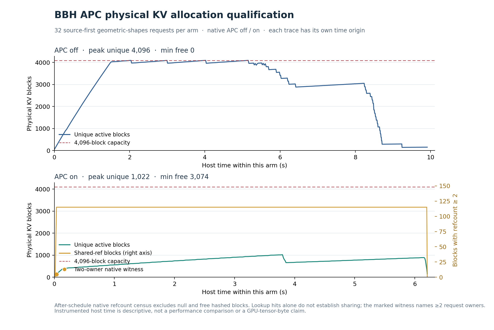

# Native APC removes the observed shared-prompt capacity pressure

## Result and scope

The fixed native APC off/on pair completed all64 request executions. In the on arm,31 of32 requests obtained prefix hits, and the native block tables show two different running requests owning the same physical block. Unique active KV blocks peaked at **1022**, versus **4096** with caching off; native preemptions were **0 versus4**. This supports the expected native-cache explanation in the selected cold simultaneous batch.

This is a strongest-simple-baseline allocation qualification. It supplies no new C admission method or independent algorithm novelty. The source case was deliberately selected for its long shared few-shot prefix, after CPU geometry, and is development data. Native APC already resolves the measured capacity pressure in this case; turning it off cannot establish an admission-method residual.

## Fixed comparison and complete outcomes

Same pinned base OLMoE, vLLM0.26, GPU,32sequence slots, batch1024, context4096,4096usable KV blocks; first32 official geometric_shapes examples, all external arrivals0. Same standard3-shot prompt, greedy512 output cap and blank-line stop. Only the inference APC flag differs. Both arms reset their cache after separate warmups; reset receipts show zero active blocks, hash keys and hashed blocks before measurement. All requests drain.

| Observation | APC off | APC on |
|---|---:|---:|
| Completed requests | 32 | 32 |
| Unique active block peak after scheduling | 4096 | 1022 |
| Shared active block peak | 0 | 115 |
| Requests with prefix lookup hits | 0 | 31 |
| Total prefix lookup hit tokens | 0 | 57040 |
| Actual preemptions | 4 | 0 |
| Output tokens | 13784 | 13784 |
| Blank-line stops / length caps / EOS | 13 / 19 / 0 | 13 / 19 / 0 |
| Exact correct answers | 1 / 32 | 1 / 32 |
| Instrumented full-generation interval | 9.919746s | 6.212734s |

The allocation witness appears at schedule index1: block136 has native refcount2 and is present in the block tables of measured requests0 and1. The pool/free-list census is consistent at all observed boundaries. Prefix hits alone are not used as proof of shared physical allocation.

Both arms preallocate **8,592,031,744 bytes** of KV tensors. The block counts measure consumption of that fixed pool by active references; they do not mean the CUDA allocation shrank. Free hashed blocks are reclaimable and are reported separately from blocks referenced by active requests. The counts are observed after native scheduler calls, not a claim about every transient internal allocator instruction.

## Output quality and timing limitations

Each arm scores only1/32 correct with the already-fixed historical parser;31 wrong answers remain in each denominator. Nineteen requests per arm reach the512-token cap. There are no suffix>=256 repetition flags under the fixed period<=16 diagnostic, but this does not establish semantic correctness. The long-task domain is currently weak as evidence of useful answer service.

Ten of32 output token sequences/texts and normalized predictions change between arms, although total output token counts match. Four requests change finish/stop reason, while aggregate finish counts match. No correctness label changes. Aggregate equal token count is not equal generated work or semantic equivalence.

The durations include per-step Python allocation observation and any runtime/JIT costs; the order has only one off/on pair. They are descriptive complete-episode records, not an equal-work speedup, a throughput benchmark, or an uncertainty estimate. This experiment's causal evidence is the actual native sharing path and capacity behavior under the APC toggle.

## Decision

Do not build a new controller from the BBH shared-prefix pressure case. Its apparent summed-prompt pressure omits a working native mechanism, and its answer correctness is poor. This result does not rule out admission problems with different prefix reuse, context lengths, arrival structure or useful-output workloads; those require independent evidence. The old Past-Future formula collision still withdraws C's former novelty claim. The research goal remains incomplete and not READY_FOR_HUMAN_REVIEW.

## Sources, execution and artifacts

- [Frozen plan](C_BBH_APC_PLAN_20261001.md), source/input/scorer commit `8863348`; official BBH revision `9ee07bd481feebf959a6b59d61ea57bdcf30964d`. The first example was already in the27-task qualification; this is not held-out confirmation.
- [Pinned native cache lookup/allocation](https://github.com/vllm-project/vllm/blob/v0.26.0/vllm/v1/core/kv_cache_manager.py), [block references](https://github.com/vllm-project/vllm/blob/v0.26.0/vllm/v1/core/block_pool.py). The recorded execution now supplements the earlier source-only expectation.
- Run12:26:46.133648–12:28:05.860168UTC, fixedorder off/on, SSH96665exit0. Each owned child was reaped; both post-exit GPU receipts show no compute processes. Existing nonblocking shared lock spans both cells and is released. No repeat or further GPU unit is queued.
- Complete local/remote root `c-bbh-native-apc-pair-dev-v1`; both `measured-outputs.json` and `measured-steps.json`, plus pair receipt, match remote SHA values.
- [Output analysis](bbh_apc_output_analysis_v1.json), [allocation analysis](bbh_apc_allocation_v1.json), all32 request-level comparisons and original outputs retained. Code: `C_BBH_APC_ANALYZE_V1.py` and `C_BBH_APC_ALLOCATION_V1.py`.
- Local archive `c-bbh-native-apc-pair-dev-v1-local-copy.tar.gz`,703855bytes, SHA `811dcb3ced99da5021277e469234ac6ec9bd53537a67bf36f4ce69c093bc08f4`. [Archive receipt](bbh_apc_archive_receipt_v1.json). Remote expanded originals retained; no remote archive claimed.
