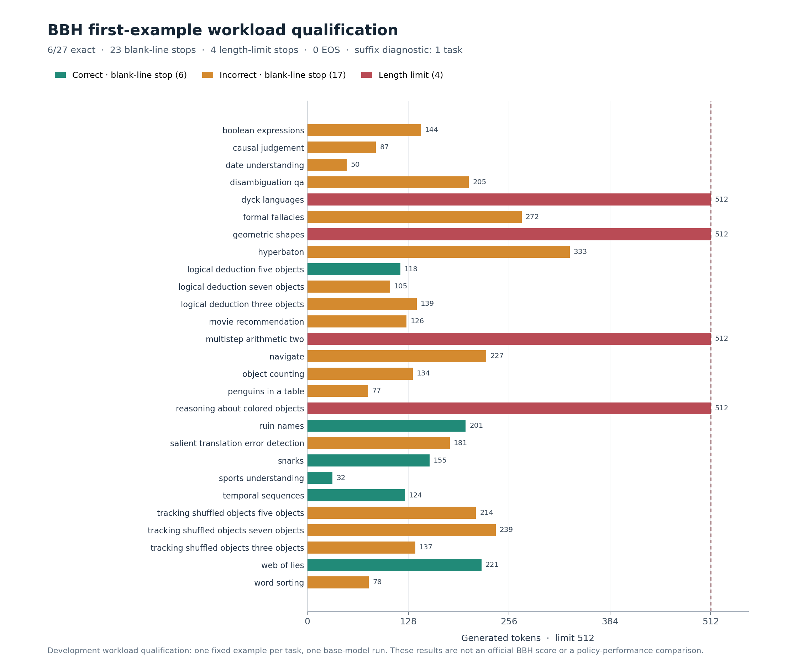

# BBH 27-task generation qualification — completed 2026-10-01

## Result and decision

The frozen first example from each of27 official BBH tasks completed under the existing base OLMoE/vLLM runtime. The fixed historical exact-match rule scores **6/27 correct (22.22%)**. All27 are retained and scored. **23 finish at the explicit blank-line stop string, 4 at max_tokens512, and 0 at EOS.** This is task-stop generation, not evidence of natural EOS. No output- or task-based filtering was used.

This establishes that the stack can produce task answers with varied lengths and directly checkable correctness. It does not establish robust answer quality:21 answers are incorrect under the fixed rule, including four capped outputs. The27 first examples are development inputs, not a full BBH benchmark, a held-out confirmation, or a model ranking. No new admission strategy was tested. The old peak-formula novelty remains withdrawn.

## Frozen setup and execution

- Source: [official BBH](https://github.com/suzgunmirac/BIG-Bench-Hard/tree/9ee07bd481feebf959a6b59d61ea57bdcf30964d), all27 tasks alphabetical, first example index0. Standard3-shot CoT plain completion; no chat template.
- Prompt composition, max512, greedy sampling and blank-line stop follow the [historical open-instruct evaluator](https://github.com/allenai/open-instruct/blob/d05effeb4df018dd82c15a956a4a58da82547eb5/eval/bbh/run_eval.py). The first `the answer is ... .` match is extracted; fallback is the full output. Exact match ignores case and ASCII punctuation. No alternate parser after outputs.
- Model `allenai/OLMoE-1B-7B-0924`, revision `6d84c48581ece794365f2b8e9cfb043c68ade9c5`; fixed private vLLM0.26, BF16, seed20260905. Native32 sequences, batch1024, context4096, 4096usable KV blocks, prefix caching/offload/async disabled. Prompts230–2003tokens.
- All27 external arrivals at0, separate2-request/16-token warmup, complete drain. Source/inputs/scorer frozen atdacd06a; one wrapper compatibility correction at2aed324. The first attempt failed in the first warmup step because the wrapper did not forward vLLM's scheduling argument; it produced no measured27-task generations. The full failed attempt remains retained.
- v2 ran12:07:09.435229–12:07:48.381423UTC. Owned child22691reaped, exit0; GPU0MiB/no apps after exit. Existing shared nonblocking lock held throughout loading, warmup, measurement and exit. Two previous v2 lock attempts deferred without creating a child. No retry queue.

## Output and cost observations

- Actual output tokens: **5647**; median155, mean209.148, range32–512.
- Complete measured generation interval: **4.893156s**; zero preemptions. This is a qualification recording, not a comparative performance claim. The log warns of a `fused_moe_kernel` JIT during inference. Text-stop buffering also differs from earlier detokenize=False article runs.
- All27 known-cap reservations total2415blocks, below4096; this cell cannot establish a capacity-pressure benefit. Physical observations after engine steps are retained in `native/measured-steps.json`; they do not claim an instrumented within-step peak.
- Predeclared period<=16 / periodic suffix>=256 diagnostic flags **1/27**, `multistep_arithmetic_two`. Its threshold and output cap differ from the article diagnostic, so no matched repetition-rate reduction is claimed.

## Full-corpus capacity geometry and strongest simple baseline

A separate CPU scan covers all6511 official examples with the same3-shot prompt and tokenizer. Prompt lengths226–2035, median895, p951709; no prompt+512 context violation. The largest32 full-cap reservations sum5053blocks; smallest32 sum1504. This is an occupancy upper bound, not an observed serving episode.

For `geometric_shapes`, even the shortest32 cap reservations total4904blocks; `salient_translation_error_detection` totals4367. But their exact task-wide common prefixes are1851/1577tokens, including115/98 complete16-token blocks. If all32 requests share those complete blocks, the corresponding reservation bound subtracts31×115 or31×98blocks; the largest32 sums would then be1488/1510. That is a structural ideal-sharing calculation, **not** a measured APC allocation or speedup. It shows why disabling prefix caching would omit a strong simple mechanism in these task families.

Therefore no long-task subset or controller is selected from the geometry. The next concrete CPU question is how the existing native APC allocator and the nearest peak-admission implementation account for shared live prefixes. Only a residual beyond those mechanisms would justify a new admission action. Input length alone does not establish a serving bottleneck.

## Artifacts and reconstruction

- Fixed inputs: `20261001_c_bbh_qualification_inputs_v1/{config,workload,SOURCE_RECEIPT}.json`.
- Runtime sources: `C_BBH_QUALIFICATION_CELL_V2.py`, `C_BBH_QUALIFICATION_LAUNCHER_V2.py`, `C_BBH_QUALIFICATION_FREEZE_V2.json`.
- All actual outputs/golds/token IDs/stops/timestamps: `c-bbh-qualification-dev-v2/native/measured-outputs.json`; raw local and remote SHA match: `e567faf398deed8906e1be8d149b0ac469a5a0c12bc2eeabd588e227eb163f24`.
- Analyzer: `C_BBH_QUALIFICATION_ANALYZE_V1.py`; result `bbh_qualification_analysis_v1.json`; frozen parser CPU checks6/6 passed before output inspection. Analysis requires the official source checkout at the pinned commit.
- CPU geometry: `C_BBH_CORPUS_GEOMETRY_V1.py/json`. Hypothetical chunk-state diagnostic: `C_PF_CHUNK_KINEMATIC_PROBE_V1.py/json`; scope in the qualification plan.
- Complete v2 local archive: `c-bbh-qualification-dev-v2-local-copy.tar.gz`,113620bytes,SHA `87e3db1b1c54c2fb99c1fde10626f3630499abfb0d2f8bb66a067ce89d674b85`. Remote expanded originals retained; no remote archive claimed.
- v1 failed-attempt archive: `c-bbh-qualification-dev-v1-local-copy.tar.gz`,11133bytes,SHA `b32d8d804eab9a8f1d388519df0f3d644b62c0a704b11936ed938234638be8e5`; remote failed originals retained.

The C research goal remains ACTIVE/INCOMPLETE and not READY_FOR_HUMAN_REVIEW.

## Every task

| Task | Output tokens | Exact match | Finish |
|---|---:|---|---|
| boolean_expressions | 144 | incorrect | blank-line stop |
| causal_judgement | 87 | incorrect | blank-line stop |
| date_understanding | 50 | incorrect | blank-line stop |
| disambiguation_qa | 205 | incorrect | blank-line stop |
| dyck_languages | 512 | incorrect | length |
| formal_fallacies | 272 | incorrect | blank-line stop |
| geometric_shapes | 512 | incorrect | length |
| hyperbaton | 333 | incorrect | blank-line stop |
| logical_deduction_five_objects | 118 | correct | blank-line stop |
| logical_deduction_seven_objects | 105 | incorrect | blank-line stop |
| logical_deduction_three_objects | 139 | incorrect | blank-line stop |
| movie_recommendation | 126 | incorrect | blank-line stop |
| multistep_arithmetic_two | 512 | incorrect | length |
| navigate | 227 | incorrect | blank-line stop |
| object_counting | 134 | incorrect | blank-line stop |
| penguins_in_a_table | 77 | incorrect | blank-line stop |
| reasoning_about_colored_objects | 512 | incorrect | length |
| ruin_names | 201 | correct | blank-line stop |
| salient_translation_error_detection | 181 | incorrect | blank-line stop |
| snarks | 155 | correct | blank-line stop |
| sports_understanding | 32 | correct | blank-line stop |
| temporal_sequences | 124 | correct | blank-line stop |
| tracking_shuffled_objects_five_objects | 214 | incorrect | blank-line stop |
| tracking_shuffled_objects_seven_objects | 239 | incorrect | blank-line stop |
| tracking_shuffled_objects_three_objects | 137 | incorrect | blank-line stop |
| web_of_lies | 221 | correct | blank-line stop |
| word_sorting | 78 | incorrect | blank-line stop |
