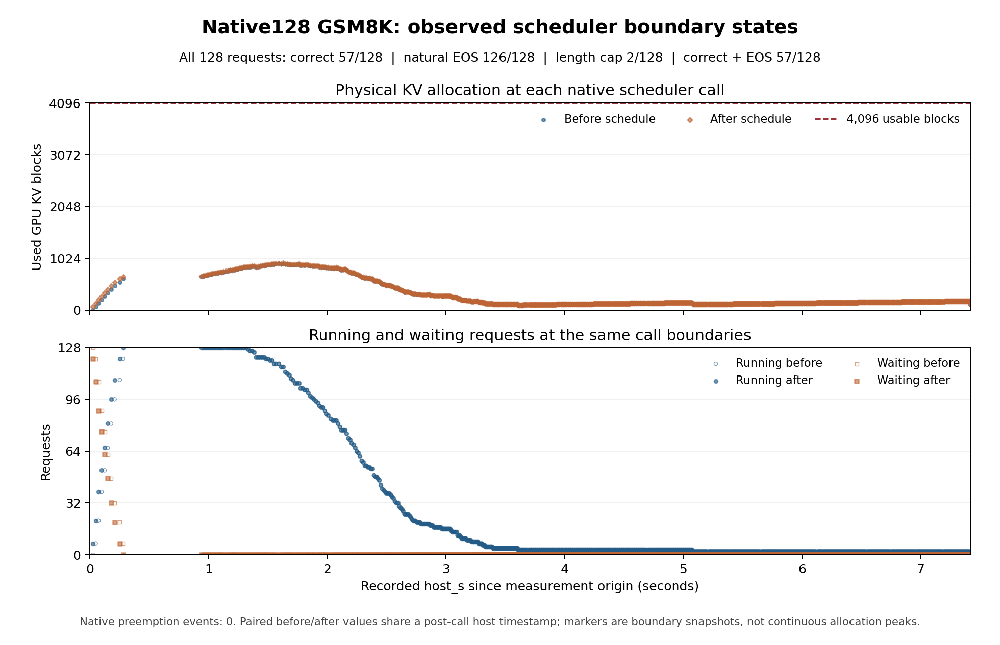

# 原生 128 并发 GSM8K 开发观察：完成，停止当前容量方向

## 判定

2026-10-01 15:10:25–15:11:34 UTC，备用 RTX 5090 上完成全部 128 条请求及排空。**57/128 数值答案正确，126 条自然 EOS，2 条长度封顶，零抢占；观察 KV 峰值 932/4096 块。** 第 9 次调度后所有 128 条请求已进入 running，此时尚无请求完成；之后 waiting 始终为零。这里有大量实际容量余量，已触发[事前计划](C_INSTRUCT_NATIVE128_PLAN_20261001.md)的停止分支。

停止本次 GSM8K 容量策略方向；不追加更高并发、更小 KV、长输出上限、提示或种子变体去获得压力。该边界限定于本模型、输入、原生配置与单批到达，并未否定其他运行域的准入问题。没有新控制器由本格获得支持；整体论文仍未达到 READY_FOR_HUMAN_REVIEW。

## 冻结配置与执行

- 计划 `0bcd5eb`；GPU 输入、cell、launcher 与 scorer `1c001f7`；容量聚合 `89de159`；绘图 `f22d1fe`。全部输出观察后才新增的 timeline/output diagnostics 明确属于事后描述。
- 官方 OLMoE-1B-7B-0924-Instruct，revision `7f1c97f440f06ce36705e4f2b843edb5925f4498`；GSM8K 官方源序前 128 条，全体外部到达为 0，包含旧资格格的相同前 16 条。全部输入已成为已见开发数据。
- 历史八示例 CoT、聊天模板加 `Answer:`；贪心 seed 20260905；EOS 启用，无文本 stop；最大 1024 新 token、最小 0。没有按质量或实际输出筛选。
- BF16、上下文 4096、原生 chunked prefill/APC 开启、batch 1024、显式 max_num_seqs=128、4097 分配块含 null/4096 可用块、无 offload/异步/speculative。128 是当前直接 EngineArgs 入口的默认并发值；其余显式设置不能称整套 vLLM 默认配置。
- 首尾两请求各 16-token 暖机，随后原生前缀缓存 reset；正式计时包含 Python 调度观察和全部 drain。它不是 32 对 128 的性能比较或生产到达 trace。
- GPU `GPU-3fc910c2-bf65-5273-e6b5-6c0d8b6ce03e`；沿用现有锁 inode `2304:25841682495`。SSH 91137 终止为 0；child 9116 已回收；结束 GPU 2 MiB、无 compute process，私有 stage 已删除。13,838,721,960 字节的已验证权重仍保留在持久 RAM cache，未声称全部内存释放。无 C GPU 作业或排队重试。

## 全部请求与质量

| 指标 | 结果 |
|---|---:|
| 计划 / 完成 / 缺失 | 128 / 128 / 0 |
| 最终答案正确 | 57/128（44.53125%） |
| 正确且自然 EOS | 57 |
| 正确且长度封顶 | 0 |
| 自然 EOS / 长度封顶 | 126 / 2 |
| 可抽取数值答案 | 128 |
| 输出 token | 13,989 |
| 长度 min / median / mean / max | 27 / 87 / 109.2891 / 1024 |

冻结 scorer issues=[]。评分保留历史逗号处理和最后数字抽取规则；这是源序前 128 题的开发成绩，不能称作者随机 200 题或全 GSM8K 的官方分数。

两条封顶输出全部保留。#98（金答案 5，预测 30）在设未知数后循环算式，末 256 token 最短精确周期为 6；#114（金答案 6，预测 2）先把原题答成 15000，再续写无关问答至封顶。后一项是人工文本判读，精确周期检测没有标记它。检测只适用于长度至少 256 的 3 条输出（EOS 1、封顶 2），标记 1/3，不能将其余 125 条当作长重复检测阴性。

与已完成的 fixed16 运行比较，前 16 条 prompt 文本及 IDs 全部相同；输出文本及 IDs 各有 7 条相同、9 条变化，finish/stop 原因全部相同。两格重叠 16 题均答对 5 条，无正确性翻转。工作量和文本差异仅作记录，不能据此归因并发对质量或速度的影响。

## 真实容量与队列过程

共记录 1032 次调度；after-schedule 最大 932 块，before-schedule 与 after-step 最大均为 923 块。最小观察空闲量 3164 块，即可用池的 77.2461%；无全池快照、无原生抢占。932 是被占用块的观察峰值，固定 KV 池分配仍为 8,592,031,744 字节。

- call 0–8 调度后仍有等待，每次均用完 1024-token budget。
- call 9，host 0.278474 s：before running/waiting=121/7、占用 632；after=128/0、占用 669，安排 615 tokens。第一条请求到 1.330624 s 才完成，因此所有 128 条入场不依赖先前完成腾出容量。
- call 50，host 1.629820 s：running=116、waiting=0，after 占用达到峰值 932。
- waiting 在首次归零后未再次出现，全体最终排空。

预算用尽是实际记录，未对每一段队列等待作排他性的因果分解。前后快照共享调度后 host 时间戳，未观测 allocator 内每一瞬态。但全体实际入场、零抢占和余量的量级共同支持本次停止决定，不只依赖“空闲块大于零”。

## 时间与成本边界

正式生成观察到 drain 为 7.419817 s；描述性请求/实际输出率为 17.2511 请求/s、1885.3565 token/s。所有计时来自 host，含本格观察开销，未与旧 16 格作速度比。

| 全请求等权指标（s） | Mean | Median | P95（nearest rank） | Max |
|---|---:|---:|---:|---:|
| 外部到达到首 token | 0.206389 | 0.147638 | 0.939079 | 0.939079 |
| 外部到达到完成 | 2.359958 | 2.253366 | 3.311855 | 7.419747 |
| 每请求最大不同 host 返回间隔 | 0.622082 | 0.661923 | 0.661923 | 0.661923 |

这组延迟是事后描述，未添加新的 SLO 或 goodput 主目标。日志 23:11:24 本地时间（15:11:24 UTC）记录 measured inference 中 `fused_moe_kernel` JIT 警告；不把 0.662 s 间隔全部归因为该警告，不将本格视为无编译污染的稳态服务速度。容量结论不要求用补跑消除这一计时限制。

独立阶段：缓存校验与 stage 准备 12.06394 s，engine 初始化 40.45577 s，应用暖机 0.20456 s，measurement wrapper 7.48341 s，shutdown 0.74377 s，child 全生命周期 66.50262 s。阶段与正式观察的定义不同，不相互重复相加成“服务时间”；首次下载准备另有收据。

## 可重建资产

- [冻结质量分析](instruct_native128_quality_v1.json)、[容量分析](instruct_native128_capacity_v1.json)、[事后时间线](instruct_native128_timeline_v1.json)、[输出诊断](instruct_native128_output_diagnostics_v1.json)。各自记录原件 SHA；对应同名前缀 Python 脚本保留。
- 图的 [SVG](c_instruct_native128_schedule_snapshots_v1.svg) 与 PNG 已从实际原件生成并目视检查。
- 原始目录：`C_research_artifacts/20261001/c-instruct-gsm8k-native128-dev-v1/`；原始远端目录和压缩包均保留。
- 完整归档 `c-instruct-gsm8k-native128-dev-v1-complete.tar.gz`，208101 字节，SHA-256 `35fb6e6672c8c6f6f56506bb2cbafdb75a28ec6f48f9ccb13f28433669472cf7`，远端与本地一致。

后续问题仍是找到有用自然输出域中强原生策略实际错失的动作机会及未被近邻覆盖的机制。目前只核实独立长文档问答的运行域可行性；未选定新策略，也未安排更多 GSM8K 容量格。
