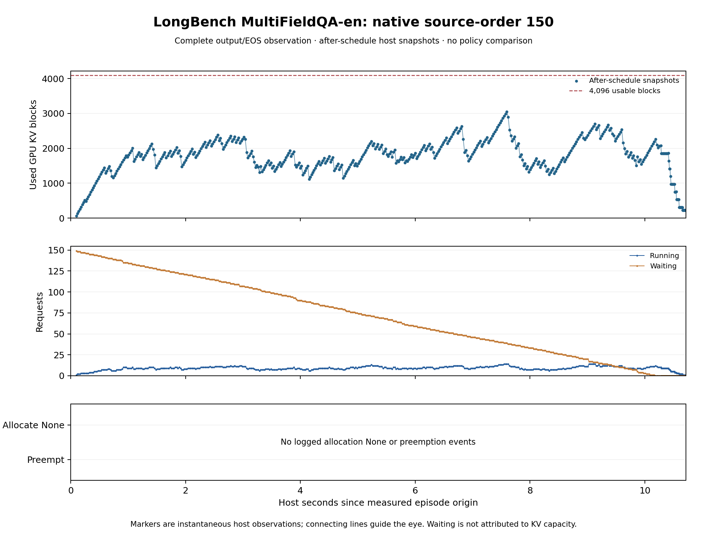

# C：完整 MultiFieldQA-en 150 条原生资源观察

**结论：停止本配置下的容量方向。** 冻结的官方任务全部150条完成；4393次原生KV分配调用没有一次返回失败，也没有抢占。占用峰值3055/4096块，最低观察余量1041块（25.42%）。448次调度后仍有waiting的调用全都用满1024-token预算，running峰值仅14，未触及128序列上限。该批次的排队没有暴露可由容量准入修复的阻塞。这执行了[事前停止规则](C_LONG_DOCUMENT_QA_FULL_PLAN_20261001.md)，不改并发、KV、cap、提示、seed或行段继续寻压；没有选择新控制器。

## 固定运行和全体结果

事前代码与输入 `b5d244c`，分析准备 `8fad3ed`。采用与前16格相同的Instruct模型固定修订、官方短答案提示、3500-token头尾截断、OLMoE chat、greedy seed20260905、EOS开启、无文本stop、max64。官方源序0–149全部同时外部到达并完整drain；前16输入字典完全一致。原生128seq/batch1024/4096可用块，APC、chunked prefill、full-ISL、FCFS开启；同一备用RTX5090。150是完整任务集合，不是为寻找压力挑选的并发点，但同时到达仍是受控开发批次，不能称生产流量。

| 指标 | 实测 |
| --- | ---: |
| 计划 / 完成 / 缺失 / 空输出 | 150 / 150 / 0 / 0 |
| 官方全文 mean F1 ×100 | 37.106557 |
| 归一化 exact match | 17/150 |
| 自然EOS / 64-token封顶 | 127 / 23 |
| 输出token总计 / 中位 / 均值 | 3942 / 20 / 26.28 |
| 原生allocation调用 / 返回None | 4393 / 0 |
| 抢占事件 | 0 |
| after-schedule占用峰值 / 可用块 | 3055 / 4096 |
| after-schedule running峰值 | 14 |
| 调度调用 / 用满1024预算 | 512 / 451 |
| 调度后仍waiting / 其中用满预算 | 448 / 448 |
| 首次完成 / waiting首次清零 | 0.264152 / 10.187800 s |
| 最后完成 / 完整生成观察 | 10.713823 / 10.713917 s |

waiting在call448后清零且未重现。正式结束的native drain为空队列、零请求与4096空闲块。图中的after-schedule占用发生在本轮输出处理前，不应要求最后一个调度快照本身为零。



## 完整请求成本和输出差异

| host观察指标（每请求等权） | 均值 | 中位 | p95最近秩 | 最大 |
| --- | ---: | ---: | ---: | ---: |
| TTFT，秒 | 5.191331 | 5.066947 | 9.897605 | 10.277980 |
| 外部到达至完成，秒 | 5.739873 | 5.632979 | 10.429392 | 10.713823 |
| 每请求最大不同返回时刻间隔，秒 | 0.024505 | 0.024438 | 0.028381 | 0.028381 |

host返回同批多个token时无法恢复其内部GPU间隔。观察器、全体请求提交和排空计入本格，未删去等待或较差输出。模型准备11.864288s、engine初始化40.251569s、首尾warmup0.783467s、measurement wrapper10.964817s、shutdown0.920604s，整个child73.564442s；生成区间包含在measurement wrapper中。日志中有inference JIT警告（日志所称inference也包含warmup），不把该单格称稳态吞吐或补跑取更好时间。

与旧16格重叠部分：16/16输入相同，15/16输出IDs完全一致；所有长度与结束原因一致。仅#14的64-token解释文本改变，F1从0.038462变为0，旧/新重叠均值52.00435/51.76397。完整150的37.10656与旧16的52.00435使用不同总体，不能称批量扩大使质量下降。没有等工作量速度或并发质量因果比较。

## 质量与适配边界

全体F1使用冻结的官方英文全文词级评分、所有参考答案取最大值；它不是事实正确率。30条F1=0包括词形差异、歧义、缺项及真实错误，例如#22的`Five`对`5.`、#86的不同连字符、#8的累计战绩/比赛比分，以及#91的256对172、#96的7对21。评分、参考答案和cap保持不变。

人工读完23条cap和30条零F1输出，未见系统性机械循环或聊天模板泄漏。cap多数是相关解释、公式或列表中途被截断；#114、#148存在局部内容偏移，不能把所有输出都称正确或有用。所有150条全文、token IDs、F1和结束原因均在[完整评分](long_document_qa_full_quality_v1.json)与原件中；没有按正确性过滤服务指标。

118/150条输入经过中段删除，112个不同原始context，最终prompt1367–3514tokens。旧16条的人工支持保留检查不能推广到余下134条；没有逐篇核验全部证据是否保留。该结果是本地OLMoE/vLLM适配的完整任务成绩，不是原论文官方模型成绩或完整长文档理解证明。

## 执行、复算与下一边界

在前两次锁忙延后后，只读检查发现资源释放且唯一根不存在，第三次自然机会取得既有非阻塞锁。唯一根 `c-instruct-longbench-full150-dev-v1` 于2026-10-01T16:27:02.093356Z–16:28:19.319119Z完成，SSH94231退出0，child15824回收0。GPU退出后2MiB/无compute process，私有stage删除；持久13,838,721,960字节权重cache仍占RAM。没有C活动作业、持锁或排队重试。

完整原件4220075字节，SHA-256 `c9e918b570f60eafaf2b8f125d2e182445ada994459777ed49d1f39dbda83b79`；复制25706退出0、本地哈希相符，原始文件在本地和远端均保留。稳定目录 `/Users/zhaozhenyu/Desktop/毕业设计/C_research_artifacts/20261001/`。freeze SHA `5575ed51625e3b99d204e07121d810a46976ccf4b274a51bcbac86b757ae4524`。

在本目录复算，`$C_RAW`指完整150根，`$C_FIRST16`指旧16根，输出路径需不存在：

```sh
python C_LONG_DOCUMENT_QA_FULL_ANALYZE_V1.py \
  --input-dir 20261001_c_long_document_qa_full_inputs_v1 \
  --run-dir "$C_RAW/native" --metadata-dir 20261001_c_instruct_model_metadata_v1 \
  --output quality.json
python C_LONG_DOCUMENT_QA_FULL_RUNTIME_V1.py \
  --run-dir "$C_RAW/native" --quality quality.json \
  --first16-run "$C_FIRST16/native" --output runtime.json
python C_LONG_DOCUMENT_QA_FULL_PLOT_V1.py \
  --run-dir "$C_RAW/native" --quality quality.json --runtime runtime.json \
  --output-dir figure
```

本次以实际原生分配/完整请求证据否定了“这套完整任务已有容量阻塞，值得直接上准入控制器”的假说；没有否定其它任务、配置或所有活跃集合问题。固定配置及停止承诺保留。旧Past-Future覆盖的峰值公式不因这次任务资格而恢复新颖性；同cap64的截断也不能识别更远EOS或自动支持混合cap预测。当前缺口仍是一个自然且重要的瓶颈，以及强简单/近邻方法未覆盖的可执行动作，论文目标仍未完成。

### 完成后的缓存工作界与下一参照

可用块包含能回收的旧缓存，不是CUDA张量大小减少；零活跃分配阻塞不能排除前缀复用损失。[已有原件的CPU核算](long_document_qa_cache_headroom_v1.json)得到prompt总493650、输出3942（含EOS）、后续decode工作3792；无APC单遍账为497442，原生实际462946，相差34496。这是聚合少调度工作量，不是日志直接测得的逐块命中或逐出次数。

仅共享完整16-token prompt前缀、每请求至少重算末token的受限模型中，24071个唯一可复用块加1362个必算尾部token给出prompt工作386498；固定本次已有输出工作后为390290，与原生差72656。实际检查排除了尾部整块与另一请求可复用块双计；唯一完整重复prompt是#38/#123。这个界假定无限缓存/理想顺序，不是4096块可达收益、通用公式或其它生成轨迹全局下界。

[PEEK](https://arxiv.org/html/2607.02525v1#A3.SS1)已经覆盖批次前缀树DFS重排，不能将该想法称为新C方法。作者固定代码的默认guard在本150上通过，置换改变149个位置。唯一下一格是[作者纯DFS重排参照](C_LONG_DOCUMENT_QA_DFS_PLAN_20261001.md)，保持所有输入与资源，测实际工作及全部请求后果；它不撤回本节活跃KV方向停止结论，也不声称完整PEEK复现。
