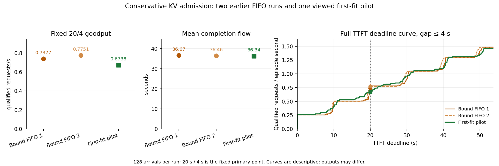

# First-fit 上界准入：开发单格负结果

## 事前问题与完成状态

[事前计划](C_NATIVE_BOUND_FIRST_FIT_PLAN_20261001.md)在 commit 02565b5 冻结了一个简单参照：保持原生无 offload、4,096 个可用 GPU KV 块、32 序列上限和已知 prompt 加最大输出长度预留；FCFS 队头装不下时继续扫描可装入的后继。唯一改变是正式测量期的等待队列准入；输入、到达、模型、采样和暖机保持不变。本次单格 128/128 请求完成并完整 drain，原生抢占为零，预留峰值 4,096/4,096 块。

| 配置 | 20 s TTFT / 4 s gap 合格 | Goodput（请求/s） | Episode（s） | 平均 flow（s） | 输出 token | 抢占 |
|---|---:|---:|---:|---:|---:|---:|
| 较早 Bound FIFO 1 | 64/128 | 0.7377 | 86.757 | 36.665 | 123,346 | 0 |
| 较早 Bound FIFO 2 | 67/128 | 0.7751 | 86.442 | 36.465 | 124,325 | 0 |
| First-fit 单格 | 59/128 | 0.6738 | 87.562 | 36.341 | 125,210 | 0 |

First-fit 有 122 个请求到 1,024-token 长度上限、6 个自然停止；128/128 的最大观察 host 返回间隔都小于 4 s，最坏为 0.0600 s。固定 20/4 主目标比两次 Bound FIFO 分别低 8.7%/13.1%；在已定 20 点前沿中，goodput 仅在 5/20、0/20 个点较高。全队列平均 flow 反而较两次 FIFO 略低 0.9%/0.3%，故应报告完整取舍，不能只用主点概括每项成本。

## 实际越过与队头代价

门控记录 60 次实际越过入场，发生于 60 个调度步；根据原始提交时刻、首调度步与等待队列顺序重建，78 个不同请求曾被后继实际越过。这不同于先前 CPU 轨迹中的潜在可装入窗口。相对于 Bound FIFO 1 / 2，这 78 个被越过请求的 TTFT 平均增加 1.42 / 1.63 s，分别有 59 / 65 个变差，最大恶化 12.79 / 12.12 s；完成 flow 平均增加 1.86 / 2.00 s，分别有 60 / 66 个变差，最大恶化 13.82 / 14.06 s。跳队确实执行，但成本落在被越过的请求上。

相对两次 FIFO，first-fit 的完整输出 ID 序列分别有 63/128、61/128 个请求改变，输出长度有 6/128、5/128 个请求不同。三格生成工作不同；这些跨运行的逐请求差值是描述性比较，不是被越过动作的因果效应、等工作量加速或有用内容 goodput。

## 决定与证据范围

按事前负分支，本 first-fit 形式不再做匹配重复、阈值调整或换 seed；它是普通简单参照，不是新算法。当前仅可对已知 cap、当前计数和原生推进条件约束下的其他预留松弛做有界 CPU 可行性分析；尚无新的 GPU 性能证据。一个已见开发 cohort、一次 first-fit 对两次较早 FIFO、输出变化和未验证的生成语义均限制外推。

[分析 JSON](native_bound_first_fit_analysis_v1.json)与 [SVG 图](native_bound_first_fit_v1.svg)保留 20 点前沿、全请求指标和实际被越过者的逐请求代价。完整原件已复制至 /Users/zhaozhenyu/Desktop/毕业设计/C_research_artifacts/20261001/c-native-bound-first-fit-pilot-v1；传输后的 raw.json SHA-256 与启动回执一致：acc6a8634112b7965f58095ef320c0c6fe7d68d1f8235d7ded445965de20ca26。共享 GPU 锁当时忙，远端归档未执行。
