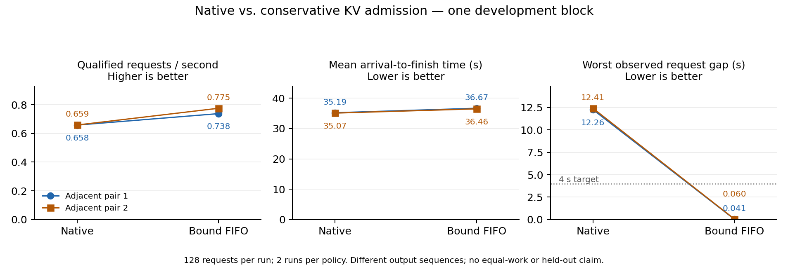
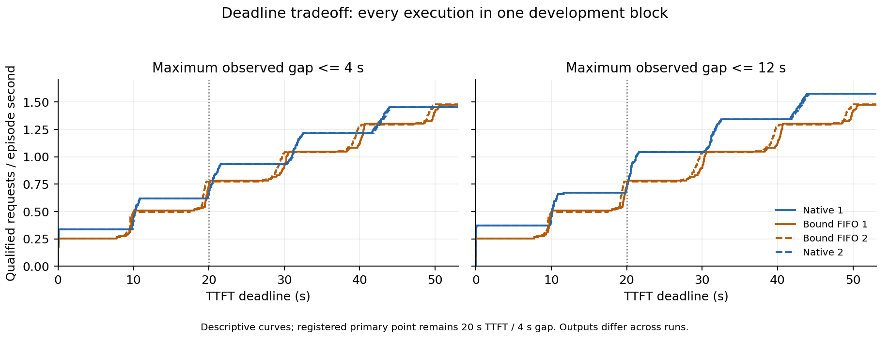

# Native versus bound FIFO: completed matched development block

All 512/512 requests completed in the frozen native/bound/bound/native order. In both adjacent pairs, conservative bound admission increased the primary joint goodput and eliminated preemption-related long gaps, with higher mean flow and lower output throughput. It is a stronger simple reference, not a novel method or unseen-data confirmation.

| Execution order | Joint 20/4 requests | Goodput, requests/s | Episode, s | Mean flow, s | Preemptions |
|---|---:|---:|---:|---:|---:|
| Native 1 | 53 | 0.6580 | 80.545 | 35.189 | 46 |
| Bound FIFO 1 | 64 | 0.7377 | 86.757 | 36.665 | 0 |
| Bound FIFO 2 | 67 | 0.7751 | 86.442 | 36.465 | 0 |
| Native 2 | 53 | 0.6585 | 80.481 | 35.074 | 47 |

## Service and cost

The two adjacent native→bound comparisons improve primary goodput by 12.1% and 17.7%, while mean flow increases 4.20% and 3.96%. Actual output throughput decreases 9.20% and 6.90%. Bound improves goodput at 10/20 and 18/20 registered frontier points, so it does not dominate the full frontier. These targets are experimental objectives, not established production SLOs.

Both native runs have 11 requests with observed maximum gaps above 4 seconds; bound has zero. Worst observed gaps are 12.257/12.409 s for native and 0.0413/0.0598 s for bound. Bound worsens TTFT for 80/128 and 81/128 requests, and flow for 59/128 and 62/128. Improved joint qualification does not mean every request benefits.

All bound reservations drain: 128 actual native admissions and releases per run, zero violations, peak 4,095/4,096 usable blocks. The rule uses known prompt lengths and max_tokens only. Holds occurred in 5,033/6,502 and 5,041/6,520 schedule calls.

## Work and uncertainty

In execution order, output totals were 126,113; 123,346; 124,325; 124,324 tokens. Finish counts (length cap / stop) were 123/5, 120/8, 121/7 and 121/7. Adjacent policies changed output ID sequences for 53/128 and 58/128 requests; six output lengths differed in each pair. This is not equal-work speedup or semantic quality validation.

Earlier results remain part of the evidence: the first native pilot gave goodput 0.5464, then the previous native/static block gave native 0.7244/0.7471. The current native values are lower; TTFT medians near the 20-second target make qualified counts sensitive to timing variation. Two same-cohort runs per arm do not establish a general superiority claim. All outputs and failures are retained.

## Reproduction and next action

Plan/runner frozen at `506aeba`; execution started 2026-09-30 20:10:40 UTC and completed without launcher errors. Originals: `/Users/zhaozhenyu/Desktop/毕业设计/C_research_artifacts/20261001/c-native-bound-matched-dev-v1/`. Archive: `c-native-bound-matched-dev-v1-complete.tar.gz`, SHA256 `4533bde64791f4db13a07b6e9bfe815e4fd0272233d139ef126caf416aed2cf7`, 29,601,977 bytes. Analysis: `C_NATIVE_BOUND_MATCHED_ANALYZE_V1.py` → `native_bound_matched_analysis_v1.json`. Plot: `C_NATIVE_BOUND_PLOT_V1.py`, matplotlib 3.9.4, all four executions shown without a confidence interval.

The observed FCFS head-of-line fit windows motivate the sole next experiment: one simple first-fit admission pilot, keeping the same reservation and runtime. It must report the bypassed heads' waiting and completion cost as well as any additional qualified requests. No length predictor or broader parameter search is justified yet.

## Descriptive deadline sensitivity added before first-fit results

The primary 20/4 target remains unchanged. At a fixed 4-second gap target, the adjacent 19- and 21-second TTFT cutoffs reverse the policy ordering:

| Run | 19 s TTFT | 20 s TTFT (primary) | 21 s TTFT |
|---|---:|---:|---:|
| Native 1 | 0.6208 | 0.6580 | 0.8442 |
| Bound FIFO 1 | 0.5302 | 0.7377 | 0.7838 |
| Bound FIFO 2 | 0.5321 | 0.7751 | 0.7751 |
| Native 2 | 0.6213 | 0.6585 | 0.8449 |

Values are qualified requests per episode second. The step-shaped curves reflect groups of requests reaching their first output together; the observed 20-second benefit is local to the deadline position. This strengthens the limitation against a broad throughput claim while leaving the measured gap reduction intact. These are post-hoc descriptive curves, not a revised primary objective or a policy-selection sweep. `C_NATIVE_BOUND_DEADLINE_CURVES_V1.py` reproduces the figure and underlying curve JSON from the same four immutable raw files.
