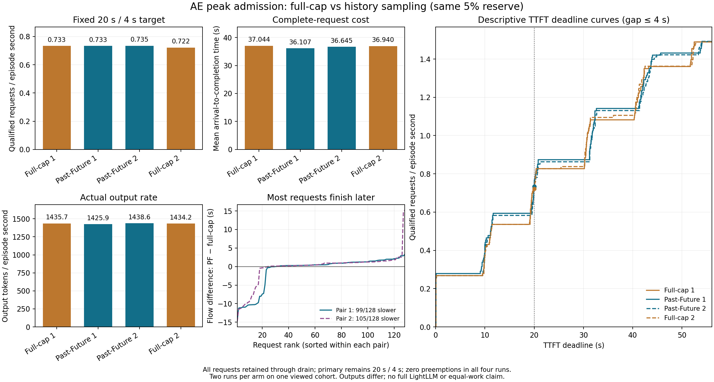

# 作者 AE 历史采样与完整 cap 峰值：四格消融结果

**已见开发 cohort 上，PF 的固定 20s/4s goodput 两对均略高于完整 cap 消融，平均 flow 也较低；在线决策 CPU 时间约为 2.1 倍，且多数逐请求 flow 变差。** 这回答的是相同 AE 峰值公式与 5% 余量下，历史采样相对完整输出 cap 评分的增量问题，不构成新方法或完整 LightLLM 系统的效果结论。

按[预注册计划](C_NATIVE_PAST_FUTURE_CAP_ABLATION_PLAN_20261001.md)固定 `cap_1 → past_future_1 → past_future_2 → cap_2`，源码于 `e770841` 冻结。四个子进程在 2026-10-01 10:50:15.307499–10:58:26.557051 UTC 完成；全部 512 个请求完成，四格策略记录均为 `DRAINED`、128 次入场和完成、零违规、零原生抢占及零恢复。GPU 在每格退出后排空，未追加格或调整阈值。

## 完整 episode

每格使用相同 128 篇已见文章（eligible ranks 832–959）、相同 Poisson 到达、模型与 seed、自然 EOS/最多 1,024 输出 token、batch4096、32 槽位和 4,096 个可用 16-token KV 块。分母包含所有到达到完全排空。`cap` 与 PF 共享单个 FIFO 队首、完整 prefill/recompute 联合预算 guard、原生分配及 5% 峰值余量；仅峰值评分中的未来输出长度来源不同。cap 对每个请求使用已知输出上限，PF 使用在线完成历史的条件采样。

| 顺序 | 20/4 合格 | goodput 请求/s | episode 秒 | 平均 flow 秒 | 输出 token | length / stop | 决策 CPU 秒 | 物理 KV 峰值块 |
|---|---:|---:|---:|---:|---:|---:|---:|---:|
| cap_1 | 63 | 0.733082 | 85.938538 | 37.044083 | 123,385 | 120 / 8 | 0.783794 | 3,901 |
| past_future_1 | 63 | 0.733489 | 85.890811 | 36.107474 | 122,469 | 119 / 9 | 1.653068 | 4,049 |
| past_future_2 | 63 | 0.734501 | 85.772499 | 36.645199 | 123,395 | 120 / 8 | 1.694502 | 4,015 |
| cap_2 | 62 | 0.721708 | 85.907351 | 36.939806 | 123,207 | 120 / 8 | 0.791509 | 3,903 |

相邻配对按 cap 作参考：PF1 的合格数仍为 **63 比 63**，goodput **+0.056%**，增幅来自 episode 时长缩短约 0.048 秒；PF2 为 **63 比 62**，goodput **+1.773%**。两对 PF 平均 flow 分别 **−2.528% / −0.798%**。决策 CPU 小计分别为 cap 的 **2.109 / 2.141 倍**，它已计入 episode 时间，并非额外扣除项。四格重复 hold 调用数依次为 4,747 / 4,782 / 4,797 / 4,750，不能解释为独立请求数。

表中决策 CPU 小计具体是 host `perf_counter` 测得的决策函数耗时，并非进程 CPU 时间计数。

## 前沿、逐请求和输出差异

两组相邻配对的 **20/20 个预登记前沿点 goodput 均为 PF 较高**；每对有 15 个点的合格请求数较高、5 个相同。四格最大观察到的 host-return token 间隔均低于 0.071 秒，因此本域 4 秒间隔条件对全部完成请求通过；主点人数差异来自 TTFT 条件。前沿点共享同一 episode，不能当作 20 次独立重复。

逐请求配对中，PF1/PF2 分别有 **99/105 个请求 flow 增加**，TTFT 增加 **94/102 个**；flow 差值的中位数为 **+0.468 / +0.594 秒**，均值却为 **−0.937 / −0.295 秒**。少数较大改善拉低了均值。平均 TTFT 差值为 **−1.109 / −0.510 秒**，首 token 之后的平均时段反而增加 **+0.172 / +0.216 秒**；这只是观测时间分解，不证明等工作量因果。最大间隔增加 **96/48 个**，数值仍远低于 4 秒。完整逐请求差值在[分析 JSON](native_past_future_cap_ablation_analysis_v1.json)中保留。

PF1 相对 cap1 有 **59/128** 个输出 ID 序列、**2** 个长度、**1** 个结束原因变化，输出总量少 916 token；PF2 相对 cap2 分别有 **60/128**、**5**、**4** 个变化，输出总量多 188 token。PF 两格自身有 54 个序列、2 个长度、1 个结束原因变化；cap 两格自身为 43、3、2。PF 主点两次都是 63，cap 从 63 变为 62。每臂只有两次 episode，不能从请求数或前沿点数推导总体置信度，也不能宣称等工作量加速。

## 解释和证据范围

该实跑支持一个有限结论：在固定的 5% 余量和本次已见输入中，作者 AE 核心的历史采样相对同公式完整 cap 评分改变入场并对应较高的 20/4 goodput；收益很小且请求级退化与决策成本明显。cap 消融只是受控的确定性评分对照，**不是最强确定性调度基线**。结果不自动选择重复实验、余量重调或下一项方法。它不复现 LightLLM 的独立 prefill/merge、两 token 等待节奏和完整抢占路径；本 native 移植在合并的 decode/prefill 调度调用中评分。更不能据此恢复 C 退休包络的新颖性主张，或作未见数据泛化、语义质量及因果等工作量主张。

[分析脚本](C_NATIVE_PAST_FUTURE_CAP_ABLATION_ANALYZE_V1.py)按原件哈希、四格回执、输入身份和策略排空条件生成上述 JSON。本地展开原件位于 `C_research_artifacts/20261001/c-native-past-future-cap-ablation-dev-v1`。完整压缩包 `c-native-past-future-cap-ablation-dev-v1-complete.tar.gz` 为 **18,799,801 字节**，SHA-256 `0468c19a04f177160a9bdb626901ef918f2b6f1c60e28c89cbe52c92783ee0c2`。保留全部正负结果；整条 C 研究尚未达到 `READY_FOR_HUMAN_REVIEW`。
