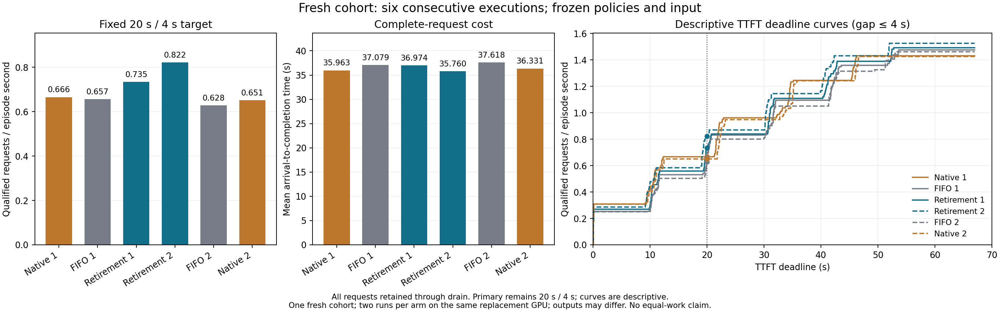

# 条件式 cap 退休预留：冻结新输入六格结果

**固定主点的新 cohort 检验为正，优势范围有限。** 条件式退休预留相对完整上界 FIFO 的两组 20/4 goodput 分别提高 **11.85% / 30.87%**，登记的 20 个前沿点均更高；平均完成 flow 分别降低 **0.28% / 4.94%**。相对同期原生无门控，主点也提高 **10.35% / 26.24%**，但只有 **5/20 / 10/20** 前沿点更高，实际输出 token/s 降低 **6.13% / 4.51%**，平均 flow 为 **+2.81% / −1.57%**。这支持预定的新输入主点假设，不能写成全面支配原生或论文已就绪。

## 冻结设计与完成情况

[比较计划](C_NATIVE_RETIREMENT_FRESH_PLAN_20261001.md)、输入和规则在 `34821e2` 冻结，运行器冻结于 `a8059a0`；两个准入策略适配器保持原版本。顺序为 **原生 1 → FIFO 1 → 退休 1 → 退休 2 → FIFO 2 → 原生 2**，固定比较退休 1 对 FIFO 1/原生 1，退休 2 对 FIFO 2/原生 2，并保留全部同臂重复。

使用此前未参与 C 策略选择的文章 eligible ranks 832–959（128 篇），实际 prompt 414–3,066 token。到达为一次冻结的 Poisson 抽样，名义 rate=5 请求/s、seed=20261001，实际到达跨度 22.682329 s；未因实测结果重抽。测量资格使用事前 3,072 prompt 上界，策略使用每请求真实长度。OLMoE、greedy seed=20260905、自然 EOS、min_tokens=0/max_tokens=1,024、32 序列、1,024 调度 token、4,096 可用 KV 块、25 CPU 线程及无 offload 路径保持固定。

六格于 **2026-10-01 08:40:50.552–08:54:51.944 UTC** 在同一替换 GPU `GPU-e4434c32-c4a4-2b81-55fa-271af38f3c36` 上完成。旧 GPU 结果仅作背景，不进入下面的配对差值。全部 **768/768** 外部请求完成并 drain，每格 0 失败、0 未完成；六个子进程正常退出并回收，块回执为 `COMPLETE`。FIFO 和退休格均各有 128 次准入/释放、0 抢占、0 条件违反；原生格的抢占也完整计入测量。

## 所有六格与固定配对

20/4 指 TTFT≤20 s 且最大 distinct host-return gap≤4 s。Goodput 分母为完整 episode，包括尾部 drain；这是实验目标，不作生产 SLO 解释。

| 执行 | 20/4 合格 | Goodput（请求/s） | Episode（s） | 平均 flow（s） | 输出 token | length / stop | 抢占 |
|---|---:|---:|---:|---:|---:|---:|---:|
| 原生 1 | 54/128 | 0.6658 | 81.108 | 35.963 | 126,083 | 123 / 5 | 43 |
| FIFO 1 | 57/128 | 0.6568 | 86.780 | 37.079 | 123,197 | 120 / 8 | 0 |
| 退休 1 | 63/128 | 0.7347 | 85.754 | 36.974 | 125,131 | 122 / 6 | 0 |
| 退休 2 | 69/128 | 0.8224 | 83.904 | 35.760 | 123,206 | 120 / 8 | 0 |
| FIFO 2 | 55/128 | 0.6284 | 87.526 | 37.618 | 122,785 | 119 / 9 | 0 |
| 原生 2 | 53/128 | 0.6514 | 81.361 | 36.331 | 125,112 | 122 / 6 | 34 |

| 候选相对参照 | 主点 goodput | 合格数增量 | Episode | 平均 flow | 实际输出 token/s | Goodput 更高的前沿点 |
|---|---:|---:|---:|---:|---:|---:|
| 退休 1 vs FIFO 1 | +11.85% | +6 | −1.18% | −0.28% | +2.79% | 20/20 |
| 退休 2 vs FIFO 2 | +30.87% | +14 | −4.14% | −4.94% | +4.67% | 20/20 |
| 退休 1 vs 原生 1 | +10.35% | +9 | +5.73% | +2.81% | −6.13% | 5/20 |
| 退休 2 vs 原生 2 | +26.24% | +16 | +3.13% | −1.57% | −4.51% | 10/20 |

| 执行 | TTFT 中位数（s） | TTFT p90（s） | Gap≤4 s 请求数 | 最大 host gap（s） |
|---|---:|---:|---:|---:|
| 原生 1 | 21.419 | 45.431 | 116 | 14.36669 |
| FIFO 1 | 20.294 | 43.038 | 128 | 0.04751 |
| 退休 1 | 20.174 | 42.677 | 128 | 0.04765 |
| 退休 2 | 19.437 | 41.839 | 128 | 0.04288 |
| FIFO 2 | 20.342 | 45.106 | 128 | 0.04125 |
| 原生 2 | 21.790 | 45.985 | 116 | 14.20883 |

退休策略消除了本块原生格所见的长 host gap，代价包含更长的完整 episode 和更低的实际输出 token/s。第一组相对 FIFO 的平均 flow 改善仅 0.105 s，不能把主点 goodput 增幅当作同等幅度的全请求加速。

## 全部登记前沿与门槛敏感性

下表给出全部 20 个固定前沿点的 goodput（请求/s）；完整合格数保留在[分析 JSON](native_retirement_fresh_analysis_v1.json)。各点共享请求，不能视为独立重复。

| TTFT（s） | Gap（s） | 原生 1 | FIFO 1 | 退休 1 | 退休 2 | FIFO 2 | 原生 2 |
|---:|---:|---:|---:|---:|---:|---:|---:|
| 10 | 1 | 0.3945 | 0.2535 | 0.2799 | 0.4767 | 0.2856 | 0.3687 |
| 10 | 2 | 0.3945 | 0.2535 | 0.2799 | 0.4767 | 0.2856 | 0.3933 |
| 10 | 4 | 0.4192 | 0.2535 | 0.2799 | 0.4767 | 0.2856 | 0.3933 |
| 10 | 8 | 0.4439 | 0.2535 | 0.2799 | 0.4767 | 0.2856 | 0.4302 |
| 10 | 12 | 0.4685 | 0.2535 | 0.2799 | 0.4767 | 0.2856 | 0.4548 |
| 20 | 1 | 0.6411 | 0.6568 | 0.7347 | 0.8224 | 0.6284 | 0.6268 |
| 20 | 2 | 0.6411 | 0.6568 | 0.7347 | 0.8224 | 0.6284 | 0.6514 |
| 20 | 4 | 0.6658 | 0.6568 | 0.7347 | 0.8224 | 0.6284 | 0.6514 |
| 20 | 8 | 0.6904 | 0.6568 | 0.7347 | 0.8224 | 0.6284 | 0.6883 |
| 20 | 12 | 0.7151 | 0.6568 | 0.7347 | 0.8224 | 0.6284 | 0.7129 |
| 30 | 1 | 0.9124 | 0.8297 | 0.8396 | 0.8700 | 0.8112 | 0.9095 |
| 30 | 2 | 0.9124 | 0.8297 | 0.8396 | 0.8700 | 0.8112 | 0.9341 |
| 30 | 4 | 0.9617 | 0.8297 | 0.8396 | 0.8700 | 0.8112 | 0.9464 |
| 30 | 8 | 0.9987 | 0.8297 | 0.8396 | 0.8700 | 0.8112 | 1.0079 |
| 30 | 12 | 1.0480 | 0.8297 | 0.8396 | 0.8700 | 0.8112 | 1.0570 |
| 40 | 1 | 1.1836 | 1.0947 | 1.1078 | 1.1680 | 1.0511 | 1.1922 |
| 40 | 2 | 1.1836 | 1.0947 | 1.1078 | 1.1680 | 1.0511 | 1.2168 |
| 40 | 4 | 1.2453 | 1.0947 | 1.1078 | 1.1680 | 1.0511 | 1.2414 |
| 40 | 8 | 1.2822 | 1.0947 | 1.1078 | 1.1680 | 1.0511 | 1.3028 |
| 40 | 12 | 1.3562 | 1.0947 | 1.1078 | 1.1680 | 1.0511 | 1.3643 |

在所有登记 gap 截止下，退休 1 对原生 1 只在 TTFT=20 s 的五点更高；退休 2 对原生 2 在 TTFT=10/20 s 的十点更高。其余登记点均更低。

固定 gap≤4 s 的 19/20/21 s 描述性切片如下。退休对 FIFO 在三种截止均为正；退休对原生在 **19 s 两组均为负**，在 20 s 主点转为正。主点事前固定，没有随曲线改动。

| TTFT 截止 | 原生 1 | FIFO 1 | 退休 1 | 退休 2 | FIFO 2 | 原生 2 |
|---|---:|---:|---:|---:|---:|---:|
| 19 s | 0.6658 | 0.5301 | 0.5597 | 0.5959 | 0.5027 | 0.6514 |
| **20 s 主点** | **0.6658** | **0.6568** | **0.7347** | **0.8224** | **0.6284** | **0.6514** |
| 21 s | 0.6658 | 0.8297 | 0.8396 | 0.8700 | 0.7998 | 0.6514 |

## 逐请求、输出工作与重复波动

下表的“低/高”表示候选相对参照的数值方向，三种延迟均以低为改善。

| 配对 | TTFT 低 / 高 | Flow 低 / 高 | Gap 低 / 高 | 输出 ID 序列不同 | 输出长度不同 | 结束原因不同 |
|---|---:|---:|---:|---:|---:|---:|
| 退休 1 vs FIFO 1 | 91 / 37 | 52 / 76 | 91 / 37 | 58 | 2 | 2 |
| 退休 2 vs FIFO 2 | 107 / 21 | 81 / 47 | 51 / 77 | 61 | 3 | 3 |
| 退休 1 vs 原生 1 | 58 / 70 | 76 / 52 | 92 / 36 | 76 | 3 | 3 |
| 退休 2 vs 原生 2 | 68 / 60 | 86 / 42 | 73 / 55 | 66 | 2 | 2 |

相对 FIFO，两组 flow 最大退化为 **15.035 s / 13.071 s**，TTFT 最大退化为 0.812 s / 0.738 s；相对原生，flow 最大退化为 **25.063 s / 8.186 s**，TTFT 最大退化为 11.600 s / 10.553 s。第一组相对 FIFO 虽平均 flow 略低，76/128 个请求的 flow 却更高，收益并非逐请求一致。

| 同策略第 2 次相对第 1 次 | 主点 goodput 变化 | 平均 flow 变化 | 输出 ID / 长度 / 结束原因不同 |
|---|---:|---:|---:|
| 原生 | −2.16% | +1.02% | 58 / 3 / 3 |
| FIFO | −4.33% | +1.45% | 55 / 4 / 3 |
| 退休 | +11.94% | −3.28% | 59 / 2 / 2 |

候选重复之间存在明显变化，不能只保留第二格。每格 119–123 个请求触及 1,024 cap；自然 EOS 虽启用且实际未知，本 cohort 仍以 cap 结束为主。配对输出 ID、长度和结束原因变化，既不能宣称等工作量因果加速，也不能由完成率或 token 总量推出语义质量等价。

## 容量、推进条件与计算成本

| 退休格 | 超完整上界的实际准入 | 完整上界和峰值（逻辑块） | 条件包络峰值（块） | 观察物理峰值（块） | 调度调用 | 门控决策 CPU 小计（s） |
|---|---:|---:|---:|---:|---:|---:|
| 退休 1 | 104 | 5,316 | 4,095 | 4,034 | 6,175 | 0.590 |
| 退休 2 | 102 | 5,347 | 4,096 | 4,029 | 6,170 | 0.573 |

FIFO 两格的完整上界预留峰值均为 4,095 块。退休策略的完整上界和是逻辑量，超过 4,096 不代表物理越界；条件包络和观测到的物理占用均未超过容量。两格退休的纯 decode 可用条件记录为 5,998 / 5,992 次，hold 为 4,866 / 4,840 次。CPU 小计仅覆盖原生调度前的门控决策，完整 episode 已包含成本；它不是全部记录开销。

推进/容量解释限于本同步、单 token decode、受保护运行前缀、无 speculative、无 offload 的执行。真实 EOS 只在出现时释放容量；没有把未来完成长度作为输入。该结果不是一般异步/流水线/多模态安全证明。

## 日志中的 JIT 时间边界

检查了全部六个 child 日志及 `timing.json`。每格各记录一条 `fused_moe_kernel` JIT 警告。原生 1 的警告时间 08:43:13 UTC 明确位于应用 warmup 08:42:33.176–08:43:14.555 内，测量起于 08:43:14.557（四舍五入）。其较长启动与 warmup 没有作为 episode 工作计入。

其余警告分别为 FIFO 1 08:45:10、退休 1 08:47:12、退休 2 08:49:14、FIFO 2 08:51:17、原生 2 08:53:23 UTC。除退休 1 外，这些整秒日志区间均早于相应测量起点。退休 1 的 warmup 结束于 08:47:12.855，测量起于 08:47:12.857；警告只有秒精度，因此仅凭日志不能确定它属于 warmup 还是测量开头同一秒。没有据此删格、补跑或修改主点，也不声称日志证明所有测量阶段均无 JIT。

## 结论与原件

按事前规则，两组退休/FIFO 主点均为正且完整性、容量和推进条件成立，因此**保留新 cohort 主点假设的支持**。同期原生比较暴露了 frontier、输出速率、flow 及门槛敏感性的限制；完整最近方法实现、更多独立 cohort/模型运行域及输出质量仍未完成。这个 fresh 属性只相对于已记录的 C 策略选择，不解决历史缺失源回执或整份 Parquet/Arrow 等价性。host gap 也不包含同次返回内部 token 间隔。单个新 cohort、每臂两次执行不足以形成总体置信结论或最终投稿就绪状态。

[分析 JSON](native_retirement_fresh_analysis_v1.json)保留全部请求、前沿和配对；[SVG 图](native_retirement_fresh_v1.svg)可放大查看，PNG 已目视检查。完整原件：`/Users/zhaozhenyu/Desktop/毕业设计/C_research_artifacts/20261001/c-native-retirement-fresh-v1`。完整归档 `c-native-retirement-fresh-v1-complete.tar.gz` 为 **44,607,042 字节**，SHA-256 `920380c771acf1fe09bf8038d00be29aba69d6d85e037d2ef7c4f40111a347de`；运行器 SHA-256 `3233aebf21bf66e8d79befaae327c6d369a017e51a2a9ed1a3cf41e051110373`。
