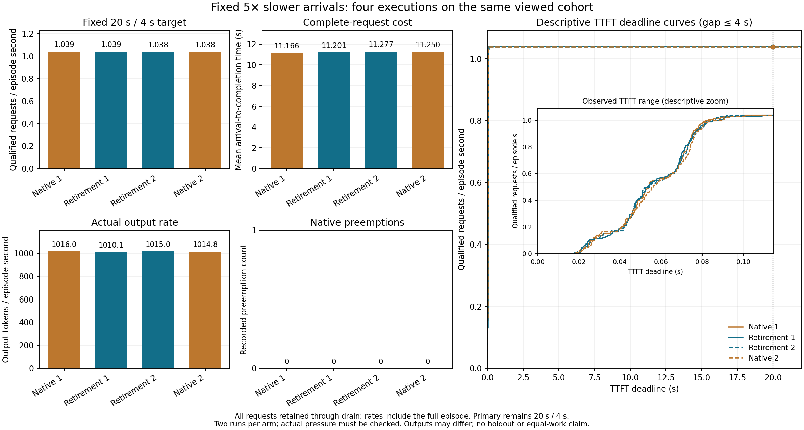

# 固定低负载负控：原生 / 退休四格结果

**未观察到实质服务收益，符合无容量驱动动作时的有限负控预期。** 全部 512/512 请求完成，四格均 0 抢占；两格退休均 **0 次超完整上界准入**。两组退休/原生的固定 20/4 goodput 差值仅 **+0.0102% / +0.0238%**，所有请求均合格；平均完成 flow 反而为 **+0.310% / +0.236%**。微小 goodput 差异完全来自 episode 分母，不能写成 SLO 合格覆盖或容量收益。

## 冻结设计与完成情况

[计划](C_NATIVE_RETIREMENT_LOWLOAD_PLAN_20261001.md)和源码在 `79062d3` 冻结。对既有 128 篇文章的同一次到达抽样施加固定 **arrival_scale=5.0**，名义 rate 从 5 降为 1 请求/s，实际到达跨度 **113.411645 s**；没有重抽、改序或改变策略。原有输入文件保持不变，测量使用明确的五倍时间变换；warmup 仍为 scale=1。该 cohort 已被查看，不是新 holdout。

顺序为 **原生 1 → 退休 1 → 退休 2 → 原生 2**，固定比较退休 1 对原生 1、退休 2 对原生 2，保留两种策略的全部重复。OLMoE、自然 EOS/max_tokens=1,024、greedy seed、32 序列、1,024 调度 token、4,096 可用 KV 块、25 CPU 线程、无 offload 及原退休策略均保持原配置。

四格在同一 GPU `GPU-e4434c32-c4a4-2b81-55fa-271af38f3c36`、同一共享文件锁下，于 **2026-10-01 09:39:52.514–09:50:29.596 UTC** 完成。块状态 `COMPLETE`，0 失败、0 未完成；两格退休各有 128 次准入/释放并 drain，0 容量或推进条件违反。证据层级为 **NATIVE_SERVING 的固定低负载诊断负控**。

## 所有四格、配对与重复

20/4 为 TTFT≤20 s 且最大 distinct host-return gap≤4 s；goodput 分母包含全部到达与尾部 drain。host gap 不包含同次返回内部 token 间隔，这些截止不作生产 SLO 解释。

| 执行 | 20/4 合格 | Goodput（请求/s） | Episode（s） | 平均 flow（s） | 输出 token | 输出 token/s | length / stop | 抢占 |
|---|---:|---:|---:|---:|---:|---:|---:|---:|
| 原生 1 | 128/128 | 1.039311 | 123.1585 | 11.1662 | 125,131 | 1,016.02 | 122 / 6 | 0 |
| 退休 1 | 128/128 | 1.039416 | 123.1460 | 11.2008 | 124,394 | 1,010.13 | 121 / 7 | 0 |
| 退休 2 | 128/128 | 1.038317 | 123.2764 | 11.2767 | 125,131 | 1,015.04 | 122 / 6 | 0 |
| 原生 2 | 128/128 | 1.038070 | 123.3057 | 11.2502 | 125,131 | 1,014.80 | 122 / 6 | 0 |

| 固定配对 | 主点 goodput | 平均 flow | Episode | 实际输出 token/s | 合格数增量 |
|---|---:|---:|---:|---:|---:|
| 退休 1 vs 原生 1 | +0.0102% | +0.3099% | −0.0102% | −0.5789% | 0 |
| 退休 2 vs 原生 2 | +0.0238% | +0.2357% | −0.0238% | +0.0238% | 0 |

| 同策略第 2 次相对第 1 次 | 主点 goodput | 平均 flow | 实际输出 token/s | 输出 ID / 长度 / 结束原因不同 |
|---|---:|---:|---:|---:|
| 原生 | −0.1194% | +0.7526% | −0.1194% | 33 / 0 / 0 |
| 退休 | −0.1057% | +0.6781% | +0.4861% | 25 / 1 / 1 |

主点配对差值小于本块同臂重复的 goodput 变化幅度；这只是描述性对照，不是统计显著性检验。第一组输出速率降低还伴随总输出少 737 token，不能把速率差全部归因于计算效率。

## 全部前沿、延迟与逐请求变化

登记的 **TTFT={10,20,30,40} s × gap={1,2,4,8,12} s** 共 20 点，在每一格均为 **128/128 合格**。因此全部点的 goodput 都等于该格主点值，上表完整确定了全部 20 点；两组均为 20/20 合格数平局。虽然退休 goodput 数值在所有点略高，原因只是同一个 episode 分母稍短，不能把 20 个共享请求的点当成 20 次独立收益。

| 执行 | TTFT 中位数（ms） | TTFT p90（ms） | 最大 TTFT（ms） | 最大 host gap（ms） |
|---|---:|---:|---:|---:|
| 原生 1 | 54.11 | 76.76 | 99.35 | 56.00 |
| 退休 1 | 54.52 | 77.76 | 109.15 | 51.91 |
| 退休 2 | 54.97 | 78.87 | 91.81 | 62.38 |
| 原生 2 | 57.15 | 78.83 | 101.09 | 55.14 |

所有 TTFT 均远低于固定 20 s 主点；图中 inset 仅放大实际观测范围，未改变目标或选择新截止。

| 配对 | TTFT 低 / 高 | Flow 低 / 高 | Gap 低 / 高 | 输出 ID 序列不同 | 输出长度不同 | 结束原因不同 |
|---|---:|---:|---:|---:|---:|---:|
| 退休 1 vs 原生 1 | 58 / 70 | 42 / 86 | 29 / 99 | 36 | 1 | 1 |
| 退休 2 vs 原生 2 | 78 / 50 | 51 / 77 | 67 / 61 | 32 | 0 | 0 |

“低 / 高”均指退休相对原生的数值方向。两组最大单请求 flow 退化为 **0.379 / 0.414 s**，最大 TTFT 退化为 **15.32 / 44.60 ms**；第一组最大 flow 降幅达 6.512 s，但同时存在输出长度变化，不能将其解释为等工作量加速。每格 121–122 个请求触及 cap；自然 EOS 虽启用，本负控仍以 cap 结束为主。输出 ID 改变而长度相同也不代表语义等价；本次没有质量评价或总体置信结论。

## 动作消退与保留成本

| 退休格 | 超完整上界准入 | 完整上界和峰值（块） | 条件包络峰值（块） | 观察物理峰值（块） | Hold | 调度调用 / eligible | 决策 CPU 小计（s） |
|---|---:|---:|---:|---:|---:|---:|---:|
| 退休 1 | 0 | 3,994 | 3,307 | 3,243 | 4 | 11,589 / 11,419 | 0.644563 |
| 退休 2 | 0 | 3,994 | 3,302 | 3,236 | 4 | 11,535 / 11,365 | 0.655367 |

两格均未超过 4,096 块容量，原生也没有抢占，故本块未观察到预期容量收益所需的动作。各 4 次 hold 均发生于 `eligible_all_decode=False` 且有 1 个等待请求的调用：退休 1 为 1713/1714、3451/3452；退休 2 为 1701/1702、3447/3448。这保留了 prefill 期间禁止新准入的限制，不能称为策略完全无动作。平均 flow 增加不能仅凭这些计数被全部归因为 hold 或决策成本。

决策 CPU 小计约 0.645/0.655 s，已包含在完整 episode 中；它不是全部埋点成本，也不是隔离测得的净额外开销。低负载下消退的是超完整上界准入及原生抢占，本结果不证明所有资源均无压力，也不推广到异步、offload 或其他负载域。

## 结论、下一步与原件

本次支持一个有限运行域结论：固定五倍慢到达下，容量驱动动作未出现，主点覆盖已全部合格，保持不变的退休策略没有实质服务增益，并保留小幅平均 flow 成本。负控成功不等于独立方法成立，也不需要通过改 seed、到达倍率或门槛来补救。

[直接 prior 对照](C_NATIVE_RETIREMENT_PRIOR_COLLISION_20261001.md)已将当前包络的新颖性定位降为既有峰值准入的保守特化；本负控不恢复独立峰值公式主张。完整最近方法比较和 oracle/headroom 仍未完成。唯一下一步是准备明确命名并冻结的 Past-Future 同后端适配，保留已完成全部 GPU 结果，不把当前包络或 donor 称为完整复现。

[分析 JSON](native_retirement_lowload_analysis_v1.json)保存全部请求、前沿和重复；[SVG 图](native_retirement_lowload_v1.svg)可放大，新增 TTFT inset 后 PNG 已目视检查。完整原件位于 `/Users/zhaozhenyu/Desktop/毕业设计/C_research_artifacts/20261001/c-native-retirement-lowload-v1`。归档 `c-native-retirement-lowload-v1-complete.tar.gz` 为 **31,709,787 字节**，SHA-256 `753b65a562da46fe428516050a2dd5dc046887fb34104bc1dfe49d9e2a0ba9c0`；运行器 SHA-256 `677c6a95449a02730e4a3a5a9adda246a3f90d6cae3a945d16900da2757a91cf`。
