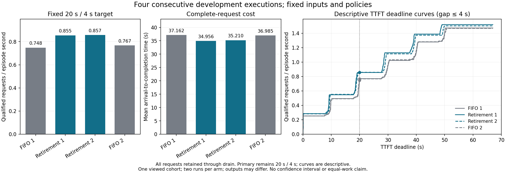

# 条件式 cap 退休预留：四格匹配开发结果

**两组相邻比较均复现正方向。** 在固定 20 s TTFT / 4 s 最大 host 返回 gap 主点，条件式退休预留相对完整上界 FIFO 的 goodput 分别提高 **14.22% / 11.70%**，平均完成 flow 降低 **5.94% / 4.80%**。两组预定的 20 个前沿点全部提高。结果符合[事前计划](C_NATIVE_RETIREMENT_MATCHED_PLAN_20261001.md)的正分支，可以保留开发候选并推进单独冻结的新输入测试及最近方法比较；这仍是已见开发数据上的重复，不构成未见数据确认或新颖性结论。

## 固定设计与完整性

顺序为 `bound_fifo_1 → retirement_1 → retirement_2 → bound_fifo_2`；相邻比较固定为 FIFO 1→退休 1、FIFO 2→退休 2。计划与运行器在 `b925176` 冻结，两个策略的适配器和 cell 沿用 `33fc5ff`。四格于 2026-09-30 21:02:18–21:10:34 UTC 在同一旧 RTX 5090（`GPU-3fc910c2-bf65-5273-e6b5-6c0d8b6ce03e`）完成。后续 SSH 恢复连接对应的新 GPU `GPU-e4434c32…` 没有参与本表测量。

四格保持同一 128 篇已见文章、外部到达序列（每 0.2 s 一次）、OLMoE 模型与运行时、greedy seed、自然 EOS 和 1,024 输出上限、32 序列上限、1,024 调度 token、4,096 个可用 KV 块、25 CPU 线程、无 offload 路径及应用 warmup。两策略只在测量期间改变准入。全部 512 个外部请求保留至 drain，每格 128/128 完成、0 失败、0 未完成，128 次准入与释放、0 抢占、0 条件违反；四个子进程均以 0 退出并被回收。块结束回执为 `COMPLETE`。

## 所有执行与相邻比较

Goodput 分母是包含完整 drain 的 episode 时长。Flow 为外部到达到完成；20/4 是事前实验主点，不作生产 SLO 解释。

| 执行顺序 | 20/4 合格 | Goodput（请求/s） | Episode（s） | 平均 flow（s） | 输出 token | length / stop |
|---|---:|---:|---:|---:|---:|---:|
| FIFO 1 | 65/128 | 0.7482 | 86.873 | 37.162 | 125,280 | 122 / 6 |
| 退休 1 | 72/128 | 0.8546 | 84.249 | 34.956 | 125,280 | 122 / 6 |
| 退休 2 | 73/128 | 0.8571 | 85.170 | 35.210 | 124,328 | 121 / 7 |
| FIFO 2 | 67/128 | 0.7673 | 87.318 | 36.985 | 124,326 | 121 / 7 |

| 候选相对相邻 FIFO | 主点 goodput | 合格请求增量 | Episode | 平均 flow | 实际输出 token/s |
|---|---:|---:|---:|---:|---:|
| 退休 1 vs FIFO 1 | +14.22% | +7 | −3.02% | −5.94% | +3.11% |
| 退休 2 vs FIFO 2 | +11.70% | +6 | −2.46% | −4.80% | +2.52% |

| 执行 | TTFT 中位数（s） | TTFT p90（s） | 最大 host 返回 gap（s） |
|---|---:|---:|---:|
| FIFO 1 | 19.934 | 49.361 | 0.03987 |
| 退休 1 | 18.775 | 39.200 | 0.04427 |
| 退休 2 | 19.085 | 39.688 | 0.04927 |
| FIFO 2 | 19.819 | 49.485 | 0.05369 |

四格所有请求的 gap 都小于 1 s，因此登记的 gap 截止 `{1, 2, 4, 8, 12}` 对本块给出相同结果。下表每行代表五个已登记前沿点，完整覆盖 TTFT `{10, 20, 30, 40}` × gap 的 **20 点**；括号内为合格请求数。

| TTFT 截止（s） | FIFO 1（请求/s） | 退休 1（请求/s） | 退休 2（请求/s） | FIFO 2（请求/s） |
|---|---:|---:|---:|---:|
| 10 | 0.4720（41） | 0.5460（46） | 0.5518（47） | 0.4695（41） |
| **20** | **0.7482（65）** | **0.8546（72）** | **0.8571（73）** | **0.7673（67）** |
| 30 | 0.9554（83） | 1.1276（95） | 1.1154（95） | 0.9620（84） |
| 40 | 1.1281（98） | 1.3887（117） | 1.3737（117） | 1.1681（102） |

两组候选均在 20/20 点的合格数及 goodput 上更高。这 20 点共享相同请求，不能当成 20 次独立重复。相邻 19/20/21 s 截止的事后曲线切片也保留正方向：退休 1 为 0.8190/0.8546/0.8546 请求/s，FIFO 1 为 0.5180/0.7482/0.7712；退休 2 为 0.7397/0.8571/0.8571，FIFO 2 为 0.5154/0.7673/0.7673。曲线仅描述门槛敏感性，未改变 20 s 主点。

## 逐请求变化与重复波动

| 候选相对相邻 FIFO | TTFT 更低 / 更高 | Flow 更低 / 更高 | Gap 更低 / 更高 | 输出 ID 序列不同 | 输出长度不同 | 结束原因不同 |
|---|---:|---:|---:|---:|---:|---:|
| 退休 1 vs FIFO 1 | 115 / 13 | 105 / 23 | 24 / 104 | 57 | 0 | 0 |
| 退休 2 vs FIFO 2 | 120 / 8 | 78 / 50 | 62 / 66 | 51 | 3 | 2 |

TTFT 最大恶化分别为 0.006 s / 0.133 s；flow 最大恶化为 0.556 s / 12.875 s。平均 host gap 增量分别为 0.00399 s / 0.00200 s。候选没有逐请求一致改善，第二组尤其保留了较大的单请求 flow 退化。第一组总输出和每请求长度相同，但 57 条输出 token ID 序列改变；第二组总输出只差 2 token，也仍有长度、结束原因与内容变化，不能由总量近似相同推导等工作量或语义质量等价。

同策略重复亦有变化：FIFO 2 相对 FIFO 1 主点 goodput +2.55%，平均 flow −0.48%，输出 ID / 长度 / 结束原因不同 33 / 1 / 1 个请求；退休 2 相对退休 1 主点 goodput +0.29%，平均 flow +0.73%，上述差异为 56 / 2 / 1 个请求。这里只有每策略两次执行，报告实测值与方向，不给总体置信区间。

## 容量、推进条件与计算成本

| 退休执行 | 超过完整上界规则的实际准入 | 完整上界和峰值（逻辑块） | 条件包络峰值（块） | 观察到的物理占用峰值（块） | 调度调用 | 门控决策 CPU 小计（s） |
|---|---:|---:|---:|---:|---:|---:|
| 退休 1 | 105 | 5,372 | 4,092 | 4,075 | 6,327 | 0.550 |
| 退休 2 | 104 | 5,323 | 4,096 | 4,033 | 6,314 | 0.581 |

两次 FIFO 完整上界预留峰值均为 4,095 块。退休策略的完整上界和是按所有居民同时达到 cap 计算的逻辑量，超过 4,096 不代表物理越界；其条件包络与观察到的物理占用均未超过 4,096 个可用块。两次退休分别记录 6,141 / 6,127 次可用纯 decode 条件和 4,813 / 4,820 次 hold。CPU 小计只覆盖原生调度前的适配器决策计算；完整 episode 已包含该成本，不应把它称为全部 instrumentation 开销。

容量依据使用当时已知的输出 cap 与已生成 token 数，只在所有居民均进入单 token decode、受保护 decode 前缀先推进的条件下按退休时间计算峰值；新请求仍保留完整上界。真实 EOS 未作为未来信息。当前结果验证了这四格的受限同步、无 speculative、无 offload 执行；它不是一般异步/流水线/多模态调度的安全证明，也不是 offload 压力结果。host 返回 gap 不包含同次返回内部 token 的间隔，完成与 drain 也不构成输出质量验证。

## 决策与可复查材料

按事前正分支保留条件式退休预留，下一步单独冻结新文章与新到达序列的比较，并落实最近方法参照。此前原生无门控、完整上界和 first-fit 负结果仍须保留；本块没有 contemporaneous 原生执行，不能凭本表宣称全面优于原生。固定重复成功也不证明机制新颖、未见输入泛化或逐动作因果收益。

[分析 JSON](native_retirement_matched_analysis_v1.json)含全部请求、20 点前沿及相邻/同臂比较；[SVG 图](native_retirement_matched_v1.svg)可放大查看。PNG/SVG 使用现有 `C_NATIVE_RETIREMENT_MATCHED_PLOT_V1.py` 生成，PNG 已目视检查。

完整原件位于 `/Users/zhaozhenyu/Desktop/毕业设计/C_research_artifacts/20261001/c-native-retirement-matched-dev-v1`。完整归档 `c-native-retirement-matched-dev-v1-complete.tar.gz` 为 30,423,111 字节，SHA-256 `fb3821e7b1d78a32fba2768162601d04e01e5253c2dbb87a27429fab9cea834e`。运行器 SHA-256 为 `efc9acb4f18f00c342011c34c968c28c48e463311667c7bbd648593bc223efbc`；父输入 manifest SHA-256 为 `acdf36222489773ab1fc3a4b6580adcb5951b08af4fa044cfe2c66fb9e850792`。
