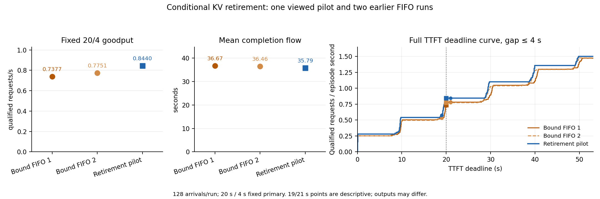
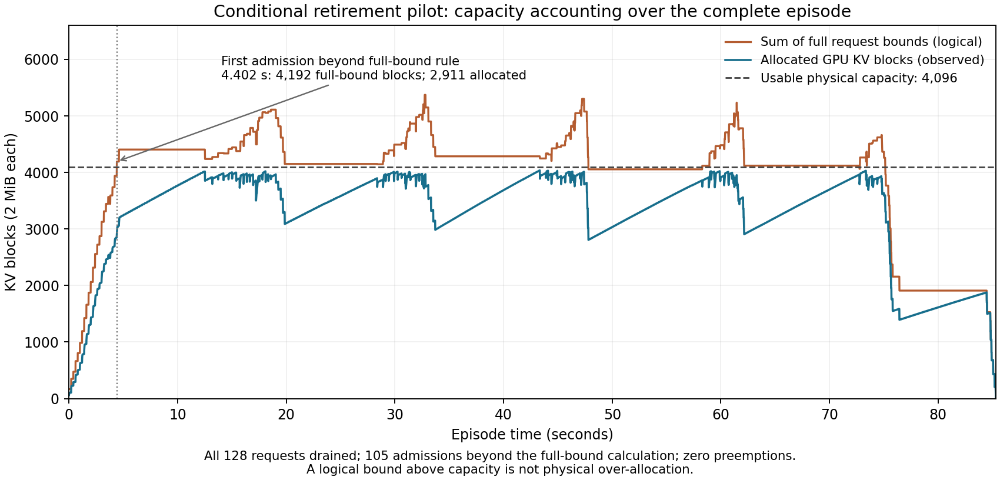

# 条件式 cap 退休预留：开发单格正信号

[事前计划](C_NATIVE_RETIREMENT_PLAN_20261001.md)与运行源文件在 commit `33fc5ff` 冻结。策略保持 FCFS 与原生无 offload 路径；仅当所有运行请求满足单 token 解码推进条件时，按各请求已知的最大输出 cap 计算退休包络，为队头预留新请求。输入、到达、模型、采样、32 序列上限、4,096 个可用 GPU KV 块及固定 20 s TTFT / 4 s host 返回 gap 主点沿用先前配置。

单格 128/128 请求完成并 drain，启动回执 `ACCEPTED_PILOT_ONLY`。门控记录 128 次入场与释放、0 次原生抢占、0 个违反条件；105 次入场发生在完整最大长度预留总和已超过 4,096 块的状态。完整上界总和峰值 5,372 块是记账量，不能解释为物理占用；条件包络峰值 4,096 块，观察到的物理占用峰值 4,036 块。6,319 次调度调用中的门控决策累计 0.582 s，仅覆盖原生调度前的适配器计算。

| 配置 | 20/4 合格 | Goodput（请求/s） | Episode（s） | 平均 flow（s） | 输出 token | 抢占 |
|---|---:|---:|---:|---:|---:|---:|
| 较早原生 1 | 53/128 | 0.6580 | 80.545 | 35.189 | 126,113 | 46 |
| 较早 Bound FIFO 1 | 64/128 | 0.7377 | 86.757 | 36.665 | 123,346 | 0 |
| 较早 Bound FIFO 2 | 67/128 | 0.7751 | 86.442 | 36.465 | 124,325 | 0 |
| 较早原生 2 | 53/128 | 0.6585 | 80.481 | 35.074 | 124,324 | 47 |
| 条件式退休单格 | 72/128 | 0.8440 | 85.309 | 35.788 | 124,336 | 0 |

相对两次 Bound FIFO，固定主点 goodput 高 14.4% / 8.9%，平均完成 flow 低 2.39% / 1.86%；相对两次原生无门控，平均 flow 则高 1.70% / 2.04%。本单格在预先登记的 20 个 TTFT/gap 前沿点上均高于四个旧参照；逐请求 TTFT、flow 和 gap 方向仍混合，不存在逐请求一致改善。输出 ID 序列相对四格分别改变 59、53、65、57 个请求，输出长度改变 5、4、4、3 个请求。

在固定 gap≤4 s 下，19/20/21 s 的事后连续曲线切片如下；20 s 是唯一预定主点，邻点只描述门槛敏感性。

| TTFT 截止 | Bound FIFO 1 | Bound FIFO 2 | 条件式退休单格 |
|---|---:|---:|---:|
| 19 s | 46（0.5302/s） | 46（0.5321/s） | 49（0.5744/s） |
| **20 s 主点** | **64（0.7377/s）** | **67（0.7751/s）** | **72（0.8440/s）** |
| 21 s | 68（0.7838/s） | 67（0.7751/s） | 72（0.8440/s） |

这是一个已见开发 cohort 的单次 pilot，对照四格发生在较早时段。128 个请求虽使用相同输入/到达，输出 ID 与长度不同，因此不能宣称等工作量加速、动作因果、未见数据泛化或方法新颖性。host 返回时间的 gap 不包含一次返回中 token 的内部间隔。按事前正分支，下一项唯一 GPU 实验是另行冻结的 Bound FIFO / 条件式退休 / 条件式退休 / Bound FIFO 匹配交错块；此处不把单格结果写成策略比较结论。

[分析 JSON](native_retirement_analysis_v1.json)保留全部 20 点前沿和逐请求差值；[SVG 图](native_retirement_v1.svg)可放大查看。完整原件在 `/Users/zhaozhenyu/Desktop/毕业设计/C_research_artifacts/20261001/c-native-retirement-pilot-v1`；原始 `raw.json` SHA-256 为 `2e60b6913d2e515e569911c7165d522e3196a4ac9211715624b57d88b960f5f1`。完整归档 `c-native-retirement-pilot-v1-complete.tar.gz` 为 7,673,363 字节，SHA-256 `a6ed9f78f3b7aede4320edd0bd2604b3cb68086448ff30aed3d86e994ec42c1f`。

## 实际准入例子

第444次调度、外部episode的4.402s，已有21个decoder；其完整上界和3939块，加队头253块会达4192块，超过4096容量。按当时已知cap与输出进度，已有decoder条件峰值3610块，加入该队头的完整253块为3863块，因此允许入场。该请求prompt3019tokens，本次先算1003tokens；调度后实际GPU只分配2911块。这个例子证明同一可见状态下容量计算确实改变了准入；它不单独证明该次动作的请求性能因果收益。

图末的零值来自完整drain状态，其余物理样本采于原生调度分配后、该步输出及释放前。[原始例子字段](native_retirement_capacity_v1.json)。
