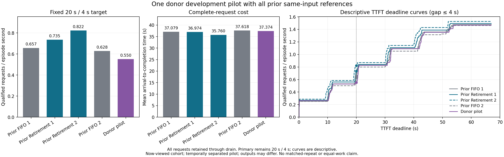

# 单 donor cap 时间复用：原生负结果 pilot

**原生配额转移实际发生，但固定主点没有收益；保留该负向比较。** 本格 128/128 请求完成，22 次 promise 全部转成真实 donor 释放后的配额转移，0 抢占、0 容量或推进条件违反。20/4 goodput 为 **0.5504 请求/s**，相对此前两格完整上界 FIFO 为 **−16.20% / −12.40%**，相对两格全局退休预留为 **−25.08% / −33.07%**。平均 flow 接近 FIFO，分别为 **+0.80% / −0.65%**，不能写成所有成本均更差。本次不追加 matched repeat，不调 guard、seed 或输入。

## 冻结条件与证据层级

[计划](C_NATIVE_TEMPORAL_CAP_DONOR_PLAN_20261001.md)和源码冻结于 `df50879`。单格于 **2026-10-01 09:19:32.768–09:21:36.815 UTC** 在替换 GPU `GPU-e4434c32-c4a4-2b81-55fa-271af38f3c36` 上执行，沿用共享文件锁。子进程正常退出并回收，前后 GPU 均 drain；回执为 `ACCEPTED_PILOT_ONLY`。

输入复用已完成新 cohort 六格的全部 128 请求和同一次 Poisson 到达抽样；该 cohort 此时已经看过。OLMoE、vLLM 原生调度、无 offload、自然 EOS/max_tokens=1,024、32 序列、1,024 调度 token、4,096 可用 KV 块及 warmup/seed 均按计划固定。证据层级为 **NATIVE_SERVING 的一次开发 pilot**。下列四个参照均来自此前同一 GPU 的 fresh 块，时间分离，构不成同期 matched repeat。

该策略只实现 **CacheOPT-inspired、基于已知 cap 的单 donor 时间复用消融**，未实现完整 CacheOPT 的长度预测、空间复用、SLO 配额分配或抢占选择。没有使用未来自然 EOS；CPU 条件与全局退休包络的接受集合互不包含，不能由本格结果宣称其中一方在所有状态下支配另一方。

## 全部参考格与主点比较

20/4 固定为 TTFT≤20 s 且最大 distinct host-return gap≤4 s，goodput 分母为包含尾部 drain 的完整 episode。host gap 不含同次返回内部的 token 间隔；这些截止是实验目标，不代表生产 SLO。

| 执行 | 20/4 合格 | Goodput（请求/s） | Episode（s） | 平均 flow（s） | 输出 token | length / stop | 抢占 |
|---|---:|---:|---:|---:|---:|---:|---:|
| 此前 FIFO 1 | 57/128 | 0.6568 | 86.780 | 37.079 | 123,197 | 120 / 8 | 0 |
| 此前退休 1 | 63/128 | 0.7347 | 85.754 | 36.974 | 125,131 | 122 / 6 | 0 |
| 此前退休 2 | 69/128 | 0.8224 | 83.904 | 35.760 | 123,206 | 120 / 8 | 0 |
| 此前 FIFO 2 | 55/128 | 0.6284 | 87.526 | 37.618 | 122,785 | 119 / 9 | 0 |
| Donor pilot | 48/128 | 0.5504 | 87.203 | 37.374 | 123,209 | 120 / 8 | 0 |

| Donor 相对参照 | 主点 goodput | 平均 flow | 实际输出 token/s | Goodput 更高 / 更低的前沿点 |
|---|---:|---:|---:|---:|
| FIFO 1 | −16.20% | +0.80% | −0.47% | 5 / 15 |
| FIFO 2 | −12.40% | −0.65% | +0.72% | 10 / 10 |
| 退休 1 | −25.08% | +1.08% | −3.17% | 0 / 20 |
| 退休 2 | −33.07% | +4.51% | −3.78% | 0 / 20 |

Donor TTFT 中位数为 **20.688 s**、p90 为 **43.480 s**；最大 host gap 为 **0.04144 s**，全部 128 请求满足 gap≤4 s。因此本格主点的 48 个合格请求由 TTFT 截止决定。

## 全部固定前沿与局部门槛敏感性

五格的最大 host gap 均低于 1 s，因此每行同时覆盖 gap={1,2,4,8,12} s 的五个固定点，四行完整覆盖全部 20 点。表内为 goodput（请求/s），同一轨迹上的点不是独立重复。

| TTFT（s） | Gap（s） | FIFO 1 | 退休 1 | 退休 2 | FIFO 2 | Donor |
|---:|---|---:|---:|---:|---:|---:|
| 10 | 1 / 2 / 4 / 8 / 12 | 0.2535 | 0.2799 | 0.4767 | 0.2856 | 0.2638 |
| 20 | 1 / 2 / 4 / 8 / 12 | 0.6568 | 0.7347 | 0.8224 | 0.6284 | 0.5504 |
| 30 | 1 / 2 / 4 / 8 / 12 | 0.8297 | 0.8396 | 0.8700 | 0.8112 | 0.8257 |
| 40 | 1 / 2 / 4 / 8 / 12 | 1.0947 | 1.1078 | 1.1680 | 1.0511 | 1.0894 |

固定 gap≤4 s 的 19/20/21 s 描述性切片说明主点附近存在敏感性：donor 合格数为 **46 / 48 / 71**，21 s 时相对 FIFO 2 转为正。主点未随观察结果改变。

| TTFT 截止 | FIFO 1 | 退休 1 | 退休 2 | FIFO 2 | Donor |
|---|---:|---:|---:|---:|---:|
| 19 s | 0.5301 | 0.5597 | 0.5959 | 0.5027 | 0.5275 |
| **20 s 主点** | **0.6568** | **0.7347** | **0.8224** | **0.6284** | **0.5504** |
| 21 s | 0.8297 | 0.8396 | 0.8700 | 0.7998 | 0.8142 |

## 逐请求与输出变化

“低 / 高”表示 donor 相对参照的数值方向，三项延迟均以低为改善。全部逐请求差值保留在[分析 JSON](native_temporal_cap_donor_analysis_v1.json)。

| Donor 相对参照 | TTFT 低 / 高 | Flow 低 / 高 | Gap 低 / 高 | 输出 ID 序列不同 | 输出长度不同 | 结束原因不同 |
|---|---:|---:|---:|---:|---:|---:|
| FIFO 1 | 24 / 104 | 12 / 116 | 118 / 10 | 54 | 3 | 2 |
| FIFO 2 | 20 / 108 | 22 / 106 | 77 / 51 | 59 | 2 | 1 |
| 退休 1 | 27 / 101 | 49 / 79 | 80 / 48 | 63 | 2 | 2 |
| 退休 2 | 7 / 121 | 11 / 117 | 121 / 7 | 55 | 2 | 2 |

相对 FIFO 1/2，单请求最大 flow 退化为 **14.822 / 6.461 s**；相对退休 1/2 为 **11.317 / 23.794 s**。对应最大 TTFT 退化为 1.116 / 1.442 / 11.281 / 12.492 s。相对 FIFO 2 的平均 flow 虽略低，106/128 个请求的 flow 仍更高，均值不能代表逐请求一致改善。输出序列、长度和结束原因会随策略变化，因此没有等工作量加速或语义质量等价结论。Donor 有 120/128 请求触及 cap，本格也不是自然 EOS 占主导的负载。

## 实际 promise、转移与容量边界

128 次准入全部对应 128 次释放，**22 promise → 22 transfer、0 cancellation**；运行结束逻辑预留和 promise 均为空。0 抢占、0 条件违反，逻辑已承诺配额峰值为 **4,096 块**，完整上界和峰值为 **4,149 块**，观察物理峰值为 **3,895 块**。4,149 是所有请求完整上界之和，不是物理占用；它超过容量本身不表示越界。

首个实际 promise 发生于调度调用 **287**：donor `memory-train-article-0124542-b544f16c` 有完整配额 169 块、剩余 cap horizon 739 次；receiver `memory-train-article-0128045-808fb18f` 初始配额 230 块、完整上界 233 块、接收方余量 983 token。条件 **739+1≤983** 且 **169≥233−230=3** 成立。事件流记录了这对请求的 **3 块 transfer**，receiver 承诺量升至 233 块，随后记录该 donor 以 `FINISHED_LENGTH_CAPPED` 释放 169 块。这证明本次确实执行了 native free 钩子中的逻辑转移，不能单凭该事件推出性能收益。

策略要求准入前所有居民均为 pure decode，并保护此前运行前缀直至 cap 或真实 EOS；只允许一个 outstanding promise，曾获部分配额的 receiver 此后永久不得作为 donor。guard 固定为 1；违反推进或容量条件即中止。实际未出现 cancellation，receiver 提前 EOS 和同次调用释放顺序分支仍只有 CPU 检查证据，不能写成已在 GPU 覆盖。该容量解释限于当前同步、单 token decode、无 speculative、无 offload 的执行域，也不证明 HBM/offload 压力收益。

共 6,333 次调度调用，其中 eligible 4,952、hold 5,036 次。门控决策 CPU 小计 **0.423872 s**，记账 **0.150568 s**，合计 **0.574440 s**；完整 episode 已包含这些成本。该小计不是全部埋点或日志开销，不能由此反推没有测量成本。

## 结论、唯一下一步与原件

本次回答了“单 donor promise 是否能在原生运行里实际兑现、当前固定主点是否有收益”：**能兑现，本次固定主点为负。** 失败类别为当前 cap-only 单 donor formulation 的性能不足；生命周期与已观测容量条件通过。完整 CacheOPT、预测校准、取消路径的 GPU 覆盖、独立新 cohort 和匹配重复均未完成，oracle/headroom 也未由本格界定。保留此最近方法风格消融及全部四个参照，不将其升级为完整最近方法已解决或 donor 方法家族 NO-GO；只在有新的独立机制证据时重开。当前不为该负结果调参或补 matched repeat。唯一下一步是对**保持不变的退休策略**执行事先固定的低负载负控，按原生/退休/退休/原生顺序、到达间隔乘 5；另行冻结后运行。

[分析 JSON](native_temporal_cap_donor_analysis_v1.json)保留全部请求和前沿；[SVG 图](native_temporal_cap_donor_v1.svg)可放大，PNG 已目视检查。完整 SCP 原件位于 `/Users/zhaozhenyu/Desktop/毕业设计/C_research_artifacts/20261001/c-native-temporal-cap-donor-pilot-v1`，回执 `raw_sha256` 为 `31f43f5c54da089880f355484ba843627dabc21c8c345858a2399daecb1f259e`。本地将完整 SCP 副本归档为同目录层级的 `c-native-temporal-cap-donor-pilot-v1-local-copy.tar.gz`，**7,421,603 字节**，SHA-256 `025ecc377954cbd6d77a00d0f391dc92813b2155b893158240e4f975b1578a09`；其来源明确为本地副本，远端未压缩原目录仍保留。
