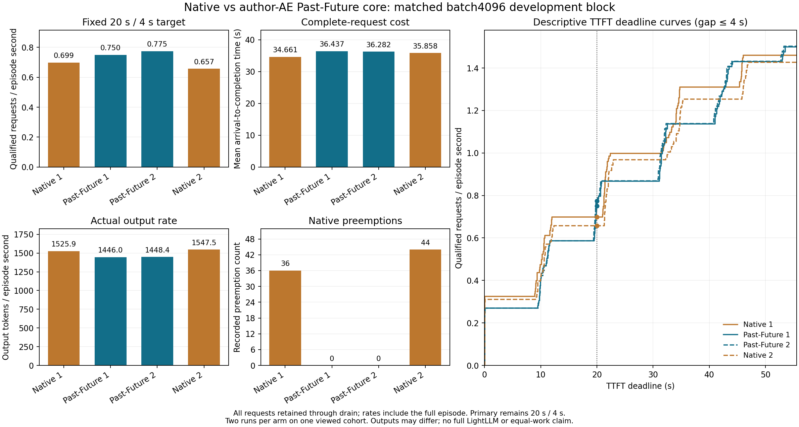
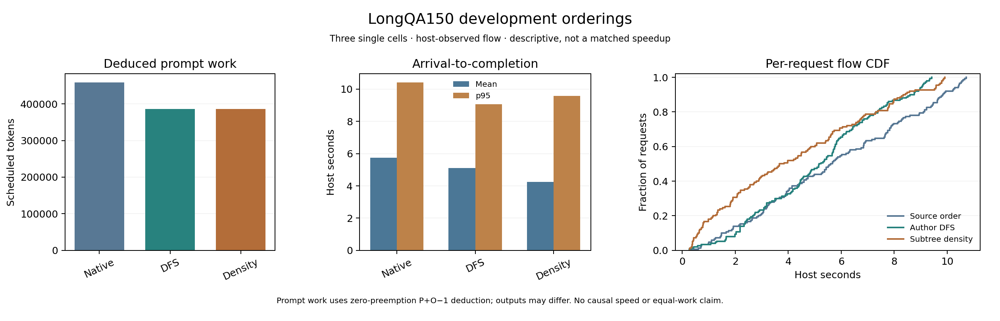
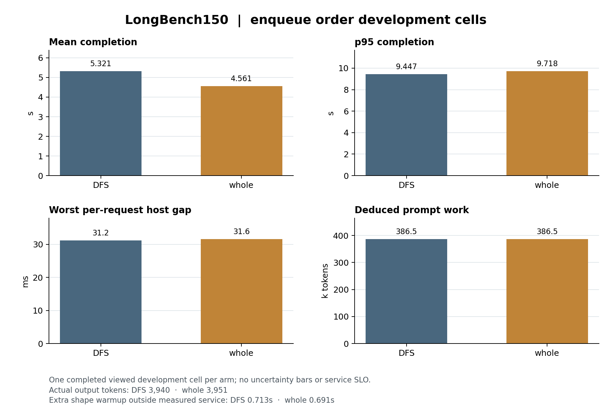
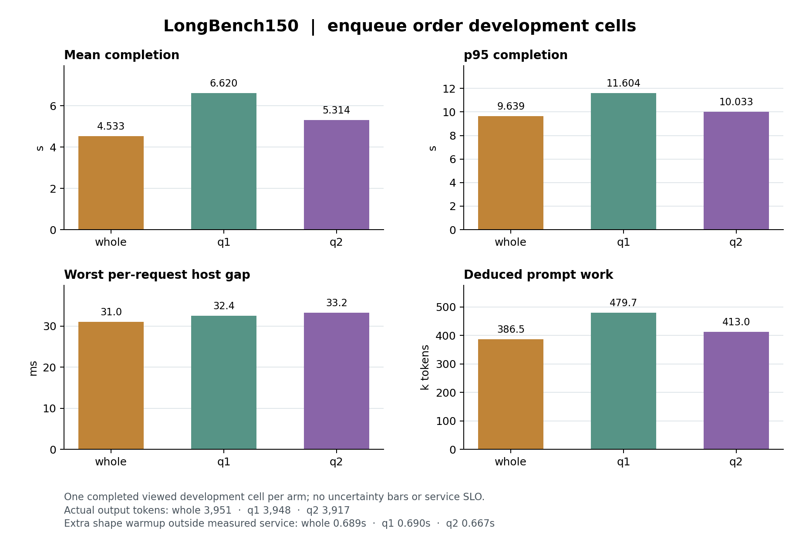
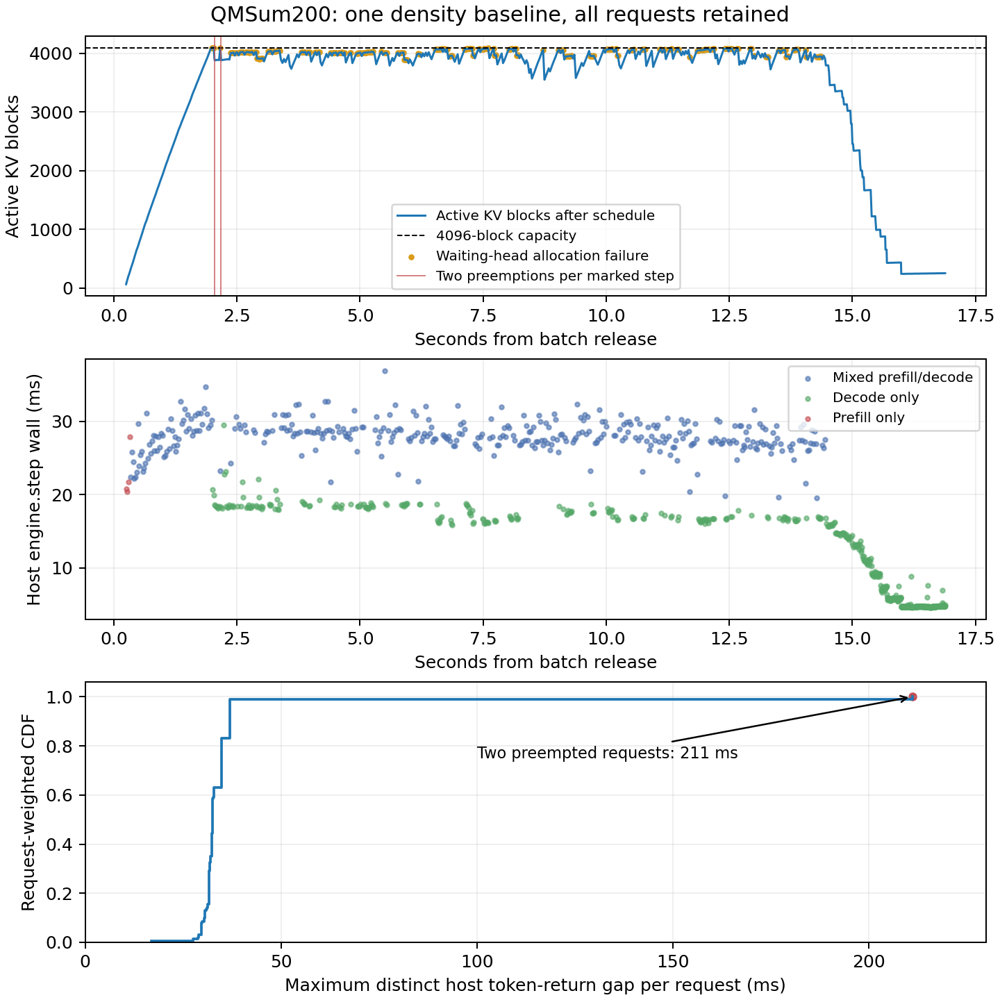
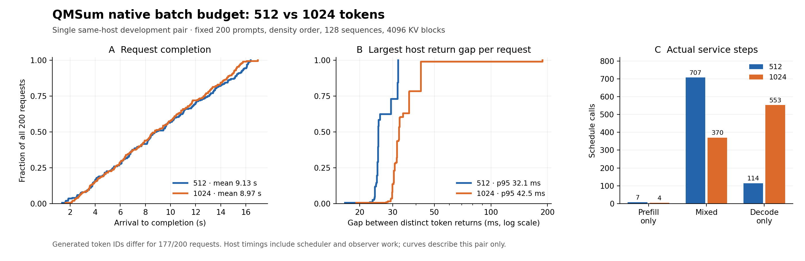
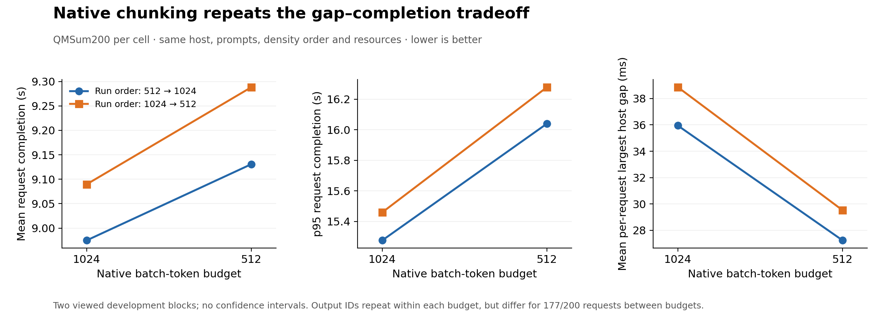
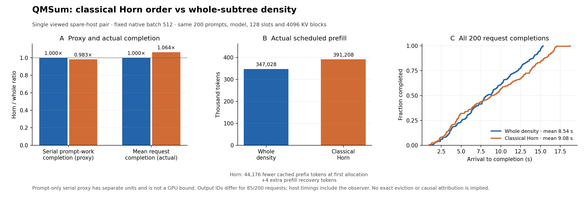

# C 线论文工作稿：有限 GPU KV 下的请求准入与完整请求代价

> **2026-10-01 近邻核对修正：** Past-Future／LightLLM 已公开实现按未来完成时刻计算全批次 KV 峰值。当前退休包络的 resident 核心公式属于该思路的保守特化；已有真实服务收益保留，但不再作为独立新方法的新颖性依据。作者AE统计核心已完成原生移植和同batch4096四格对照，同样呈现固定目标收益及代价。详见 [直接近邻记录](C_NATIVE_RETIREMENT_PRIOR_COLLISION_20261001.md) 和 [原生四格结果](C_NATIVE_PAST_FUTURE_AE_MATCHED_RESULT_20261001.md)。

**当前状态：2026-10-02，研究已收敛至前缀组服务连续性。** 完整LongBench150的DFS／密度反向配对、长步剖析、共同形状预热，以及整组／q1／q2三格均完成。经典密度排序保留平均完成时间收益；旧约0.7秒长步包含JIT开销，公共预热消除该停顿后仍有较小尾部代价。固定q1/q2轮转使均值、p95和前缀计算量同时变差，当前没有支持新增动态控制器的证据，也没有新的可投稿方法claim。下面保留早期容量研究的完整历史，其核心公式已被直接prior覆盖；不继续扩展该旧方向。

## 摘要（初稿，非投稿结论）

持续到达的推理请求争用有限 GPU KV、调度槽和执行时间。我们在同一 RTX 5090、固定 OLMoE 开发输入上，比较原生无 offload 重算、带 host KV 的静态保存，以及仅用已知 prompt 长度与最大输出长度的保守准入。两组交错四格共完成 1,024 次请求执行。静态保存能消除超过 4 秒的观察生成间隔，但在 native/static/static/native 块中降低联合 goodput 并显著增加平均完成时间；原生上界预留在 native/bound/bound/native 块中消除原生抢占和长间隔，使固定 20/4 联合 goodput 从 0.6580/0.6585 增至 0.7377/0.7751 请求/s，同时使平均 flow 增加约 4%、实际输出吞吐下降。相邻 19 s 与 21 s TTFT 截止点的 goodput 方向反转，故这不是普遍吞吐改善。普通容量准入已是必须越过的强简单参照，尚不能支持新的控制器贡献。输出内容变化、单模型单卡、开发输入和生成重复限制了推断。

随后一次保持相同上界、仅跳过装不下队头的 first-fit 开发单格执行了 60 次真实越过，固定 20/4 goodput 却降至 0.6738 请求/s；78 个被越过请求的平均 TTFT 和完成 flow 均比两次 FIFO 参照更差。该负结果不支持继续调这一简单规则，也不是新方法结论。

最新候选在受保护的同步 decode 前缀中，使用已知最大输出数与当前已生成数计算先后完成时的 KV 峰值，不预测真实 EOS。FIFO／候选／候选／FIFO 开发重复的全部 512 次请求执行均完成；候选两次主点 goodput 比相邻 FIFO 提高 14.2%/11.7%，平均到达至完成时间降低 5.9%/4.8%，无抢占或进度条件违例。随后冻结的新文章／新到达六格完成768次请求执行，相对同期FIFO主点goodput提高11.8%/30.9%，相对原生提高10.3%/26.2%；原生参照下实际输出吞吐仍低4.5%–6.1%，且19s相邻截止点方向反转。完整近邻实现、生成质量及更广运行域仍是论文缺口。

作者AE统计核心随后在独立声明的batch4096域完成原生/PF/PF/原生四格和cap/PF/PF/cap四格。相对原生，PF消除本块抢占并改善固定主点，仍增加平均完成时间。相对相同5%余量的cap评分，PF在两组全部20个登记goodput点均更高，平均flow降低2.53%/0.80%，但主点合格数仅持平/增加1个，99/105个请求的flow更高，决策host耗时小计约翻倍。这些结果刻画该开发域中的收益和成本，未形成独立方法贡献。

## 问题、目标与计量

研究问题是：在仅见当前等待队列、已计算长度、物理 KV 占用与真实服务回执的条件下，是否存在强简单策略未覆盖的原生准入或活跃集合动作，能改善**全部外部到达请求**的完整代价？未来到达、真实 EOS、未来输出长度与实际剩余长度不作为在线输入。延后入场、暂不执行、抢占并释放 KV 是不同动作，其等待、恢复、GPU/host 占用与末态积压都须计入。

固定开发目标为每请求 TTFT ≤20 s 且最大**不同 host 返回时间**间隔 ≤4 s；联合 goodput 是合格完成请求数除以从测量开始到全队列 drain 的 episode 时长。20/4 是预声明实验目标，并非生产 SLO。固定的 4×5 TTFT/间隔前沿同时报告。所有失败、拒绝、未完成与被延后的外部到达均留在分母；还报告总完成、输出 token 和终止原因、请求/输出吞吐、TTFT、最大间隔、到达至完成 flow、逐请求改善与恶化，以及 GPU/host 资源。host 返回间隔看不到一次返回内部的生成时间。

## 输入、原生实现与资源

[持续到达开发输入](C_SUSTAINED_SOURCE_AUDIT_20260930.md)在 GPU 测量前固定了 128 篇新 rank 704–831 的文章和 0–25.4 s、每 0.2 s 一次的外部到达；[v2 开发 burst](C_DEVELOPMENT_BURST_V2_REAL_SOURCE_20260930.md)另对 192/192 篇历史 G/H 锚点核对原行、全文与完整 token。两者都属已见**开发**输入：六份旧来源字节 receipt 缺失，Parquet 与历史 Arrow 的全片等价未证，不能称留出确认。

同一模型 revision、贪心自然 EOS／最多 1,024 输出 token、应用暖机、原生 vLLM 调度和完整 drain 用于持续到达测量。RTX 5090 上固定 4,096 个可用 GPU KV 块、32 个 engine 序列槽与 1,024-token batch；单卡共享锁串行运行。原生重算与容量预留没有 KV offload connector 或 CPU KV storage 配置；static64 是使用 16 GiB host KV 的另一完整配置，比较它们不能隔离单一准入动作或传输成本。[原生生命周期资格](C_G64_NATIVE_LIFECYCLE_20260930.md)曾连起 38 条 selected store→flush→load→新输出链；它只验证后端路径，不是性能或完整 LTR 复现，缺失的 cgroup memory.peak 限制历史峰值声明。

## 已测的强简单策略

- **Native recompute：** 无 connector 的原生等待、准入与 KV 抢占；[首个单格](C_NATIVE_RECOMPUTE_PILOT_RESULT_20261001.md)已完成，但其 45/128 联合合格、0.5464 请求/s 的较低值未在后续交错块复现。此前带 16 GiB host KV 的 native_full 不能代替默认无 offload 参照。
- **Static64：** 已有 selected-save 路径和 64-block 静态余量，连同 guarded static64 与 selected observe，均是简单参照；它们不是本文新方法。
- **Bound FIFO：** 每个 resident 请求预留 ceil((prompt_tokens + max_tokens)/16) 块，FCFS 前缀的预留总量不超过 4,096，真实原生完成后才释放账本。它不预先物理分配全部 KV，也不读取未来 EOS。[单格结果](C_NATIVE_MAX_BOUND_RESULT_20261001.md)完成 128/128、零抢占、67 个 20/4 合格、0.7768 请求/s；需以下交错重复解读。
- **First-fit：** 保持同一已知上界与预算，扫描等待队列并跳过当前装不下的请求，仍保留全部外部到达及队头代价。[事前计划](C_NATIVE_BOUND_FIRST_FIT_PLAN_20261001.md)冻结后完成一格；[结果](C_NATIVE_BOUND_FIRST_FIT_RESULT_20261001.md)为主目标负信号，不做这一路径的匹配重复或调参。

## 条件性容量判据与实现

此 resident 峰值规则与 [Past-Future §3.3](https://arxiv.org/html/2507.10150#S3.SS3) 的排序前缀峰值在统一上限、端点和分页后相等；官方保守分支也已使用最大输出数。以下保留本线原生实现及条件论证，不将该公式作为独立贡献。

令块大小为 $B=16$，容量为 $C=4096$ 个可用块。一次准入边界上，已有纯 decode 请求 $i$ 的 prompt 长度为 $P_i$、已返回输出数为 $O_i$、请求给定上限为 $M_i$，故最多还有 $R_i=M_i-O_i$ 次输出。真实 EOS 未知。固定同步运行中，受保护的 resident decode 前缀在每个调度轮先各推进一个 token；新 prefill 使用剩余 token 预算。对这组已有 decoder 定义

$$
E=\max_{t\in\{0\}\cup\{R_i\}}
\sum_i \left\lceil\frac{P_i+O_i+t}{B}\right\rceil\mathbf{1}[t\le R_i].
$$

该式在触及上限的最后一轮仍保守计入该请求；实际 KV 通常只计算到已返回末 token 之前，式中的额外一个位置保留调用边界余量。在相邻退休时刻之间，尚存项单调不减，因此只需检查零点和每个 $R_i$，而非扫描全部未来 token。每次至多 32 个 resident，直接实现为 $O(n^2)$ 个整数项，不需要预测器或 GPU 状态复制。

等待队列按 FIFO 取最长可装入前缀 $A$，条件为

$$
E+\sum_{j\in A}\left\lceil\frac{P_j+M_j}{B}\right\rceil\le C,
\qquad n+|A|\le32.
$$

新请求的 prefill 与全部最大生成量一直按完整上界计入；有 resident 尚处于 prefill 时暂不加入下一批。等全体重新进入 decode 后，才可更新退休包络。该门控只延后新请求的原生准入，不替换 KV allocator，不释放仍在用的状态，也不通过暂停 resident 假造可用容量。

**条件性容量论证。** 若每个受保护 decoder 在存活期间每轮推进一个 token，则第 $t$ 轮的旧请求占用被上述和式上界覆盖；提前 EOS 只删掉非负项。所有新增请求的占用又各不超过其完整上界，因此在下一个重新计算边界前，总量不超过 $C$。逐边界应用同一判据得到该运行域内的容量不变量。论证依赖单 KV 组、无共享 prefix、无 speculative/lookahead、无 offload 或上下文并行，以及确认过的同步 decode 顺序；实现逐轮检查受保护请求被调度且输出数推进，违例立即使本次测试无效。它不是对任意原生调度模式的保证。

**实际差异与代价。** 完整上界 FIFO 假定所有 resident 同时达到各自最大长度；本策略允许由受保护进度保证的先后完成降低峰值。它可能让新请求更早开始，也可能让更多 resident 分享算力，增大已有请求的完成时间和短生成间隔。故评价必须同时保留 TTFT、逐请求 flow/gap、完整 episode 与实际输出工作。开发重复中的 105/104 次额外准入说明判据确实改变了动作，性能结果仍是各策略独立演化的配对证据。

## 当前主要结果

### Native / static64 / static64 / native

[同期四格结果](C_NATIVE_STATIC_MATCHED_RESULT_20261001.md)完成 512/512 请求：

| 顺序 | 20/4 合格 | Goodput（请求/s） | Episode（s） | 输出 token | 原生抢占 |
|---|---:|---:|---:|---:|---:|
| Native 1 | 58/128 | 0.7244 | 80.068 | 125,304 | 38 |
| Static64 1 | 62/128 | 0.6477 | 95.729 | 125,150 | 306 |
| Static64 2 | 63/128 | 0.6667 | 94.493 | 126,105 | 307 |
| Native 2 | 60/128 | 0.7471 | 80.308 | 124,329 | 41 |

Static64 的两格都没有超过 4 s 的观察间隔，native 每格有 11 个；但 static64 在两组都使 113/128 请求的最大间隔增大，平均完成 flow 增加 22.8–23.3%。原生两格在全部 20 个已定前沿点的 goodput 均不低于 static64。两组相邻输出 ID 序列分别改变 59/128、66/128 请求，且 host offload 配置不同；这些是完整配置的描述性差异，不是等工作量或单动作因果收益。

### Native / bound FIFO / bound FIFO / native

[最新交错四格结果](C_NATIVE_BOUND_MATCHED_RESULT_20261001.md)完成 512/512 请求：

| 顺序 | 20/4 合格 | Goodput（请求/s） | Episode（s） | 平均 flow（s） | 输出 token | 原生抢占 |
|---|---:|---:|---:|---:|---:|---:|
| Native 1 | 53/128 | 0.6580 | 80.545 | 35.189 | 126,113 | 46 |
| Bound FIFO 1 | 64/128 | 0.7377 | 86.757 | 36.665 | 123,346 | 0 |
| Bound FIFO 2 | 67/128 | 0.7751 | 86.442 | 36.465 | 124,325 | 0 |
| Native 2 | 53/128 | 0.6585 | 80.481 | 35.074 | 124,324 | 47 |

相邻两组的联合 goodput 分别增加 12.1%/17.7%，但平均 flow 增加 4.20%/3.96%、实际输出吞吐下降 9.20%/6.90%。Bound 两格的 4 s 间隔失败和抢占均为零，最坏观察间隔 0.0413/0.0598 s；native 每格 11 个长间隔、最坏 12.257/12.409 s。Bound 分别使 80/81 个请求的 TTFT 变差，只在 10/20 与 18/20 个既定前沿点的 goodput 更高。两组相邻输出 ID 序列改变 53/58 个请求，输出总数和终止原因也变化。全部预留真实 drain，峰值 4,095/4,096 块。这里得到的是有排队和输出代价的**强简单参照**，不是一般优越性、等工作量加速或方法新颖性。

[连续截止点曲线](native_bound_deadline_curves_v1.json)固定 gap 为 4 s 或 12 s，只作既有原始数据的**事后描述**；不改已冻结的 20/4 主点。gap=4 s 时，19/20/21 s 的联合 goodput（请求/s）为：

| TTFT 截止 | Native 1 | Bound 1 | Bound 2 | Native 2 |
|---|---:|---:|---:|---:|
| 19 s | 0.6208 | 0.5302 | 0.5321 | 0.6213 |
| 20 s（预声明主点） | 0.6580 | 0.7377 | 0.7751 | 0.6585 |
| 21 s | 0.8442 | 0.7838 | 0.7751 | 0.8449 |

20 s 的 bound 优势在相邻 19 s 与 21 s 均反向；成批准入使曲线呈台阶。消除长 gap 的事实仍成立，但不能据单一截止点声称吞吐普遍改善。原生同配置 goodput 从最早单格 0.5464，到 native/static 块的 0.7244/0.7471，再到最新 native/bound 块的 0.6580/0.6585；同臂重复与时间漂移不能忽略。任何看似正面的新单格都须先做事前冻结的交错重复。

### First-fit 单格：实际跳队后的负结果

[事前固定的单格](C_NATIVE_BOUND_FIRST_FIT_RESULT_20261001.md)完成 128/128、原生抢占为零、输出 125,210 token（122 个长度封顶、6 个停止），全体观察 gap 均小于 4 s。它有 59/128 个 20/4 合格、0.6738 请求/s、87.562 s episode、36.341 s 平均 flow；较上表两次 FIFO 的主 goodput 低 8.7%/13.1%。20 点前沿只在 5/20、0/20 点较 FIFO 高；输出 ID 序列分别有 63/61 个请求不同，长度有 6/5 个不同。全队列 mean flow 略低于 FIFO，不能说所有代价都变差。

原生记录确认 60 次实际越过入场，涉及 78 个不同的被越过请求。与两次 FIFO 参照逐 ID 比较，这些请求的 TTFT 平均增加 1.42/1.63 s，flow 平均增加 1.86/2.00 s；最大 flow 恶化 13.82/14.06 s。这是跨运行的描述性代价，不是单个跳队动作的因果反事实。按已登记负分支，不对 first-fit 换阈值、换 seed 或追加匹配重复。

### 条件性退休包络：首次原生动作与正信号

[新候选](C_NATIVE_RETIREMENT_PLAN_20261001.md)保持 FIFO，在全部 resident 都已进入纯 decode 时，依据已知 prompt、当前已生成数与 max_tokens 计算这些请求先后触及上限前的 KV 峰值；新 prefill 仍计全部上界。它依赖固定同步原生调度中已有 decoder 前缀每轮产生一个 token，逐轮检查调度与输出推进，提前 EOS 只会更早释放。遇到条件违例即使该次运行无效，不声称适用于任意异步、推测或混合 prefill 顺序。

[首个单格](C_NATIVE_RETIREMENT_RESULT_20261001.md)完成128/128：72个20/4合格、0.8440请求/s、85.309s episode、35.788s平均flow、零抢占、最大gap0.0469s。相对两次较早 FIFO，主点goodput提高14.4%/8.9%，meanflow降低2.39%/1.86%，20个既定前沿点均较高。实际执行105次当前全上界求和规则会阻止的准入；全上界和峰值5372块、条件包络峰值4096块、真实分配峰值4036块，不能把这三种数量混为物理占用。正式episode包含计算开销，门控调度前CPU计时总计0.582s。

输出124336tokens（121length/7stop），相对FIFO有53/65个请求输出ID变化、各4个长度变化；很多逐请求成本仍恶化。相对原生平均flow仍高1.7%–2.0%。这些是一个已见pilot的描述性结果，不是等工作量因果加速或论文新颖性证明；需要已冻结的交错块及后续未见数据。

### 条件性退休包络：交错重复完成

[FIFO／退休包络／退休包络／FIFO 四格](C_NATIVE_RETIREMENT_MATCHED_RESULT_20261001.md)已从恢复后的 SSH 连接取回，全部在原 GPU 上完成，共 512/512 请求；不需要补跑。FIFO 的 goodput 为 0.7482/0.7673，退休包络为 0.8546/0.8571 请求/s，两组分别提高 14.2%/11.7%；平均 flow 从 37.162/36.985 s 降到 34.956/35.210 s，降低 5.9%/4.8%。两组全部 20 个既定前沿点均更高，四格零抢占并完整释放 KV。

退休包络实际多接纳 105/104 次，包络峰值 4092/4096、物理块峰值 4075/4033，均未超过 4096；调度前决策 CPU 小计 0.550/0.581 s。每请求代价仍不同：23/50 个请求的完成 flow 增大，104/66 个请求的最大观察间隔增大，但均远低于 4 s。输出序列分别改变 57/51 个请求，长度改变 0/3 个；首对总输出相同也不证明内容和计算工作完全相等。该结果支持进入冻结的新文章／新到达测试，仍属已见数据上的开发重复。

### 冻结新文章与 Poisson 到达：首次新输入测试

[新输入六格](C_NATIVE_RETIREMENT_FRESH_RESULT_20261001.md)使用在输入构建前固定的 rank 832–959 文章和一次 Poisson 抽样，128 请求、prompt 414–3066 token、到达跨度 22.682329 s。输入规则在 bff68b1、比较计划在 34821e2、三臂公共 cell 与运行器在 a8059a0 固定；没有按输出或时延筛选文章、重抽到达或改 seed/目标。该 cohort 相对已记录的 C 策略选择是新的，现已成为已见测试数据。六格全部在用户提供的新 RTX5090 上完成；旧卡速度不参与本表配对。

| 顺序 | 20/4 合格 | Goodput（请求/s） | Episode（s） | 平均 flow（s） | 输出 token | 抢占 |
|---|---:|---:|---:|---:|---:|---:|
| Native 1 | 54/128 | 0.6658 | 81.108 | 35.963 | 126083 | 43 |
| FIFO 1 | 57/128 | 0.6568 | 86.780 | 37.079 | 123197 | 0 |
| Retirement 1 | 63/128 | 0.7347 | 85.754 | 36.974 | 125131 | 0 |
| Retirement 2 | 69/128 | 0.8224 | 83.904 | 35.760 | 123206 | 0 |
| FIFO 2 | 55/128 | 0.6284 | 87.526 | 37.618 | 122785 | 0 |
| Native 2 | 53/128 | 0.6514 | 81.361 | 36.331 | 125112 | 34 |

全部768请求完成并 drain。相对配对 FIFO，退休策略主 goodput 提高11.85%/30.87%，平均 flow 降低0.28%/4.94%，两组20点前沿均更高，符合事前主假说的正分支。第一组平均 flow 只略降，且76/128请求的 flow 更高，不能说所有代价稳定改善。两次真实额外准入104/102次；包络峰值4095/4096块，物理峰值4034/4029块，零抢占及进度违例，决策CPU小计0.590/0.573s。

相对同块原生，主 goodput 提高10.35%/26.24%，但平均flow分别+2.81%/−1.57%，实际输出token/s分别−6.13%/−4.51%；只有5/20与10/20个登记前沿点较高。原生每格12个请求的最大host间隔超过4s，退休策略全部小于0.048s。相邻19s截止点上，退休策略goodput0.5597/0.5959低于原生0.6658/0.6514；20s才反超，故对原生的优势仍依赖服务目标，不能称全面速度提升。

配对FIFO输出ID改变58/61个请求、长度改变2/3个；配对原生改变76/66个ID序列、3/2个长度。所有输出保留；较短episode不作为等工作量加速。两次候选自身的goodput差异较明显，本块只有两个重复，不把请求或前沿点当作独立重复，也不宣称总体置信度。首格原生额外内核编译发生在应用暖机结束前，未计入正式episode。六格各有一次编译提示；退休1的提示与测量起点同在08:47:12UTC，日志仅精确到秒，不能完全排除该格测量开头同秒内的编译。全部格仍保留。

本测试支持“条件性退休准入在这组新文章／新到达上相对完整上界FIFO改善固定主目标”，同时保留对原生的代价及截止敏感性。它不补足完整近邻实现、语义质量、多模型或各种压力下的确认，也不构成逐动作因果证明。

### 单 donor 容量转移参照：原生动作成立，单格服务为负

[固定单格](C_NATIVE_TEMPORAL_CAP_DONOR_RESULT_20261001.md)在相同新卡、现已见的832–959输入上完成128/128、123209输出token（120length/8stop）。发生22次承诺和22次真实完成后的配额转移，0取消、0抢占、0条件违例；逻辑承诺峰值4096、全上界和4149、物理峰值3895块。提前receiver结束后的取消只通过CPU生命周期检查，本格未观察到原生取消。策略调度前CPU小计0.424s，调度后及释放记账小计0.151s，完整episode包含这些开销。

该格48/128个20/4合格、goodput0.5504请求/s、episode87.203s、平均flow37.374s、最大hostgap0.0414s。主点比两次FIFO低16.20%/12.40%，比两次退休策略低25.08%/33.07%；相对退休策略在全部20点均较低。相对FIFO平均flow却分别+0.80%/−0.65%，且有5/20与10/20前沿点更高，因此不能说所有成本都恶化。19/20/21s截止的合格数46/48/71体现门槛敏感性，仍保留事前20s主点。

这是一次较晚运行的描述性pilot，所有四个参照都保留，输出内容与长度仍会变化；不能当匹配重复或因果归因。该受限参照只允许一个未完成承诺、禁止原receiver成为donor，并省略CacheOPT预测、空间复用和SLO分配等机制。当前结果不挑战本域内退休策略的已测服务方向，但**不能推断完整CacheOPT较弱**。保留负结果，不调guard、输入或seed补救，也不为这一个弱单格追加匹配重复。下一项为固定五倍放慢到达的原生／退休负载范围对照。

### 固定低速率负控：容量动作消退，服务收益也消退

[固定五倍慢到达四格](C_NATIVE_RETIREMENT_LOWLOAD_RESULT_20261001.md)沿用相同已见128篇文章，名义1请求/s、跨度113.411645s，顺序原生／退休／退休／原生，全部512请求完成。四格均128/128通过主点和所有20个登记目标，0抢占。两格退休的超完整上界准入均为0，完整上界和峰值3994块，物理峰值3243/3236块；仍各有4次等待于已有prefill期间的hold。

原生goodput1.039311/1.038070，配对退休1.039416/1.038317请求/s，差异仅+0.0102%/+0.0238%，全部来自完整episode分母；同臂重复差异更大。平均flow从11.1662/11.2502增至11.2008/11.2767s（+0.310%/+0.236%）。决策CPU小计0.645/0.655s已计入episode。输出ID改变36/32个请求，长度改变1/0个，不把小幅差异当等工作量加速或显著成本估计。

该负控支持有限结论：容量动作消退时，没有观察到实质服务收益。它不恢复被直接prior覆盖的独立新颖性主张，也不证明所有低负载域均无额外成本。

### 同文章跨负载的输出模式限制

[复用既有判据的输出诊断](C_FRESH_LOWLOAD_TOKEN_PATTERN_20261001.md)覆盖全部六格 fresh 与四格低负载，逐 ID 对齐同一128篇文章。周期≤16、连续跨度≥512 token 的重复分别出现在每格35–42/128与36–41/128个请求；描述性合计为228/768与153/512。低负载虽无抢占、两格退休无超上界准入，仍各有3个请求输出同一token共1024次。22篇文章在全部十格均命中长重复；一个请求由高负载原生两格的1024次相同token变为全部低负载格的30token后自然终止，也说明模式变化会同时改变工作量。完整逐请求变化保留，未过滤请求或重算服务主目标。

因此重复现象并非只在所见抢占或超上界准入时出现；仍不能分离输入、模型、数值执行与并发变化的原因。这是事后token模式检查，不是语义质量评分，也不能把同一文章的重复执行视作独立质量样本。固定版本的模型官方示例采用普通续写，缺少chat template本身没有被证实为接入错误；整篇文章续写的实用代表性仍未建立。当前goodput只描述该工作负载的服务完成，不代表有用内容goodput。

### 直接近邻的作者 AE 核心：原生单格

[Past-Future作者AE核心单格](C_NATIVE_PAST_FUTURE_AE_RESULT_20261001.md)在单独声明的batch4096运行域完成128/128请求，零抢占与状态违例，物理KV峰值4082块，在线决策小计1.722s。完整episode86.768s、64个20/4合格、goodput0.737599请求/s，实际输出123036token，119个length、9个stop。没有同配置参照前不作性能胜负结论。

4926个实际队头状态的事后判据复算显示：保持作者端点、5%余量和batch/slot条件，若改用全部已知cap，9次实际准入将不通过。历史条件采样确实改变动作；这不提供另一策略的轨迹或性能。旧C整数判据则通过127次实际准入、拒绝1次；另有979个拒绝调用对应旧判据容量可行，涉及35个队头，不能把重复调用当独立服务机会。该实现是vLLM上的统计/峰值核心，单队头调用频率、引擎和原生抢占并非完整LightLLM系统。下一步固定同batch4096原生/PF/PF/原生比较；公式新颖性不因结果恢复。

### 作者AE核心的同配置交错对照

[原生/PF/PF/原生四格](C_NATIVE_PAST_FUTURE_AE_MATCHED_RESULT_20261001.md)在相同batch4096、同一已见128篇文章和到达上完成全部512请求。PF相对配对原生的20/4合格数由56/53变为64/66，goodput由0.698577/0.657319变为0.749953/0.774663请求/s（+7.35%/+17.85%），抢占由36/44变为0/0。但平均flow增加5.12%/1.18%，实际输出吞吐下降5.23%/6.40%；20个登记前沿点只有5/20和7/20更高，相邻19s截止方向反转。

PF物理峰值4022/4024块，决策CPU小计1.678/1.660s。72/70个请求TTFT更高、51/45个请求flow更高；相对原生有59/64个输出序列和4/2个输出长度不同。每格全部请求与完整drain保留。PF两格输出总量及逐请求长度相同，仍有20个输出序列不同，故不作等工作量因果加速结论。每臂仅两个episode，也不据此推总体置信度。

该结果补足了直接近邻统计核心的原生执行证据；不等于完整LightLLM路由器，也不与旧batch1024策略跨域比胜负。它没有分离历史预测和峰值准入的作用。下一项固定cap/PF/PF/cap仅把同一AE端点/5%余量下的统计score改为已知cap，检验9次单格动作差异是否产生完整请求增量；不调整reserve、seed或输入，也不包装为新方法。

### 相同5%余量的cap消融：小幅服务增量与请求间代价转移

[cap/PF/PF/cap四格](C_NATIVE_PAST_FUTURE_CAP_ABLATION_RESULT_20261001.md)仅将作者AE的历史条件采样score替换为已知输出上限score；端点、严格5%容量余量、单队头及完整prefill联合预算守卫、生命周期和全部输入保持一致。冻结e770841后完成512/512请求，各格零抢占、零状态违例并完整drain。

| 顺序 | 20/4合格 | Goodput（请求/s） | Episode（s） | 平均flow（s） | 输出token | 决策CPU（s） |
|---|---:|---:|---:|---:|---:|---:|
| Cap 1 | 63 | 0.733082 | 85.939 | 37.044 | 123385 | 0.784 |
| PF 1 | 63 | 0.733489 | 85.891 | 36.107 | 122469 | 1.653 |
| PF 2 | 63 | 0.734501 | 85.772 | 36.645 | 123395 | 1.695 |
| Cap 2 | 62 | 0.721708 | 85.907 | 36.940 | 123207 | 0.792 |

PF相对cap的主goodput提高0.056%/1.773%；首对合格数相同，差异全来自episode分母。两对平均flow分别降低2.528%/0.798%，全部20个登记前沿goodput均更高，相邻19s与21s也同向。实际输出速率却分别−0.687%/+0.310%，不能称所有成本均改善。

平均值隐藏了请求间差异：99/105个请求flow更高，逐请求flow差值中位数为+0.468/+0.594s；29/23个较大幅改善的请求抵消多数小幅退化。平均TTFT变化为−1.109/−0.510s，首次输出至完成的平均跨度则增加0.172/0.216s。这只是完整计时分解，不能独立归因为队列调度或GPU效率：两对有59/60个输出ID序列、2/5个输出长度不同，其中同一请求都少生成1003个token。

PF决策CPU小计增加0.869/0.903s，约为cap的2.11/2.14倍；已包含在episode内，不另加到墙钟。两次cap主点自身相差一个合格请求；每臂两个episode不足以确立总体提升或将请求视作独立重复。本消融回答的是**同一5%余量下采样的观测增量**，不代表最强确定性cap配置，更不是完整LightLLM复现或C的新方法。保留正向前沿和成本；不据此改变余量、输入、seed或主目标追逐更大涨幅。

## 历史证据、失败与候选退出

- **G/H 自然门点只证明机会存在。** 旧 H r02 的 20/4 selected/eager 为 66/65、native full 为 80/80；40/4 则为 127/127 对 118/112。[失败分解](H_HISTORICAL_GAP_HEADROOM.md)表明 eager 的 20/4 失败全由 TTFT 决定，固定 TTFT 只修 gap 没有联合合格余量；原始 H raw 缺席，不能作独立大样本或因果证据。[G 原生复算](G_ADMISSION_BOUNDARY.md)显示恢复债务出现后，虽有 24 次外部到达却无新请求首次运行，故“债务形成后才收紧准入”在该段为零动作。
- **G64 延后与水位容易受运行波动遮蔽。** [Eager observe](C_G64_EAGER_OBSERVE_20260930.md)未复现 LTR-style index38 的门点；[首个实时候选](C_G64_FIRST_ELIGIBLE_OBSERVE_20260930.md)虽在首次真实 KV 后成为首个抢占 victim，[三臂审计](C_G64_FIRST_ELIGIBLE_TRIAD_20260930.md)发现 first_hold 的 11 步延后落在另一个候选，动作前已从 step53 分叉。[Guarded static64](C_G64_GUARDED_STATIC64_DIAGNOSTIC_20260930.md)也执行过 hold/release；[稀疏四格校准](C_G64_SPARSE_CALIBRATION_20260930.md)中 observe 同臂 goodput 差 0.1247 请求/s、输出差 938 token，足以覆盖一次水位动作的表面差异。这些策略仅保留为简单基线。
- **Checkpoint 有 host 侧链条，未有完整请求净收益。** [首个 v1 资格尝试](C_G64_PREFIX_CHECKPOINT_FAILED_ATTEMPT_20260930.md)在正式测量前因默认阈值守卫失败，不能计入方法运行。[v2 四格](C_G64_PREFIX_CHECKPOINT_V2_SEQUENCE_20260930.md)及其[单例审计](C_G64_PREFIX_CHECKPOINT_V2_CASE_AUDIT_20260930.md)连起 store、同键 load worker 完成、正 decode 与 host 首 token，但首次 load 的 189 键仅 188 键有抢占前 ready-owned 证明，首 decode 仍有 recompute token；host 回执不证明 GPU DMA fence 或避免重算。[Native full 对照](C_G64_NATIVE_FULL_DIAGNOSTIC_20260930.md)与 selected 的输出工作也不同。[真实来源 burst 12 格](C_BURST_REAL_SOURCE_12_CELL_AUDIT_20260930.md)及[checkpoint 单例](burst_checkpoint_case_audit_v1.json)同样见到动作前分叉与正 recompute，没有稳定净收益。选择性 checkpoint 暂不作为论文方法。
- **持续到达旧基线暴露的是共同队列损失。** [八格完整运行](C_SUSTAINED_REAL_SOURCE_8_CELL_AUDIT_20260930.md)中 selected、static、guarded 的 20/4 合格仅 62–65/128，带 host KV 的 native_full 为 49/48。[自然门点审计](C_SUSTAINED_LIVE_GATE_CASE_AUDIT_20260930.md)发现 14 个 live-eligible 请求的观察 gap 均小于 4 s；[全队列损失分解](C_SUSTAINED_LOSS_ANATOMY_20260930.md)显示后 64 个到达仅 0–1 个联合合格。不能从这些自然事件推出延后、保存或优先新请求的全队列反事实。
- **H1 仍是 CPU 条件证书。** 旧 prepare/commit 路径的资源足额重检可在无需新 victim 时取消强制抢占；GPU off/on 与完整请求收益均 **UNRUN**。G 旧轨迹的 54 次 READY commit 均缺即时 KV，D/E 两次正余额只是条件 CPU 证书；它等价于容量足够时零受害者的简单正确性规则。

## 相关工作与主张边界

已核过的原文把一般性的有限 KV 准入、等待和恢复纳入近邻：[Andes](https://arxiv.org/html/2404.16283v2#S4)联合内存可行性与切换收益；[LTR](https://arxiv.org/html/2408.15792v1#S4.SS3)逐步重排 batch 与等待请求；[WAIT/Nested WAIT](https://arxiv.org/html/2504.11320v4)控制等待与常驻边界，并处理未知生成长度；[SOLA](https://proceedings.mlsys.org/paper_files/paper/2025/file/bc82dbfbfa43232be85b8d9838f49c3e-Paper-Conference.pdf)使用峰值内存准入；[SCORPIO](https://arxiv.org/pdf/2505.23022)涉及 TTFT/TPOT 准入与拒绝计账；[TokenFlow](https://arxiv.org/pdf/2510.02758)涉及动态活跃集合与 KV 迁移。[CacheOPT 的容量与预测机制](https://arxiv.org/html/2503.13773v1)还涵盖输出长度估计、KV 配额、预留及抢占/重算选择；[摘要入口](https://arxiv.org/abs/2503.13773)保留于研究记录。由此，普通上界预留和跳过队头都不能命名为新方法，更不能称完整 WAIT 或 CacheOPT 复现。

针对新候选的窄比较：[WAIT §4.2](https://arxiv.org/html/2504.11320v4)用已知实际输出长度类别和到达率设固定阶段阈值；[Nested WAIT §5.1](https://arxiv.org/html/2504.11320v4)在未知长度下检查下一轮容量，必要时驱逐边界resident。[CacheOPT §3.3.2](https://arxiv.org/html/2503.13773v1)已经利用预测的完成时序复用释放KV，故“利用将释放的容量”本身不是新思想。本候选目前的具体差别是已知max_tokens硬上限、当前计数、受保护同步decode前缀和分块全程峰值判据，不用预测实际EOS；这只是两篇文本的机制对照，完整近邻基线与广泛新颖性仍待完成。

最近实现核查没有找到论文或作者主页链接的公开 CacheOPT 源码；其[最新 arXiv 版本](https://arxiv.org/html/2503.13773v2)仍声明录用后提供源码。因此目前不能声称已检查或运行官方实现。已完成的“单个 donor 按输出上限保证容量转移”参照明确属于部分改写，用于区分逐对容量承诺与全局峰值判据；它不包含 CacheOPT 的输出预测、置信 padding、SLO 加权分配、空间复用及抢占策略，不能替代完整近邻比较。其冻结定义、双向接受集合反例和负向原生 pilot 均保留；完整近邻对照仍是缺口。

[单 donor 的 CPU 定义与反例](C_TEMPORAL_CAP_DONOR_NOTE_20261001.md)已经给出双向差异：合成状态中，先后退休的 resident 可让本全局判据接受而单 donor 规则拒绝；反之，16 个居民各预留 250 块、都还有 35 次输出，队头 prompt=1500、cap=1024 时，donor 先给队头 96 块、退休后补 62 块，逐步容量上界为 4096。当前全局策略却按居民峰值 4000 加队头完整 158 块算得 4158，从而拒绝。原因是当前策略始终完整预留新请求，而 donor 规则利用其增长速度上界。**两种接受集合互不包含**；这提供了必须实测的具体机制比较，而非当前策略支配近邻的证明。这些接受集合反例是合成整数状态与CPU检查；随后原生单格见到22次实际转移，但本格服务指标低于两次退休参照，详见上文。

若转向 TTFT 或 host KV，还须面对 [FlowPrefill](https://arxiv.org/abs/2602.16603) 的 prefill 队头阻塞、[Fairness-Aware and Latency-Controllable Scheduling](https://arxiv.org/abs/2606.09061) 的等待老化与延迟控制，以及 [KV offloading 瓶颈分析](https://arxiv.org/abs/2601.19910) 的传输成本。对 [InplaceKVCache / WriteScope](https://arxiv.org/abs/2609.14507) 的边界目前只据摘要整理，涉及 CPU/GPU KV 物理驻留与计算分工。[PEEK 方法§3及附录A.3.1](https://arxiv.org/html/2607.02525v1#A3.SS1)本轮已核对：在线排队前缀聚类结合逐出和公平调度，离线批次采用前缀树DFS重排与缓存模拟。因此等待队列前缀分组和静态重排均不能直接成为C的新颖性依据。本线未移植或复现这些系统，不能泛称首次跨层 KV 调度。选择性 checkpoint 如重启，必须测完整传输字节、空耗 store、恢复命中和全请求成本。

2026-10-01 补充核对：[UniBoost 的原文 §3.2–3.4](https://arxiv.org/html/2606.18431v1#S3.SS2)已将 prefill/decode 放在同一优先级空间，并用按已服务量几何分段的 MemGuard 降低频繁抢占，另有在线分布统计调整；因此“按已生成长度和等待调优先级、增加最小服务量”不能直接成为 C 新方法。其 [Appendix A.5](https://arxiv.org/html/2606.18431v1#A1.SS5)仅讨论以 prefix hit 数修正有效工作量，本线未检查其代码或复现效果。本文的主线仍需先有实际动作机会；不能从未覆盖某一细节推断新颖性。

另有[StaticCore 作者草稿及补丁核对](C_STATICCORE_PRIOR_NOTE_20261001.md)：其 vLLM 0.24 实证用短上下文、全批到达和强制等长输出，比较 full-input reservation、水位与单请求输出上限预留，已报告保守准入把等待移到首 token 前并可能降低同时运行批次大小。其单请求补丁不维护本线全 resident 合计上界，也未检验自然 EOS；这是已知成本解释的补充来源，不是本线新颖性的替代证据，且未宣称该稿经过同行评审。

## 有效输出工作负载检查（27题开发资格完成）

固定BBH三示例CoT、原base模型、512输出上限、官方空行停止规则的27题全部完成，固定计分为6/27正确。23题因空行停止，4题到上限，0题因EOS停止；输出5647tokens、长度中位155。全部题目、错误答案和上限结束保留。首次接口错误仅发生在预热，修正版不改输入或计分。见[结果与全部题目](C_BBH_QUALIFICATION_RESULT_20261001.md)。这提供可核对的答案与停止证据，但错误答案占21/27，不能宣称生成质量充分，更不能替代完整BBH评分或未见确认。

全部27题按512上限预留仅需2415块，小于4096，正式生成0抢占。日志出现推理期JIT，空行文本缓冲也不同于先前不解码文本的article实验，因此4.893s只作本格记录，无跨工作负载或策略速度主张。预先固定的短周期后缀>=256诊断仅标记1题；它与旧文章上限和诊断阈值不同，不能据此称重复率改善。

另对全部6511题进行CPU输入扫描，全部适配4096上下文。最长32条上限预留达5053块，两个长prompt任务最短32条也超4096；但任务内共同前缀分别1851/1577tokens。在理想共享完整前缀块时，其最长32条预留上界可降至1488/1510块。这个结构计算没有实际APC执行证据，足以说明后续此类工作负载必须纳入前缀缓存强简单参照，不能靠关闭缓存制造容量残差。目前没有由此选定新控制器或性能矩阵。

## 长共享提示词的原生 APC 对照（开发分配资格）

从上述输入几何选取几何图形任务的官方前32题，固定冷缓存、同时到达及512输出上限，完成原生APC关/开相邻两臂，共64次请求。关闭时活跃请求占用独立KV块峰值4096、抢占4次；开启时峰值1022、抢占0次，31个请求命中57040个前缀token，最多115块由不同请求共同引用。原生块表直接记录两请求共享同一物理块，而非只从相同文本推断共享。两臂KV张量预分配均为8592031744字节，因此结果描述的是固定池中的活跃容量需求，不是CUDA分配字节减少。见[完整结果](C_BBH_APC_RESULT_20261001.md)。

两臂均仅1/32答案正确，19条长度封顶、13条空行停止；总输出token均13784，却有10条内容变化、4条结束原因变化。完整时间包含Python分配观察，仅作描述，不作等工作量加速。这个实例的容量压力由现成APC消除，且任务正确性很弱，因而没有据此构造新准入控制器。它约束了本次共享前缀运行域的下一步，不否定不同前缀重用或有用输出域中所有准入问题。

## Instruct GSM8K 有用输出资格（开发完成，正确性有限）

BBH原base模型的正确答案少、自然EOS为零；上述长共同前缀的容量压力又已由原生APC消除。因此下一格只检查更适合问答的固定工作负载能否产生有用答案与自然EOS，不测试新准入策略。[预注册计划](C_INSTRUCT_GSM8K_PLAN_20261001.md)固定官方GSM8K测试集源序前16题、历史Open-Instruct八示例CoT、单用户聊天模板后接`Answer:`；16题均保留且同时到达。模型为官方`allenai/OLMoE-1B-7B-0924-Instruct`固定修订`7f1c97f440f06ce36705e4f2b843edb5925f4498`，贪心、最多1024新token、启用EOS且无文本停止符。冻结输入的prompt长660–740 token，连同上限均适配4096上下文。[CPU输入几何](instruct_gsm8k_input_geometry_v1.json)给出16题完整上限预留共1727块，小于4096；即使关闭APC，上界也不构成容量压力，不能从本格推出准入或性能收益。

原生vLLM 0.26.0资格格保持BF16、32并发、1024批token、4096可用KV块及APC开启；首尾请求各做一次16-token预热后清空前缀缓存，再完整生成并保存每题文本、token、金标准、结束原因和主机时间。运行前须用下载后本地tokenizer逐题核对聊天模板加历史`Answer:`提示及token IDs。它与历史评测的随机200题、512上限和文本停止规则不同，不能称官方GSM8K分数，也不能把模型变化归为调度收益。

[全1319题输入几何](instruct_gsm8k_corpus_geometry_v1.json)进一步得到prompt长656–817、无上下文超限。整个测试集中最大的32条完整上限独立预留总计3586块，仍小于4096；故当前最多32个活跃请求的设置下，任取这一数据集的请求也不会产生已知cap的KV容量压力。首32题独立/精确前缀块去重预留为3443/2234；64与128题的聚合预留不能当成32个槽位下的同时驻留量。该结论直接排除当前配置的GSM8K容量策略实验，不改变已冻结16题的质量/EOS资格用途。 [入口默认值核对](C_NATIVE_CONCURRENCY_DEFAULT_NOTE_20261001.md)确认32是显式继承设置；当前直接EngineArgs入口默认128，而32GB卡上公共LLM入口默认256。这不预先证明更高并发会有容量压力或服务收益。

备用机固定16题开发格已于2026-10-01 14:36:12–14:37:12UTC完成：[全部结果](C_INSTRUCT_GSM8K_RESULT_20261001.md)为5/16数值答案正确、16/16真实EOS、0封顶、0抢占；1571输出tokens，长度49–129、中位100.5、均值98.1875。全部请求、错误答案与原始文本保留。#8的历史最后数字规则抽到句尾时间4而非模型的距离195，但195仍错于金答案45，固定成绩不变；其余错误来自明确的算术、单位或条件理解问题，没有共同模板失效证据。所有输出短于256tokens，预设长重复后缀检测没有适用样本，0标记不构成重复检测充分阴性。

本结果提供可核对的自然EOS和输出长度变化，但5/16的正确性不足以支持一般质量结论。源序16题、1024上限与EOS-only配置仍不等同官方随机200/完整测试分数。主机观察生成区间1.6593s只作本格描述，post-step活跃块最大178；它既不是压力实验，也不是算法或跨模型加速证据。子进程已reap、GPU2MiB无compute进程、私有stage移除、共享锁释放；13,838,721,960字节备用模型缓存持续计入RAM，主机另有第一分片副本。完整34780byte归档的远端/本地SHA相符，原件可追溯。

[预注册的原生128观察已完成](C_INSTRUCT_NATIVE128_RESULT_20261001.md)：官方源序前128条全部完成，57/128答对、126自然EOS、2封顶、0抢占，共13989输出tokens。原生调度前后快照的峰值占用932/4096块，至少3164块观察余量；call9（0.278474s）已全部128条running、waiting=0，第一条完成在1.330624s，之后无等待重新出现。初始仍等待的9次调度每次均用完1024-token budget。实际入场和容量余量共同触发停止分支：不继续此GSM8K容量方向，不追加更高并发、更小KV或更长上限。

正式host生成观察7.419817s仅作描述；有measured inference的fused_moe_kernel JIT警告，不称稳态吞吐。全部请求mean TTFT/flow为0.206389/2.359958s，每请求最大不同host返回间隔mean0.622082s。两条封顶均答错，其中一条精确周期重复、一条答错后续写无关问答；长后缀诊断只适用3条。与旧16格重叠输入16/16相同、输出9条变化，正确性翻转0（均5/16），不能作并发质量或等工作量速度归因。完整质量、容量、时间线和输出诊断以及图均保留。下一步仅核实独立长文档问答运行域的可行性，没有新控制器获得支持。

### 长文档短答案的固定输出资格

[MultiFieldQA-en源序前16条](C_LONG_DOCUMENT_QA_RESULT_20261001.md)在同一Instruct模型、官方短答案提示、3500-token首尾截断与64-token上限下全部完成，全文词级F1为52.00435，13条自然EOS、3条cap、4条归一化exact match、0空输出，合计395输出token。三条封顶是相关连贯解释在句中截断，未见循环。F1不是答对率：如功率单位错答`Joule`仍因词重叠得到1/3；单位格式差异也会得到零分。不能据此声称比GSM8K质量更好或达到官方完整LongBench成绩。

12条输入做了头尾截断；输出前人工检查发现12条支持保留、3条支持删除、1条人物关联不明，全部仍在分母。最终prompt1462–3513tokens，全16独立cap上界3279<4096；实测after-schedule峰值1941、running峰值10、零抢占，故本格不是容量策略实验。host mean TTFT/flow为0.554871/0.918041s，正式生成观察1.374292s，仅作带观察器的单格描述。下一格只观察完整官方150条的原生分配与队列；若相同设置下无容量阻塞，则停止这个任务域的容量方向。没有新控制器获得支持。

### 完整150条的原生容量观察：按事前规则停止该域

[完整MultiFieldQA-en运行](C_LONG_DOCUMENT_QA_FULL_RESULT_20261001.md)在相同模型、提示与资源下完成150/150，全文F1为37.10656，127EOS/23cap、3942输出token、无空输出。4393次原生KV分配调用均成功，零抢占，占用峰值3055/4096块；448次调度后仍有等待请求的调用均用满1024-token预算，running峰值14。该受控同时到达批次没有观察到容量准入可修复的阻塞，因此执行事前停止规则，不通过并发、KV、cap或输入调参寻压。完整生成观察10.713917s、host mean TTFT/flow为5.191331/5.739873s，仅作本格描述。

旧16重叠输入全部不变、15条输出IDs一致，长度和结束原因全部一致；#14文本/F1变化。完整150与前16的质量均值不能作并发质量归因。118条输入截断、112个原始context，多问题共享文档；F1不是正确率，也不是官方列出模型的可直接比较成绩。此结果收窄了可继续的运行域，没有提供新方法或完整论文主张。

### 作者默认前缀 DFS 重排的单格参照

[作者默认 DFS 重排结果](C_LONG_DOCUMENT_QA_DFS_RESULT_20261001.md)保留完整150条、模型与原生资源，仅改变入队顺序。受限的 prompt 前缀工作核算从源序459154降至**386498**调度token，恰好达到此前该模型的理想下界；两格输出分别3942与3940token，故总调度工作差72658中有2token来自生成差异。两格均127自然EOS/23长度上限、0原生抢占/0分配返回None；DFS全文F1为37.13733%，源序为37.10656%。DFS格的host观察区间9.412255s、平均到达至完成5.104493s，源序分别10.713917s和5.739873s，但这是先后的单格且输出工作不完全相同，不能称匹配加速。逐请求仍有67条flow变差、128条最大不同host返回间隔变差；6条输出IDs与5条F1改变。该行动是已有PEEK离线第一阶段的guarded DFS，不是完整PEEK或C的新方法。

### 同前缀工作量的子树密度排序单格

[密度排序的开发结果](C_LONG_DOCUMENT_QA_DENSITY_RESULT_20261002.md)仍执行150条，保持前缀子树连续，按子树独有 prompt 工作量/请求数升序安排兄弟子树。相对先前作者DFS格，两格扣除 decode 的 prompt 调度工作同为386498 token；候选平均TTFT从4.535271降至3.645126s（−19.627%），平均到达至完成从5.104493降至4.241056s（−16.915%），两项各有90条改善、60条恶化。但p95完成时间从9.068325升至9.583250s，全批观察区间从9.412255升至9.903573s，最大不同host返回间隔为0.656449s。该长间隔发生在调度调用380→381、最后一段prefill转decode附近，日志不足以确定原因，不能剔除。两格输出相差11 token，6条输出IDs改变、2条长度改变、1条结束原因改变；候选126自然EOS/24封顶、F1为37.08429%，低于DFS的37.13733%。这是后来的一次开发单格，不能作等工作量加速、一般优越性或C新方法主张；随后完成的同机反向配对另列如下。

### 作者 DFS／密度排序的同机反向配对

[冻结四格结果](C_LONG_DOCUMENT_QA_ORDER_BLOCK_RESULT_20261002.md)按DFS1/density1/density2/DFS2完成600/600请求。两个相邻配对中，prompt调度工作各为386498 token；密度排序的平均TTFT分别下降18.129%/18.085%，平均到达至完成下降15.393%/15.358%，两组各89条flow改善、61条恶化。p95 flow却增加0.725/0.716s，全批观察区间增加7.184%/7.056%；density两格在调度380→381附近再次出现约0.701/0.717s的host间隔，原因待诊断。DFS每格3940输出token，density每格3951；6条输出IDs、2条长度、1条结束原因改变，F1由37.13733%降到37.08429%。同一已见队列上的两次反向配对支持均值与尾部权衡的重复观察，不支持等输出工作量加速、全面体验改善或新方法主张。离线tokenization及模型准备没有计入服务时间。

[文档组完成辅助统计](long_document_qa_document_completion_v1.json)来自此前备用卡先后单格，按`context_sha256`分出112组，其中29组含多题；density相对DFS的等权平均组完成时间为5.419→5.090s，多题组为4.442→2.481s，但全部组p95为9.099→9.706s。该辅助视角不与同机四格合并，也不假设用户必须等同一文档的全部题目。

[同机配对的文档与退化幅度](long_document_qa_primary_order_group_losers_v1.json)进一步显示：112组的等权平均组完成时间分别为DFS→density的5.746528→5.497463s、5.663399→5.417170s，均约下降4.3%，但组p95均上升。两对各61条完成更晚的请求，平均延迟增加2.840824/2.793729s，p95增加6.174809/6.072749s，最坏增加8.914985/8.776538s。每对60条输家输出长度未变，最坏请求#119的输出IDs、长度和结束原因也未变。这些损失不能仅用输出数量变化解释；没有业务SLO时只报告时间幅度，不虚构违约率。

## 局限、下一步与论文地位

- 当前是单模型、每次单卡的开发重复及一次冻结新cohort测试；旧卡开发与新卡测试分别在块内比较。新输入相对C选择的主点结果已取得，但不是多cohort或总体泛化。G/H、H128、704–831和本次832–959现在均不能再称盲测。
- 生成质量仍不足以支撑一般有用服务结论。[旧短周期重复诊断](C_SUSTAINED_TOKEN_PATTERN_DIAGNOSTIC_20261001.md)在八格1,024次执行中见到359次长重复；[同文章跨负载诊断](C_FRESH_LOWLOAD_TOKEN_PATTERN_20261001.md)又发现低负载四格中153/512次长重复，故无抢占不足以建立生成有效性。阈值均为事后诊断。121/128的bound单格输出到长度上限；事后实际结束长度只比已知上界总量少423/24,238块（1.75%），这不是在线性能oracle，也不证明预测器会有收益。
- [队头容量机会计数](native_bound_hol_opportunity_v1.json)只作无动作观察：4,921 个未接纳队头的步中，2,723 步存在上界可装入的后继，涉及 78 个唯一请求；每步最早可装入者涉及 27 个。跳队会增加头部等待，正 TTFT slack 也不是可达收益。
- **固定较低到达率对照及直接近邻核心对照已完成。** 低负载没有超完整上界准入或原生抢占，也没有实质服务收益。作者AE核心在单独batch4096运行域完成原生对照和同余量cap消融；旧batch1024结果不与新域拼成配对。直接prior已覆盖当前峰值公式，不能用后续性能调参挽救公式新颖性。异构请求上限下历史截断信息的[CPU反例](C_PAST_FUTURE_CENSORING_BACKUP_20261001.md)目前只是未选中的备选；本组统一上限1024的数据不受该反例解释，真实运行域和独立动作价值均未建立。进一步统计公开Exgentic基准全部241473次调用，20925个成功且cap/长度/结束原因完整的样本中没有length截断；仅5个length样本都缺cap。混合cap确实在22个会话中出现，但该源无法检验所需删失偏差，故未据此启动新控制器或GPU测试。

目前的论文资产是有开发重复支持的限定服务收益、历史失败边界、强简单参照及任务生成资格数据，**尚无可投稿的方法 claim**。未来主张需要同后端、同资源、完整请求的净增量和未见输入确认，不能把预测分数、单个自然门点、原生抢占计数下降或 host 回执本身当成贡献。

### 密度排序的最近理论边界（2026-10-02）

当前候选将完整兄弟子树保持连续，在这个受限线性工作模型下，两个子树的交换条件为 `work_A/count_A ≤ work_B/count_B`，直接来自已知Smith交换律。树先后约束调度中的Horn密度思想可见 [Root-to-Leaf Scheduling in Write-Optimized Trees §4.1](https://arxiv.org/html/2404.17544#S4.SS1)，其可选择子树与当前完整兄弟子树规则并不相同；不能从它推导原生GPU最优性。近邻 [AlignedServe §3.3](https://arxiv.org/html/2605.23389#S3.SS3) 的Density First Search按前缀长度区间组织分组，其具体状态与本线token共享trie不同。当前实测均值收益支持强简单参照与系统权衡研究，尚未验证可独立成文的新机制；不能只凭文献未出现相同代码或排序键称新方法。

### 当前唯一候选问题：同前缀组的连续准入范围

本轮问题是：密度次序固定时，选中的前缀组应连续放行多少新请求，再转向其他组？whole策略仅保持入队连续，原生token预算仍决定实际开始时刻，不能称所有组内请求原子地同时进入GPU。最小动作比较为whole、每轮每组1条、每轮每组2条；组间初始优先级及组内次序来自相同density排序。运行时不暂停已有decode、不改变active cap、不读取未来EOS。前32个prompt token相同的100组是固定操作定义，不用答案或原始文档标签分组；组大小为1–5。whole序与原密度序完全相同，其余均为完整150条排列。下面按实际执行顺序报告长步定位、公共预热和固定粒度结果。

[单次长步调用剖析](C_LONG_DOCUMENT_QA_GAP_PROFILE_RESULT_20261002.md)已执行：相同density轨迹中第380步耗时0.733188s，实际触发两次Triton `make_cubin`、LLVM优化和PTX生成；编译子进程等待的self时间为0.217870s。相邻379/381步分别0.026792/0.015349s，没有这些编译调用。150条输出ID及434步批次与同机两个density格一致。由此确认长步包含显著JIT开销，不能将整个0.7s归因于组连续服务。cProfile递归计时不完整，不能据此精确分摊墙钟或推导GPU内核耗时。下一两格只在DFS/whole中加入相同的1023-token、1-output合成形状预热（1024预算的相邻奇数），其成本在初始化单列，正式计时前重新清空APC；若长步消失，升级公共基线再进行固定粒度比较。

[共同形状预热控制V2](C_LONG_DOCUMENT_QA_SHAPE_WARMUP_RESULT_20261002.md)已经完成：DFS/whole各150条，额外初始化预热分别0.712568/0.690677s，正式测量前APC均清空。whole的同一911-token第380步降至0.025791s，全格最长步0.031547s；对应输出IDs和调度批次与原density两格完全相同。旧冷启动与新控制不是交错warmup-off/on配对，故不把差值当精确预热加速比；新增warmup成本也没有消失。当前同块DFS→whole的平均完成时间5.320528→4.560885s，p95却9.447309→9.717581s，全批9.791680→10.049753s；prompt工作仍各386498token，输出3940/3951。长编译停顿已消除，较小的完整批次与尾部损失仍待粒度实验。V1候选在预热阶段因观测器内部/外部请求ID映射失败，尚未正式测量；修复后不改变调度，全部失败原件保留。

### 固定粒度的实际负结果

[whole→q1→q2三格](C_LONG_DOCUMENT_QA_FIXED_GRAIN_RESULT_20261002.md)共完成450条请求，沿用公共1023-token形状预热、空APC初态及相同模型、输入、密度rank、原生执行配置。每组最多连续1条或2条后轮转遍历全部组；实际首次成功分配顺序逐项等于冻结入队序。该观测确认动作生效，但不把首次分配当成GPU开始时刻。

| 正式服务指标 | whole | q1 | q2 |
|---|---:|---:|---:|
| 平均到达至完成 / s | 4.532795 | 6.620204 | 5.313906 |
| p95到达至完成 / s | 9.639375 | 11.603663 | 10.033231 |
| 最大不同host返回间隔 / ms | 31.027 | 32.447 | 33.221 |
| prompt调度token | 386,498 | 479,698 | 413,010 |
| 首次分配时前缀命中token | 107,152 | 13,952 | 80,640 |
| after-schedule活跃KV块峰值 / 4096 | 3,269 | 3,228 | 3,245 |
| 实际输出token | 3,951 | 3,948 | 3,917 |
| 全输出English QA F1 / % | 37.08429 | 37.16114 | 36.97943 |

q1/q2平均完成时间增加46.05%/17.23%，p95也恶化。其首次分配命中损失93,200/26,512token与额外prompt工作逐一相等；这是已测工作量解释，未仅凭此表认定缓存逐出的具体时刻或原因。[重访诊断](long_document_qa_fixed_grain_revisit_v1.json)给出具体证据：q1中完全相同prompt的源序#38已于0.748s返回首token，#123约8.702s才首次分配；后者可复用3504token却仅命中16。因此该例不能归因于前缀尚未完成计算，但没有逐块逐出事件支持更细时间归因。KV峰值略低未带来服务收益，且活跃块峰值不等于总缓存驻留上界。此前共同预热已使大停顿消失，轮转也没有进一步改善最大生成间隔。

q1/q2分别有100/127条请求更早完成，但50/23条更晚请求的平均额外等待为8.385/6.797s，最大11.121/8.991s；q1的50条输家输出ID及长度均未变化。112个原始文档按最后问题完成定义的等权均值从5.430s升至7.491/6.376s；29个多题文档从2.690s升至10.784/5.981s，q1的29组均更晚。胜负数量不能代替全请求代价。q1/q2各有3/4条输出ID变化，1/3条长度变化，保留全文评分；不做等输出工作量速度声明。

这是已见离线150条输入上的每臂单格，不能外推至大前缀组、在线到达或任意动态切换策略。它已足以否定本轮继续调固定轮转粒度的理由：两种简单粒度都未满足“保留主要平均收益并减小尾部代价”的事前条件。按冻结规则，不追加粒度网格或动态控制器。只有定位强密度基线遗漏的可观测执行代价及有利动作后，才重开动态决策；现有经典排序权衡和缓存命中损失本身不构成新方法。

随后[有界树序CPU检查](long_document_qa_tree_order_witness_v1.json)给出一个同工作量、遵守前缀先后约束的非连续顺序，其平均prompt完成工作比whole少0.0471%。这只证明当前完整子树限制并非精确最优；没有实现最强Horn/Sidney算法、证明全局剩余空间、估计有限缓存代价或验证GPU净收益。该微小见证没有触发新的GPU单元。当前科学缺口仍是找到有实际服务价值、强经典排序无法覆盖的中断决策。

必须面对的近邻包括：[BatchLLM §4.3](https://arxiv.org/html/2412.03594v2#S4.SS3)已研究共享前缀分组、组间重排、组内一起开始及prefill/decode混合，目标主要是离线吞吐；[k-LPM §4](https://arxiv.org/html/2502.04677v3#S4)以最老请求和最长缓存前缀交替选取，不能把定期照顾旧请求称为新机制；[DLPM §4](https://arxiv.org/html/2501.14312#S4)用客户端服务额度约束局部性选择，额度不是同前缀组的请求数。当前数据没有天然客户端标识，不能随意把文档当客户端后宣称完整DLPM复现。动态粒度只有在原生执行、固定粒度和简单aging后仍有可测损失，并通过新增决策改善完整请求结果时，才值得实现。当前只承诺离线已知prompt、全部到达为0的批处理场景，在线与文档整体交付均没有产品场景保证。

### 强经典参照与有依据的运行域检查

[经典Horn树调度](C_LONG_DOCUMENT_QA_HORN_RESULT_20261002.md)已在相同150条prompt的串行、无限缓存模型中实现；按终端数的精确子树密度DP选择可用作业，整数工作量可展开为零权重内部单位链，沿用经典最优性。平均完成工作从154010.6267降至153910.02，改善0.0653245%，总工作仍386498。五个小树的穷举与实际150条作业到请求投影均一致。这给出该狭窄模型下whole排序与精确参照的差距；不把它当GPU实际时间或decode影响的收益上界，也不因这点微小代理收益启动GPU排序试验。

[官方QMSum结构](C_QMSUM_STRUCTURE_NOTE_20261002.md)提供一个有依据的同模型运行域：200题来自35份会议，参考答案中位77token，128题参考答案超过64token，官方生成上限512。所有200题保留；在OLMoE原生4k上下文与既有3500-token首尾截断下，199题发生截断，因此不宣称完整会议证据保留。全部渲染prompt共用36token通用指令，旧first32分组会合并全部会议，不能直接搬用为有意义的组粒度。完整密度基线现已执行200/200：199条自然EOS、1条触及512上限，实际输出19454token（中位92.5），全文Rouge-L为21.413990%。平均完成8.929171s、p95为15.194928s、完整批次16.883465s；每请求最大host生成间隔的p95为37.029ms、全局最大211.152ms。直接原生分类得到347688个prefill及19264个decode调度token，927步中370步混合、553步纯decode、4步纯prefill。KV峰值4096/4096、活跃请求峰值44，记录273次分配失败和4次抢占。它证明该自然域实际产生更长输出与容量压力，尚未证明任何新控制策略收益。主分析见`qmsum_whole_analysis_v1.json`，所有200条及35份文档保留。

原生子进程成功退出、排空及显存释放通过；launcher随后误用仅接受对象的读取器读取输出列表，原始INCOMPLETE回执保留。独立`C_QMSUM_POSTQUAL_V1.py`仅离线修正该读取并重新验证现有输出，未重跑GPU，资格附录为QUALIFIED。4次抢占实际只涉及两条请求，恢复额外prefill合计660token，占总prefill约0.19%；不能用抢占计数本身支撑容量控制器的效用主张。下一项可检验问题是密度队首不适配当前KV时，后续请求是否存在实时缓存适配机会；尚无动作或收益结果。

QMSum的进一步[逐步诊断](qmsum_pressure_v1.json)将273次失败分为256次WAITING、13次PREEMPTED及4次RUNNING。256次WAITING失败各在不同步，原生调度器在首次失败处中止该轮waiting扫描；每次队首所需新增块的必要下界已超过当时空闲块。以历史实际执行的前缀建立乐观命中上界，未发现更深已算前缀的后序未准入请求；只有较短的源序#42在10个call具备可能适配的必要条件。这一结果不支持大规模缓存适配机会。当前仅准备一个原生allocator后向尝试的开发配对，直接确认有限动作及扫描代价，不据此追加控制器或参数网格。

计时域为已分词prompt在t=0统一释放到离线服务，密度排序、入队及完整排空均计入；数据下载、3500-token首尾截断和输入分词在输入准备阶段完成，模型初始化与预热单列。当前数字不是从原始文档上传到结果交付的全管线延迟。

后向准入探针V1在正式请求前因源码补丁缩进匹配失败，非策略结果。V2仅修正两个去缩进后的文本锚点；相同动作和输入已冻结，尚未测量。主卡两次自然断点均返回资源锁忙，备用同机配对包在准备；不会把两张卡的绝对耗时拼成对照。

[完整prompt工作量核对](qmsum_prompt_work_v1.json)显示，200题的16-token前缀trie包含21577个不同完整块与1796个私有尾token，单次唯一计算总量为347028。原生首次准入后的必要prompt工作恰为347028；总量347688的差异为已定位的660个恢复重算token。因此这个whole基线在该块级模型下已经没有首次prompt重复计算残差。此结论只约束prompt工作量，不能推出decode重叠、完整完成时间或有限缓存调度的最优性。

### 原生allocator后向准入的实际负结果

修复源码匹配后，[原生backfill→control配对](qmsum_backfill_pair_comparison_v1.json)在主卡完成全部400条。仅在原生分配器拒绝尚未启动的WAITING队首时，临时跳过它并依原密度顺序尝试后续请求；调用结束恢复被跳过请求的相对次序，PREEMPTED仍保留原生优先级。模型、输入、密度入队序、128seq/1024token/4096KV、EOS/512及公共预热相同。结果是单个已见开发配对，没有未见确认或统计置信主张。

| 指标 | 原生control | backfill |
|---|---:|---:|
| 平均到达至完成 / s | 8.966379 | 9.540701 |
| p95到达至完成 / s | 15.250683 | 16.030219 |
| 完整episode / s | 16.920906 | 18.061562 |
| 每请求最大host间隔的均值 / ms | 35.489 | 36.416 |
| 每请求最大host间隔的p95 / ms | 37.369 | 40.159 |
| 全局最大host间隔 / ms | 202.906 | 193.886 |
| 35份文档等权完成均值 / s | 10.637992 | 11.168075 |
| 实际输出token | 19454 | 20084 |
| 自然EOS / 上限结束 | 199 / 1 | 198 / 2 |
| 全输出Rouge-L / % | 21.413990 | 21.273159 |
| 调度prefill / decode token | 347688 / 19264 | 347876 / 19907 |
| 抢占次数 | 4 | 7 |

[动作联结](qmsum_backfill_actions_v1.json)确认264个扫描片段累计跳过20698个请求事件，仅一次成功：源序#42从首次分配位置199提前至50（零起始），发生在call106、host schedule返回约3.019s。其完成时间从16.036s提前到6.849s，但输出从158变为144token，不能称同输出加速。原队首#14的位置50→51、首次分配call113→128，完成6.255→7.322s，输出125→139token；149条首次分配后移一位，50条次序不变。

190条请求完成更晚，其平均额外等待0.66350s、最大5.23918s；仅10条更早。34份多题文档等权完成均值10.4792→11.2951s。全局最大间隔略低，但请求等权均值和p95均上升，不能只挑全局maximum作收益。共有149条输出ID、140条输出长度和1条结束原因改变，输出总量多630token；保留全输出评分，不把全部墙钟差异归因于扫描或宣称等工作量减速。

记录到的扫描区间host累计0.523919s、process CPU累计0.528095s，均已在正式时间内。这些计时从跳过头部后到后续首次成功/该轮结束，不覆盖全部策略CPU工作，也不是可直接删除的独立反事实。首次分配缓存命中两臂同为355024token，额外prefill为188token；没有缓存复用收益。该结果否定当前QMSum域中的穷举native first-feasible backfill增量：它没有满足完整请求净收益条件，不追加扫描窗口、阈值或新控制器。并未否定其他工作负载上的所有backfilling。

下一个最小检查转为原生强基线的执行粒度，固定密度次序比较批次token预算512与1024，各完整200题。已观察到混合步通常约27–30ms、纯decode步约17–19ms，但这种相关性尚不能推出缩小预算的净收益。[vLLM官方优化文档](https://docs.vllm.ai/en/latest/configuration/optimization/#performance-tuning-with-chunked-prefill)说明预算影响ITL与TTFT取舍；本轮只检验一个预先选定的减半对照，不扩参数网格、不称新方法。共同预热覆盖511和1023-token形状，按真实budget检查分块，计入初始化并重置正式APC。

### 原生chunk预算的完整请求取舍

[固定512→1024配对](qmsum_chunk_pair_comparison_v1.json)已完成400/400；仅改变原生`max_num_batched_tokens`，相同密度顺序、模型、128seq、4096可用KV块和全部200题/EOS512。两臂均执行511及1023-token共同形状预热，每段后清空APC；512臂的1023-token预热原生拆成512+511。该减半值是事前开发检查，不是文档推荐值或算法。

| 指标 | 原生1024 | 原生512 |
|---|---:|---:|
| 平均到达至完成 / s | 8.974841 | 9.130793 |
| p95到达至完成 / s | 15.275958 | 16.040319 |
| 平均首token等待 / s | 6.724212 | 7.153595 |
| 每请求最大host间隔均值 / ms | 35.947 | 27.238 |
| 每请求最大host间隔p95 / ms | 42.450 | 32.134 |
| 全局最大host间隔 / ms | 188.324 | 32.134 |
| 完整episode / s | 16.958528 | 16.396093 |
| 抢占 / 首次命中后的额外prefill | 4 / 660 | 0 / 0 |
| 实际输出token / 全输出Rouge-L % | 19454 / 21.413990 | 19361 / 21.421315 |

较小预算使每请求最大间隔的均值下降24.23%，但平均完成增加1.74%、p95完成增加0.764s、平均TTFT增加6.39%。70题更早、130题更晚；后者平均增加0.496s、最坏增加8.025s。35份文档平均完成10.6512→10.7969s。原生参数已能减少生成停顿，不能将此包装为新的组粒度机制；两个配置展示服务取舍，尚无单一全面优胜者。

[实际步级诊断](qmsum_chunk_actions_v1.json)中首次分配排列完全相同，首次缓存命中均355024token、初始prompt工作均347028。512臂混合步707次、纯decode114次，1024臂分别370/553；混合步平均20.842/28.255ms，总调度步反而由927降至828。512臂在混合步完成17873个decode token，1024臂为10808；这些是执行形态观测，不能把所有差值归因于单一因果。活跃峰44→36、KV峰4096→4079，没有主动设置更小active cap。

两臂共有177题输出ID、171题长度及2题结束原因改变；均为199自然EOS/1上限结束，但封顶题由#49变为#41。#41多391token、完成增加8.025s；#49少401token、完成提前3.502s。不能按输出内容变化删除请求或称等工作量速度；ROUGE-L均值接近也不是质量非劣证明。当前是单个已见开发配对，完整episode的小幅收益和平均完成的小幅损失待相反执行顺序核对。下一步只补1024→512，保持全部源码、输入与两种预算，不追加参数点或控制器。

对相同QMSum200追加[既有经典Horn的CPU参照](qmsum_horn_reference_v1.json)：总唯一prompt工作仍为347028，完整子树密度序的平均prompt完成工作159051.55，Horn为156297.425，下降1.73159%；165个请求位置变化，2458个共享前缀节点的终端后代不再连续。该量是串行、无限缓存、仅prompt的已有模型参照，不能外推为GPU收益或实际可改善空间的上界。缓存容量、decode重叠、实际输出与执行效率不在这个最优性范围内；因此没有据此宣称新的中断机制或立即展开参数网格。先完成原生预算的反向顺序检查，再决定是否需要将经典参照落到同后端GPU比较。

[全部200题的精确时间分解](qmsum_chunk_decompose_v1.json)给出512减1024：平均完成差+0.155952s = 平均TTFT差+0.429383s + 首token后跨度差−0.273431s，代数残差为0。它直接展示较小预算延后prefill完成、缩短首token之后跨度的观测取舍；后者含不同输出长度，不能叫纯decode加速。23条输出IDs不变子集也保留作为诊断：+0.150294 = +0.409937 −0.259644s，不替代全200主结果。最坏#41多391token，其文档最后完成由7.8049变15.7802s；#49少401token，其文档最后完成16.9583→14.0564s。

已完成的三次1024运行（本配对、backfill对照、原完整基线）全200输出IDs、首次分配排列和逐call请求/token/prefill/decode/cache/computed签名完全相同，均927步、19454输出token、4次抢占。三次平均完成8.97484/8.96638/8.92917s、完整episode16.9585/16.9209/16.8835s。它们预热配置并非完全相同，故仅说明这些实测执行与输出签名稳定，不能称严格三次相同实验。512尚仅一格，反向配对仍用于其输出与取舍重现，未升级为未见确认。

### 原生预算的反向顺序复现与后续强经典参照

[反向1024→512](qmsum_chunk_reverse_comparison_v1.json)也完成400/400，与此前512→1024共同构成两个完整运行块。每种预算的200条输出IDs、长度、结束原因、首次准入次序和逐call请求/token/cache/computed签名在两个块间完全相同；这既复现原生取舍，也复现不同预算引起的177题输出变化，不能把输出差异当一次随机异常。

| 完整运行块 | 1024平均完成 / s | 512平均完成 / s | 512平均完成变化 | 512每请求最大gap均值变化 | 512完整episode变化 / s |
|---|---:|---:|---:|---:|---:|
| 512→1024 | 8.974841 | 9.130793 | +1.738% | −24.229% | −0.562435 |
| 1024→512 | 9.089598 | 9.288312 | +2.186% | −24.032% | −0.510622 |

反向块p95完成15.45945→16.27892s、平均TTFT6.80995→7.28114s；请求等权最大gap均值38.861→29.522ms，p9542.796→33.330ms，全局最大193.172→33.330ms。67题更早/133题更晚，后者平均额外0.53365s、最坏8.16014s。两块均由4次抢占变0，首命中后重算660→0，输出19454→19361及全文质量保持各配置自身完全一致。[聚合器](qmsum_chunk_repeat_v1.json)以运行块保留差值，不将400题或全部token视为独立重复来构造置信区间。512与1024均保留为强原生参照，前者对应较短生成间隔，后者对应较低平均等待；仍无全面支配关系。

为让经典参照本身高效，`C_QMSUM_HORN_COMPACT_V1.py`收缩零权重内部节点中的正成本单分支链：一旦经典规则选择链首，去掉已执行的正成本会提高其唯一后继的密度，而其他可用节点密度不变，故该链不会在分支前被该规则中断。QMSum节点21778→270、短QA24222→189，两批完整终端排列和理论目标值均与原精确实现相同；另有5个固定小树验证。QMSum本地一次排序约0.064s，仅为实现诊断，不是远端服务加速或新算法贡献。

下一原生配对固定512预算、全部QMSum200与公共预热，仅比较完整子树密度序和经典Horn终端序。Horn的1.73%串行prompt代理增量不足以保证GPU收益，打断子树也可能损失实际缓存复用。排序在正式计时内重新计算、首次准入按冻结序核对。若经典方法已有净收益，就升级为强基线；若有限缓存与执行损失抵消收益，先给出实际代价，不据此自动增加控制器或参数网格。

### 经典可中断排序在原生有限缓存中的负结果

[Horn→whole同机配对](qmsum_classical_pair_comparison_v1.json)在已授权备用RTX5090上完成400/400，固定原生512-token预算、128seq、4096可用KV、相同全部QMSum200输入与511/1023公共预热。主卡忙时仅将整组配对移至备用卡；以下只在备用卡块内比较，不与主卡绝对时间拼接。排序在正式服务内计算，whole耗时0.07837s、等价收缩后的Horn为0.04181s。两臂实际首次分配顺序分别逐项等于冻结顺序，165个位置不同。

| 正式服务指标 | whole密度 | 经典Horn |
|---|---:|---:|
| 平均到达至完成 / s | 8.536676 | 9.083102 |
| p95到达至完成 / s | 14.960810 | 16.658944 |
| 平均TTFT / s | 6.691785 | 7.330181 |
| 每请求最大host间隔均值 / ms | 27.638 | 25.383 |
| 每请求最大host间隔p95 / ms | 32.856 | 31.231 |
| 完整episode / s | 15.309542 | 18.746276 |
| 首次准入前缀命中token | 355024 | 310848 |
| 首次命中后必要prompt工作 | 347028 | 391204 |
| 恢复额外prefill / 抢占 | 0 / 0 | 4 / 1 |
| 实际输出token | 19361 | 19538 |
| 全输出ROUGE-L / % | 21.421315 | 21.437064 |

Horn在串行无限缓存模型中的1.73%目标改进，没有转化为原生平均完成收益：平均完成增加6.40%、p95增加1.698s、TTFT增加9.54%，虽然请求等权最大间隔均值减少8.16%。90题更早、110题更晚，后者平均额外2.976s、最坏10.989s；35份文档平均完成10.0878→13.1477s，多题文档9.9394→12.9831s。当前不采用该不考虑实际缓存代价的Horn序，不追加排序参数或预算网格。

[原生动作与工作量](qmsum_horn_actions_v1.json)显示首次命中损失44176token，恰好等于初始prompt额外计算；总prefill391208比whole多44180，其中仅4token来自一次恢复。此前理论收益假设的总prompt工作不变，在有限缓存原生执行中已被破坏。例如Horn中#21首token于3.2706s返回，#25在4.7634s首次分配，二者已完成过的共享前缀为1744token；#25实际只命中32，whole中则命中1744。#33与#51、#38与#14等也有类似已算前缀的重访损失。这些是历史计算与后续命中见证，不声称知道每个块的准确逐出时刻。

Horn有796个混合步及557个纯decode步，whole为707/114；总步1360/828。按host步区间分类，mixed累计时间14.952/13.743s、纯decode3.454/1.213s。此分解保留执行形态，不能把全部episode差值单独归因于前缀重算。两臂85题输出IDs、77题长度、2题结束原因改变；均199自然EOS/1封顶，但封顶题由whole的#41变为Horn的#42。Horn的#42在16.010s才返回首token，最终生成512token；输出与decode重叠也影响完整时间。全文质量均值接近不是非劣证明。

下一步只做一个有明确代价的CPU筛查：在仅保留前一请求前缀路径的受限串行模型中，对whole序的全部单请求移动计入重访计算，检查是否仍有严格降低完整请求完成工作的一步中断。它不读取输出/EOS，不是GPU上界或真实缓存oracle，也不预设一定应增加控制器；若受限动作集没有收益，报告no-op，若有收益再连同规划开销决定是否值得真实验证。

### 计入重访代价后的单请求移位筛查

[有界CPU检查](qmsum_revisit_relocation_v1.json)只保留前一请求的可复用前缀路径，对每个转移收取目标prompt长度减去16-token对齐LCP的工作量；首次请求计算完整prompt。它仅使用相同200条输入，不读取真实输出、EOS或质量来选择动作，也不是实际缓存oracle或GPU收益上界。对whole序枚举40000个from/to操作（含200个no-op），仅2个严格改善串行prompt完成工作总和。最佳将源序#80从零起始位置5移至199：总工作347028→348740，增加1712token；目标31810310→31808738，只改善0.0049418%。矩阵计分与直接LCP复算一致。本地规划CPU为1.499816s、wall为1.539262s。

这个微小代理改善不足以触发GPU试验，当前关闭此单步移位候选，不通过优化规划实现或追加邻域搜索来挽救。该结论仅覆盖此受限缓存模型和单请求移动邻域；不能推出全局排序、真实多路径缓存或在线服务没有改进空间。当前证据仍缺强简单基线无法解释的实际动作收益，尚未形成独立方法或未见确认。

### 补齐官方离线批次预算参照（待运行）

当前whole512的全部200次首次准入，其缓存命中逐条等于前一条提交prompt的16-token对齐LCP；逐828个调度call对齐已开始输出且尚未完成的请求，没有观察到现存decoder被跳过。707个mixed步的平均host时长约19.44ms，114个decode-only步约10.64ms，只说明共步执行具有代价，不能推出暂缓prefill会改善完整平均完成时间。没有据此增加动态控制器。

已查到的强参照缺口是：[vLLM v0.26.0官方参数源码](https://github.com/vllm-project/vllm/blob/v0.26.0/vllm/engine/arg_utils.py)在GPU显存小于70GiB的分支为离线LLM_CLASS提供8192-token批次预算，而此前本线只比较512/1024。下一配对固定8192→512，仍为同一全部QMSum200、density、128seq、4096可用KV、EOS/512及同后端。它只采用官方离线预算值；默认seq数为256，此处保持128，因此不称完整默认配置。两臂在首尾及511/1023预热之外，共同加入source0/1/2各2730token、各生成1token的8190-token预热集合，随后清空APC。

唯一问题是这一原生预算参照是否改变此前完整请求取舍，以及实际前缀重复工作是否随批次变大而增加。保留全部请求完成、TTFT、等权生成间隔、文档完成、输出/质量及原生工作量；不预写收益，不宣称新机制，不追加预算网格。8192与512都没有全面优势时保留其取舍；出现收益则升级原生强基线。只有它实际暴露了不同的可观察动作机会，才进入新的机制试验。

运行状态补记：8192/512配对在主机和备用机均因数据盘余量低于256MiB，于模型staging前退出；没有正式服务结果，两次原始回执保留。相同实验只更换结果目录后的V2已准备，未运行。已核实本线旧Horn结果的本地完整档案可恢复；远端腾空间需取得现有资源锁，两次尝试均忙，尚未删除文件。不能把这次资源失败解释为8192策略的结果。
