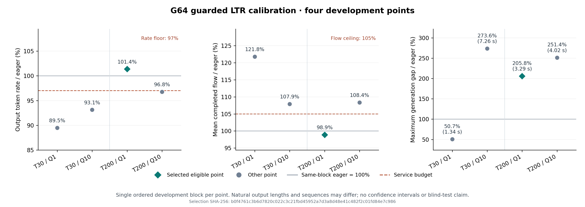

# G64 修复后有限校准（2026-09-30）

当前：原定四点均已完成并核验，唯一预算合格点为T200/Q1，按事前规则冻结为迁移比较点。该点最大gap仍差于同组eager，未建立服务停顿收益。没有扩网格。

## T30 固定组

| Arm | 完成 | 输出token | token/s | mean flow (s) | 最大生成gap (s) | 效率预算 |
|---|---:|---:|---:|---:|---:|---|
| ltr_t30_q1 | 64/64 | 59576 | 1441.894 | 23.822 | 1.343 | 未通过 |
| eager | 64/64 | 59563 | 1611.285 | 19.563 | 2.652 | 参考 |
| ltr_t30_q10 | 64/64 | 59564 | 1500.548 | 21.111 | 7.256 | 未通过 |

事前预算是同组eager实际输出率≥97%、mean flow≤105%，在合格点中取最小最大gap。Q1最大gap降低49.35%，但输出率为eager的89.49%、mean flow为121.77%；Q10为93.13%/107.91%。当前两点均不合格。

三格各64/64，58length/6stop，但Q1与eager有2个请求的stop原因不同。Q1/Q10与eager分别有36/64、21/64输出序列不同；自然EOS服务并非严格等工作量，未验证质量或KV tensor数值一致性。全部请求、失败计数、固定goodput前沿与逐请求差异在审计中保留。

Q1 guard检查21个不同step/target、拒绝2次，首F255/N225/R139；Q10检查14个、拒绝0次。相同运行payload只有LTR准入修复，无诊断observer。性能测量BEGIN–END日志未出现JIT/compile/warning/error行；这不证明无系统噪声。单次顺序组无统计稳定性结论。原未修复T30Q10曾通过其同组预算、修复后此组未通过；eager代码相同但率从1528.65变为1611.28，不能将变化归因于LTR修复。

## 可复核来源

- [T30审计](A_G64_GUARDED_T30_PERFORMANCE_AUDIT_R02_20260930.json)：SHA `d66017210cb71577489f8c24e6bd19816aa790d244ae59fa65adbfb448cbfe40`，三格各27/27归档SHA匹配、源码/模型/输入/资源/warmup/drain/完整cohort通过。
- 会话 `moe-a-g64-perf-inflight-guard-t30-session-r02-20260930`：CELLS_COMPLETE，409.732s，所有格退出0且GPU EMPTY。
- 修复性能manifest `597bedb4573531d49c4e173fc8dc3b8c6c937a05fdc9e8272c0562b5fbc43c78`，与初始性能包仅 `pkg/ltr_style_native.py` 不同。
- [原生冲突与修复资格](A_G64_LIVENESS_RESULT_20260930.md)：是共享基线正确性修复，不计算法新贡献。
- [T200准入记录](A_G64_GUARD_T200_LAUNCH_ACCEPTANCE_20260930.json)：只完成原定剩余点，运行28项payload逐字相同，新会话保留旧结果。

## T200 固定组及四点选择

| Arm | 完成 | 输出token | token/s | mean flow (s) | 最大生成gap (s) | 效率预算 |
|---|---:|---:|---:|---:|---:|---|
| T200/Q10 | 64/64 | 59579 | 1503.710 | 21.462 | 4.017 | 未通过 |
| eager | 64/64 | 58631 | 1553.823 | 19.807 | 1.598 | 参考 |
| T200/Q1 | 64/64 | 59564 | 1575.183 | 19.590 | 3.289 | 通过 |

T200/Q1相对同组eager输出率101.37%、mean flow98.91%，是四点中唯一合格点；最大gap为eager的205.84%。这选择一个预算内的近邻比较点，没有证明其停顿收益。T200/Q10为96.77%/108.36%，不合格。四点没有追加数据或参数。

T200三格各27/27原件SHA匹配，源码/模型/输入/物理资源/warmup/drain/完整请求通过；407.311s全组结束，三格exit0/GPU EMPTY。正式测量段未见compile/JIT/warning/error行。两个LTR点58length/6stop，eager57length/7stop（文档0003443终止不同）；Q10/Q1与eager输出序列28/64、21/64不同，不是等工作量加速。固定goodput前沿和逐请求得失保留在完整审计。

- [T200审计](A_G64_GUARDED_T200_PERFORMANCE_AUDIT_R01_20260930.json)：`0e458c9b8aac4dd8b71e03be8fc3c69ba86c075894841ee96ad8117bad68a114`。
- [四点冻结选择](A_G64_GUARDED_FOUR_POINT_SELECTION_20260930.json)：`b0f4761c3b6d7820c022c3c21fbd45952a7d3a8d48e41c482f2c01fd84e7c986`。
- [复算脚本](select_g64_guarded_four_point_calibration.py)核两个完整审计的SHA、cohort/arrival/输入一致性和同块预算，输出唯一选择；不能把不同块eager互换。
- 旧未修复T30Q1活性失败、旧T30Q10首组和独立修复资格全部保留，它们不替代此修复版完整四点校准。

## 全请求得失与固定前沿

同组eager为参照，逐请求最大gap改善/恶化计数：T30Q1为22/42，T30Q10为24/40，T200Q1为43/21，T200Q10为7/57；mean flow对应的单请求完成时间改善/恶化为1/63、8/56、52/12、12/52。这是策略各自演化后的观察差异，不能称共同前态动作因果。

固定20点goodput前沿上，四点分别8/12、4/16、4/16、0/20个阈值组合更好/更差，无平手。T200Q1在多数请求改善gap，同时把最坏gap变大，且前沿有交叉；因此既不能只用最坏gap断言全体更差，也不能用多数请求改善掩盖尾部代价。自然输出差异边界同上。派生计数与来源SHA见[A_G64_GUARDED_REQUEST_TRADEOFFS_20260930.json](A_G64_GUARDED_REQUEST_TRADEOFFS_20260930.json)。

## 事前方向预测

固定Q10时，T30的强制轮转44次多于T200的10次，符合频次预测；但最大gap7.256s大于4.017s，不符合“更早提权会降低最坏gap”的事前方向。单次不同块观测不提供隔离阈值因果或噪声界，却已不能将该预测当作得到支持。检查见[A_G64_GUARDED_Q10_PREDICTION_CHECK_20260930.json](A_G64_GUARDED_Q10_PREDICTION_CHECK_20260930.json)，不追加网格拯救假说。

## 结论边界与下一步

当前证据是已见G64上的开发校准和同机完整自然生成服务。T200/Q1被冻结为原定H128输入上的迁移比较点；H128已看过，不是盲测。保持原生full与selected/eager强基线、相同修复后LTR代码和资源预算。若H上仍无目标收益，则不把等待提权/固定量子包装为新方法。

单次顺序块无噪声界或统计稳定性结论。H迁移、冻结后新输入、质量/数值正确性以及论文方法贡献尚未建立。H1 direct helper也未显式计native inflight reservation，但当前open-mode提交前置条件可能已排除R>0；仅有条件CPU反例，未证实真实可达故障。后续可用KEEP回退硬化，不混入这次已冻结LTR迁移或算法收益。
