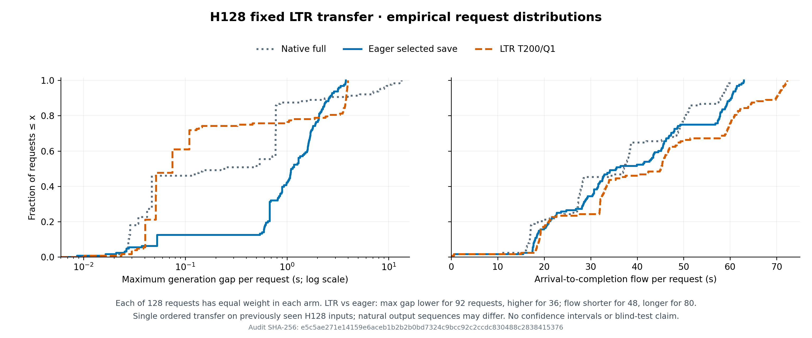

# H128 冻结LTR迁移结果（2026-09-30）

**结论：完整运行通过，收益与服务预算迁移失败。** G64事前四点唯一预算合格点T200/Q1被冻结后，在已见H128输入原样迁移。不得按H结果更换T/Q或追加网格。

| Arm | 完成 | 输出token | token/s | mean flow(s) | 最大gap(s) | p95请求gap(s) |
|---|---:|---:|---:|---:|---:|---:|
| native_full_native | 128/128 | 124453 | 1504.458 | 35.706 | 13.346 | 8.128 |
| eager | 128/128 | 124528 | 1435.104 | 38.222 | 3.773 | 3.161 |
| ltr_t200_q1 | 128/128 | 124469 | 1308.168 | 42.561 | 3.963 | 3.888 |

T200/Q1相对同组eager实际输出率91.15%、mean flow111.35%，超出预定97%/105%预算；最大gap3.963s也差于3.773s，p95为3.888比3.161s。128请求中maxgap改善92、恶化36；flow改善48、恶化80；TTFT改善46、恶化82。固定20点goodput前沿4点更好、16点更差。请求/阈值是相关观测，不能当独立重复或统计显著性。

eager相对native full输出率95.39%、mean flow107.05%，最大gap由13.346降至3.773s；请求maxgap改善33、恶化95，固定goodput前沿10点更好、10点更差。因此原生效率和eager长停顿控制均须保留，不能声称eager全指标支配native。97%/105%的LTR校准预算只相对eager定义，不能转成相对native的同一验收。

## 可复核条件

- 单RTX5090、固定vLLM0.26/OLMoE revision、4096可用GPU KV块（8592031744 B）、16GiB host KV、90GiB cgroup；三格同输入/0.2s到达/EOS允许/cap1024，分别完整warmup与drain。
- 三格各27/27归档文件SHA核对，通过完整cohort、源码、模型、物理资源、选择收据和运行控制门。原始会话`moe-a-h128-perf-guard-session-r02-20260930/`，组CELLS_COMPLETE/584.089s，三格exit0/GPU EMPTY。
- [冻结G选择](A_G64_GUARDED_FOUR_POINT_SELECTION_20260930.json) SHA `b0f4761c3b6d7820c022c3c21fbd45952a7d3a8d48e41c482f2c01fd84e7c986`；H包manifest `81c13cfdd5a260fcb9b8a83bc310e618f1bd1962fdb1dc59eaaecce909536a17`，只给旧H包补入已资格的LTR guard，其余28payload保持。
- [H128完整审计](A_H128_GUARDED_TRANSFER_AUDIT_R02_20260930.json) SHA `e5c5ae271e14159e6aceb1b2b2b0bd7324c9bcc92c2ccdc830488c2838415376`；[审计脚本](audit_h128_guarded_transfer_r02.py)7项CPU完整与拒绝测试通过。
- 正式测量日志段均未见JIT/compile/warning/error行；不因此宣称无噪声。LTR guard检查10个不同step/target、拒绝0。

## 输出与结论边界

三格均121length/7stop，但eager/native、LTR/eager、LTR/native分别65/128、68/128、62/128 token序列不同，总token数也不同；不是等工作量速度比较，未验证生成质量或独立KV tensor一致性。H128过去已看过，是冻结后不重调参的迁移输入，非盲确认；只有一个顺序块，没有噪声界或统计稳定性，不能据此否定完整官方LTR。0.2s到达形成25.4s有限到达窗口，不等于持续稳态服务或生产SLO。

本次定位的资源预留正确性修复只让可比基线正常执行，不计算法贡献。当前近邻组件没有在预算内改善最大gap，但多数请求自身gap变化相反，应保留整体分布。eager继续作为停顿优先的强简单参照，native full保留效率参照。

## 自然残留定位

[原始轨迹定位](A_H128_OBSERVED_RESIDUAL_LOCATIONS_20260930.json)显示native/eager/LTR分别44/266/79次原生抢占，连续同请求抢占对为19/163/42。其中只返回1–2个新token便再次抢占分别0/2/1对，零新token均为0；本组不支持把“普遍短恢复抖动”作为动机。

eager最坏gap属于`memory-train-article-0020233`，在76.024721–79.797304s停顿3.772583s；抢占发生在最后新输出后0.722ms，当时已返回773token。它上一对抢占之间已经返回202个新token，并非只服务1–2token就被赶走。此处只能定位相关状态，不能删除该抢占并宣称反事实收益，也不能从轻量轨迹推得当时direct资源足够。复算脚本[analyze_h128_residual_locations.py](analyze_h128_residual_locations.py)保留所有对与前三个观测gap，不用该事后例子另调参数。

## 下一项动作

转入原先冻结的H1提交时recheck：只运行同已见H128输入的一格eager/on详细资格，检查是否真的避免计划victim抢占并让目标原生准入、随后返回新输出。没有真实direct_commit就记NO_ACTION，停止H1性能扩展，不改输入制造机会。H1 helper对native reservation的零/未知/正值保护是防御硬化；当前open前置可能已保证零值，不冒称已观察到H1故障。H1诊断输出与归档放余量充足的A私有系统盘，GPU启动前再核空间、身份、公共锁和前组结束。
