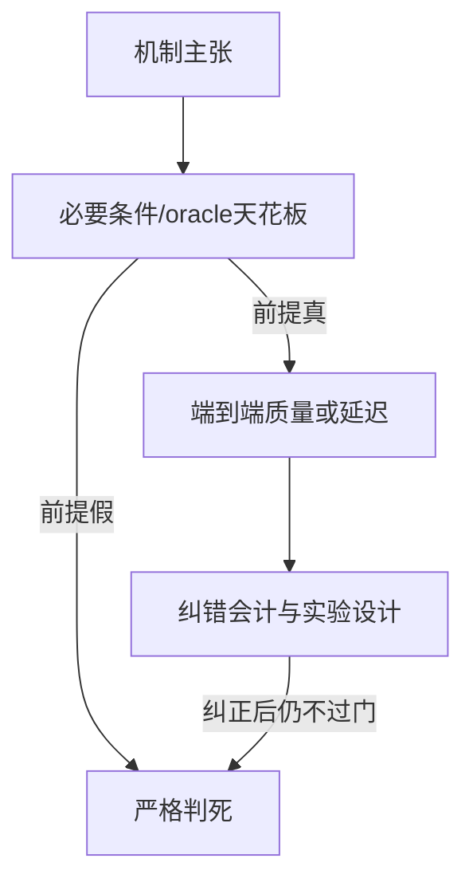

# 严格判死 Idea · 思路总览

大目录：`docs/99_archive/killed_ideas/`  
规则：**纠错实验逻辑/代码后仍死**才进本目录；每个子目录 = 一个 idea，含：

| 文件 | 含义 |
|---|---|
| `思路与判死.md` | 机制假设 → 检验门 → 死因 → 不该再怎么救 |
| `scripts/` | 实验脚本（共享库：`experiments/shared/`） |
| `run_conclusions/` | 历史结论原文（每 idea 一份，不另存副本） |

活 idea 不在这里：见 [`../../ideas/README.md`](../../ideas/README.md)。

---

## 判死思路分类（怎么读）

1. **前提证伪**：Residual（残差不低秩）、CreditReduce（无病可治）、WaveCredit（文献已覆盖）  
2. **效应量天花板**：MassCover、RouteFidelity、Placement mean-balance  
3. **系统固定开销吃掉收益**：TokenRace、Prefetch（工作集饱和 + 错误 cache key 纠正后仍无系统空间）  
4. **端到端不赢最强简单基线**：PLTB vs fixed-tail、Graceful/QTree、Progressive、QuotaEP  

勘误说明（作废数字 ≠ 复活）：[`errata/`](errata/) — 禁止再引 additive **3.77×**；TokenRace/PLTB 表述已纠正，**机制仍死**。

---

## 子目录索引

| 目录 | Idea | 核心死因一句话 |
|---|---|---|
| [creditreduce/](creditreduce/) | CreditReduce | sealed：升级无探测收益；FP8 字节支配 |
| [graceful_qtree/](graceful_qtree/) | Graceful / QTree | 几乎无字节增益或质量更差 |
| [residual_shadow/](residual_shadow/) | Residual + Tiered Shadow | 残差不满秩假说假；shadow KL 不可用 |
| [tokenrace/](tokenrace/) | TokenRace-EP | 纠正会计后固定开销仍大于负载差 |
| [pltb_additive/](pltb_additive/) | PLTB / additive 审计 | 匹配协议不赢 fixed；3.77× 作废不恢复 MILP |
| [prefetch/](prefetch/) | Expert Prefetch | 系统层 NO-GO；信号≠端到端收益 |
| [progressive/](progressive/) | Progressive residual | 等 wire 质量差 + codec |
| [routefidelity/](routefidelity/) | RouteFidelity | 排序扰动不转配置 regret |
| [wavecredit/](wavecredit/) | WaveCredit | 文献碰撞，未实现 |
| [masscover/](masscover/) | MassCover | 相对 gate_mass 边际不够 |
| [quotaep/](quotaep/) | QuotaEP / GroupedOwner | 生死实验未过 |
| [placement_mean_balance/](placement_mean_balance/) | Mean-balance placement | 均衡均值≠压 P99/瞬时 max |

历史堆：[`timelines/`](timelines/)、[`old_audits/`](old_audits/)、[`misc_killed/`](misc_killed/)。
