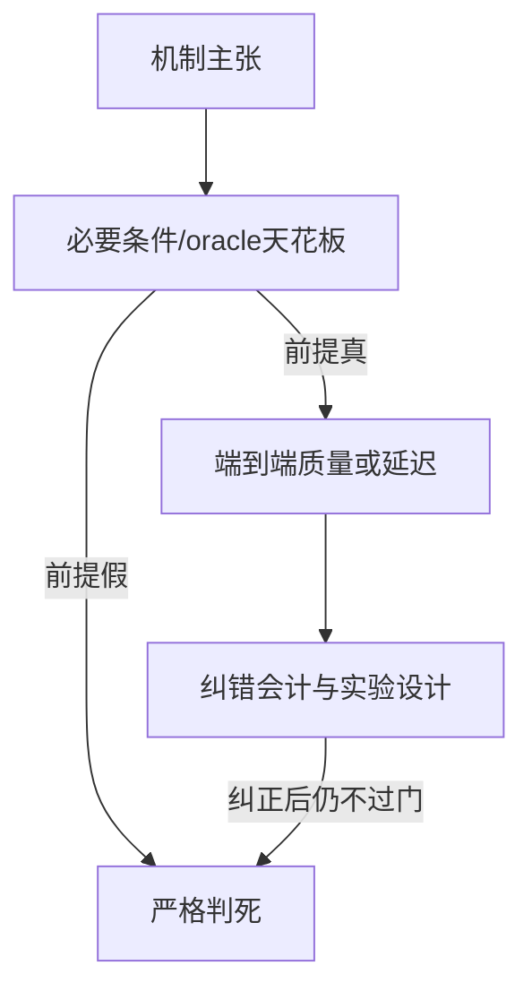

# 已归档 / 非主线 Idea · 思路总览

大目录：`docs/archive/killed_ideas/`  
规则：本目录收纳**当前不作主线**的 idea；其中有纠错后仍死、问题定义不成熟和未验证归档三类，不得统称为严格实证判死。每个子目录 = 一个 idea，含：

| 文件 | 含义 |
|---|---|
| `思路与判死.md` | 机制假设 → 检验门 → 死因 → 不该再怎么救 |
| `scripts/` | 实验脚本（共享库：`experiments/shared/`） |
| `run_conclusions/` | 历史结论原文（每 idea 一份，不另存副本） |

活 idea 不在这里：见 [`../../ideas/README.md`](../../ideas/README.md)。

---

## 判死思路分类（怎么读）

1. **前提证伪**：CreditReduce（无病可治）
2. **效应量天花板**：MassCover、RouteFidelity  
3. **系统固定开销吃掉收益**：TokenRace、Prefetch（工作集饱和 + 错误 cache key 纠正后仍无系统空间）  
4. **端到端不赢最强简单基线**：PLTB vs fixed-tail、Graceful/QTree
5. **未闭环**：QuotaEP（质量 Gate B 过，系统 Gate C 未跑）

勘误说明（作废数字 ≠ 复活）：[`errata/`](errata/) — 禁止再引 additive **3.77×**；TokenRace/PLTB 表述已纠正，**机制仍死**。

---

## 子目录索引

| 目录 | Idea | 核心死因一句话 |
|---|---|---|
| [creditreduce/](creditreduce/) | CreditReduce | sealed：升级无探测收益；FP8 字节支配 |
| [graceful_qtree/](graceful_qtree/) | Graceful / QTree | 几乎无字节增益或质量更差 |
| [tokenrace/](tokenrace/) | TokenRace-EP | 纠正会计后固定开销仍大于负载差 |
| [pltb_additive/](pltb_additive/) | PLTB / additive 审计 | 匹配协议不赢 fixed；3.77× 作废不恢复 MILP |
| [prefetch/](prefetch/) | Expert Prefetch | 系统层 NO-GO；信号≠端到端收益 |
| [routefidelity/](routefidelity/) | RouteFidelity | 排序扰动不转配置 regret |
| [masscover/](masscover/) | MassCover | 相对 gate_mass 边际不够 |
| [quotaep/](quotaep/) | QuotaEP / GroupedOwner | Gate B 质量侧过；Gate C 系统门未跑，归档为未闭环 |

## 已从仓库剔除

以下方向只保留决策记录，不再保留成套文档、代码和结果：

| Idea | 删除理由 |
|---|---|
| WaveCredit-EP | 与已有工作高度重叠，且没有实现或实验 |
| Mean-balance Placement | 优化长期均值，无法触及主张中的瞬时/P99 瓶颈 |
| Residual-EP / Tiered Shadow | mean-base 低秩必要条件直接失败；继续需要开启新的训练课题 |
| Progressive Residual Transport | 等 wire 质量被直接混合精度支配，codec 固定开销也无法回本 |
| misc_killed | 只有零散一次性探针，不构成可审计的独立 idea |
