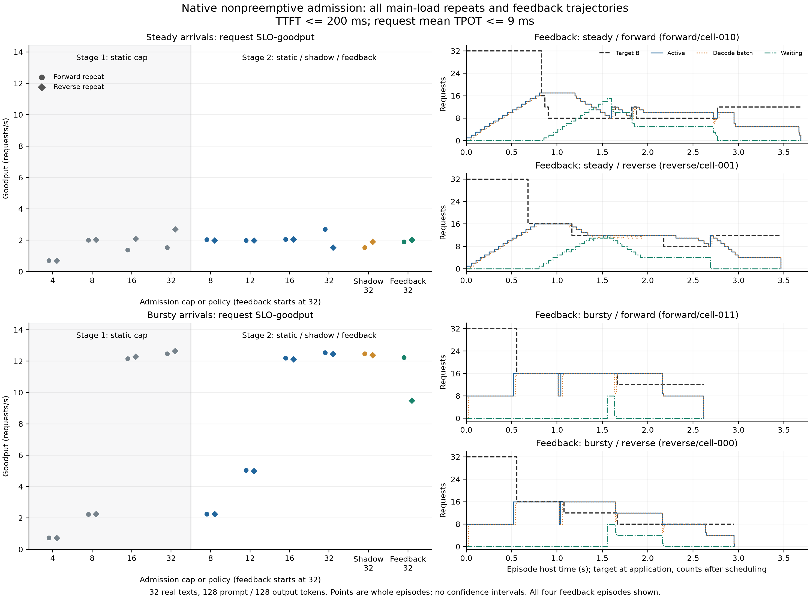

# 原生 MoE 非抢占接纳：容量权衡与普通反馈的完整 pilot

2026-09-06，`agent/publish-current-moe-code@2a37765` 加本轮未提交实现。**已完成44个GPU episode、1408次完整请求执行；只有32条重复使用的真实文本，不是1408个独立样本。**

**结论：`MEASUREMENT_ONLY`。当前四步ITL反馈规则为本运行域的 `CONDITIONAL_NO_GO`；U/C动作增量仍为 `UNRUN`。** 原生运行时存在吞吐、TTFT和TPOT的真实权衡，但受控复测后，普通反馈在四组比较中均未超过当组最好已测静态档位。不能据此判死非抢占接纳，更不能将反馈失败当作增加专家predictor的依据。

**本轮问题与切入点。** 共同引擎配置下，增加活跃并发是否产生请求级权衡；如果有，一条只看动作前普通时延的反馈能否利用它？最弱环节是从“观测到慢step”到“非抢占接纳动作改善完整请求”。继续保留的研究问题是：专家历史信号能否提供普通状态之外、早于接纳承诺的有效提前量，并在动作真正影响接纳后仍改变请求结果。本轮没有测到这一专家增量。

**设计与执行。** 一张RTX5090（32607MiB），固定BF16 `allenai/OLMoE-1B-7B-0924@6d84c48581ece794365f2b8e9cfb043c68ade9c5`；vLLM0.26.0、PyTorch2.11.0+cu130、CUDA13.0、Transformers5.15.1。使用原生engine/kernel和scheduler，进程内arrival driver及capture；不是HTTP服务或生产部署实验。

| 固定内容 | 本轮设置 |
|---|---|
| 引擎 | max_num_seqs32、max_model_len256、token预算1024、GPU利用率参数0.70；FA2/Triton MoE、compiled执行 |
| 请求 | WikiText现有manifest的offset16/count32；128 prompt tokens、128固定生成tokens，ignore_eos；不是自然终止或全新holdout |
| 到达 | steady每50ms一条；bursty每组8条；均在0–1.55秒到达完毕，随后排空 |
| 合法动作 | FCFS；只限制新接纳；已有请求继续推进，降低B时设置scheduler上限=max(B,现有running数)，自然完成 |
| 不变量 | router、top-k、精度、placement不变；无抢占、无KV驱逐、无跳过既有decode；各arm独立执行未来KV、route、batch和completion |
| 主指标 | TTFT≤200ms且请求平均TPOT≤9ms的请求数/episode墙钟时间；平均TPOT=(末token时间−首token时间)/127 |
| 参考与敏感性 | 原5s/200ms SLO全部1408次通过；预冻结的3×3描述网格全部保留，不选择有利阈值替换主结果 |
| 计时 | 预定arrival至host token交付，含提交延迟、原生排队、采集、反馈、执行和采样；初始化及共同warmup在测量外，不把局部耗时再次加到分母 |

阶段一按[冻结设计](DECISIONS.md)执行4/8/16/32档、steady/bursty、正反序两新引擎，共16个主负载episode；另外4个低负载负控把steady间隔改为400ms，比较4/32。两引擎均按相同升序warmup全部形状。阶段一出现静态goodput排名变号，因此按既定规则进行一次受控后续。

阶段二按[预先固定的反馈设计](policy_probe/DECISIONS.md)保留8/16/32锚点，增加一个简单中间档12，以及shadow32、feedback32；两到达域、正反序，共24个episode。所有arm处于各自共同引擎中，整体执行顺序反转。阶段二各baseline与feedback使用同版capture代码；阶段一与二代码有新增埋点，不能当成逐字节相同的重复。

反馈从32开始：每个已交付step先取请求ITL中位数，再取最近4步中位数；至少隔4个完成step才能再变更目标。信号>9ms降一档；<7.2ms且有等待、实际数等于目标时升一档；档位8/12/16/32。shadow运行同一观测/决策代码，实际目标始终32。参数全程未按收益调整。这是普通基线资格化，不是Chiron完整复现，也不是已验证的最强普通控制器。

**测到了什么。** 阶段一20/20、阶段二24/24完成，原始请求指标与保存指标一致；全部episode边界GPU隔离检查通过。原始调度与completion重建显示178816次既有decode推进均保留，反馈17次真实目标变更均无抢占或KV调整。观测可用时间先于决策，决策与应用先于相应调度结果。

阶段一steady，cap4→32时，TTFT中位数约1.79–1.81s降至18–20ms，TPOT中位数约5.4ms升至9.7–10.1ms，吞吐5.58–5.60升至12.24–12.35req/s。目标确实改变了实际并发与队列。cap32下实际峰值仅26–27（bursty为24），所以没有识别“真实batch32的容量拐点”。低负载负控中实际只有1–2个请求、无排队、全部通过，cap4/32吞吐均约2.50req/s，未出现虚假的限流收益。

阶段二全部arm的主goodput如下，单位为达标请求/秒；每格保留正序/反序两个episode，不作step级显著性推断。

| Arm | steady正序 / 反序 | bursty正序 / 反序 |
|---|---:|---:|
| static8 | 2.032 / 1.988 | 2.244 / 2.254 |
| static12 | 1.992 / 1.990 | 5.041 / 4.998 |
| static16 | 2.063 / 2.057 | 12.193 / 12.134 |
| static32 | 2.700 / 1.539 | 12.552 / 12.456 |
| shadow32 | 1.539 / 1.896 | 12.475 / 12.386 |
| feedback32 | 1.899 / 2.018 | 12.232 / 9.484 |

相对各组最好已测静态点，feedback分别为 **−29.69%、−1.87%、−2.55%、−23.86%**。这个“最好点”是描述性实测比较，不是已训练、可在线选择的策略或动态Oracle。steady静态排名再次变号，故不选定唯一赢家、不再搜索第三个selector。即使feedback相对部分shadow有改善，也不足以越过公平的静态对照。

**负结果的具体位置。** [有界诊断数据](policy_probe/concise_feedback_diagnostic.json)给出以下事实；它们定位失配，尚未构成隔离prefill因果作用的实验。

- steady正序在0.827、0.865、0.903秒连续32→16→12→8，三次实际活跃数都为17。8档从应用到实际数降至8又等了0.676秒；前两档未达到便被下一档替代。全过程等待峰值15，出现15个TTFT失败。反序feedback有16个TTFT失败，其中3个同时TPOT失败。减少部分TPOT失败没有转成更高联合goodput。
- bursty两次首次降档均约0.558秒、active16且无等待；首次观察到受低目标限制接纳的窗口约1.553秒，间隔约0.995秒。该窗口是本arm可观测的约束机会，不等于相对hold32的精确首次因果分叉，也不能把达到目标数与产生请求收益混为一谈。
- bursty首次触发的四步均为“纯decode、mixed、mixed、纯decode”，信号9.23/9.46ms。对应static32/shadow的完整请求平均TPOT中位数仅8.23–8.44ms，全部请求联合达标。feedback则32/32、28/32通过，后者4个失败全部来自TTFT。**短窗口step ITL越限不等于请求平均TPOT越限。**
- static32/shadow中，steady每episode有31个mixed step，mixed-step ITL中位数13.74–14.00ms、pure为8.67–8.81ms；bursty仅6个mixed，分别15.54–16.32ms、8.18–8.36ms。状态不同，不能将此差值直接称为prefill因果税。

开销对照中shadow相对static32吞吐低0.28%–1.41%，含执行噪声，不能全部归因于采集；steady通过数同时出现7→4与4→5，说明门槛附近的goodput很敏感。观测到的决策及应用耗时每episode合计5.1–7.7ms，已在完整分母内；输出处理至信号就绪19.2–24.0ms还包含共有处理，不能称为纯增量开销。没有测U/C采集成本。



**文献碰撞与研究判断。** 本轮复核三项最相关原文：[Chiron](https://arxiv.org/html/2501.08090v1)已用ITL和吞吐反馈调batch上限；[Gimbal](https://arxiv.org/html/2606.15177v1)已把专家压力接入DP引擎分配及专家放置协同；[DA-MoE](https://arxiv.org/html/2607.23099v3)已在router之后根据histogram选择kernel，报告kernel及MoE-layer graph结果。普通反馈、专家压力、分布相关kernel选择各自均不是这里的新颖性。更完整的已读工作见[已有调研](../20260906_research_synthesis_r01/REPORT.md)及其addendum，不再扩张idea列表。

可能的剩余贡献是“专家信号对不可立即撤回的接纳，提供普通状态之外的有效提前量及请求收益”。这仍是研究推断：当前没有U/C、实测HBM、动作排序增量、精确Oracle、第二模型或自然请求质量证据。现有数据只足以停止这条四步ITL规则；时标与目标失配尚可由普通状态解释，不能包装成MoE独有的新规律或CCF-B方法GO。

**唯一下一最小实验。** 做一次无需predictor的动作资格化：保持本轮共同引擎、文本、到达和SLO，使用32的共同执行前缀；在首次本规则触发降档的决策点，分别真实执行hold32（同样观测但不应用）与“只降一次到16，之后保持”，各自推进到完成；同步重跑static16作简单基线，两到达域×正反序，12个episode。首次触发只使用各自已完成历史，不读取未来；记录前缀普通状态是否相近，允许受控端到端重复，不声称保存了精确相同的运行时快照。它只区分连续降档/指标失配与单次接纳动作的请求后果，不训练第三个selector，也不改变阈值。若单次动作仍未越过静态对照，停止当前短cohort上的降档formulation；不把它扩写成所有MoE并发控制NO-GO。**该后续尚未执行，本轮到此停止。**

组合仍为一个主攻（上述接纳因果链）、一个条件备选（有明确干预及请求后果时的执行配置/容量边界测量）、一个不同机制候选（既有Verify Precision真in-loop资格化）。本轮只执行主攻，没有启动备选机制。

**复跑与保留。** [阶段一命令](gpu_results/forward/commands.txt)、[反序命令](gpu_results/reverse/commands.txt)、[阶段二命令](policy_probe/gpu_results/forward/commands.txt)、[反序命令](policy_probe/gpu_results/reverse/commands.txt)均为实际执行命令。两个`run_campaign.py`分别执行本地冻结plan；`deployment/stage1.tar.gz`、`stage2.tar.gz`保留两份实际上传包原件（共78122字节），各引擎environment记录的源码摘要已与对应包核对，不把HEAD假装成全部执行源码。原始cell、metrics、环境、检查及日志留在各自gpu_results中。

初始offset64准备因可用文本不足失败，0个GPU cell；第一次引擎启动遭并行任务占用显存，0个测量cell。分别保留在`preparation_failed_offset64/`及`startup_blocked/`，未降低显存参数或杀其他任务；等GPU空闲后用原部署包在新目录完成阶段一。输入行另被同期任务使用过，不标为fresh/native holdout。所有正式运行和两次重复都保留，未替换canonical。复用5项native capture检查并新增2项仅针对历史截止与自然drain的CPU检查，7项通过；GPU性能结论全部来自上述真实执行。

本地从仓库根目录重算，输出路径须不存在：

```bash
python3 refine-logs/expert_saturation/outputs/admission_capacity/20260906_native_knee_r01/analyze_knee.py --results-dir refine-logs/expert_saturation/outputs/admission_capacity/20260906_native_knee_r01/gpu_results --output-dir /tmp/moe-knee-reanalysis
python3 refine-logs/expert_saturation/outputs/admission_capacity/20260906_native_knee_r01/policy_probe/analyze_policy.py --results-dir refine-logs/expert_saturation/outputs/admission_capacity/20260906_native_knee_r01/policy_probe/gpu_results --output-dir /tmp/moe-policy-reanalysis
```

| 结束字段 | 当前边界 |
|---|---|
| Verdict / failure category | MEASUREMENT_ONLY；四步step-ITL反馈在当前域CONDITIONAL_NO_GO；观测目标/动作生效失配，非实验无效或家族判死 |
| Evidence type / claim ceiling | REQUEST_LEVEL / 原生vLLM进程内实验；单模型单卡、固定短文本和输出、有限episode；非生产或稳态容量 |
| Strongest baseline | 全部实测static8/12/16/32与shadow；最好静态点无反馈残差，steady赢家不稳定 |
| Oracle / unmeasured | 动态Oracle未知；U/C额外信息、跨生效时间持续性和完整成本收益均未验证 |
| Reopen condition | 先有合法单次接纳动作相对静态的稳定请求收益，再考虑动作前专家信号的增量；不靠更复杂predictor救当前规则 |
| One next experiment | 上述hold32 / 单次down16 / static16的12个episode，UNRUN |

GPU任务已自然退出，最终设备空闲。未push，未改`docs/current/README.md`，未覆盖旧封存事实。
