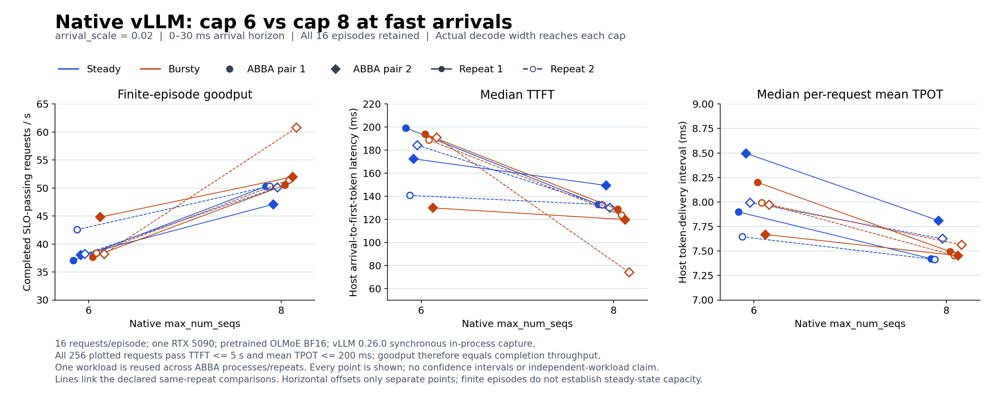

# 原生 vLLM 固定并发对照：32 个 episode 已完成

2026-09-06，`agent/publish-current-moe-code@2a37765`，新增代码与结果尚未提交。

**Verdict：`MEASUREMENT_ONLY / NATIVE_STATIC_CAP_RESPONSE_OBSERVED / SLO_BOUNDARY_UNCALIBRATED`。**
快速到达负载中，cap 8 在八组配对中都比 cap 6 有更高完成吞吐、更低 TTFT/TPOT
中位数。全部请求通过沿用的 SLO，因此这不是专家感知策略收益，也没有验证安全容量边界。
两个 cap 同时改变了引擎的 CUDA graph 捕获计划，尚不能归因于共同引擎内的接纳动作。

本轮问题：custom runtime 的 cap 排名不稳定后，原生后端是否实际暴露并发上限与排队，
并得到可重复的 cap 响应？答案是在本轮快速到达、固定引擎配置的范围内得到正证据。

## 实际运行

- **32/32 episode 完成，512/512 次请求执行完成且联合 SLO 通过**；只有原始 16 条
  WikiText 输入，不能当作 512 条独立文本。每请求 128 prompt tokens、16 固定输出 tokens。
- RTX 5090，OLMoE-1B-7B-0924，revision
  `6d84c48581ece794365f2b8e9cfb043c68ade9c5`，BF16，temperature=0。
  vLLM 0.26.0、Torch 2.11.0+cu130、Transformers 5.15.1，104 个 Torch CPU threads。
- 同步 in-process V1 引擎，compiled/CUDA graphs、FlashAttention 2、Triton MoE；
  prefix caching、async scheduling、routed expert export 和 batch invariance 均关闭。
  无网络服务层；host 接收到的真实逐 token 时间用于 TTFT、mean TPOT 和 goodput。
- 四个新进程按 cap **6/8/8/6** 执行；各自运行 steady/bursty、到达 scale 1/0.02、
  两次反序重复。首尾到达为 0–1.5 秒或 0–0.03 秒。所有到期请求提交给 native 队列，
  无客户端 inflight 限流。每个 episode 独立生成未来 KV、batch 和输出。
- 第一启动在初始化 FlashInfer sampler 时失败，**0 个测量 episode**。本机 nvcc 12.8
  低于其 SM12 JIT 所需的 12.9，尽管 Torch 自带 CUDA 13.0。使用官方
  `VLLM_USE_FLASHINFER_SAMPLER=0` 修复，保持真实贪心请求及 MoE/attention 后端不变。
  原失败保留在 [attempt 1](gpu_attempt01_results/)，不计为科学负结果。

## 快速到达结果

下表各范围含全部四次实际观测，不是置信区间。goodput 为有限 episode 内联合达标
请求数除以 host 墙钟时间；本轮全通过，因此等于完成吞吐，不代表稳定服务容量。
TTFT/TPOT 为每个 episode 内的请求中位数；mean TPOT 不保证每个 ITL 达标。

| 到达方式 / cap | 完成吞吐（请求/秒） | TTFT p50（毫秒） | mean TPOT p50（毫秒） |
|---|---:|---:|---:|
| steady / 6 | 37.08–42.58 | 140.72–199.26 | 7.645–8.496 |
| steady / 8 | 47.10–50.32 | 130.04–149.36 | 7.413–7.810 |
| bursty / 6 | 37.68–44.81 | 129.86–193.89 | 7.668–8.199 |
| bursty / 8 | 50.52–60.76 | 74.00–128.72 | 7.452–7.563 |

八组同 repeat 的配对中，cap 8 的完成吞吐相对提高 **16.0%–59.0%**，TTFT/TPOT
中位数均更低。这些收益属于已测静态配置；本轮没有采集原生 U/C，也没有专家策略。
相对 custom runtime 的速度差不作为 claim，因为后端、软件版本、prefill 组织和 CPU
配置都不同。

快速到达下，16 个 episode 的实际 active/decode 均达到其 cap。调度后仍在等待的
请求最大数，cap 6 全部为 10，cap 8 全部为 8，确认实际队列暴露；不是仅把调度前
刚提交的请求计为拥塞。

## 原始 SLO 与慢到达边界

原始 TTFT ≤5 秒、mean TPOT ≤0.2 秒对全部 512 次执行都无区分力。全部 episode 中
最大请求 TTFT 为 1.388 秒、最大 mean TPOT 为 49.73 毫秒，不能把全通过叫作 SLO 控制成功。

scale 1 的 16 个慢到达 episode 中，仅最早两个进程的首个 steady cell 出现调度后等待
（最大 9/7 请求）；其余 14 个均为零。后续 steady 实际最大并发多为 1–2，cap 没有
持续约束它们。该负载不能承担容量边界结论。

四个进程都在 engine 初始化结束与首 cell 汇总之间记录了 fused MoE JIT 告警，
现有日志缺少额外 warmup 与测量开始的 phase 标记，不能确定每条告警落在哪个阶段。
首两个 steady cell 的高延迟与该执行阶段相邻，但尚未证明峰值由 JIT 单独造成。
不删除这些 cell，也不以暖态结果替换它们。

## 两个需要保留的解释限制

1. **配置 cap 不等于同一引擎的在线接纳动作。** 两臂的 `EngineArgs.max_num_seqs`
   分别为 6/8，其 FULL decode CUDA graph 捕获数量分别为 3/4，最大捕获尺寸也不同。
   运行时实际 batch 对 graph 选择/padding 的影响是合法执行响应，但重新配置引擎
   改变捕获计划的额外影响尚未分离。当前强简单基线是 cap 8 的整套静态配置，不能
   把它当成动态接纳 Oracle。
2. **输出轨迹并非逐 token 相同。** 32 个 episode 中有 6 种完整 cohort 输出轨迹，
   其中 5/16 个请求各出现两种输出。输入、模型、精度和采样规则一致，但本轮没有
   定位 first divergence 或验证任务质量等价。各策略必须继续独立执行未来状态；
   不复用一条固定 route/output trace 冒充不同并发的真实未来。

## 必要检查与复现

32 个 cell 前后 GPU 进程检查均通过；这不是连续主机/设备隔离证明。每 cell 记录
2,048 个 prefill tokens、240 个 decode tokens，与 16×128 prompt、16×15 后续生成
相符；其余 16 个首输出由 prefill 产生。无 preemption、无 computed-token adjustment，
每个输出 chunk 均为单 token，无插值 ITL。

从 raw 重算的 32 份请求指标均与保存的 metrics 一致。四个进程记录的三份实验源码
hash 与本轮核查时的本地源文件一致；实际版本、环境和命令保存在每组目录中。
采集开销进入 host 服务时间，但尚未用无采集对照分离 instrumentation tax。
加载、初始化和显式 warmup 位于 episode 计时外；测量期间发生的成本保留在分母内。

- [原始结果、环境、命令及所有日志](gpu_results/)；[逐 cell 重算](analysis/analysis.json)
- [分析入口](analyze_native.py)；[全点图脚本](plot_native.py)
- [执行前设计及兼容修复](DECISIONS.md)；[原准备记录](PREPARATION_RECORD.md)

分析首次解包遇到本地 Python 不支持 `tarfile.extractall(filter=...)`；分析器对未解包
目录正确报告 PARTIAL，保留在 `analysis_before_extraction/`。随后核对归档路径并完成
解包，真实 32-cell 重算位于 `analysis/`，没有从空数据生成性能值。

## 唯一下一步

**在共同引擎配置下重做 cap 6/8 接纳对照。** 两臂固定
`EngineArgs.max_num_seqs=8`，在每个 episode 已排空时设置 scheduler 的接纳上限，
保留同一编译/内存配置；只跑已暴露排队的快速 steady/bursty，提前覆盖两种实际到达
形状的 warmup 并标记阶段。暂不执行在线 8→6：scheduler 的 running 上限断言意味着
不能在已有 8 个活跃请求时直接把该内部字段设为 6。

原 SLO 全通过，下一轮同时记录旧 SLO 与新的探索 SLO：以本轮全部 256 个快速到达
请求记录合并后的 p75 校准，TTFT 向上取整至 10 毫秒为 **0.20 秒**，mean TPOT 向上
取整至 1 毫秒为 **0.009 秒**。这是本机小 workload 的探索阈值，不是业务承诺；
不是按哪个 cap 收益更高挑选配置。下一批结果必须单独保存，不能回写本轮达标结论。

直接回答：**原生运行时确有可重复的静态 cap 配置差异，cap 8 是当前更强的简单基线；
U/C 的动作选择增量仍未验证。先分离接纳上限与编译配置，并建立有区分力的请求 SLO，
再决定是否值得做专家感知机制。当前尚无完整 CCF B 方法链。**
