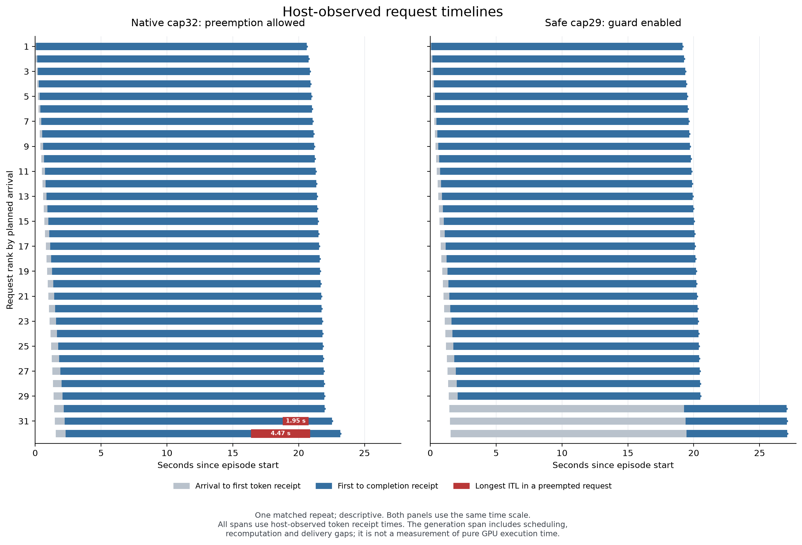

# 原生恢复完成后的比较：cap32吞吐更高，少数请求承担长暂停

2026-09-08，HEAD `2a37765fe522b1d74609a686f1d327ede7619a50`，分支
`agent/publish-current-moe-code`，继承未提交的准入实验实现。

**本轮问题已回答：原生cap32在两次真实抢占后都能完成32条请求，相对公式cap29的
完整吞吐提高16.99%/17.08%，TTFT尾部显著降低；但平均TPOT升高约7.5%–7.9%，
并让两条请求承担约2秒和4.5秒的生成暂停。** “避免抢占”不能替代完整请求目标。
当前结论是普通容量策略的时延权衡，尚无MoE专家感知方法收益。

## 问题、继承事实与实验

[上一轮](../20260908_kv_safe_static_r02/REPORT.md)证明公式cap29可完成，较cap16
提高少量吞吐但恶化部分时延；更早的cap32被保护钩子终止，遗漏了后续恢复成本。
本轮最弱链路因此是原生抢占后的完整等待、重算与完成，而非新的预测器。
执行前合同见 [DECISIONS.md](DECISIONS.md)，实际接口见 [INTERFACES.md](INTERFACES.md)。

四个新引擎固定顺序 `native32 → safe29 → safe29 → native32`，沿用32篇真实
WikiText103文章、3072输入、固定1024输出、50ms到达；它们是128次请求执行，
不是128篇独立文档。保持pinned BF16 OLMoE、vLLM0.26、RTX5090、engine32、
context4096、token budget1024、gpu_memory_utilization0.90、FCFS、chunked prefill、
无prefix缓存、同步in-process。每项相同3次暖机并单独保留完整raw。

两臂同样核对真实KV布局：单个full-attention组、每块16tokens、7677可用块，
每请求最大长度预留256块，公式cap29。native32使用默认32并发容量并调用原生
抢占方法；safe29保留原容量保护。策略独立推进KV、队列、batch和输出。
采集器版本一致；完整host请求计时包含调度、采集、排队及重算，不再次累加局部时间。

## 完整请求结果

4/4 episode、128/128请求完成；12/12暖机完整，共264次16-token请求执行。
TPOT列是每请求平均生成间隔的中位数，TTFT p99只描述每cell的32条请求。

| 重复 / 策略 | 完整时长s | 吞吐req/s | TTFT p99 s | 请求平均TPOT p50 ms | 最长ITL s | 抢占次数 |
|---|---:|---:|---:|---:|---:|---:|
| 0 / native32 | 23.16106 | 1.38163 | 0.75993 | 19.98720 | 4.47345 | 2 |
| 0 / safe29 | 27.09503 | 1.18103 | 17.90026 | 18.52244 | 0.10792 | 0 |
| 1 / safe29 | 27.29250 | 1.17248 | 18.10710 | 18.69630 | 0.10801 | 0 |
| 1 / native32 | 23.31108 | 1.37274 | 0.79515 | 20.09704 | 4.51215 | 2 |

native32相对safe29吞吐提高16.9853%/17.0795%，完整时长减少14.5192%/14.5880%；
TTFT p99从约18秒降到0.8秒以内。代价是请求平均TPOT p50提高7.9080%/7.4921%。
反过来说safe29吞吐降低约14.5%，不能把不同分母的17%与14.5%混写。
参考5s TTFT/200ms平均TPOT联合达标为native32的32/32、safe29的29/32，
两臂全部通过宽松的平均TPOT阈值；它不约束下面的秒级生成暂停。



图为预定首组比较，另一组完整保留并列于表中。灰色是到达至首token的host时间，
蓝色是首token至完成，红色为被抢占请求的最长receipt间隔；蓝色不代表纯GPU执行。
[PDF图](figures/repeat0_request_timelines.pdf) 与 [绘图脚本](plot_request_timelines.py)可独立复用。

## 抢占造成了什么

两次native32均在attempt809/931抢占相同两条请求：article0003640已有712输出、
computed3783；article0003571已有837输出、computed3908。原生调用释放其237/245块，
把computed归零并重新排队，保留既有输出；前后输出前缀及最终延续均核对一致。
两条都恢复完成，每条各4个chunk执行重复计算。

成功执行区间的重复覆盖重建给出每次完整episode的守恒式：

```text
native32实际调度token位置 = 138731
  = 首次prefill 98304 + 首次decode 32736 + 重算7691
重算7691 = 3783 + 3908
safe29实际调度token位置 = 131040，重算0
```

最后一个已生成token可能尚未执行forward，所以输出长度不是已计算高水位。
重算按成功engine.step的实际计算区间核对，不通过token receipt计数反推。
每项均有2个成功但无新token返回的engine.step，保留并计时；这些调用也出现在safe臂，
不能把无输出调用数量当作重算次数。allocation返回None次数也不等于抢占次数。

native32每次两条请求的最长ITL分别为4.473/4.512秒和1.952/1.969秒；其余请求及
safe29均没有超过1秒的间隔。1秒在此只是描述停顿规模，不是新选择的SLO门槛。
native32把全部32736个ITL混合后的p99仅为27.686/28.051ms，甚至略低于safe29的
28.603/28.778ms：仅两条请求的长停顿在该分布中被稀释。每请求最大ITL的p99则为
3.692/3.724秒。分布单位必须跟着指标一起报告，不能把相邻token当成独立实验样本。

### 秒级暂停主要出现在重新开始重算之前

沿受损请求时间线分开三段，结果见 [pause_phases.json](analysis-pool-corrected/pause_phases.json)
及 [复算脚本](analyze_pause_phases.py)：

| 请求 | 重复 | 完整最长间隔s | 上次receipt至首个重算call s | 重算calls首尾跨度s |
|---|---:|---:|---:|---:|
| article0003640 | 0 | 4.473448 | 4.357883 | 0.115565 |
| article0003640 | 1 | 4.512153 | 4.396435 | 0.115718 |
| article0003571 | 0 | 1.952389 | 1.828288 | 0.124102 |
| article0003571 | 1 | 1.969477 | 1.845183 | 0.124293 |

最后一个重算call返回时收到下一token，因此本次第三段为0。这里显示大部分停顿发生在
victim再次执行之前；不能把7691重算位置解释为4.5秒纯计算税。重算call跨度也包含
其它请求工作和采集，是host区间，不是isolated GPU kernel时间；不同请求的等待可能
重叠，不能跨请求相加为episode总时长。

## 容量、核对与留存

实际active/decode峰值为native32的32/32、safe29的29/29，队列确实暴露。
在原生抢占点实际free=0；safe最少余320块。首版分析只汇总schedule前后采样，
原生该采样最少余2块，因此最初的“KV peak”标签过宽。原分析保留，
[更正说明](analysis/ADDENDUM.md)明确区分边界采样与allocation/preemption采样；
主指标不受影响。最终准确入口为 [修正后分析](analysis-pool-corrected/report.md)
和 [分析JSON](analysis-pool-corrected/analysis.json)。

身份、到达、输入token hash、完整输出、互斥区间会计、五份执行源码及环境核对通过。
全部4项退出0，原始request/token/step/KV数据、12个warmup、配置、命令、stdout、stderr、
退出信息均在 [gpu_results/](gpu_results/)。每项回传核对后才启动下一项，四份无损归档
合计58513041bytes；[执行记录](execution-state-20260908.json)为COMPLETE_LOCAL_READBACK。
远端原件保留。

本地监控首项查询曾因缩进错误失败；直接核实原PID终态后修复并接管回传，首项未重跑，
见 [ADDENDUM.md](ADDENDUM.md)。GPU执行包全程未变，SHA256
`f9ff1de2aea4ce66aac79cc899be91bc32a2af561e7145c7e58edf5105013e90`。
[最后GPU读取](FINAL_GPU_OBSERVATION.json)无计算进程，临时凭据助手已删除。
资源检查只覆盖进程边界，不声明连续隔离；未修改权威入口、旧raw或推送代码。

## 主线判断与唯一下一实验

中心问题仍是SLO下的MoE资源管理，但本轮尚无专家信号、专家释放动作或MoE专属残差。
当前最明确的因果链是：KV增长→原生victim等待/重算→少数请求长暂停；提前限制并发
把成本转移到首token之前，可能使完整episode更慢。不能用“零抢占”作为优化目标本身。

减少并发或提高KV显存预算属于既有调优路径；vLLM0.26官方文档明确列出这些动作。
本轮将它们视为普通基线，不主张新算法。参见
[vLLM优化文档](https://docs.vllm.ai/en/v0.26.0/configuration/optimization/#preemption)。

**唯一下一项：固定cap32，比较gpu_memory_utilization0.90与0.95，判断同硬件额外
KV预算是否能消除少数请求暂停，并改善完整请求。** 先在0.95首个引擎直接读取live布局；
若无法初始化或可用块不足32×256=8192，保留失败/UNRUN并停止此预定配置。8192是保证
完整上界同时驻留的充分条件，不是原生完成或无抢占的必要条件；未达此资格不能判定
增加KV预算无效。达到条件后完成
同输入、同暖机、同采集的四项正反序对照，记录真实增配字节、原生抢占与完整时延。
这是预算干预和强简单基线，不是同资源预算下的调度收益，更不是专家回收Oracle。
当前该实验未运行；不再扫cap或增加预测器。

| 结束字段 | 本轮结论 |
|---|---|
| Verdict | MEASUREMENT_ONLY：native32约17%吞吐优势与少数请求长暂停并存 |
| Evidence type | 单OLMoE、单RTX5090、原生vLLM同步in-process完整请求测量 |
| What was measured | 同预算两种静态并发策略、真实抢占恢复、完整请求、KV等待及重复计算区间 |
| What was not measured | 额外KV预算的因果收益、专家回收/路由增量、任务质量、第二模型、EP和生产SLO |
| Strongest baseline | 默认native32完整恢复；公式safe29为普通保守容量对照，两者均非全局最优 |
| Oracle/headroom | 没有Oracle；有少数请求暂停，尚未证明同预算净改进动作 |
| Claim ceiling | 当前固定长度运行域的容量、排队位置和时延分布权衡 |
| Failure category | 零抢占作为完整性能代理不成立；监控与pool摘要缺口已保留并修正 |
| Resurrection condition | 普通KV/queue配置后仍有可重复请求损害，并有可执行专家动作改变该路径 |
| One next smallest experiment | native32下0.90/0.95真实KV预算对照；先查完整预留资格，再量完整请求 |

直接回答研究问题：**原生恢复完成后，cap32比保守cap29更快排空且首token尾延迟更低；
cap29降低平均生成间隔并避免少数请求的长暂停。当前应优化明确的请求目标，不能把避免
抢占本身当作性能结论。**
