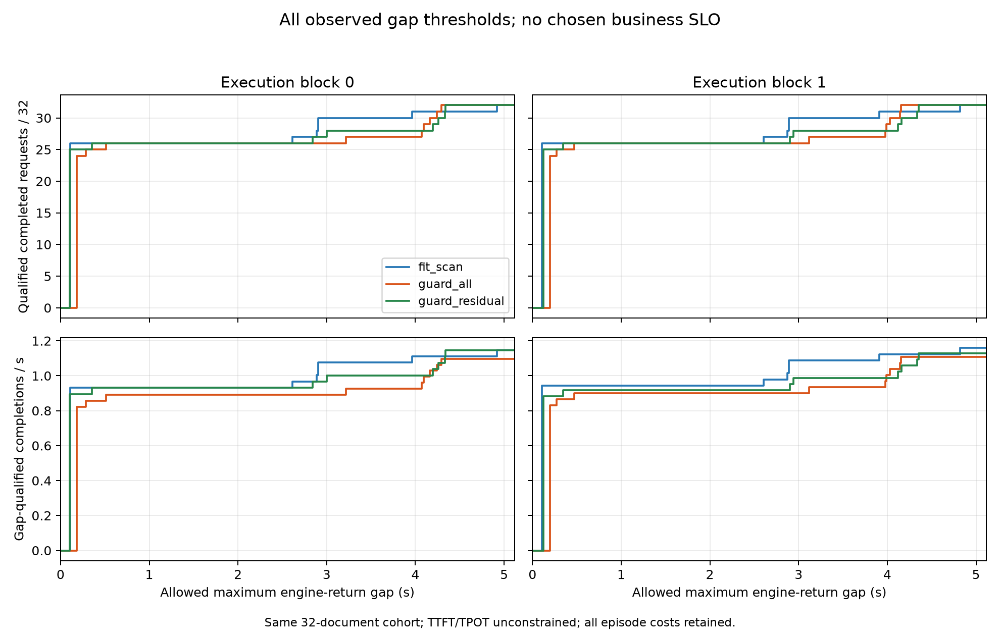

# 全阈值生成间隔—服务量曲线

Verdict：`MEASUREMENT_ONLY / NO_DISTRIBUTION_DOMINANCE`。在原 token-reservation 六格中，guard_residual 的全局最长停顿下降，并不构成相对 fit_scan 的停顿分布整体改善。两轮均有较大的阈值区间让 fit_scan 同时提供更多合格请求/秒；residual 只在部分区间较高。这个结果支持保留完整权衡，不支持事后选择一个有利阈值作为业务要求。

本分析回答的新问题：已有 max ITL 改善、p95 变差及 throughput 损失，究竟怎样落到全部请求和全部观测间隔要求上？不再次运行已完成六格。

对每个实际完成请求，取同步 `LLMEngine.step` 返回的新 token 时间中的最大相邻间隔 `g_i`。定义 `Q(g)=sum_i[completed_i and g_i≤g] / episode_wall`。分母保留全部 episode 成本。对两臂全部观测断点的并集求值，并输出右连续的 `[lower, upper)` 区间。未施加 TTFT、TPOT 或语义质量要求，因此这里称“间隔合格完成率”，不能称客户端 QoE 或联合 SLO-goodput。TTFT 单独保存，不混入 inter-output gap。



| residual 相对 fit_scan | Q(residual)>Q(fit) 的全部非空区间 / 秒 | 其余有完成请求区间 |
|---|---|---|
| block0 | [0.105089128, 0.110777007)；[4.338545175, 4.919892840) | residual 更低 |
| block1 | [4.355580913, 4.823252747) | residual 更低 |

数字仅为实际数据产生的完整区间，精确端点见 analysis.json；它们不是候选 SLO。两轮共同较高的区间为 `[4.355580913, 4.823252747)`。在两臂所有请求都满足间隔条件后，residual 因 episode 更长而再次更低。block0 很窄的早期交叉在 block1 不复现，不能作为鲁棒收益。

相对 guard_all，residual 在多数区间的 Q 较高，但两轮仍有相反区间；不能声称对旧 guard 分布支配。两组比较的双方间隔经验分布均交叉，均不存在一阶随机支配。两轮 residual 对 fit 的 32/32 请求完成时间全部更晚，对 guard 的 32/32 全部更早；这些按请求结果已保留。

只使用 `20260914_restore_token_reservation_r01/analysis/analysis.json` 已资格化的六条 raw 路径，各自核对 SHA256，重新计算所有请求的 TTFT、完成时长和 max gap。每格 COMPLETE/32 请求，输出时间有序、完整 wall 与原资格记录一致。两轮是同一固定长度文档 cohort 的反序执行，不是两个独立 workload 或 64 个独立抽样。没有置信区间或显著性主张，跨臂生成质量尚未测量。

两个定向测试覆盖阈值包含等号、相同间隔的 ties、完整 wall 分母，以及 TTFT 与生成间隔分离。首轮分析成功写出 JSON 后，系统 Python 缺 matplotlib 导致绘图失败；原 JSON 保留，改用已安装 brew Python 的 `--plot-only` 渲染并视觉检查。没有重选 raw 或改动指标。

Strongest baseline：本六格 fit_scan；新 cohort3 的 native/most/fit/residual 由共享入口执行并统一回读，接续独立分析。Oracle/headroom：本曲线不是 Oracle，不给替代窗口评分。Claim ceiling：固定 cohort、同 GPU KV/native recompute 的引擎返回测量；各进程树 host 硬预算尚未统一。Failure category：无分布整体支配，存在范围受限的效率—间隔交换。唯一下一问题：新文档上的 native/most 是否已覆盖这个交换；若是，停止为该 residual 增加窗口复杂度。

复跑（新输出目录；现有结果拒绝覆盖）：

```bash
MPLCONFIGDIR=/private/tmp/moe-window-mplcache /Users/leandrozhao/.brew/bin/python3 refine-logs/expert_saturation/experiments/admission_capacity/analyze_gap_service_tradeoff.py --workspace /Users/leandrozhao/Desktop/、++++++++ --output-dir /private/tmp/gap-tradeoff-new
```
