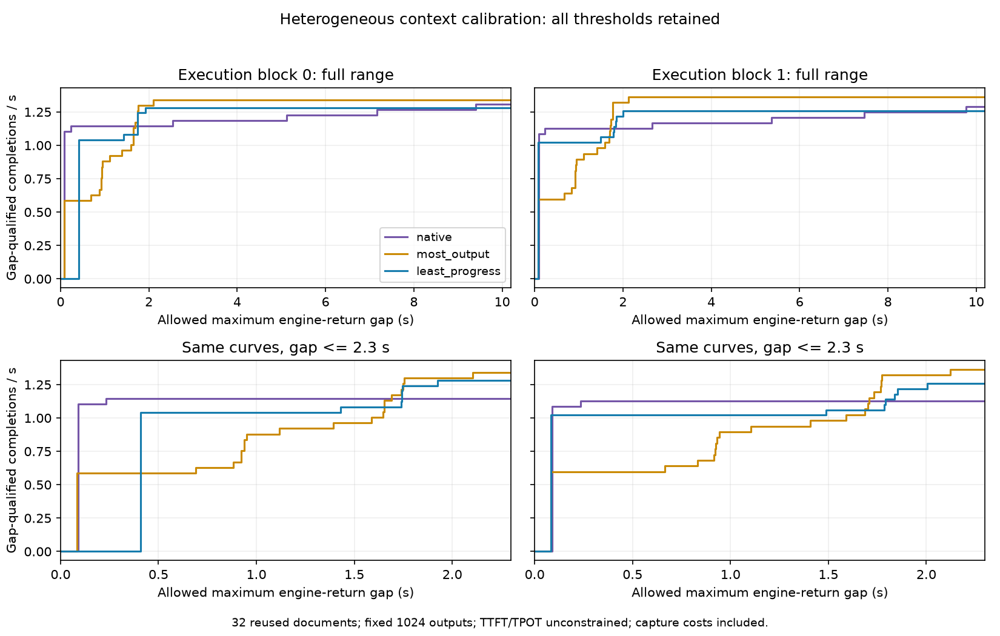

# 异构上下文下的恢复服务量与完整请求权衡

Verdict：`MEASUREMENT_ONLY / NO_SHORT_SERVICE_RESIDUAL_IN_TESTED_CALIBRATION`。新六格全部完成，native/most/least所有重复均没有零输出或仅1–2新输出后再次丢弃的恢复段；不重开旧短窗口组件。简单victim规则仍提供不同延迟—效率取舍，不能把most称为所有约束下的唯一最优。

Evidence：只读复用原组件会话已执行的context-victim六格，192请求、196608新输出。读回SHA `7e83a4483e37f65c4ad83ecebc3f522eefbd7263687ac4e10de86be92b1e9f5d`；所有源文件与读回包一致。实际原件保持在其worktree的execution/readback，逐raw及helper来源hash见lifecycle.json/tradeoff/analysis.json，本方无新增GPU。

运行域：32个既有cohort3文档，偶数位置截到2560 tokens、奇数3072，固定输出1024并忽略EOS，50ms到达；6656实际usable KV块、原vLLM0.26/OLMoE/native recompute/APC off。它改变上下文及实际压力，同时复用旧文档；不是新独立文档、匹配动态压力或未知EOS验证。host峰值未测，不追认独立host硬预算。

| Block / 策略 | wall s | 完成请求/s | 平均完成 s | 最大引擎返回gap s | 恢复段 | 输出后再丢弃 | 重算位置 | 下一段实测重执行位置 |
|---|---:|---:|---:|---:|---:|---:|---:|---:|
| 0 / native | 24.4620 | 1.30815 | 20.3069 | 9.3963 | 5 | 0 | 17820 | 0 |
| 0 / most_output | 23.8746 | 1.34034 | 22.0316 | 2.1049 | 26 | 8 | 93044 | 28151 |
| 0 / least_progress | 24.9486 | 1.28264 | 21.4786 | 1.9255 | 24 | 18 | 83510 | 62272 |
| 1 / native | 24.8306 | 1.28873 | 20.5720 | 9.7749 | 5 | 0 | 17820 | 0 |
| 1 / most_output | 23.4498 | 1.36462 | 21.6272 | 2.1223 | 26 | 8 | 93044 | 28151 |
| 1 / least_progress | 25.4430 | 1.25772 | 21.8424 | 2.0052 | 24 | 18 | 83517 | 62278 |

native每轮5段恢复全部服务至完成。most每轮8段输出后再丢弃，单段输出11–274，合计954新输出；least每轮18段再丢弃，最短5新输出。所有恢复的内部前缀都曾在后续调用中继续复用；“最终丢弃”不等于此前没有价值。表中下一段重执行是已观察重算位置的重叠诊断，不能加到重算总数，更不能换算为省时。恢复调用包含其它请求执行与host成本，不作为纯重算税。

most相对native的完成吞吐+2.4605%/+5.8883%，但平均完成时间+8.4936%/+5.1294%，29/28个请求完成更晚。least相对most最大gap−8.5208%/−5.5184%，代价是吞吐−4.3047%/−7.8338%；平均完成−2.5103%/+0.9950%，方向翻转保留。固定输出数相同，但完整输出轨迹并不完全相同：most/native每轮27/32一致，least/most31/32与21/32一致；质量未测。

Q(g)=自身最大引擎返回gap≤g的完成请求数/完整episode wall。全部断点保留，未按结果选业务阈值。least超过max(native,most)的区间仅block0 [1.7457194086,1.7498425674) s、block1 [0.0828433894,0.0879011564) s，两轮没有共同超过区间。该结果是已执行完整静态策略的描述性边界，不允许按请求/步骤免费切换策略；不包含TTFT/TPOT或“所有请求必须达标”的联合约束，不能据此抹去least较低最大gap的取舍。

本组检查的是actual dispatch、输出返回和状态丢弃，耗时包含现有插桩。原执行方早期分析器曾把native缺少forced_preempted字段当作错误；实际native使用completion_headroom(mode=native, observer=fast)，该字段本来不存在。本分析核验了每步mode、空held、actual dispatch/preempt map及真实恢复回执，未修改原件，也没有把分析schema问题当作GPU失败。

Strongest baseline：native/most/least均保留为已测简单策略，按所需目标比较。Oracle/headroom：无真实动作Oracle、无窗口动作排序证据。Claim ceiling：异构但固定输出的原生引擎内诊断与完整请求描述；不是客户端收到、质量、生产或新方法GO。Failure category：当前校准没有暴露旧零/1–2输出短恢复残差；不是请求恢复问题级NO_GO。

Reopen condition：持续到达/未知EOS的实际新数据证明强简单规则仍留下可执行而未兑现的服务机会；或可信的执行前成本对有限动作排序产生真实净增量。不能通过把短段阈值2改成5或11来复活。唯一下一实验仍为已冻结20260914_streaming_recovery_r01四格，当前STAGED/GPU_UNRUN_AUTH_UNAVAILABLE，待授权连接恢复后按共同队列/锁执行。

研究问题的本轮回答：换成2560/3072异构上下文后，强简单规则仍没有此前定义的短恢复问题；已经存在的是恢复次数、输出停顿与多数请求完成时间之间的代价交换，尚无证据要求增加服务窗口机制。
