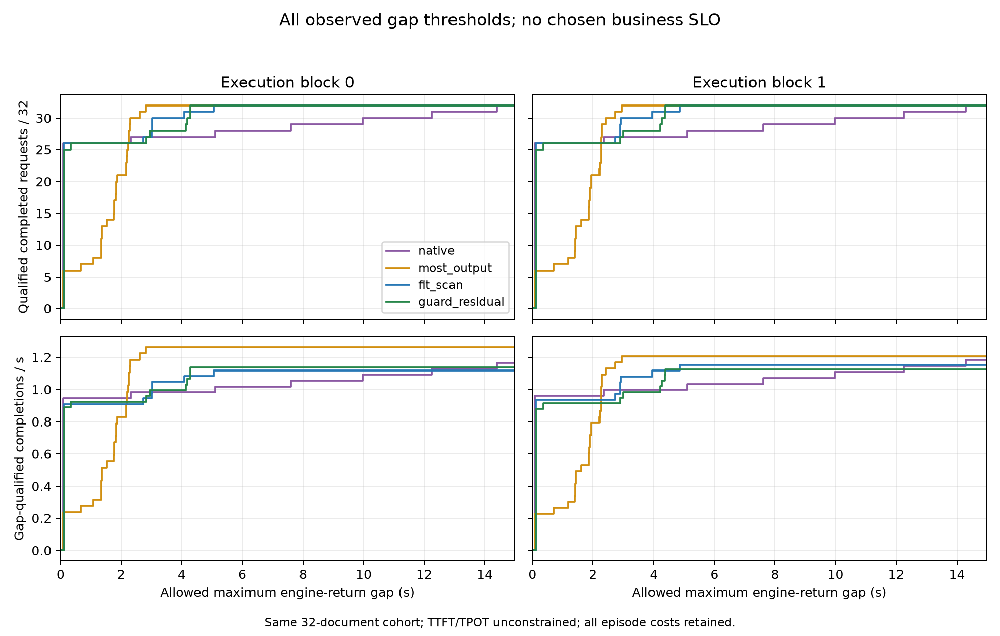

# 强基线覆盖了当前短恢复缺口

**Verdict：`MEASUREMENT_ONLY / BASELINE_COVERS_TESTED_RESIDUAL`。停止在当前 fixed-shape residual 组件上追加服务窗口保护；主问题仍 OPEN。** 新 cohort3 的 native 和 most_output 都没有 1–2 token 后再次抢占的昂贵短段。完整服务量—生成间隔曲线也没有给 residual 留下超越这两个已测简单策略的区间。不能把组件自己的低效作为强基线后的问题或新方法空间。

本次只读利用原长任务统一执行并回传的八格，未另起 GPU。分支 HEAD 仍 de64dae5，工作区其它会话修改保留。原执行资格位于 `../20260914_recovery_holdout_comparison_r01/analysis/analysis.json`，8/8 COMPLETE；各 raw SHA 在本目录两份分析中交叉保留。新 cohort3 排除了此前128个文档，同源分布、32个唯一请求，两次反序执行共256次完成；不是8个独立 workload。

| 策略 | wall 两次 / s | 最长 engine-return 间隔两次 / s | 平均请求完成两次 / s | 每格 1–2 输出短恢复段 | 每格重算位置 |
|---|---|---|---|---:|---:|
| native | 27.480 / 27.065 | 14.398 / 14.290 | 21.247 / 20.819 | 0 | 21,426 |
| most_output | 25.327 / 26.579 | 2.814 / 2.942 | 23.288 / 24.444 | 0 | 163,764 |
| fit_scan | 28.599 / 27.739 | 5.044 / 4.855 | 22.682 / 21.809 | 11 | 75,742 |
| guard_residual | 28.117 / 28.450 | 4.291 / 4.369 | 22.063 / 22.333 | 5 | 89,448 |

most 相对 residual 的 wall 和最长停顿两轮均更好，但不是所有请求都更好：residual 相对 most 的平均完成改善5.260%/8.636%，26/27个请求完成更早，24/25个请求的最大间隔更小。native 则对 residual 两轮32/32请求完成均更早，但有少数请求承担很长停顿。不能要求所有指标同时下降，也不能只用一个全局最坏值覆盖这些损害转移。

关键反例是 most 的重算位置比 residual 多74,316，却仍有更短的实际 wall；恢复位置数不能直接变成可扣毫秒。混合调用的其它 decode、批大小、执行次数和 host 开销均在实际 episode 分母内，没有重复扣除局部税。原执行者的 cost_transfer 使用已经发生的未来 schedule，仅可解释路径，不是执行前动作预测器。

## 全阈值检验

[曲线数据](tradeoff/analysis.json)重新从每条 raw 计算 `Q(g)=自身最大新输出间隔≤g的完成请求数 / 完整episode wall`。枚举全部经验断点，未挑业务 SLO；输出时间停在同步引擎返回。TTFT、TPOT和质量没有附加约束，因此 Q 不是联合 SLO-goodput 或客户端 QoE。

[简单策略外边界](tradeoff/baseline_envelope.json)对每个固定 g 比较各自完整执行的 native 与 most：两轮各42个有非零完成率的断点区间，residual 高于该边界 **0/42、0/42**，相等也为0。低间隔要求下 native 提供更多合格请求，较宽松要求下 most 提供更多；residual 分别被覆盖。

这是一组完整策略的描述性外边界，不是可以在episode内部免费切换的在线策略，不是全局 Oracle，也不证明任何 TTFT/完成约束下都被覆盖。没有从交叉位置反选阈值。相对 fit 的吞吐在两轮为+1.712%/−2.502%，发生符号变化，保留两轮，不能只保留第一轮的有利结果。

## 真实恢复生命周期

[生命周期账本](lifecycle/REPORT.md)与[原始分账](lifecycle/analysis.json)连接每次抢占、恢复、新输出、下一次失效及最终完成。互斥分账如下，短段是已服务后丢弃的子集，不重复相加：

| 策略 | 首输出前恢复丢弃位置 | 已输出后丢弃位置 | 服务到完成的恢复位置 |
|---|---:|---:|---:|
| native | 0 | 0 | 21,426 |
| most_output | 0 | 64,835 | 98,929 |
| fit_scan | 5,973 | 48,329 | 21,440 |
| guard_residual | 0 | 64,024 | 25,424 |

most 仍有18个已服务后再次丢弃的恢复段，已关闭段至少4个输出；“没有1–2个输出短段”并不等于已经证明摊销最优。只是当前5个一token短段/17,505恢复位置并非强简单策略之后仍成立的缺口。不能把阈值从2改成4来救回原叙事。

## 窗口模型的保留价值与边界

有限模型仍用 `L=max(1,ceil(C_remaining/α))` 和 `L≤n≤min(U_KV,U_age)`。C是未来还需要付出的额外暴露恢复税，不是历史沉没成本或恢复调用总跨度；缺少C时不认证摊销。n是未知EOS下可提供的机会数；实际完成就释放。资源需要覆盖恢复临时量、共批peer增长、后续目标增长；恢复/传输沿依赖路径计时，重叠部分不相加。

[恢复前v2证书](../20260914_service_window_model_r01/pre_resume_window_certificate_v2.md)把旧六格的同一3640/405事件提前到动作前资格：固定victim可释放212块，恢复至少4批，目标205块加peer增长7块正好耗尽；后续全部共批1/2/3次分别缺3/5/6块。同前态允许固定FCFS fit子集28/26/25个请求，但六个peer需暂停，victim也继续等待。它区分可行与不可行动作，不证明一个4输出窗口值得实施。

v1曾将实际receipt释放量作为predict输入；v2改为已资格化不共享后端的before held候选量，receipt只作事后验证。原件保留、预测数字不变。模型支持实例是共批窗口同时满足下界与资源/等待界；反例是恢复能完成但peer增长令全共批窗口无法兑现。不能从这个局部反例推出整个负载无解。

## 预算和唯一下一问题

实际GPU KV保持6656 usable blocks，native recompute/APC off，没有为任一策略增加host KV。远端只读检查发现容器父cgroup上限90GiB，但只读且没有memory子树委派；此快照不能倒填成八格各自可控的进程树硬预算。见[主机预算边界与已实现工具](../20260914_host_budget_r01/REPORT.md)。真实host全成本、质量、未知EOS/异构/持续到达和第二模型仍未验证。

唯一下一项科学GPU实验应继续同一问题，先以 **native/most这两个强简单策略** 在一个预先固定的持续到达、异构上下文、允许真实EOS的episode上检验：其有效服务段是否仍能覆盖恢复成本与长停顿交换。固定实际GPU/host资源能力，保持相同输入，两臂反序重复；记录EOS是否真的发生、跨时间的压力/恢复和所有失败。当前八格全部3072/1024固定长度且早期到齐，不满足这个问题。这里没有提交新driver或插入共享GPU队列。

若两简单策略仍覆盖服务量—间隔边界，保留简单实现，不加窗口；若强基线之后出现新的实际恢复/丢弃或等待缺口，先定位其资源及成本原因，再比较一个最小窗口动作。若没有压力或没有真实EOS，分别报告适用边界/未覆盖，不能人为加压或改输出阈值制造失败。当前只读主机环境无法提供独立hard cap，执行方须先落实明确预算或把结果限制为共享容器预算下的测量，不能静默降级为同预算确认结果。

Evidence type：NATIVE_SERVING实跑的只读分账与全阈值描述，STRUCTURAL窗口资格。Strongest baseline：native和most。Oracle/headroom：未测全局Oracle，当前residual未超越这两个已测策略的Q边界。Failure category：`FORMULATION_NOT_RESIDUAL_AFTER_STRONG_BASELINE`，仅指当前组件及固定运行域。Reopen：新的持续/异构/真实EOS域里出现强基线未覆盖的实测缺口。直接答案：当前昂贵短恢复是组件可避免的问题，不能据此证明需要新增服务窗口机制。
